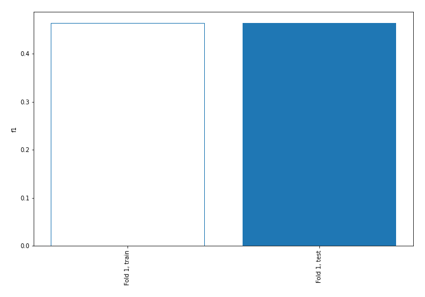
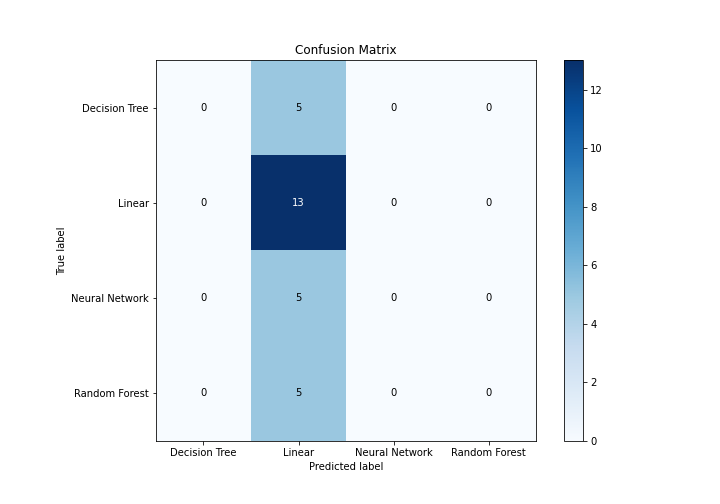
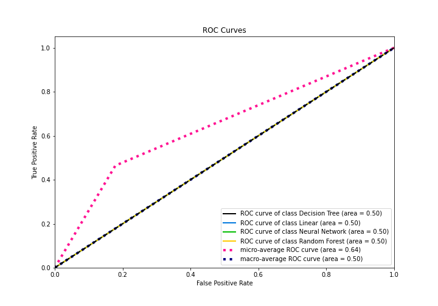
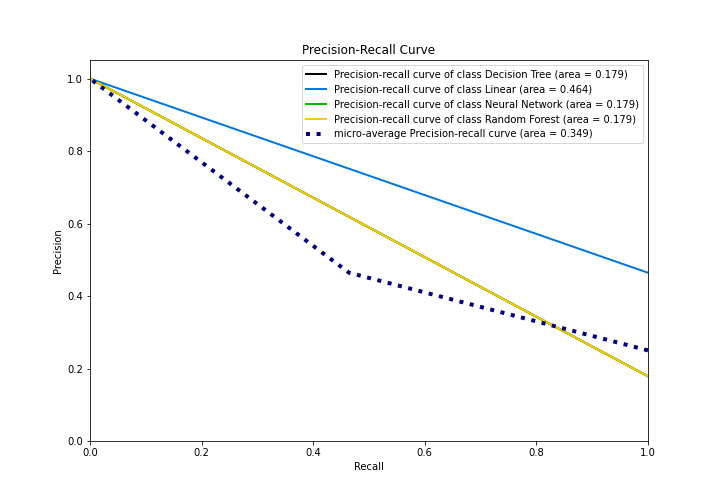

# Summary of 1_Baseline

[<< Go back](../README.md)

## Baseline Classifier (Baseline)
- **n_jobs**: -1
- **num_class**: 4
- **explain_level**: 1

## Validation
 - **validation_type**: split
 - **train_ratio**: 0.75
 - **shuffle**: True
 - **stratify**: True

## Optimized metric
f1

## Training time

0.3 seconds

### Metric details
|           |   Decision Tree |    Linear |   Neural Network |   Random Forest |   accuracy |   macro avg |   weighted avg |   logloss |
|:----------|----------------:|----------:|-----------------:|----------------:|-----------:|------------:|---------------:|----------:|
| precision |               0 |  0.464286 |                0 |               0 |   0.464286 |    0.116071 |       0.215561 |   1.27914 |
| recall    |               0 |  1        |                0 |               0 |   0.464286 |    0.25     |       0.464286 |   1.27914 |
| f1-score  |               0 |  0.634146 |                0 |               0 |   0.464286 |    0.158537 |       0.294425 |   1.27914 |
| support   |               5 | 13        |                5 |               5 |   0.464286 |   28        |      28        |   1.27914 |

## Confusion matrix
|                           |   Predicted as Decision Tree |   Predicted as Linear |   Predicted as Neural Network |   Predicted as Random Forest |
|:--------------------------|-----------------------------:|----------------------:|------------------------------:|-----------------------------:|
| Labeled as Decision Tree  |                            0 |                     5 |                             0 |                            0 |
| Labeled as Linear         |                            0 |                    13 |                             0 |                            0 |
| Labeled as Neural Network |                            0 |                     5 |                             0 |                            0 |
| Labeled as Random Forest  |                            0 |                     5 |                             0 |                            0 |

## Learning curves

## Confusion Matrix

## Normalized Confusion Matrix

## ROC Curve

## Precision Recall Curve

[<< Go back](../README.md)
