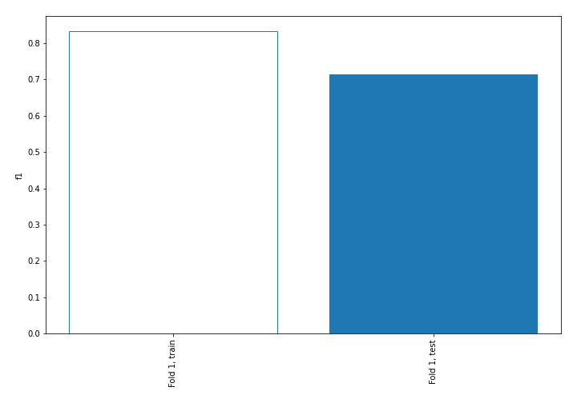
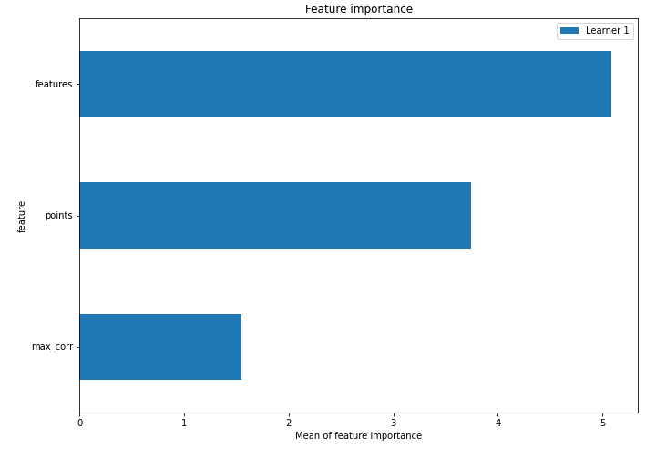
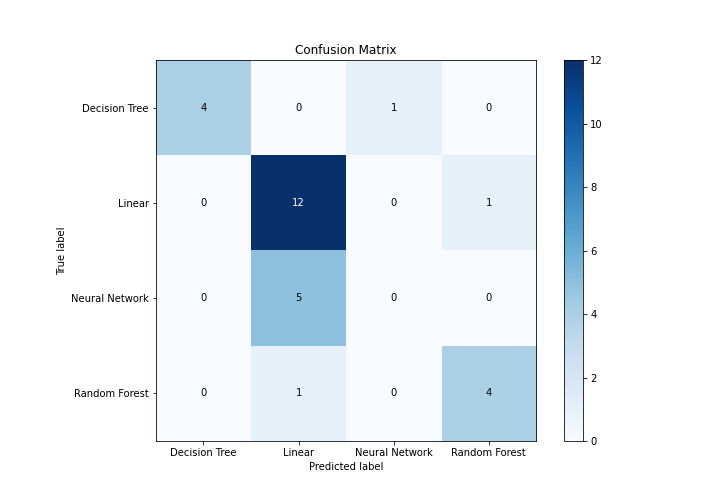
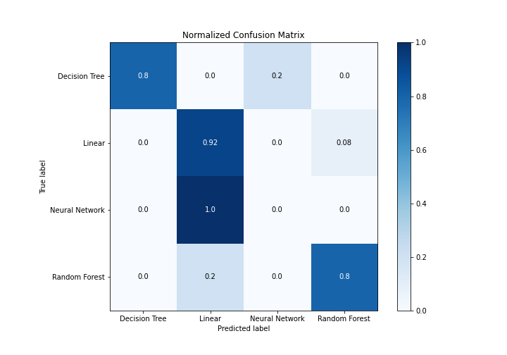
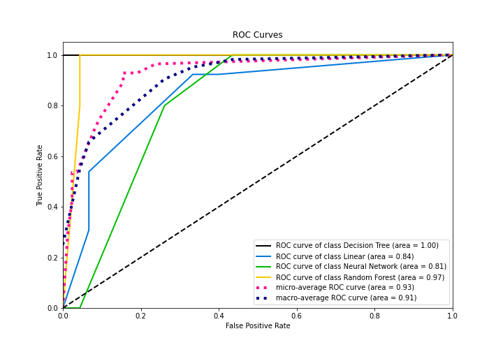
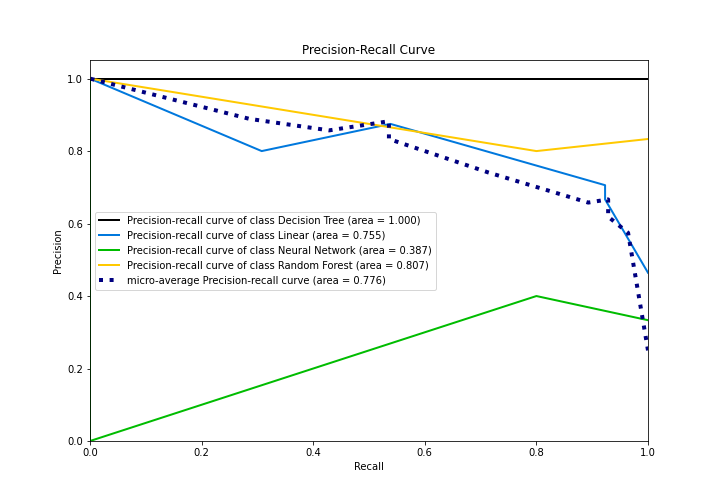

# Summary of 2_DecisionTree

[<< Go back](../README.md)

## Decision Tree
- **n_jobs**: -1
- **criterion**: entropy
- **max_depth**: 4
- **num_class**: 4
- **explain_level**: 1

## Validation
 - **validation_type**: split
 - **train_ratio**: 0.75
 - **shuffle**: True
 - **stratify**: True

## Optimized metric
f1

## Training time

9.4 seconds

### Metric details
|           |   Decision Tree |    Linear |   Neural Network |   Random Forest |   accuracy |   macro avg |   weighted avg |   logloss |
|:----------|----------------:|----------:|-----------------:|----------------:|-----------:|------------:|---------------:|----------:|
| precision |        1        |  0.666667 |                0 |             0.8 |   0.714286 |    0.616667 |       0.630952 |  0.905279 |
| recall    |        0.8      |  0.923077 |                0 |             0.8 |   0.714286 |    0.630769 |       0.714286 |  0.905279 |
| f1-score  |        0.888889 |  0.774194 |                0 |             0.8 |   0.714286 |    0.615771 |       0.661034 |  0.905279 |
| support   |        5        | 13        |                5 |             5   |   0.714286 |   28        |      28        |  0.905279 |

## Confusion matrix
|                           |   Predicted as Decision Tree |   Predicted as Linear |   Predicted as Neural Network |   Predicted as Random Forest |
|:--------------------------|-----------------------------:|----------------------:|------------------------------:|-----------------------------:|
| Labeled as Decision Tree  |                            4 |                     0 |                             1 |                            0 |
| Labeled as Linear         |                            0 |                    12 |                             0 |                            1 |
| Labeled as Neural Network |                            0 |                     5 |                             0 |                            0 |
| Labeled as Random Forest  |                            0 |                     1 |                             0 |                            4 |

## Learning curves

## Permutation-based Importance

## Confusion Matrix

## Normalized Confusion Matrix

## ROC Curve

## Precision Recall Curve

[<< Go back](../README.md)
