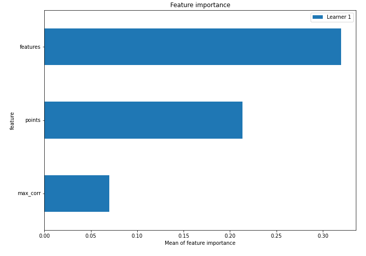
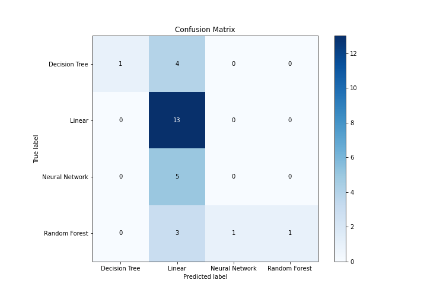
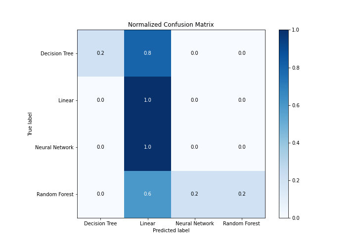
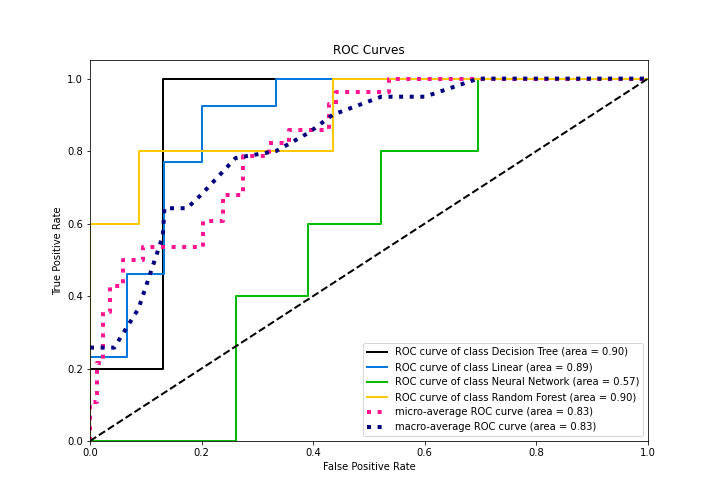

# Summary of 3_Linear

[<< Go back](../README.md)

## Logistic Regression (Linear)
- **n_jobs**: -1
- **num_class**: 4
- **explain_level**: 1

## Validation
 - **validation_type**: split
 - **train_ratio**: 0.75
 - **shuffle**: True
 - **stratify**: True

## Optimized metric
f1

## Training time

3.1 seconds

### Metric details
|           |   Decision Tree |    Linear |   Neural Network |   Random Forest |   accuracy |   macro avg |   weighted avg |   logloss |
|:----------|----------------:|----------:|-----------------:|----------------:|-----------:|------------:|---------------:|----------:|
| precision |        1        |  0.52     |                0 |        1        |   0.535714 |    0.63     |       0.598571 |   1.03953 |
| recall    |        0.2      |  1        |                0 |        0.2      |   0.535714 |    0.35     |       0.535714 |   1.03953 |
| f1-score  |        0.333333 |  0.684211 |                0 |        0.333333 |   0.535714 |    0.337719 |       0.436717 |   1.03953 |
| support   |        5        | 13        |                5 |        5        |   0.535714 |   28        |      28        |   1.03953 |

## Confusion matrix
|                           |   Predicted as Decision Tree |   Predicted as Linear |   Predicted as Neural Network |   Predicted as Random Forest |
|:--------------------------|-----------------------------:|----------------------:|------------------------------:|-----------------------------:|
| Labeled as Decision Tree  |                            1 |                     4 |                             0 |                            0 |
| Labeled as Linear         |                            0 |                    13 |                             0 |                            0 |
| Labeled as Neural Network |                            0 |                     5 |                             0 |                            0 |
| Labeled as Random Forest  |                            0 |                     3 |                             1 |                            1 |

## Learning curves

## Coefficients

### Coefficients learner #1
|           |   Decision Tree |    Linear |   Neural Network |   Random Forest |
|:----------|----------------:|----------:|-----------------:|----------------:|
| intercept |       -0.608032 |  0.446984 |        -0.263319 |       0.424367  |
| features  |        0.684741 | -1.20681  |         0.509693 |       0.0123743 |
| points    |        1.50931  | -1.67422  |        -0.86011  |       1.02502   |
| max_corr  |        0.980869 | -0.424897 |         0.084821 |      -0.640793  |

## Permutation-based Importance

## Confusion Matrix

## Normalized Confusion Matrix

## ROC Curve

## Precision Recall Curve

[<< Go back](../README.md)
