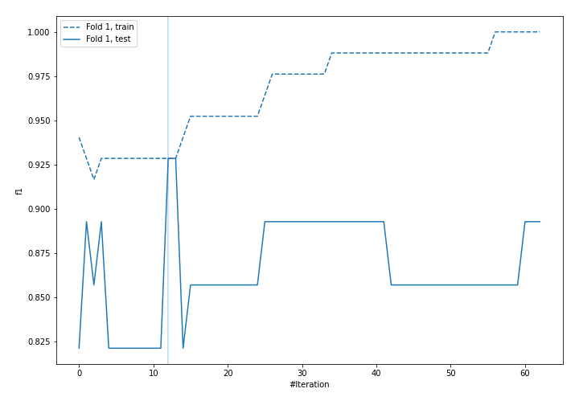
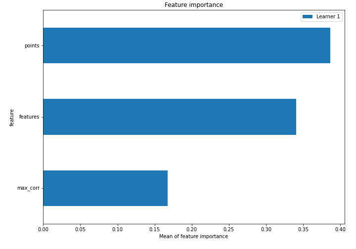
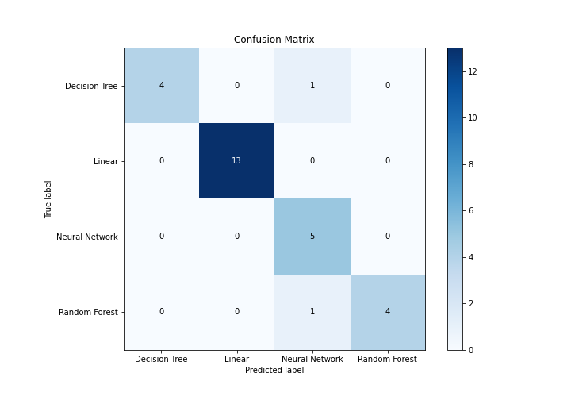
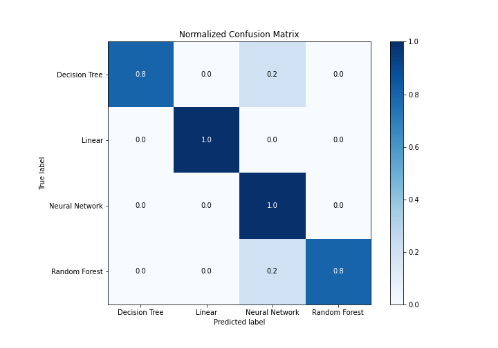
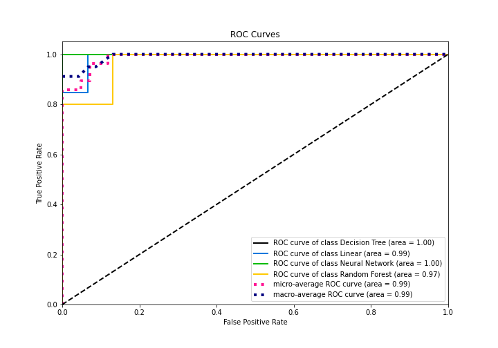
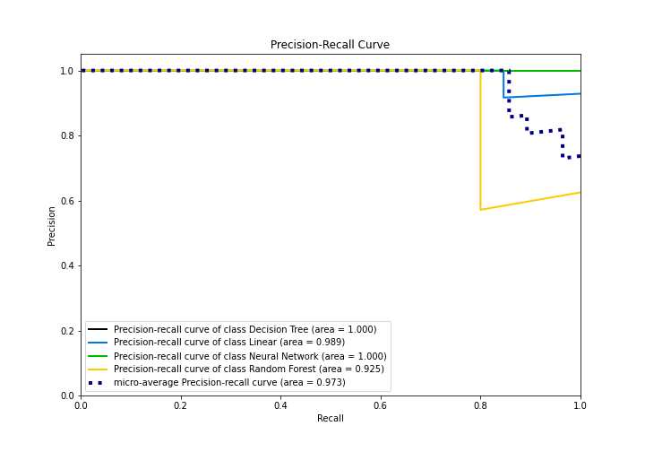

# Summary of 4_Default_Xgboost

[<< Go back](../README.md)

## Extreme Gradient Boosting (Xgboost)
- **n_jobs**: -1
- **objective**: multi:softprob
- **eta**: 0.075
- **max_depth**: 6
- **min_child_weight**: 1
- **subsample**: 1.0
- **colsample_bytree**: 1.0
- **eval_metric**: f1
- **num_class**: 4
- **explain_level**: 1

## Validation
 - **validation_type**: split
 - **train_ratio**: 0.75
 - **shuffle**: True
 - **stratify**: True

## Optimized metric
f1

## Training time

4.5 seconds

### Metric details
|           |   Decision Tree |   Linear |   Neural Network |   Random Forest |   accuracy |   macro avg |   weighted avg |   logloss |
|:----------|----------------:|---------:|-----------------:|----------------:|-----------:|------------:|---------------:|----------:|
| precision |        1        |        1 |         0.714286 |        1        |   0.928571 |    0.928571 |       0.94898  |  0.712921 |
| recall    |        0.8      |        1 |         1        |        0.8      |   0.928571 |    0.9      |       0.928571 |  0.712921 |
| f1-score  |        0.888889 |        1 |         0.833333 |        0.888889 |   0.928571 |    0.902778 |       0.930556 |  0.712921 |
| support   |        5        |       13 |         5        |        5        |   0.928571 |   28        |      28        |  0.712921 |

## Confusion matrix
|                           |   Predicted as Decision Tree |   Predicted as Linear |   Predicted as Neural Network |   Predicted as Random Forest |
|:--------------------------|-----------------------------:|----------------------:|------------------------------:|-----------------------------:|
| Labeled as Decision Tree  |                            4 |                     0 |                             1 |                            0 |
| Labeled as Linear         |                            0 |                    13 |                             0 |                            0 |
| Labeled as Neural Network |                            0 |                     0 |                             5 |                            0 |
| Labeled as Random Forest  |                            0 |                     0 |                             1 |                            4 |

## Learning curves

## Permutation-based Importance

## Confusion Matrix

## Normalized Confusion Matrix

## ROC Curve

## Precision Recall Curve

[<< Go back](../README.md)
