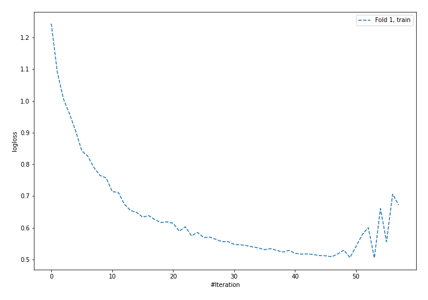
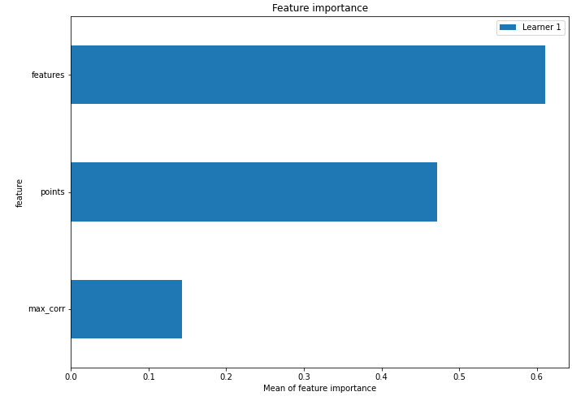
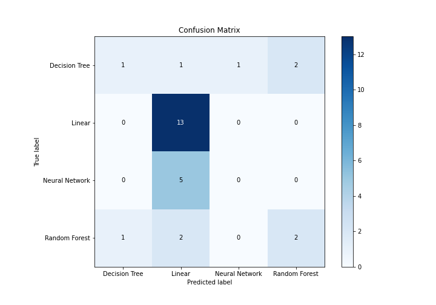
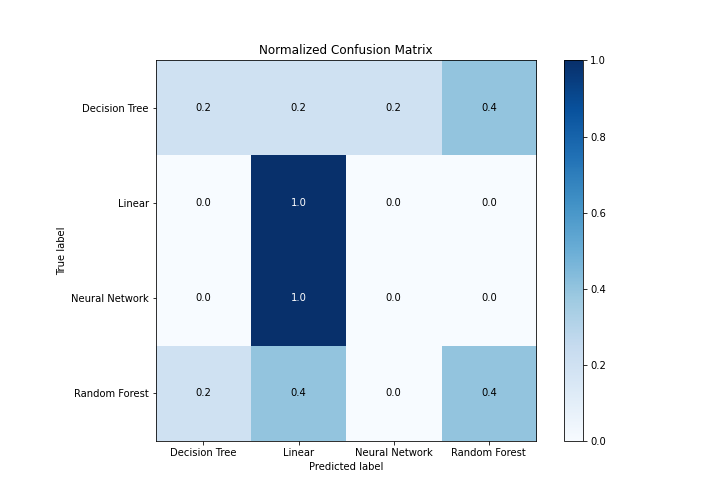
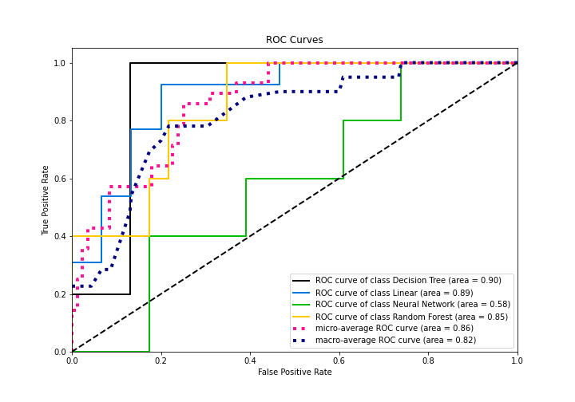
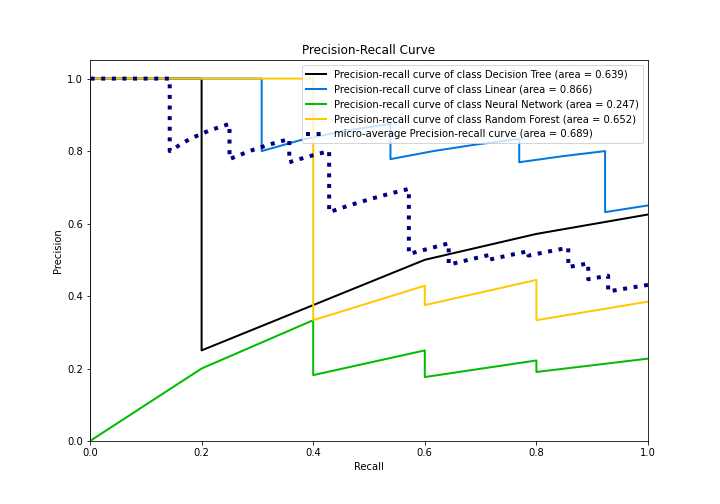

# Summary of 5_Default_NeuralNetwork

[<< Go back](../README.md)

## Neural Network
- **n_jobs**: -1
- **dense_1_size**: 32
- **dense_2_size**: 16
- **learning_rate**: 0.05
- **num_class**: 4
- **explain_level**: 1

## Validation
 - **validation_type**: split
 - **train_ratio**: 0.75
 - **shuffle**: True
 - **stratify**: True

## Optimized metric
f1

## Training time

0.5 seconds

### Metric details
|           |   Decision Tree |    Linear |   Neural Network |   Random Forest |   accuracy |   macro avg |   weighted avg |   logloss |
|:----------|----------------:|----------:|-----------------:|----------------:|-----------:|------------:|---------------:|----------:|
| precision |        0.5      |  0.619048 |                0 |        0.5      |   0.571429 |    0.404762 |       0.465986 |  0.938499 |
| recall    |        0.2      |  1        |                0 |        0.4      |   0.571429 |    0.4      |       0.571429 |  0.938499 |
| f1-score  |        0.285714 |  0.764706 |                0 |        0.444444 |   0.571429 |    0.373716 |       0.485428 |  0.938499 |
| support   |        5        | 13        |                5 |        5        |   0.571429 |   28        |      28        |  0.938499 |

## Confusion matrix
|                           |   Predicted as Decision Tree |   Predicted as Linear |   Predicted as Neural Network |   Predicted as Random Forest |
|:--------------------------|-----------------------------:|----------------------:|------------------------------:|-----------------------------:|
| Labeled as Decision Tree  |                            1 |                     1 |                             1 |                            2 |
| Labeled as Linear         |                            0 |                    13 |                             0 |                            0 |
| Labeled as Neural Network |                            0 |                     5 |                             0 |                            0 |
| Labeled as Random Forest  |                            1 |                     2 |                             0 |                            2 |

## Learning curves

## Permutation-based Importance

## Confusion Matrix

## Normalized Confusion Matrix

## ROC Curve

## Precision Recall Curve

[<< Go back](../README.md)
