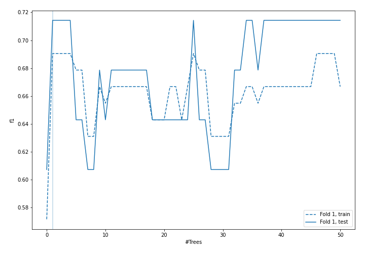
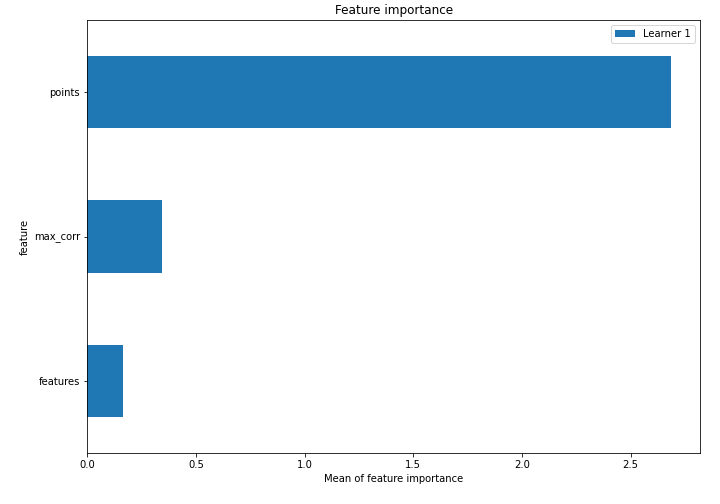
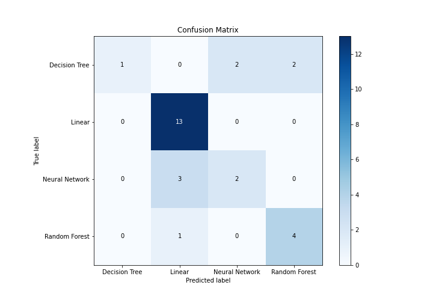
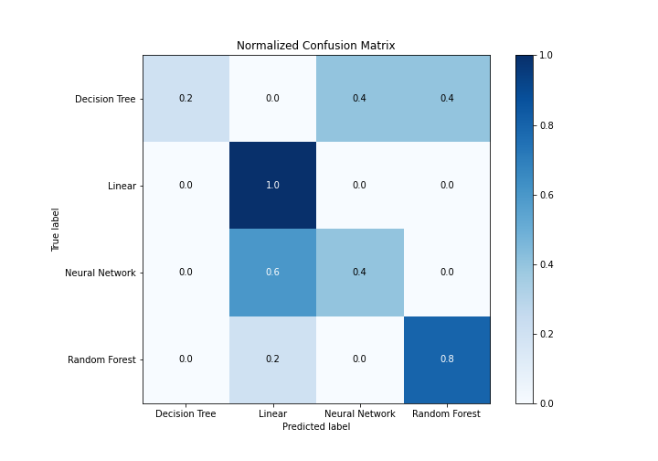
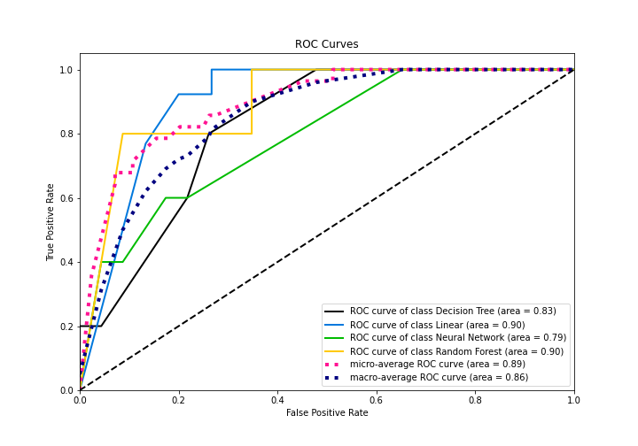
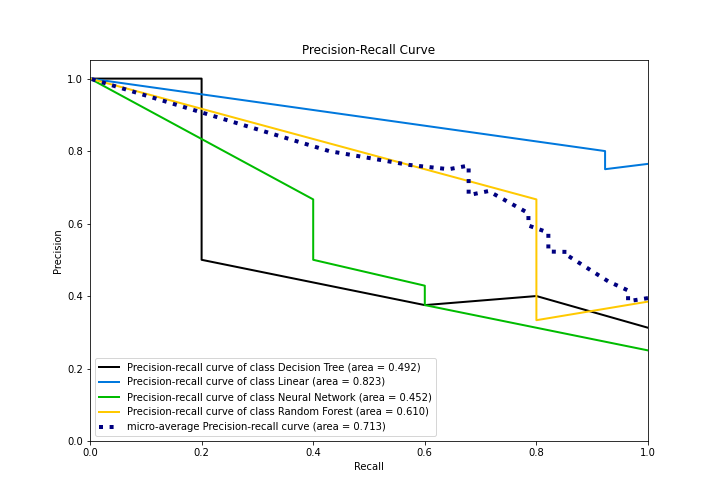

# Summary of 6_Default_RandomForest

[<< Go back](../README.md)

## Random Forest
- **n_jobs**: -1
- **criterion**: gini
- **max_features**: 0.9
- **min_samples_split**: 30
- **max_depth**: 4
- **eval_metric_name**: f1
- **num_class**: 4
- **explain_level**: 1

## Validation
 - **validation_type**: split
 - **train_ratio**: 0.75
 - **shuffle**: True
 - **stratify**: True

## Optimized metric
f1

## Training time

3.8 seconds

### Metric details
|           |   Decision Tree |    Linear |   Neural Network |   Random Forest |   accuracy |   macro avg |   weighted avg |   logloss |
|:----------|----------------:|----------:|-----------------:|----------------:|-----------:|------------:|---------------:|----------:|
| precision |        1        |  0.764706 |         0.5      |        0.666667 |   0.714286 |    0.732843 |       0.741947 |  0.776643 |
| recall    |        0.2      |  1        |         0.4      |        0.8      |   0.714286 |    0.6      |       0.714286 |  0.776643 |
| f1-score  |        0.333333 |  0.866667 |         0.444444 |        0.727273 |   0.714286 |    0.592929 |       0.67114  |  0.776643 |
| support   |        5        | 13        |         5        |        5        |   0.714286 |   28        |      28        |  0.776643 |

## Confusion matrix
|                           |   Predicted as Decision Tree |   Predicted as Linear |   Predicted as Neural Network |   Predicted as Random Forest |
|:--------------------------|-----------------------------:|----------------------:|------------------------------:|-----------------------------:|
| Labeled as Decision Tree  |                            1 |                     0 |                             2 |                            2 |
| Labeled as Linear         |                            0 |                    13 |                             0 |                            0 |
| Labeled as Neural Network |                            0 |                     3 |                             2 |                            0 |
| Labeled as Random Forest  |                            0 |                     1 |                             0 |                            4 |

## Learning curves

## Permutation-based Importance

## Confusion Matrix

## Normalized Confusion Matrix

## ROC Curve

## Precision Recall Curve

[<< Go back](../README.md)
