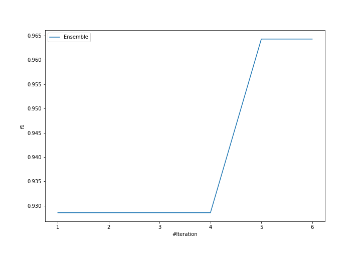
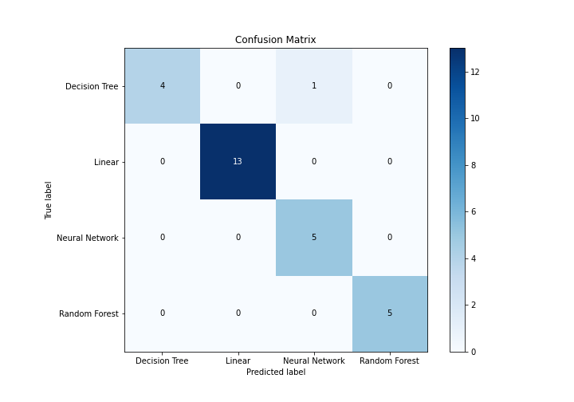
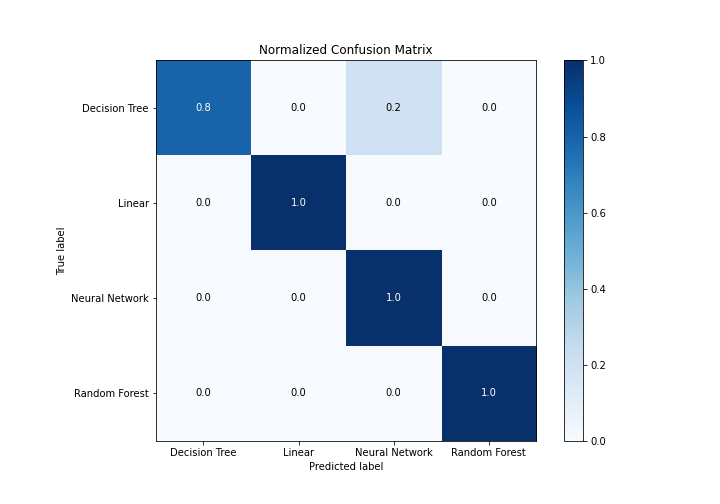
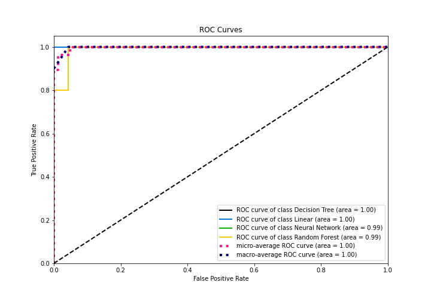
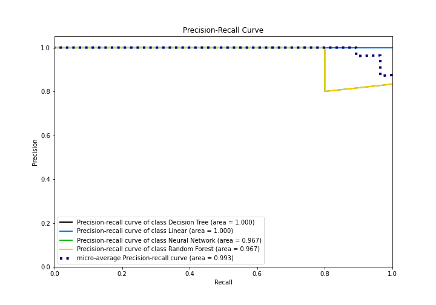

# Summary of Ensemble

[<< Go back](../README.md)

## Ensemble structure
| Model             |   Weight |
|:------------------|---------:|
| 2_DecisionTree    |        1 |
| 4_Default_Xgboost |        4 |

### Metric details
|           |   Decision Tree |   Linear |   Neural Network |   Random Forest |   accuracy |   macro avg |   weighted avg |   logloss |
|:----------|----------------:|---------:|-----------------:|----------------:|-----------:|------------:|---------------:|----------:|
| precision |        1        |        1 |         0.833333 |               1 |   0.964286 |    0.958333 |       0.970238 |  0.626947 |
| recall    |        0.8      |        1 |         1        |               1 |   0.964286 |    0.95     |       0.964286 |  0.626947 |
| f1-score  |        0.888889 |        1 |         0.909091 |               1 |   0.964286 |    0.949495 |       0.963925 |  0.626947 |
| support   |        5        |       13 |         5        |               5 |   0.964286 |   28        |      28        |  0.626947 |

## Confusion matrix
|                           |   Predicted as Decision Tree |   Predicted as Linear |   Predicted as Neural Network |   Predicted as Random Forest |
|:--------------------------|-----------------------------:|----------------------:|------------------------------:|-----------------------------:|
| Labeled as Decision Tree  |                            4 |                     0 |                             1 |                            0 |
| Labeled as Linear         |                            0 |                    13 |                             0 |                            0 |
| Labeled as Neural Network |                            0 |                     0 |                             5 |                            0 |
| Labeled as Random Forest  |                            0 |                     0 |                             0 |                            5 |

## Learning curves

## Confusion Matrix

## Normalized Confusion Matrix

## ROC Curve

## Precision Recall Curve

[<< Go back](../README.md)
