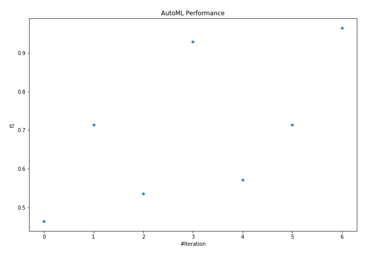
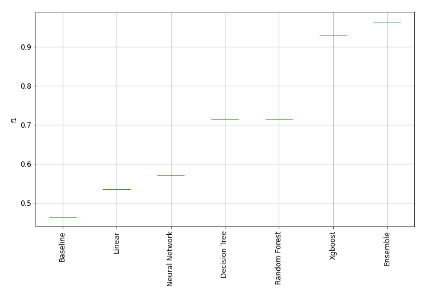
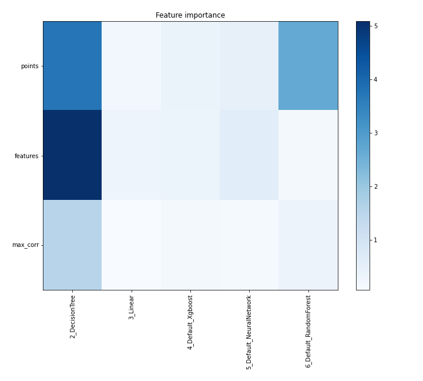
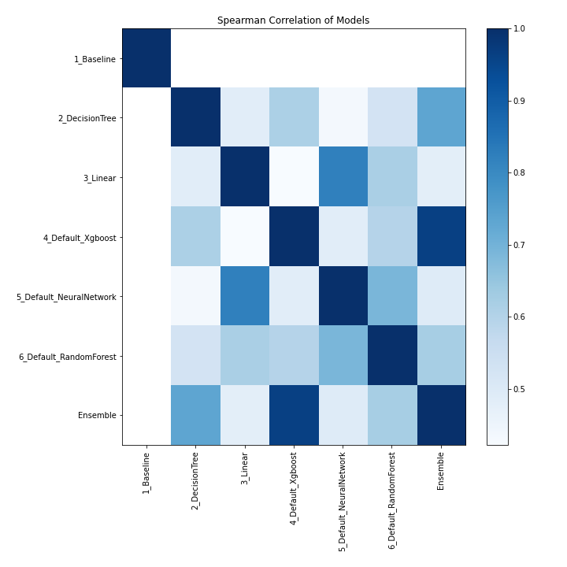

# AutoML Leaderboard

| Best model   | name                                                         | model_type     | metric_type   |   metric_value |   train_time |
|:-------------|:-------------------------------------------------------------|:---------------|:--------------|---------------:|-------------:|
|              | [1_Baseline](1_Baseline/README.md)                           | Baseline       | f1            |       0.464286 |         1.05 |
|              | [2_DecisionTree](2_DecisionTree/README.md)                   | Decision Tree  | f1            |       0.714286 |        10.15 |
|              | [3_Linear](3_Linear/README.md)                               | Linear         | f1            |       0.535714 |         3.87 |
|              | [4_Default_Xgboost](4_Default_Xgboost/README.md)             | Xgboost        | f1            |       0.928571 |         5.41 |
|              | [5_Default_NeuralNetwork](5_Default_NeuralNetwork/README.md) | Neural Network | f1            |       0.571429 |         1.37 |
|              | [6_Default_RandomForest](6_Default_RandomForest/README.md)   | Random Forest  | f1            |       0.714286 |         4.64 |
| **the best** | [Ensemble](Ensemble/README.md)                               | Ensemble       | f1            |       0.964286 |         0.19 |

### AutoML Performance

### AutoML Performance Boxplot

### Features Importance

### Spearman Correlation of Models

