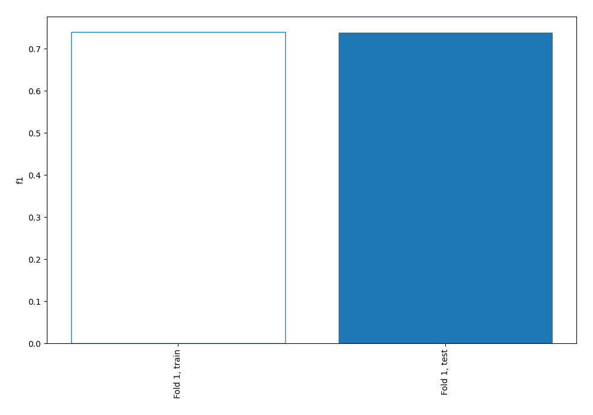
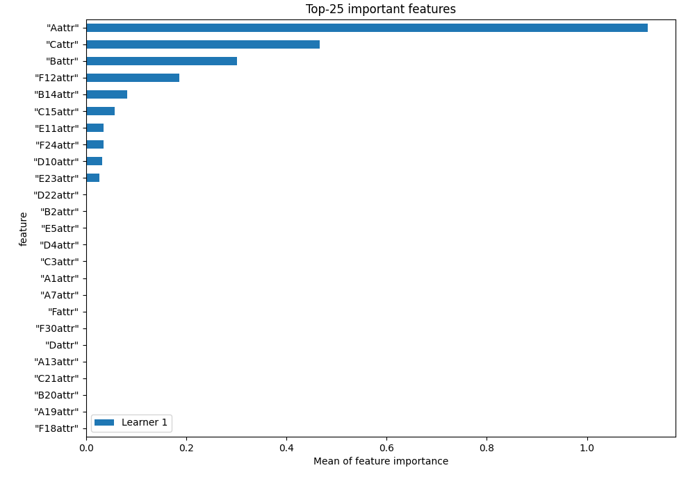
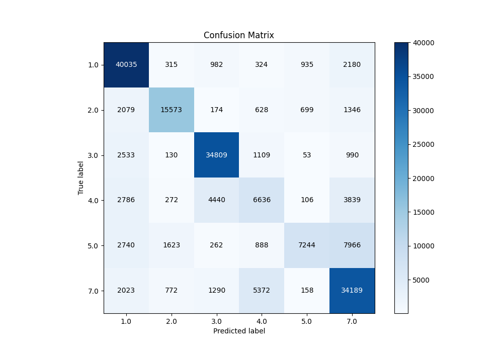
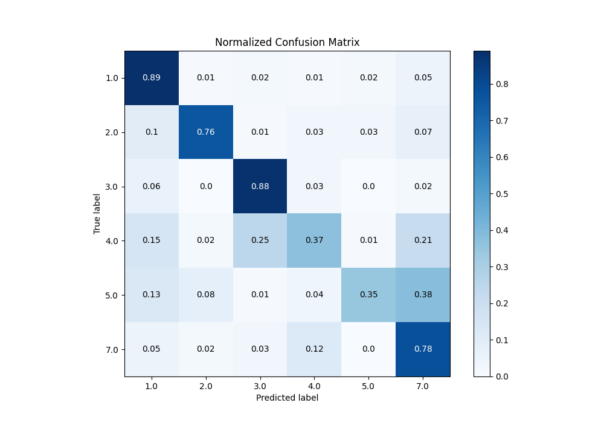
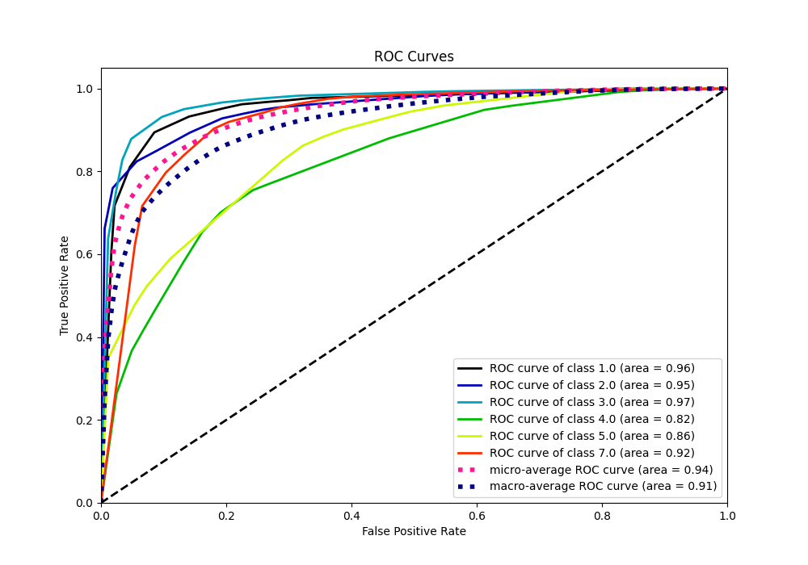
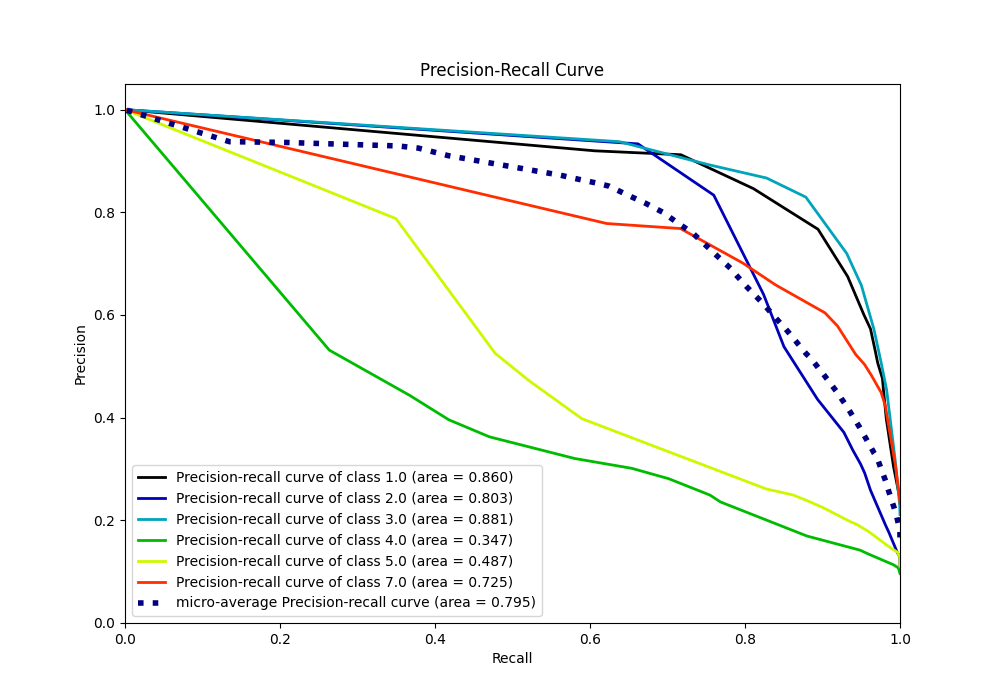

# Summary of 1_DecisionTree

[<< Go back](../README.md)

## Decision Tree
- **n_jobs**: -1
- **criterion**: entropy
- **max_depth**: 4
- **num_class**: 6
- **explain_level**: 1

## Validation
 - **validation_type**: split
 - **train_ratio**: 0.75
 - **shuffle**: True
 - **stratify**: True

## Optimized metric
f1

## Training time

122.2 seconds

### Metric details
|           |          1.0 |          2.0 |          3.0 |          4.0 |          5.0 |          7.0 |   accuracy |     macro avg |   weighted avg |   logloss |
|:----------|-------------:|-------------:|-------------:|-------------:|-------------:|-------------:|-----------:|--------------:|---------------:|----------:|
| precision |     0.767013 |     0.833449 |     0.829635 |     0.443672 |     0.787819 |     0.676876 |   0.738592 |      0.723077 |       0.737575 |  0.771896 |
| recall    |     0.894217 |     0.759696 |     0.878483 |     0.367056 |     0.349563 |     0.780499 |   0.738592 |      0.671586 |       0.738592 |  0.771896 |
| f1-score  |     0.825745 |     0.794865 |     0.85336  |     0.401744 |     0.484257 |     0.725004 |   0.738592 |      0.680829 |       0.726045 |  0.771896 |
| support   | 44771        | 20499        | 39624        | 18079        | 20723        | 43804        |   0.738592 | 187500        |  187500        |  0.771896 |

## Confusion matrix
|                |   Predicted as 1.0 |   Predicted as 2.0 |   Predicted as 3.0 |   Predicted as 4.0 |   Predicted as 5.0 |   Predicted as 7.0 |
|:---------------|-------------------:|-------------------:|-------------------:|-------------------:|-------------------:|-------------------:|
| Labeled as 1.0 |              40035 |                315 |                982 |                324 |                935 |               2180 |
| Labeled as 2.0 |               2079 |              15573 |                174 |                628 |                699 |               1346 |
| Labeled as 3.0 |               2533 |                130 |              34809 |               1109 |                 53 |                990 |
| Labeled as 4.0 |               2786 |                272 |               4440 |               6636 |                106 |               3839 |
| Labeled as 5.0 |               2740 |               1623 |                262 |                888 |               7244 |               7966 |
| Labeled as 7.0 |               2023 |                772 |               1290 |               5372 |                158 |              34189 |

## Learning curves

## Permutation-based Importance

## Confusion Matrix

## Normalized Confusion Matrix

## ROC Curve

## Precision Recall Curve

[<< Go back](../README.md)
