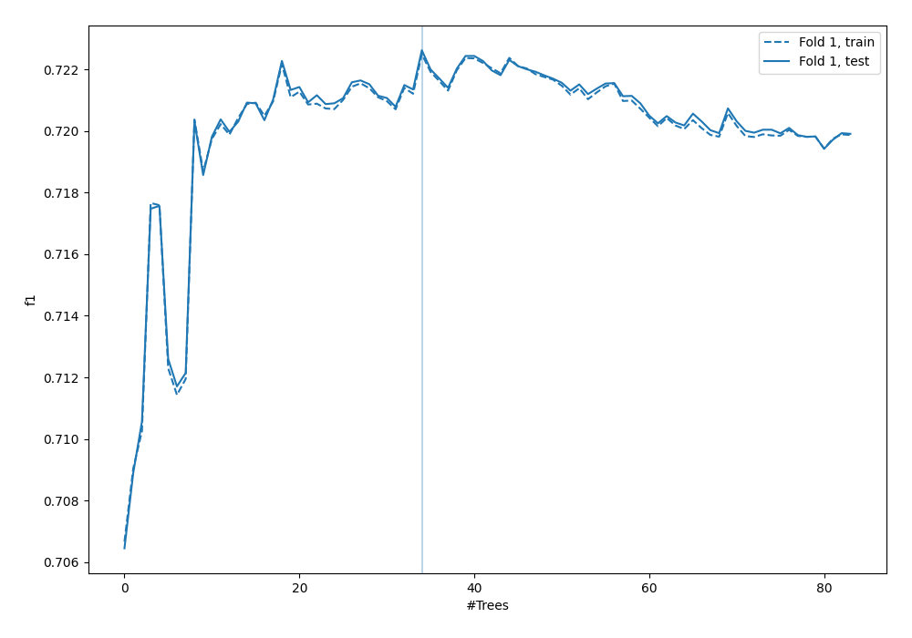
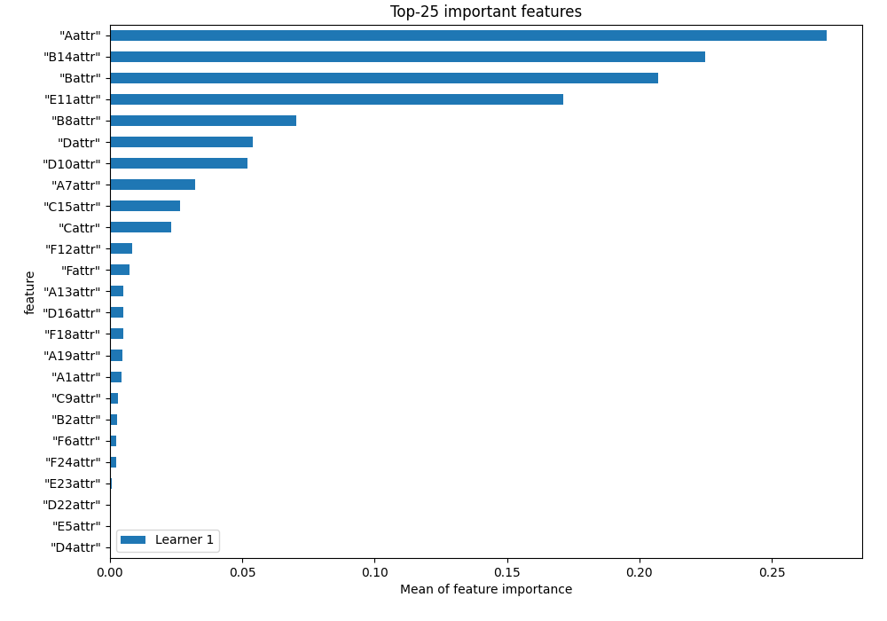
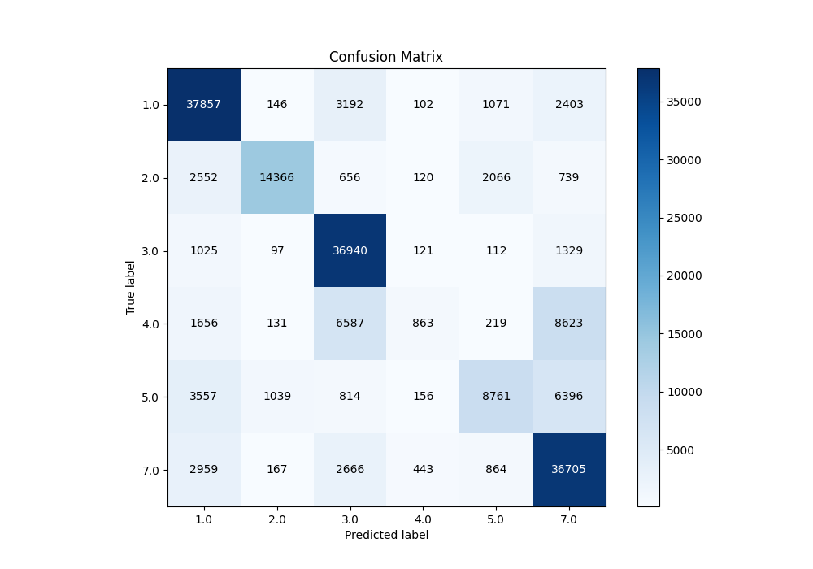
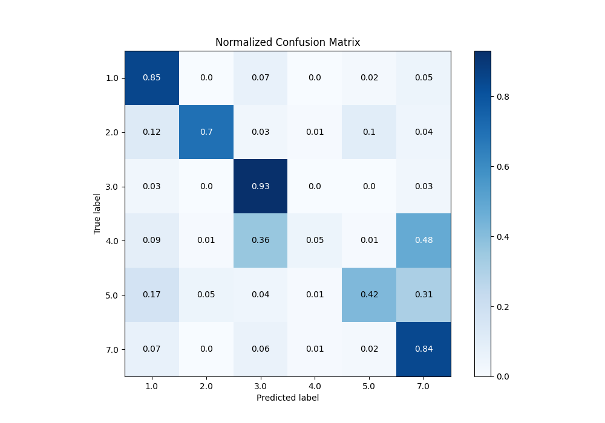
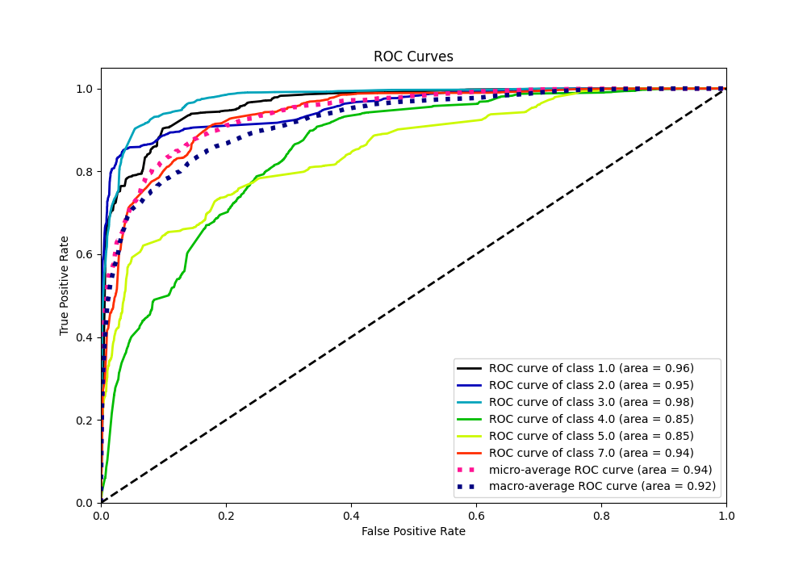
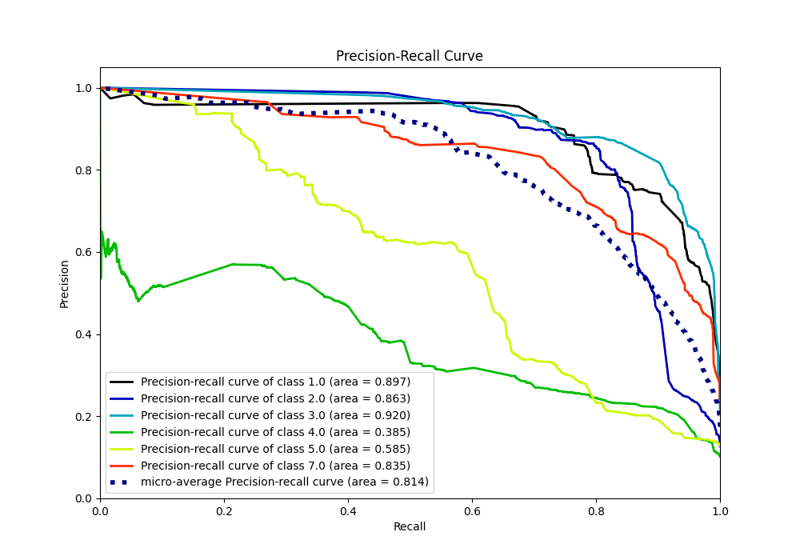

# Summary of 3_Default_RandomForest

[<< Go back](../README.md)

## Random Forest
- **n_jobs**: -1
- **criterion**: gini
- **max_features**: 0.9
- **min_samples_split**: 30
- **max_depth**: 4
- **eval_metric_name**: f1
- **num_class**: 6
- **explain_level**: 1

## Validation
 - **validation_type**: split
 - **train_ratio**: 0.75
 - **shuffle**: True
 - **stratify**: True

## Optimized metric
f1

## Training time

259.2 seconds

### Metric details
|           |          1.0 |          2.0 |          3.0 |           4.0 |          5.0 |          7.0 |   accuracy |     macro avg |   weighted avg |   logloss |
|:----------|-------------:|-------------:|-------------:|--------------:|-------------:|-------------:|-----------:|--------------:|---------------:|----------:|
| precision |     0.763154 |     0.900916 |     0.726379 |     0.478116  |     0.669136 |     0.653172 |   0.722624 |      0.698479 |       0.706875 |  0.791122 |
| recall    |     0.84557  |     0.700815 |     0.932263 |     0.0477349 |     0.422767 |     0.837937 |   0.722624 |      0.631181 |       0.722624 |  0.791122 |
| f1-score  |     0.802251 |     0.788366 |     0.816543 |     0.0868035 |     0.518157 |     0.734107 |   0.722624 |      0.624371 |       0.68745  |  0.791122 |
| support   | 44771        | 20499        | 39624        | 18079         | 20723        | 43804        |   0.722624 | 187500        |  187500        |  0.791122 |

## Confusion matrix
|                |   Predicted as 1.0 |   Predicted as 2.0 |   Predicted as 3.0 |   Predicted as 4.0 |   Predicted as 5.0 |   Predicted as 7.0 |
|:---------------|-------------------:|-------------------:|-------------------:|-------------------:|-------------------:|-------------------:|
| Labeled as 1.0 |              37857 |                146 |               3192 |                102 |               1071 |               2403 |
| Labeled as 2.0 |               2552 |              14366 |                656 |                120 |               2066 |                739 |
| Labeled as 3.0 |               1025 |                 97 |              36940 |                121 |                112 |               1329 |
| Labeled as 4.0 |               1656 |                131 |               6587 |                863 |                219 |               8623 |
| Labeled as 5.0 |               3557 |               1039 |                814 |                156 |               8761 |               6396 |
| Labeled as 7.0 |               2959 |                167 |               2666 |                443 |                864 |              36705 |

## Learning curves

## Permutation-based Importance

## Confusion Matrix

## Normalized Confusion Matrix

## ROC Curve

## Precision Recall Curve

[<< Go back](../README.md)
