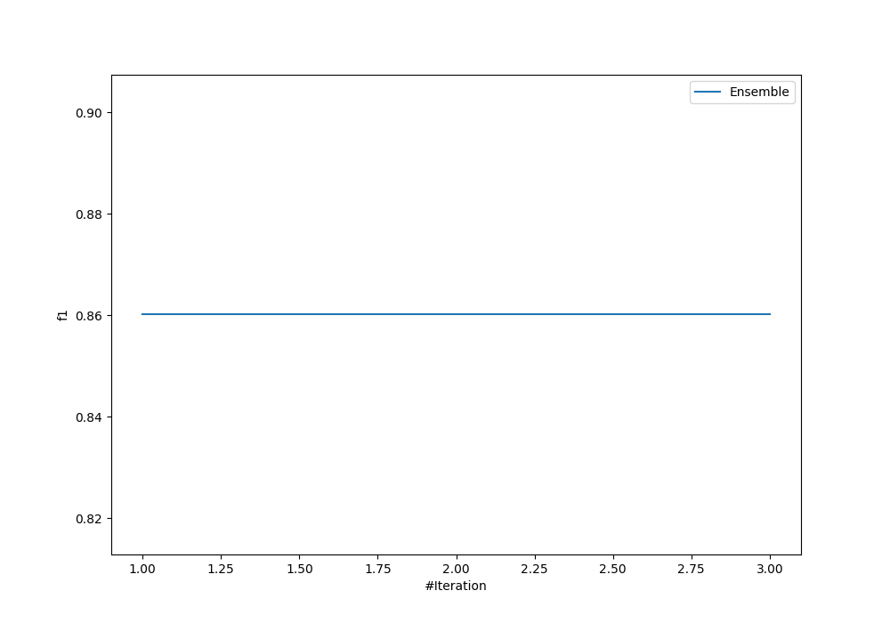
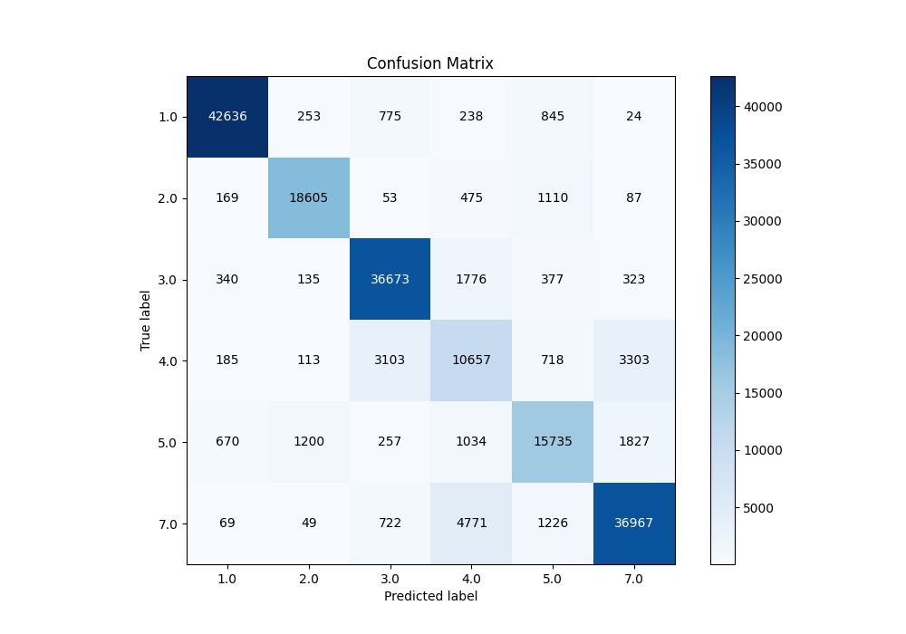
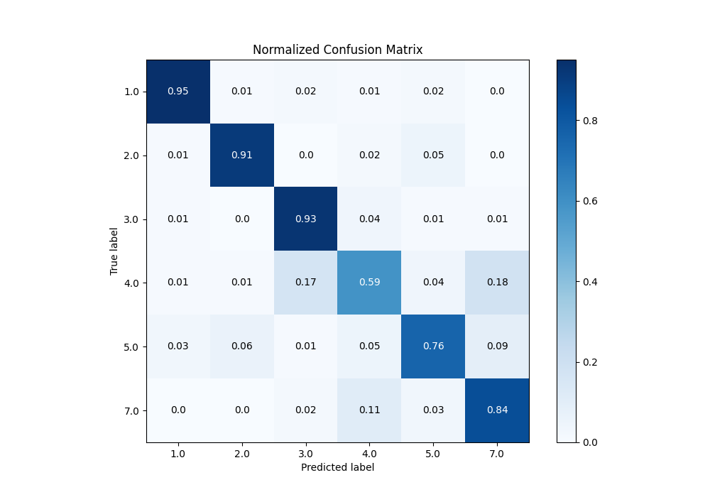
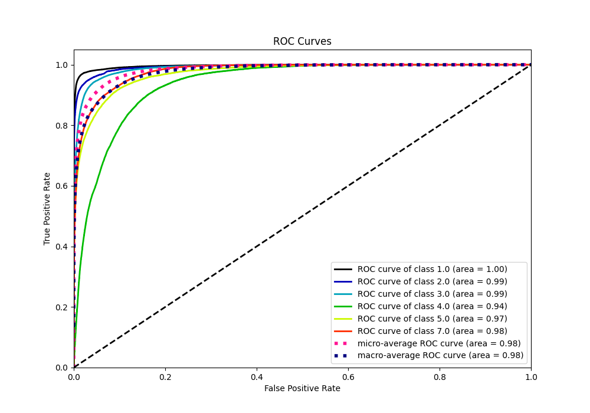
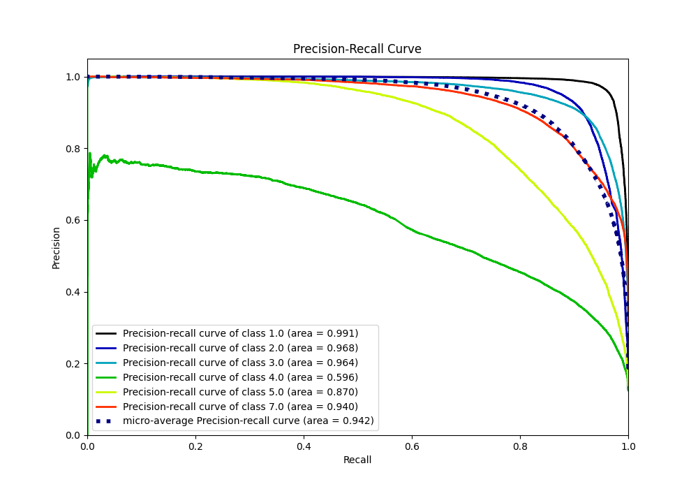

# Summary of Ensemble

[<< Go back](../README.md)

## Ensemble structure
| Model                   |   Weight |
|:------------------------|---------:|
| 2_Default_NeuralNetwork |        1 |

### Metric details
|           |          1.0 |          2.0 |          3.0 |          4.0 |          5.0 |          7.0 |   accuracy |     macro avg |   weighted avg |   logloss |
|:----------|-------------:|-------------:|-------------:|-------------:|-------------:|-------------:|-----------:|--------------:|---------------:|----------:|
| precision |     0.967483 |     0.914026 |     0.881923 |     0.562345 |     0.786318 |     0.869178 |   0.860123 |      0.830212 |       0.861504 |  0.402737 |
| recall    |     0.952313 |     0.907605 |     0.925525 |     0.589468 |     0.759301 |     0.843918 |   0.860123 |      0.829689 |       0.860123 |  0.402737 |
| f1-score  |     0.959838 |     0.910804 |     0.903198 |     0.575587 |     0.772573 |     0.856362 |   0.860123 |      0.829727 |       0.860586 |  0.402737 |
| support   | 44771        | 20499        | 39624        | 18079        | 20723        | 43804        |   0.860123 | 187500        |  187500        |  0.402737 |

## Confusion matrix
|                |   Predicted as 1.0 |   Predicted as 2.0 |   Predicted as 3.0 |   Predicted as 4.0 |   Predicted as 5.0 |   Predicted as 7.0 |
|:---------------|-------------------:|-------------------:|-------------------:|-------------------:|-------------------:|-------------------:|
| Labeled as 1.0 |              42636 |                253 |                775 |                238 |                845 |                 24 |
| Labeled as 2.0 |                169 |              18605 |                 53 |                475 |               1110 |                 87 |
| Labeled as 3.0 |                340 |                135 |              36673 |               1776 |                377 |                323 |
| Labeled as 4.0 |                185 |                113 |               3103 |              10657 |                718 |               3303 |
| Labeled as 5.0 |                670 |               1200 |                257 |               1034 |              15735 |               1827 |
| Labeled as 7.0 |                 69 |                 49 |                722 |               4771 |               1226 |              36967 |

## Learning curves

## Confusion Matrix

## Normalized Confusion Matrix

## ROC Curve

## Precision Recall Curve

[<< Go back](../README.md)
