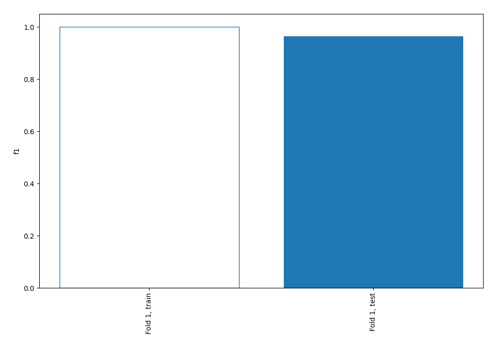
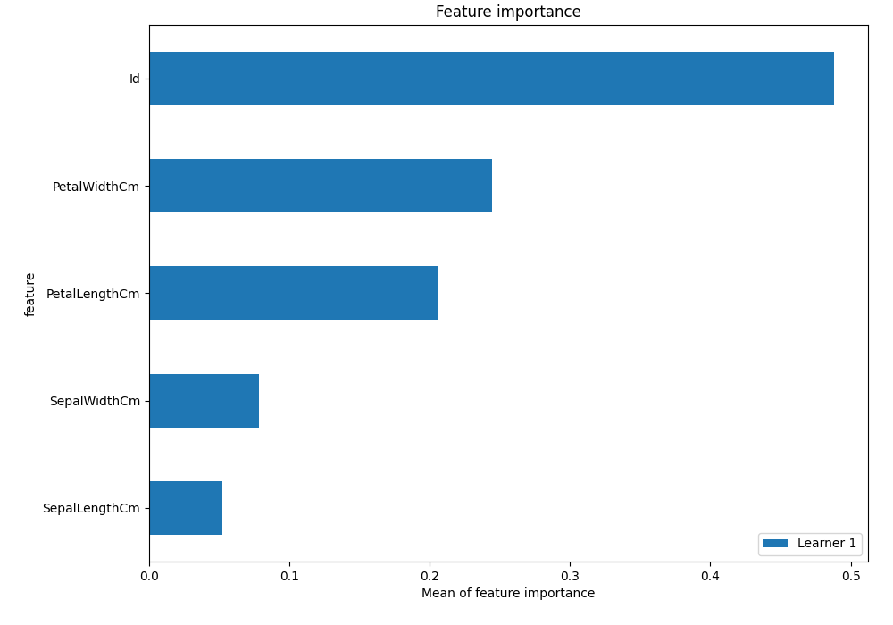
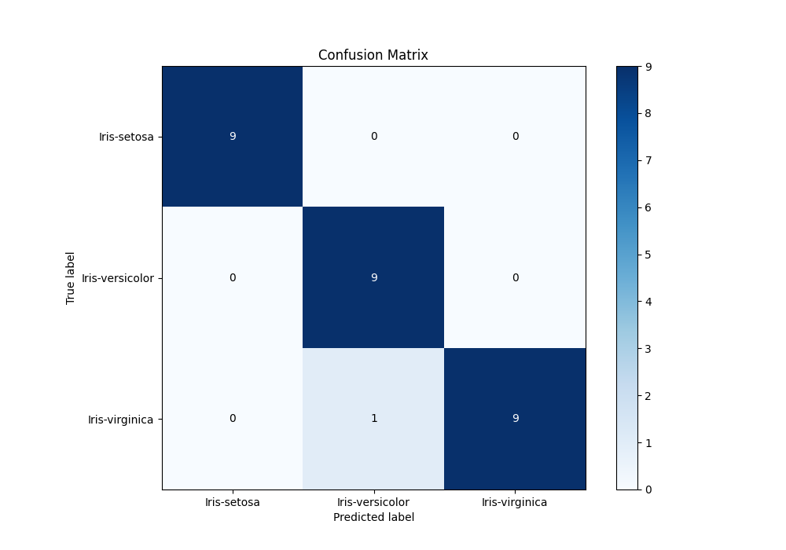
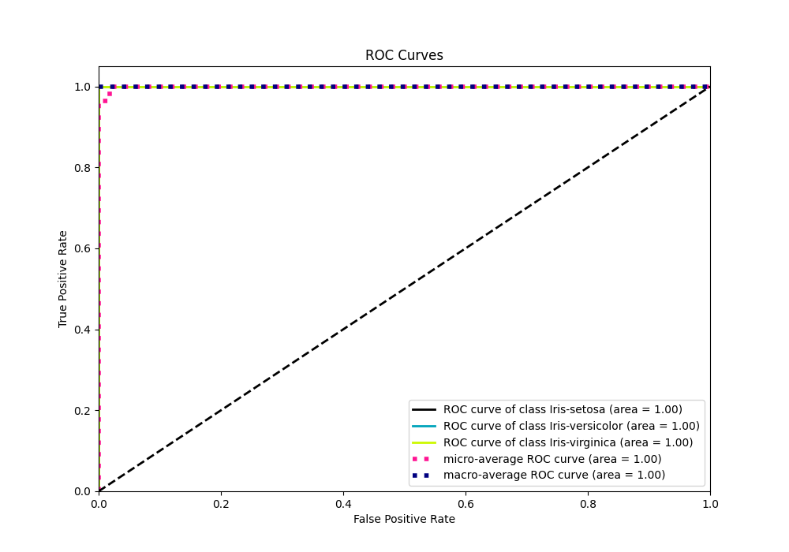
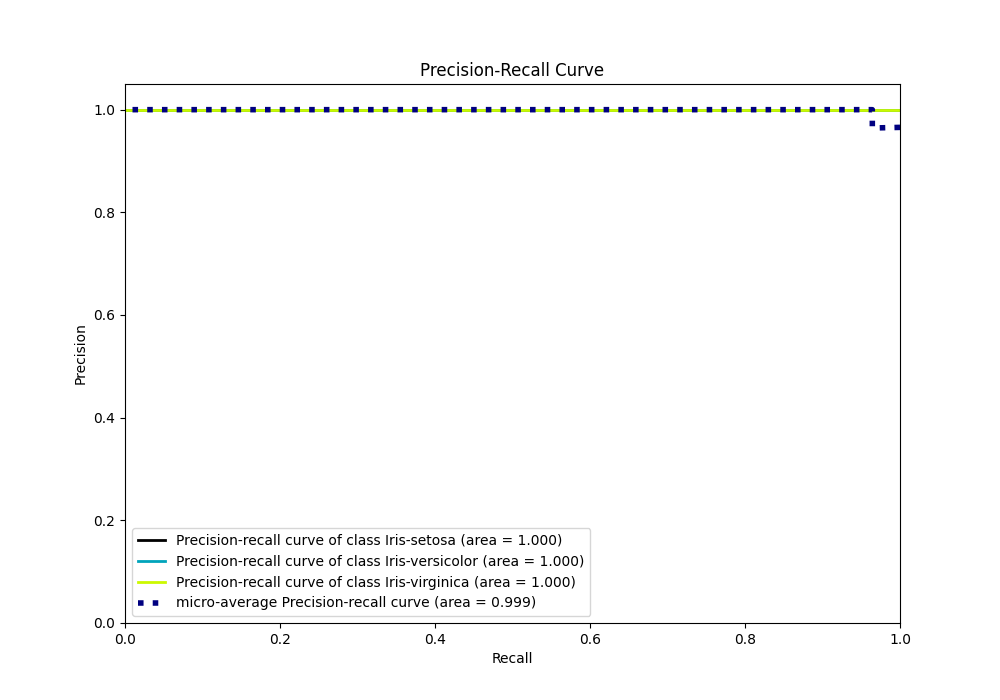

# Summary of 2_Linear

[<< Go back](../README.md)

## Logistic Regression (Linear)
- **n_jobs**: -1
- **num_class**: 3
- **explain_level**: 1

## Validation
 - **validation_type**: split
 - **train_ratio**: 0.75
 - **shuffle**: True
 - **stratify**: True

## Optimized metric
f1

## Training time

0.3 seconds

### Metric details
|           |   Iris-setosa |   Iris-versicolor |   Iris-virginica |   accuracy |   macro avg |   weighted avg |   logloss |
|:----------|--------------:|------------------:|-----------------:|-----------:|------------:|---------------:|----------:|
| precision |             1 |          0.9      |         1        |   0.964286 |    0.966667 |       0.967857 |  0.114688 |
| recall    |             1 |          1        |         0.9      |   0.964286 |    0.966667 |       0.964286 |  0.114688 |
| f1-score  |             1 |          0.947368 |         0.947368 |   0.964286 |    0.964912 |       0.964286 |  0.114688 |
| support   |             9 |          9        |        10        |   0.964286 |   28        |      28        |  0.114688 |

## Confusion matrix
|                            |   Predicted as Iris-setosa |   Predicted as Iris-versicolor |   Predicted as Iris-virginica |
|:---------------------------|---------------------------:|-------------------------------:|------------------------------:|
| Labeled as Iris-setosa     |                          9 |                              0 |                             0 |
| Labeled as Iris-versicolor |                          0 |                              9 |                             0 |
| Labeled as Iris-virginica  |                          0 |                              1 |                             9 |

## Learning curves

## Coefficients

### Coefficients learner #1
|               |   Iris-setosa |   Iris-versicolor |   Iris-virginica |
|:--------------|--------------:|------------------:|-----------------:|
| intercept     |     -0.441141 |         1.85661   |        -1.41547  |
| Id            |     -1.07115  |        -0.734379  |         1.80553  |
| SepalLengthCm |     -0.855701 |         0.0230259 |         0.832675 |
| SepalWidthCm  |      0.940744 |        -0.41148   |        -0.529265 |
| PetalLengthCm |     -1.28998  |         0.209937  |         1.08004  |
| PetalWidthCm  |     -1.225    |        -0.243214  |         1.46821  |

## Permutation-based Importance

## Confusion Matrix

## Normalized Confusion Matrix

## ROC Curve

## Precision Recall Curve

[<< Go back](../README.md)
