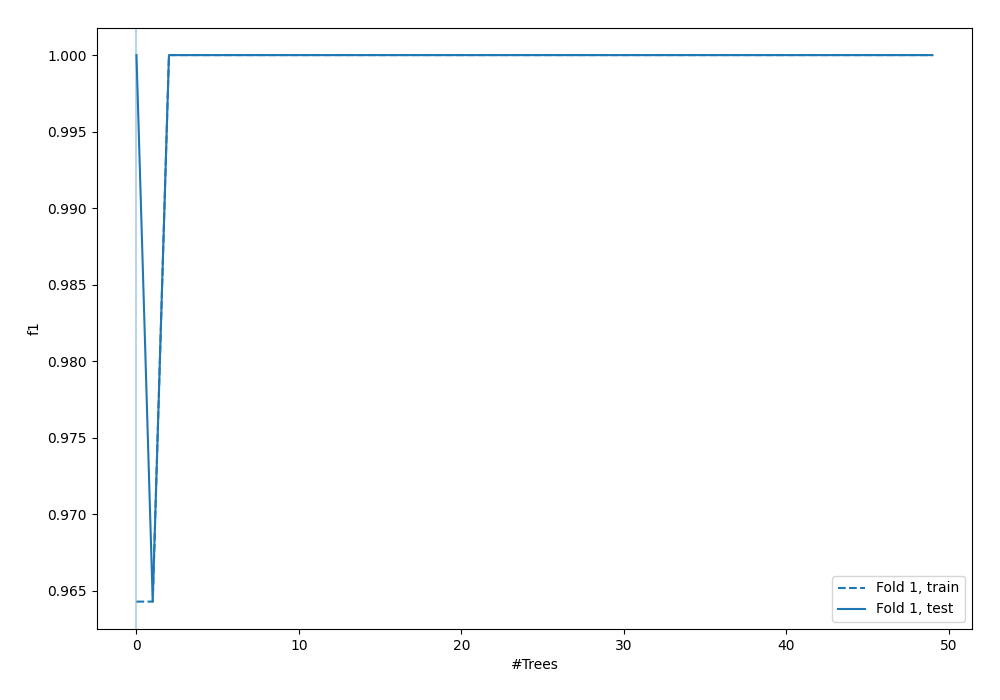
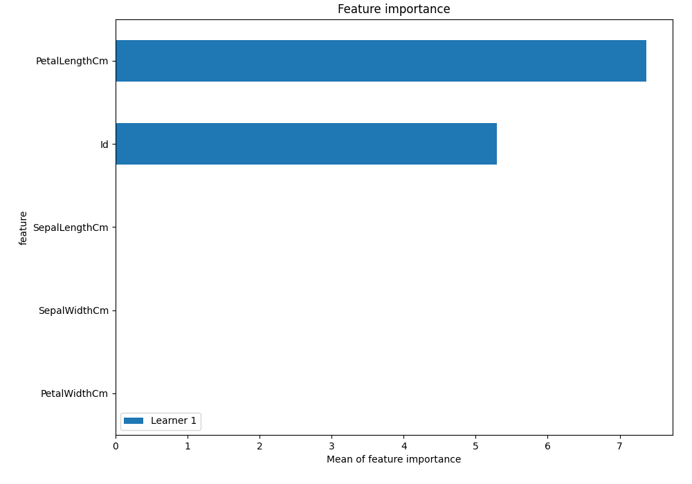
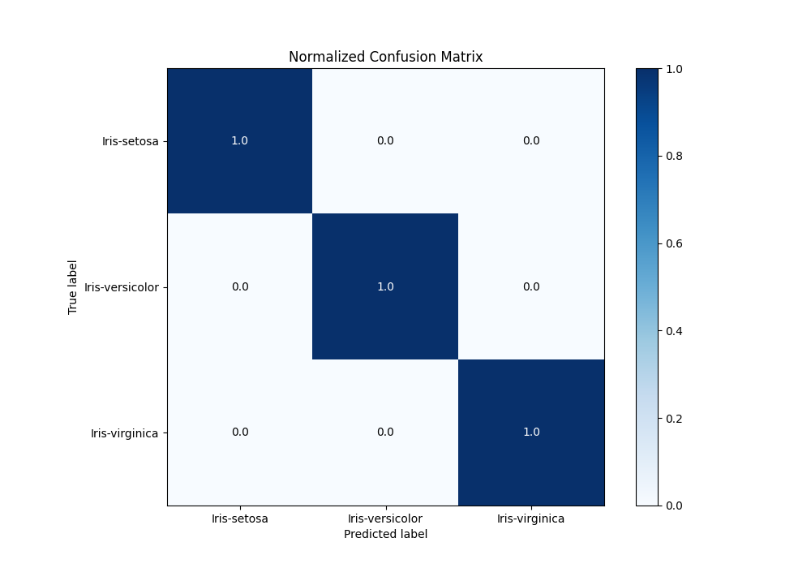
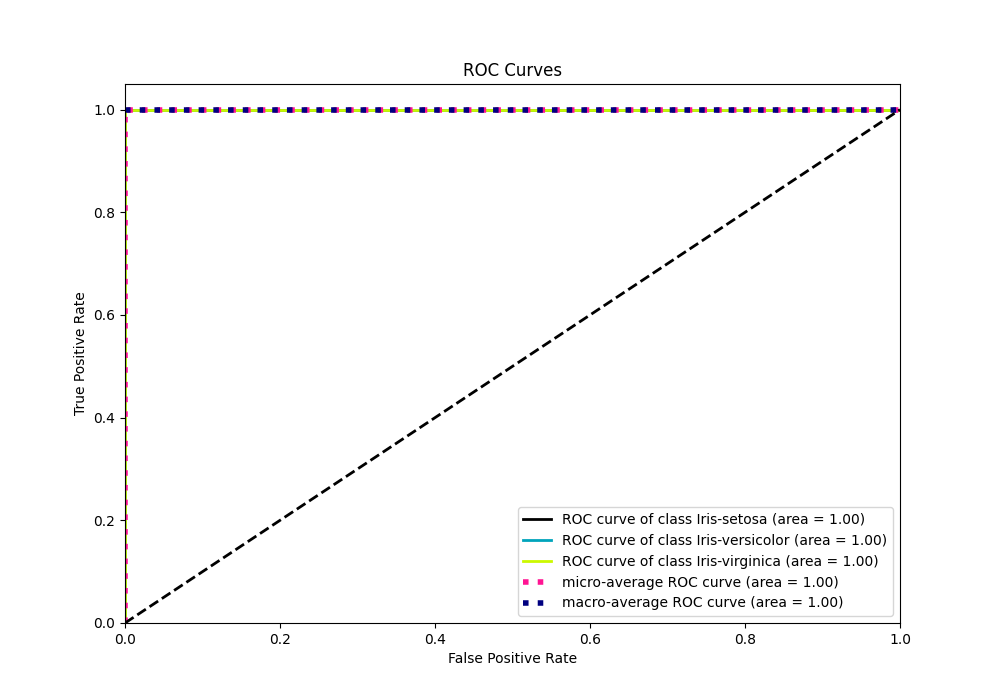
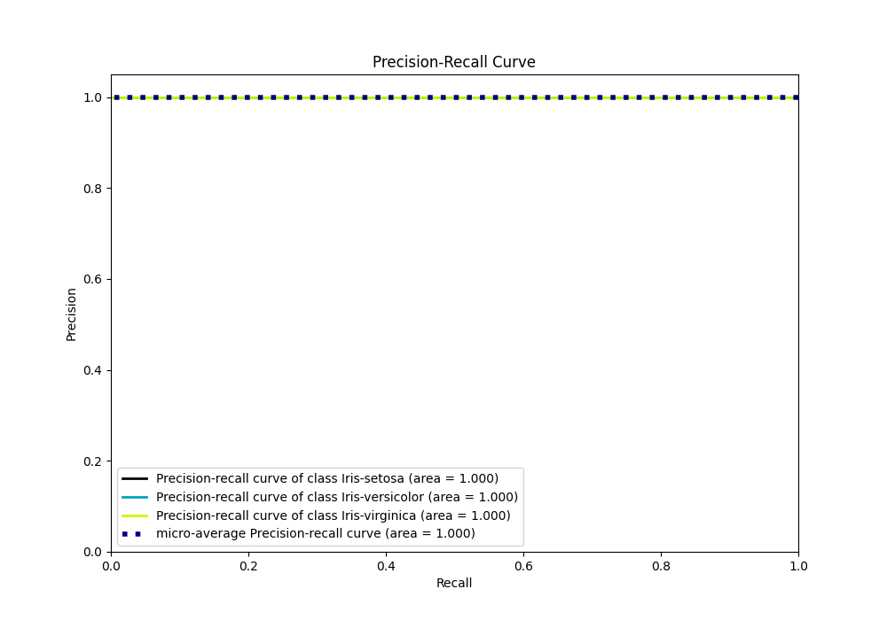

# Summary of 4_Default_RandomForest

[<< Go back](../README.md)

## Random Forest
- **n_jobs**: -1
- **criterion**: gini
- **max_features**: 0.9
- **min_samples_split**: 30
- **max_depth**: 4
- **eval_metric_name**: f1
- **num_class**: 3
- **explain_level**: 1

## Validation
 - **validation_type**: split
 - **train_ratio**: 0.75
 - **shuffle**: True
 - **stratify**: True

## Optimized metric
f1

## Training time

0.8 seconds

### Metric details
|           |   Iris-setosa |   Iris-versicolor |   Iris-virginica |   accuracy |   macro avg |   weighted avg |   logloss |
|:----------|--------------:|------------------:|-----------------:|-----------:|------------:|---------------:|----------:|
| precision |             1 |                 1 |                1 |          1 |           1 |              1 |     2e-06 |
| recall    |             1 |                 1 |                1 |          1 |           1 |              1 |     2e-06 |
| f1-score  |             1 |                 1 |                1 |          1 |           1 |              1 |     2e-06 |
| support   |             9 |                 9 |               10 |          1 |          28 |             28 |     2e-06 |

## Confusion matrix
|                            |   Predicted as Iris-setosa |   Predicted as Iris-versicolor |   Predicted as Iris-virginica |
|:---------------------------|---------------------------:|-------------------------------:|------------------------------:|
| Labeled as Iris-setosa     |                          9 |                              0 |                             0 |
| Labeled as Iris-versicolor |                          0 |                              9 |                             0 |
| Labeled as Iris-virginica  |                          0 |                              0 |                            10 |

## Learning curves

## Permutation-based Importance

## Confusion Matrix

## Normalized Confusion Matrix

## ROC Curve

## Precision Recall Curve

[<< Go back](../README.md)
