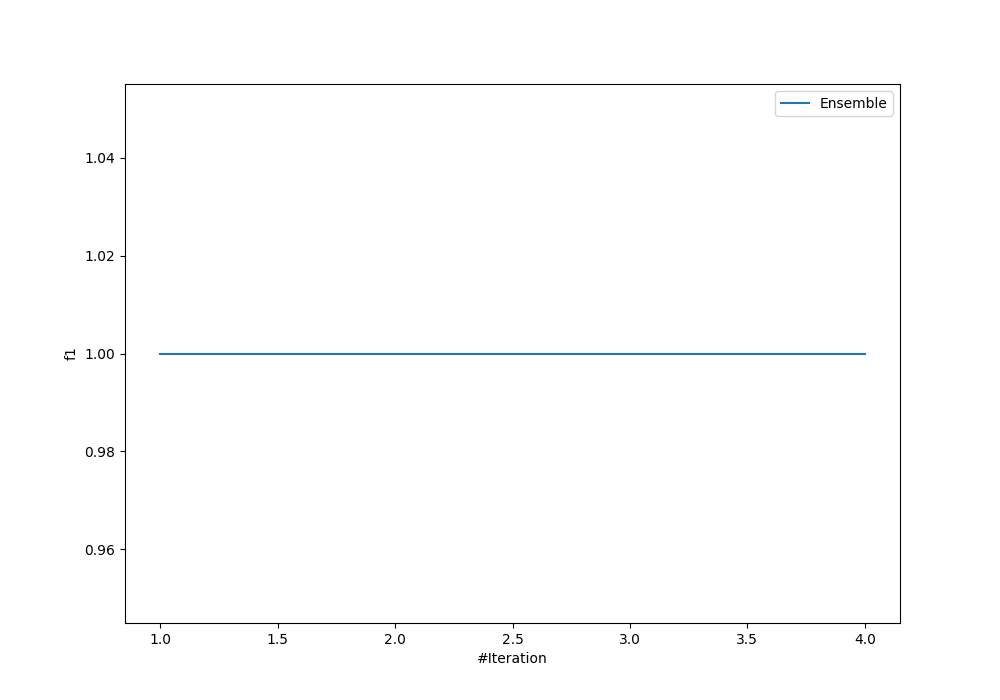
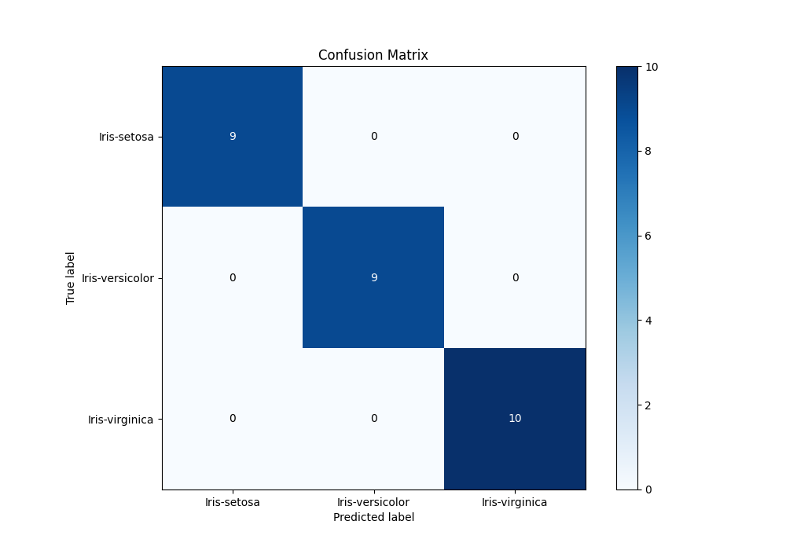

# Summary of Ensemble

[<< Go back](../README.md)

## Ensemble structure
| Model          |   Weight |
|:---------------|---------:|
| 1_DecisionTree |        1 |

### Metric details
|           |   Iris-setosa |   Iris-versicolor |   Iris-virginica |   accuracy |   macro avg |   weighted avg |   logloss |
|:----------|--------------:|------------------:|-----------------:|-----------:|------------:|---------------:|----------:|
| precision |             1 |                 1 |                1 |          1 |           1 |              1 |     2e-06 |
| recall    |             1 |                 1 |                1 |          1 |           1 |              1 |     2e-06 |
| f1-score  |             1 |                 1 |                1 |          1 |           1 |              1 |     2e-06 |
| support   |             9 |                 9 |               10 |          1 |          28 |             28 |     2e-06 |

## Confusion matrix
|                            |   Predicted as Iris-setosa |   Predicted as Iris-versicolor |   Predicted as Iris-virginica |
|:---------------------------|---------------------------:|-------------------------------:|------------------------------:|
| Labeled as Iris-setosa     |                          9 |                              0 |                             0 |
| Labeled as Iris-versicolor |                          0 |                              9 |                             0 |
| Labeled as Iris-virginica  |                          0 |                              0 |                            10 |

## Learning curves

## Confusion Matrix

## Normalized Confusion Matrix

## ROC Curve

## Precision Recall Curve

[<< Go back](../README.md)
