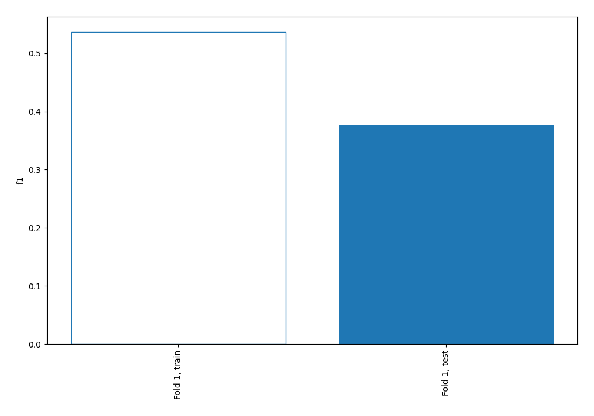
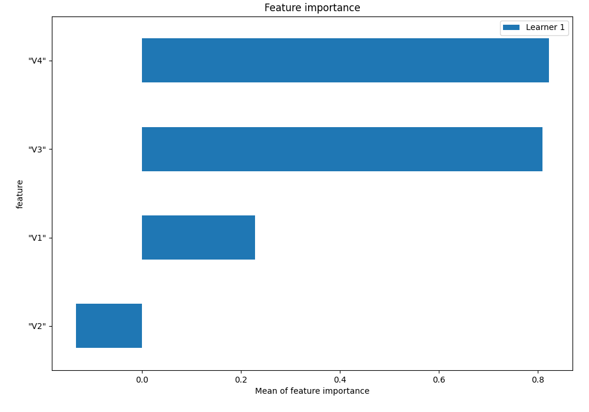
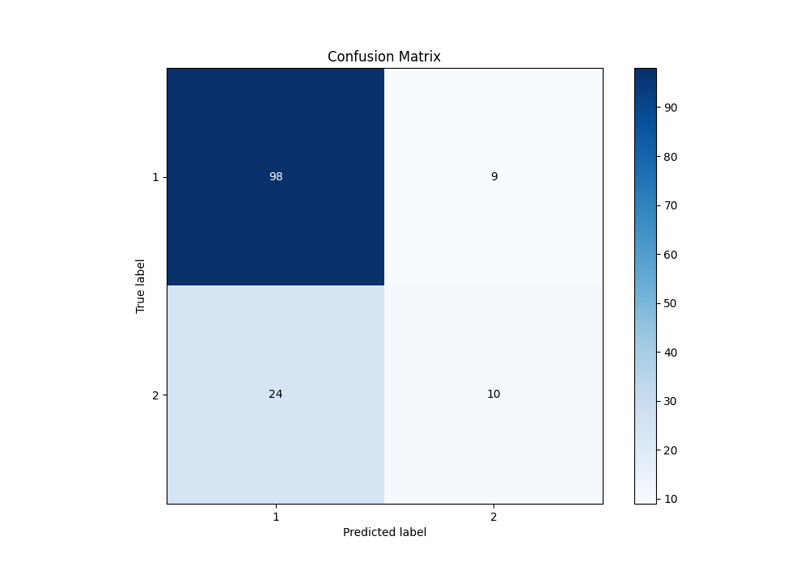
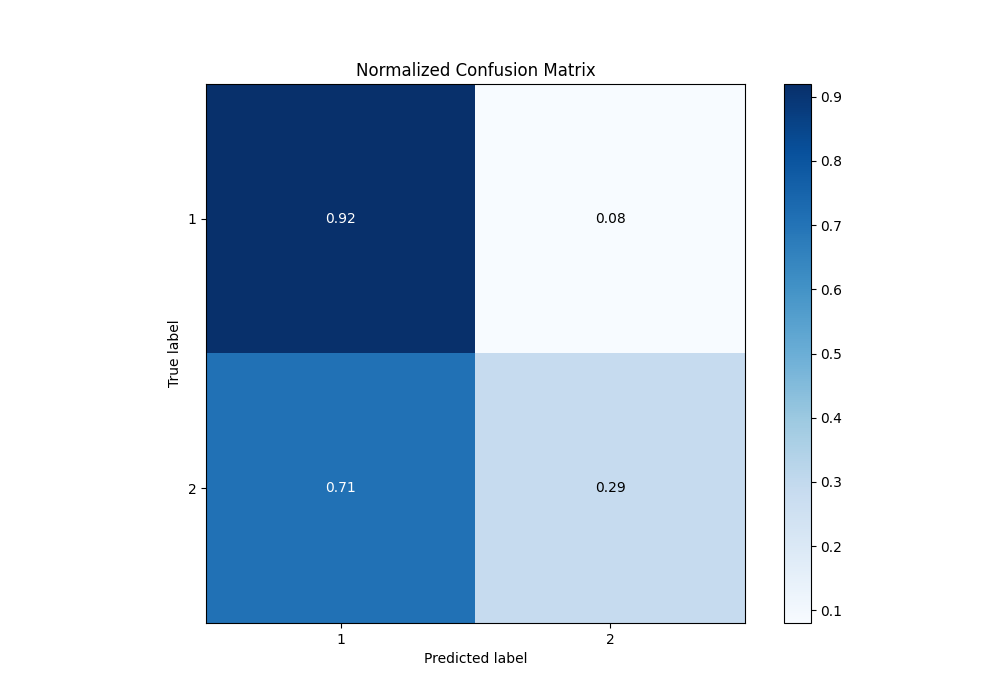
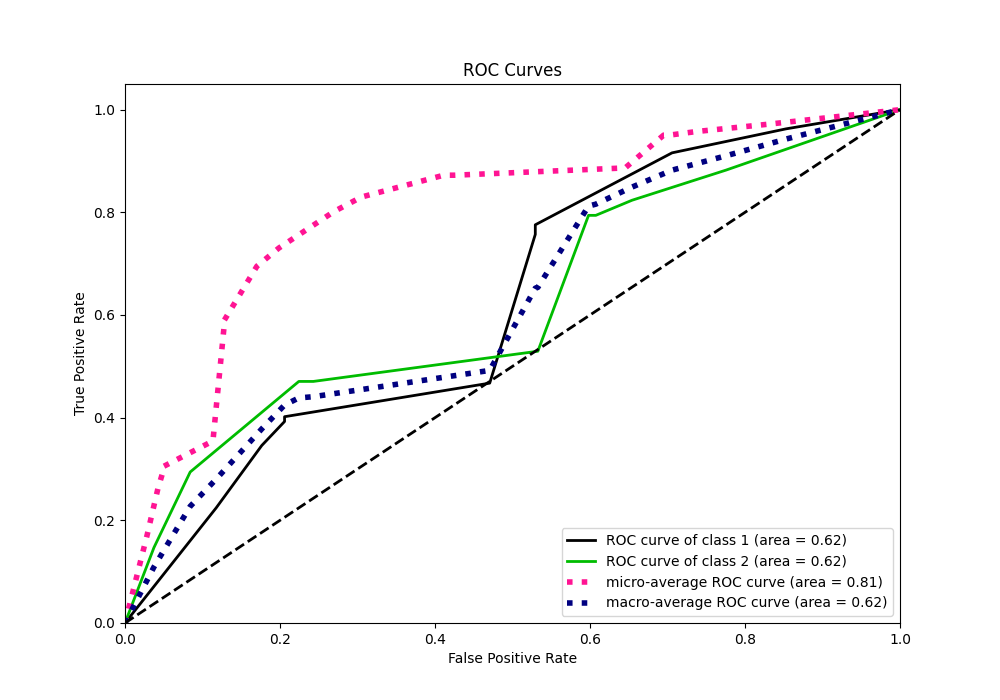
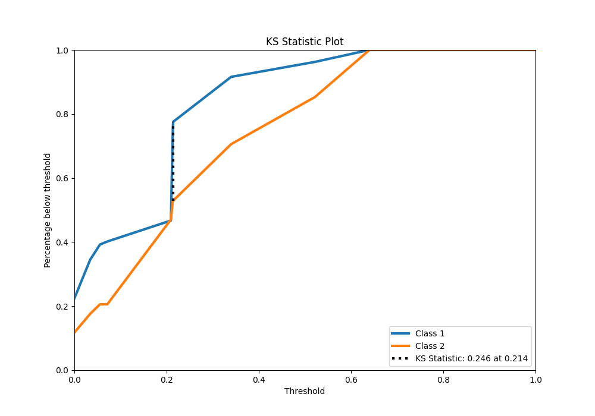
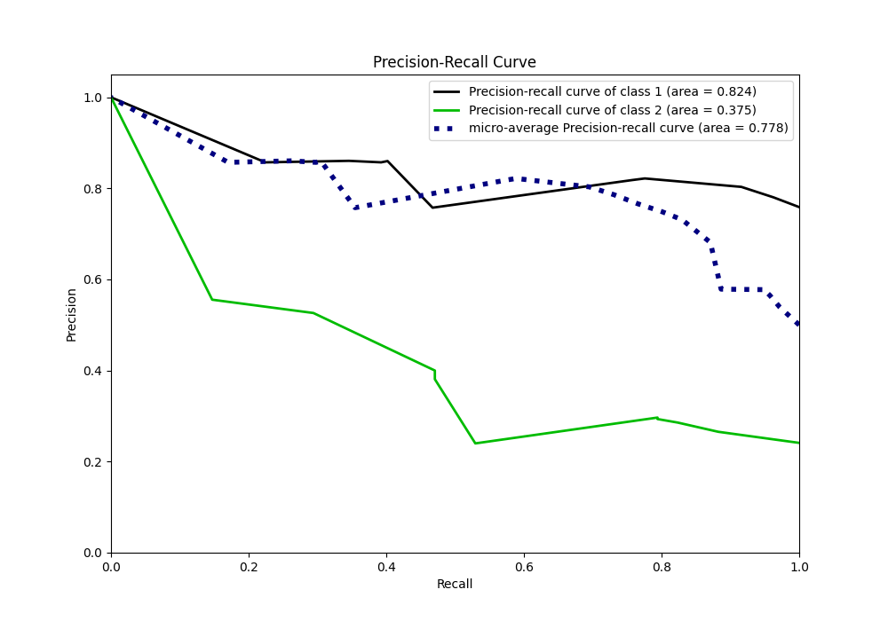
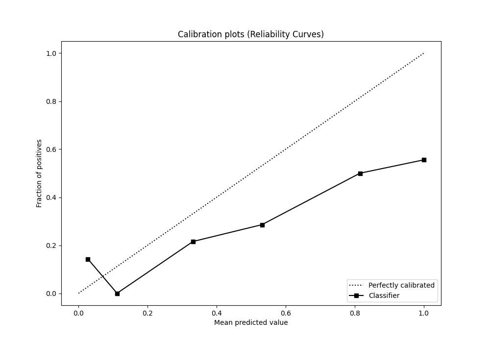
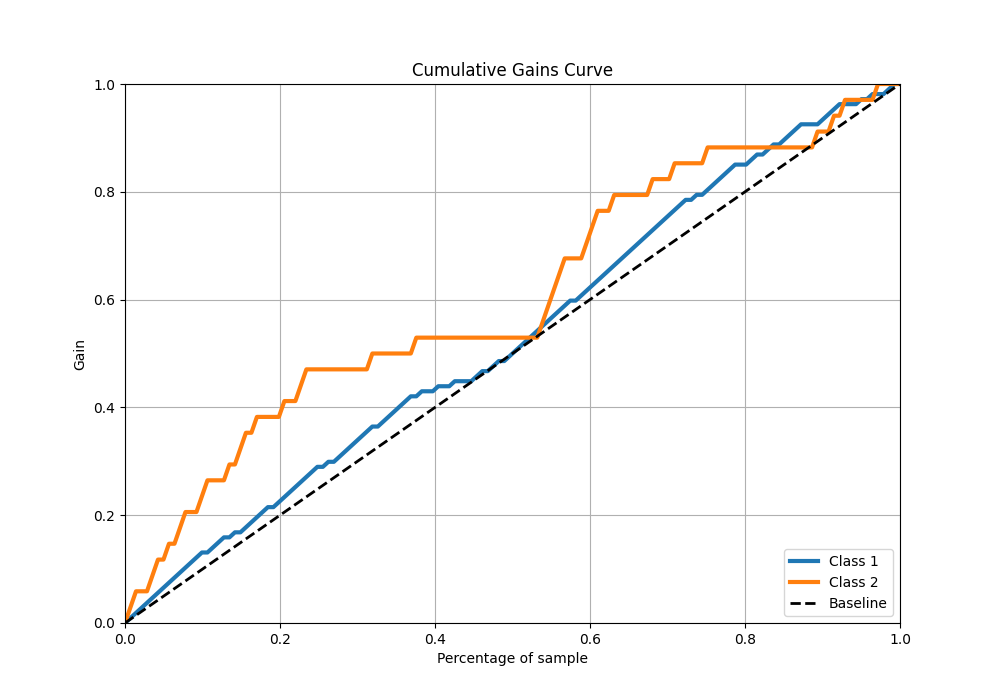
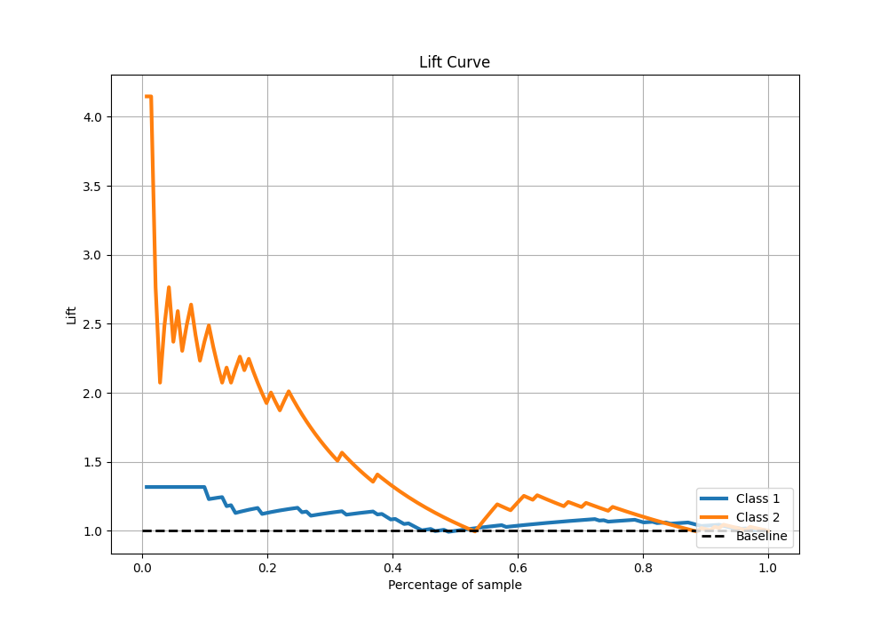

# Summary of 1_DecisionTree

[<< Go back](../README.md)

## Decision Tree
- **n_jobs**: -1
- **criterion**: entropy
- **max_depth**: 4
- **explain_level**: 1

## Validation
 - **validation_type**: split
 - **train_ratio**: 0.75
 - **shuffle**: True
 - **stratify**: True

## Optimized metric
f1

## Training time

4.6 seconds

## Metric details
|           |    score |   threshold |
|:----------|---------:|------------:|
| logloss   | 0.839757 |  nan        |
| auc       | 0.623557 |  nan        |
| f1        | 0.432432 |    0.276796 |
| accuracy  | 0.765957 |    0.426796 |
| precision | 0.555556 |    0.58087  |
| recall    | 0.882353 |    0        |
| mcc       | 0.263091 |    0.426796 |

## Confusion matrix (at threshold=0.426796)
|              |   Predicted as 1 |   Predicted as 2 |
|:-------------|-----------------:|-----------------:|
| Labeled as 1 |               98 |                9 |
| Labeled as 2 |               24 |               10 |

## Learning curves

## Permutation-based Importance

## Confusion Matrix

## Normalized Confusion Matrix

## ROC Curve

## Kolmogorov-Smirnov Statistic

## Precision-Recall Curve

## Calibration Curve

## Cumulative Gains Curve

## Lift Curve

[<< Go back](../README.md)
