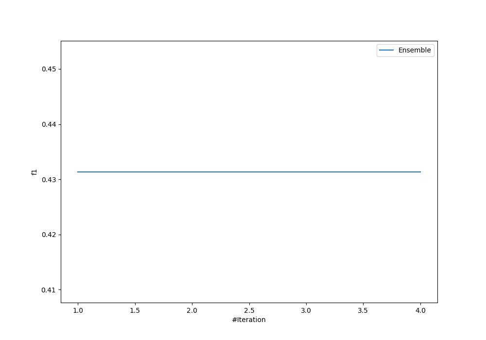
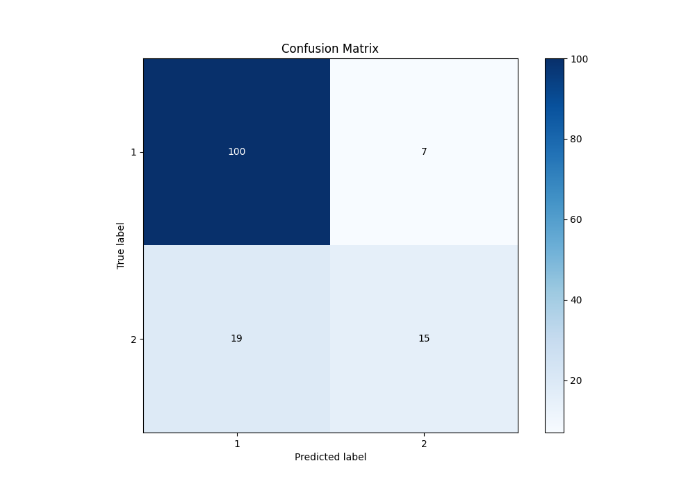
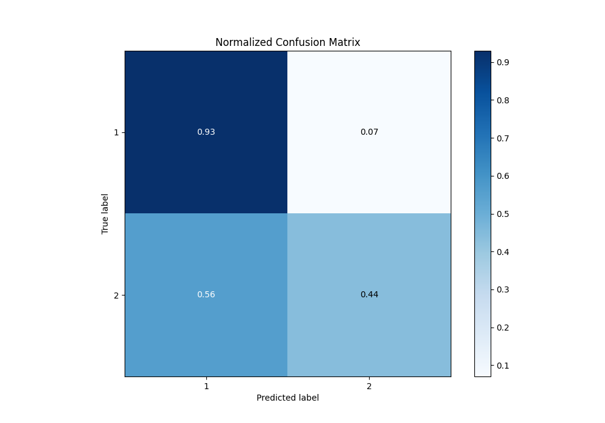
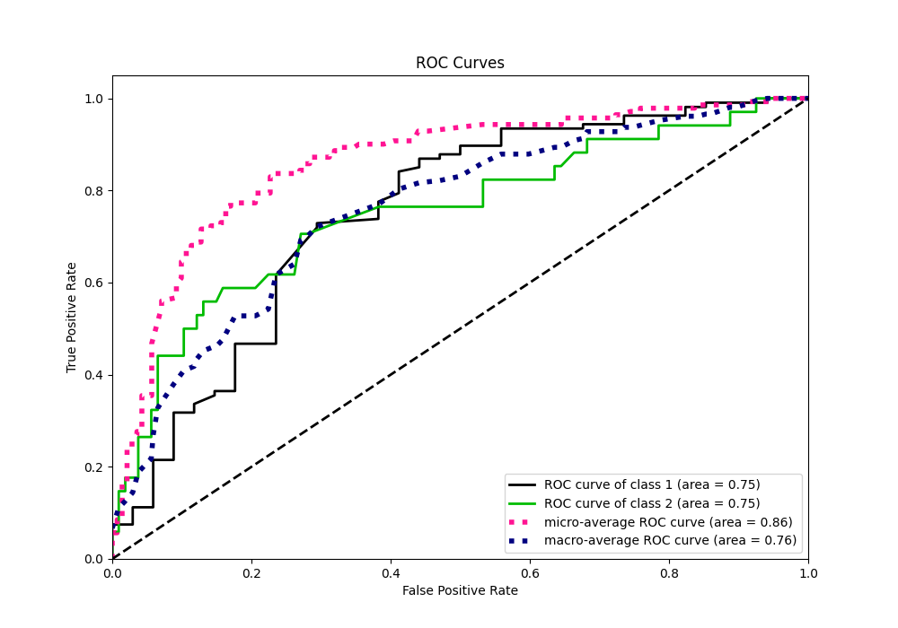
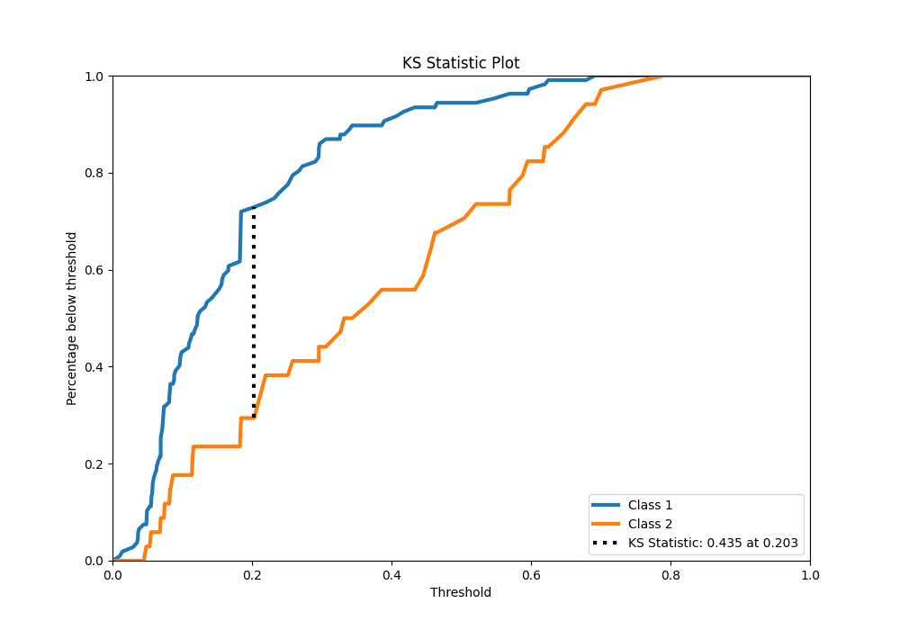
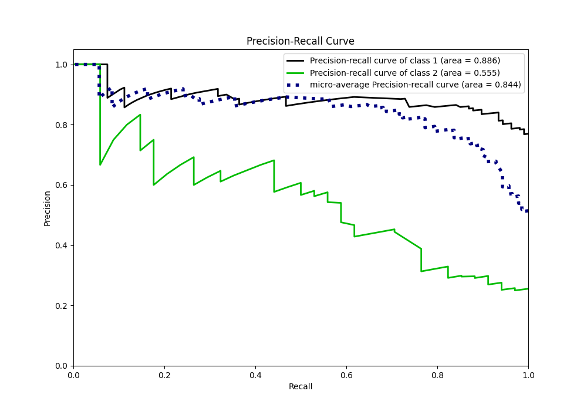
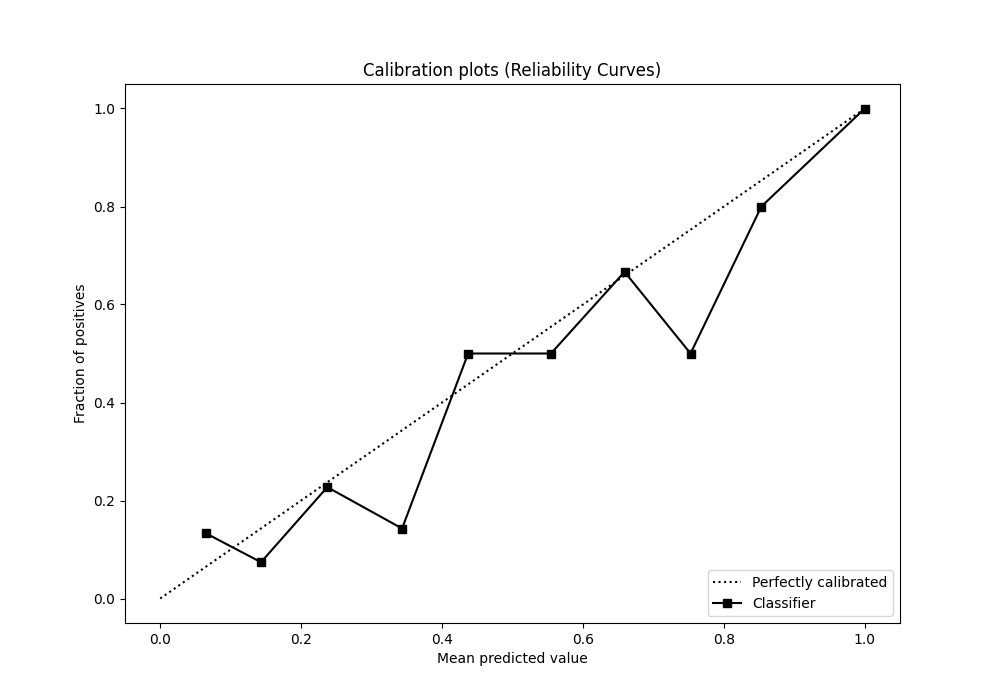
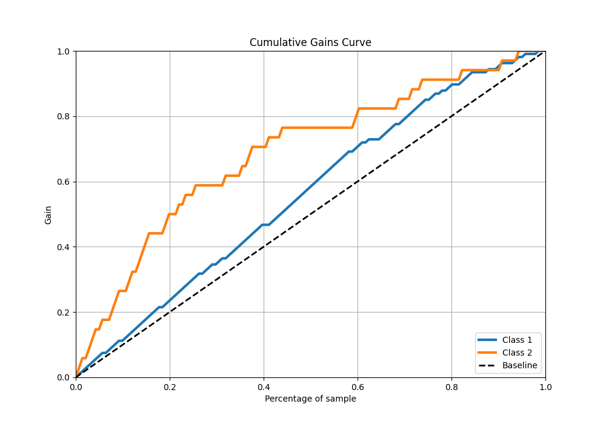
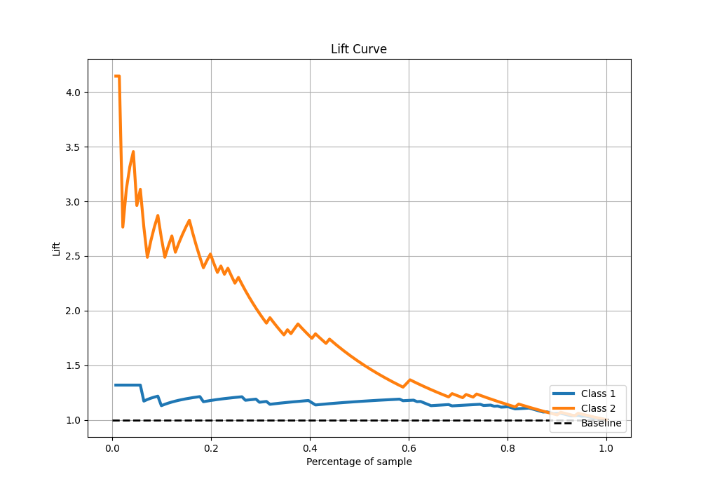

# Summary of Ensemble

[<< Go back](../README.md)

## Ensemble structure
| Model                   |   Weight |
|:------------------------|---------:|
| 3_Default_NeuralNetwork |        1 |

## Metric details
|           |    score |    threshold |
|:----------|---------:|-------------:|
| logloss   | 0.470816 | nan          |
| auc       | 0.751237 | nan          |
| f1        | 0.567164 |   0.319045   |
| accuracy  | 0.815603 |   0.438853   |
| precision | 0.681818 |   0.438853   |
| recall    | 1        |   0.00928337 |
| mcc       | 0.442948 |   0.438853   |

## Confusion matrix (at threshold=0.438853)
|              |   Predicted as 1 |   Predicted as 2 |
|:-------------|-----------------:|-----------------:|
| Labeled as 1 |              100 |                7 |
| Labeled as 2 |               19 |               15 |

## Learning curves

## Confusion Matrix

## Normalized Confusion Matrix

## ROC Curve

## Kolmogorov-Smirnov Statistic

## Precision-Recall Curve

## Calibration Curve

## Cumulative Gains Curve

## Lift Curve

[<< Go back](../README.md)
