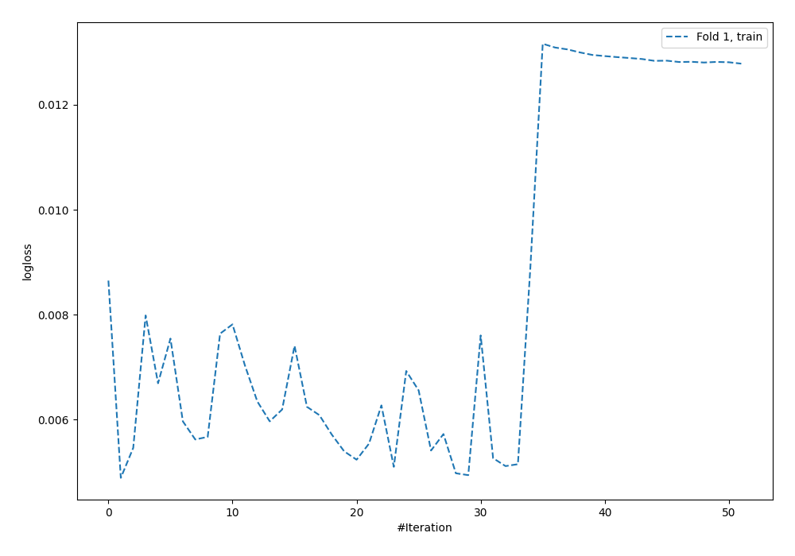
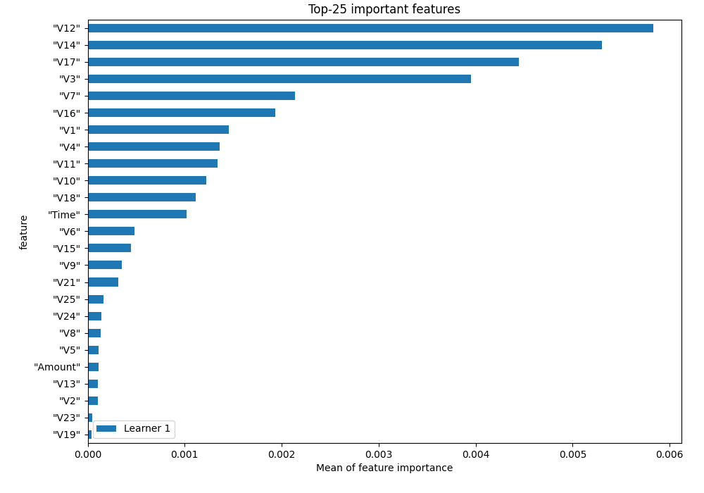
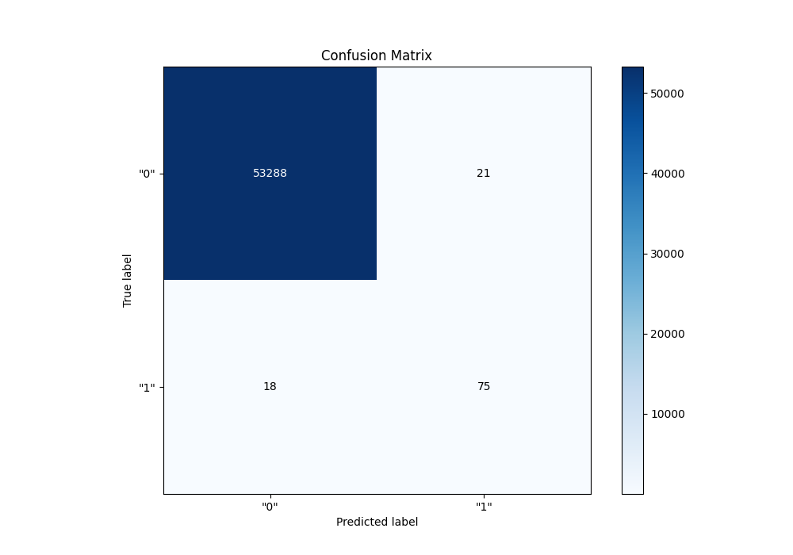
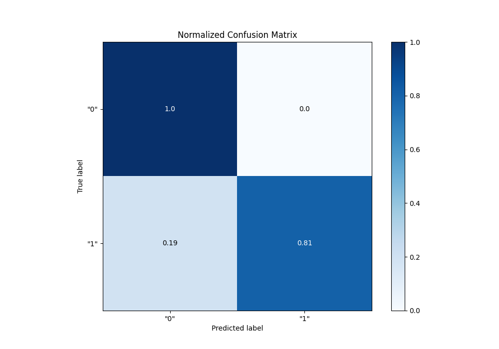
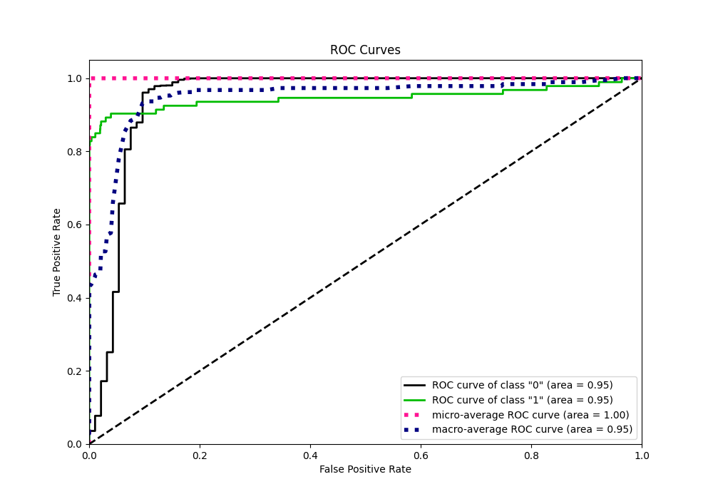
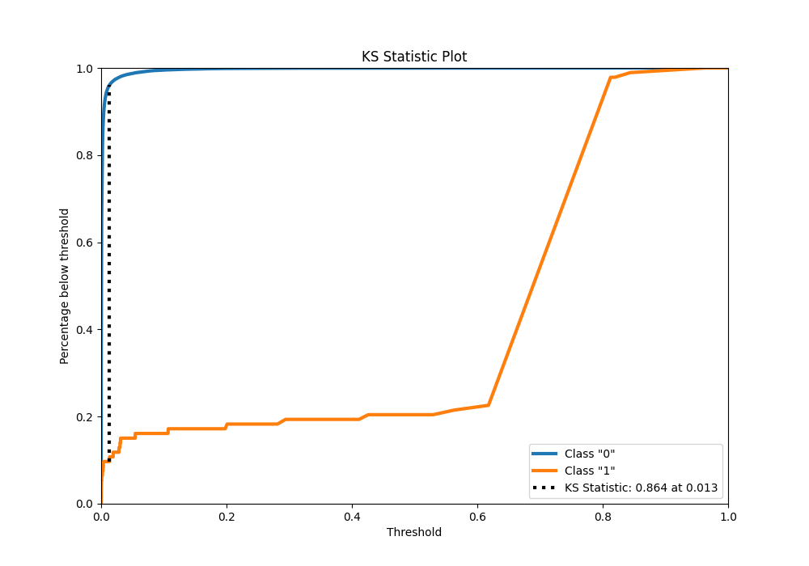
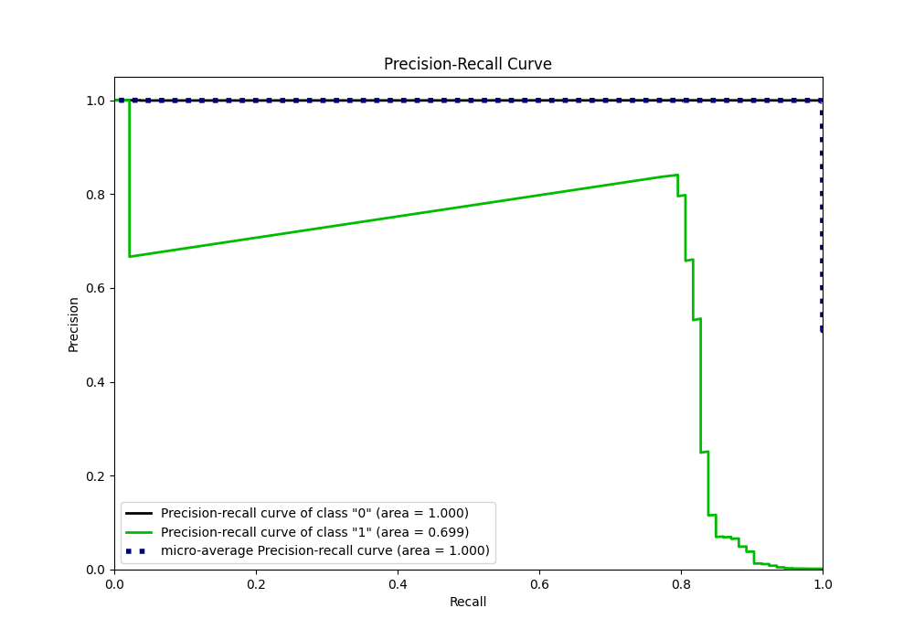
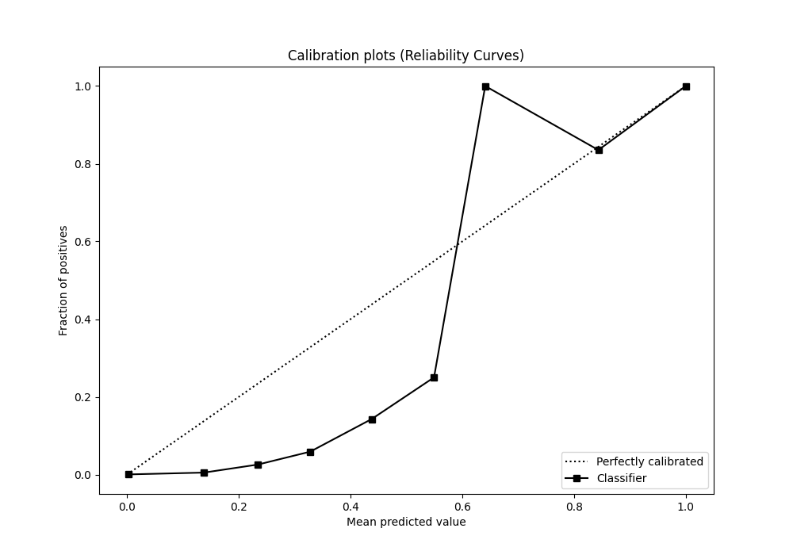
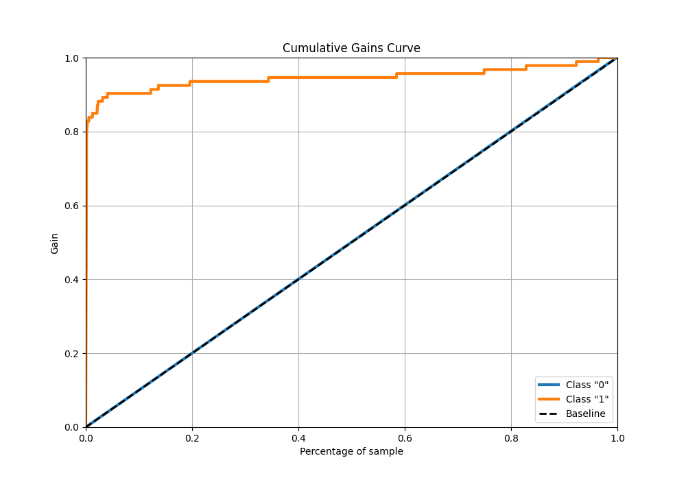
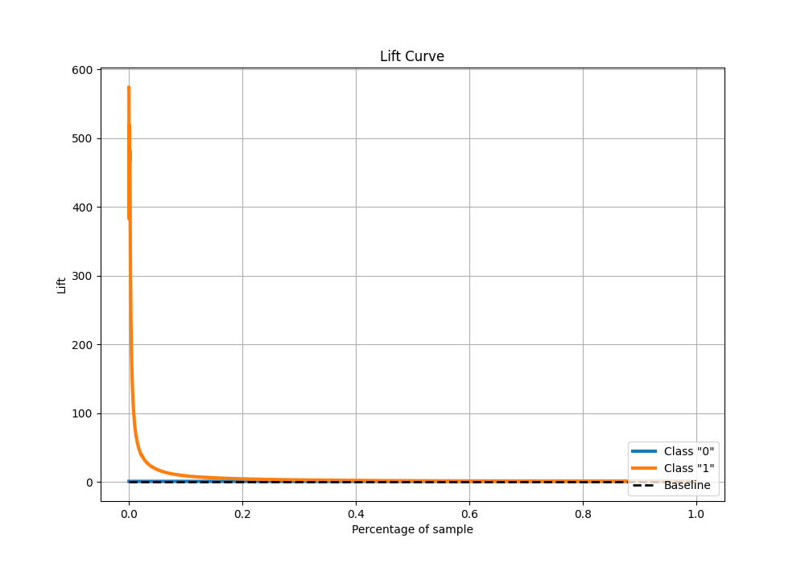

# Summary of 2_Default_NeuralNetwork

[<< Go back](../README.md)

## Neural Network
- **n_jobs**: -1
- **dense_1_size**: 32
- **dense_2_size**: 16
- **learning_rate**: 0.05
- **explain_level**: 1

## Validation
 - **validation_type**: split
 - **train_ratio**: 0.75
 - **shuffle**: True
 - **stratify**: True

## Optimized metric
f1

## Training time

50.2 seconds

## Metric details
|           |      score |     threshold |
|:----------|-----------:|--------------:|
| logloss   | 0.00590348 | nan           |
| auc       | 0.946233   | nan           |
| f1        | 0.793651   |   0.406783    |
| accuracy  | 0.99927    |   0.406783    |
| precision | 0.78125    |   0.406783    |
| recall    | 1          |   1.89735e-36 |
| mcc       | 0.793385   |   0.406783    |

## Confusion matrix (at threshold=0.406783)
|                |   Predicted as "0" |   Predicted as "1" |
|:---------------|-------------------:|-------------------:|
| Labeled as "0" |              53288 |                 21 |
| Labeled as "1" |                 18 |                 75 |

## Learning curves

## Permutation-based Importance

## Confusion Matrix

## Normalized Confusion Matrix

## ROC Curve

## Kolmogorov-Smirnov Statistic

## Precision-Recall Curve

## Calibration Curve

## Cumulative Gains Curve

## Lift Curve

[<< Go back](../README.md)
