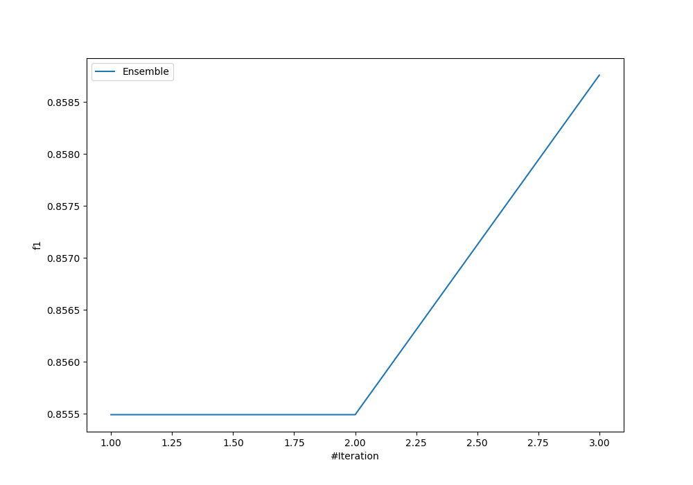
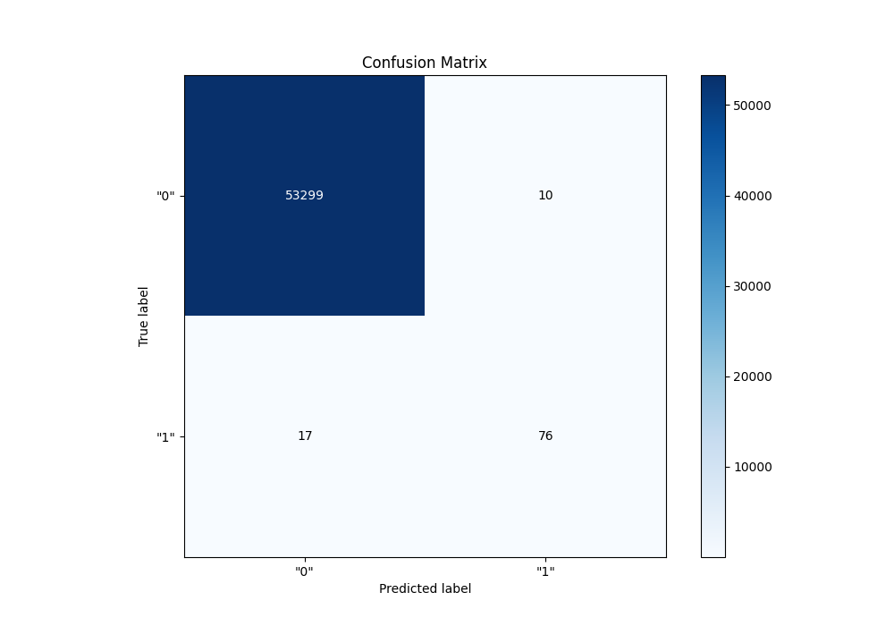
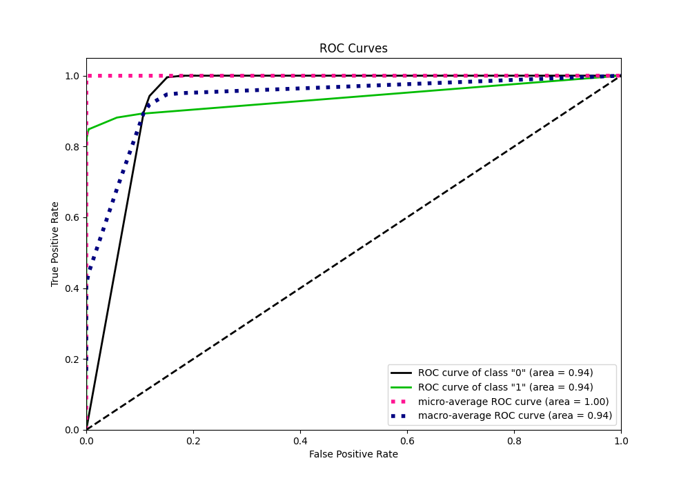
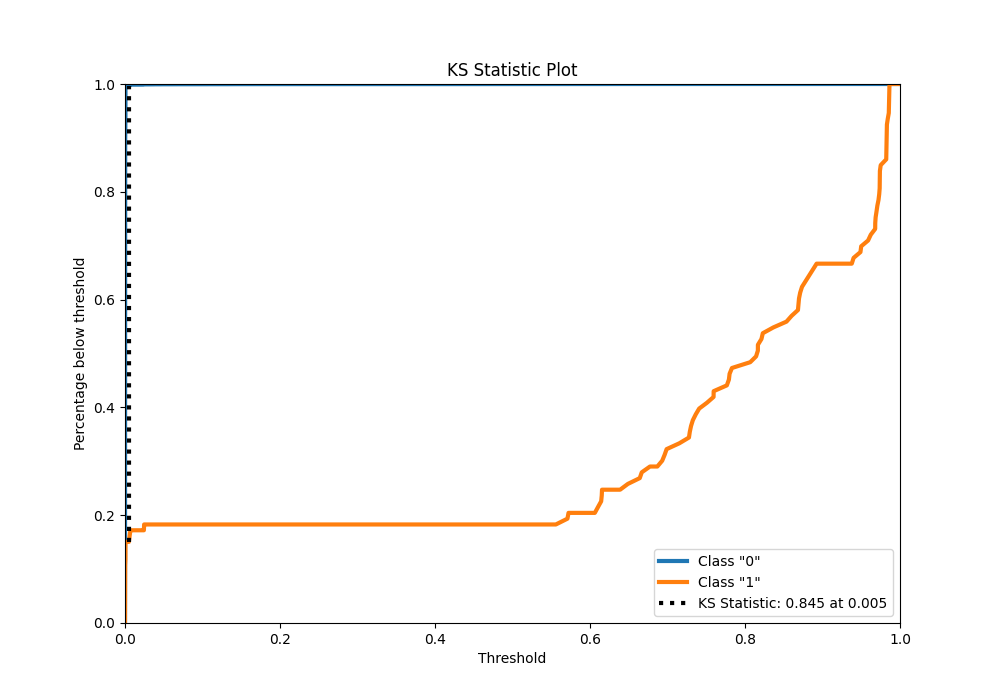
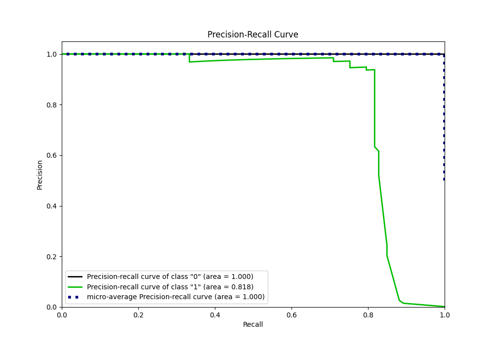
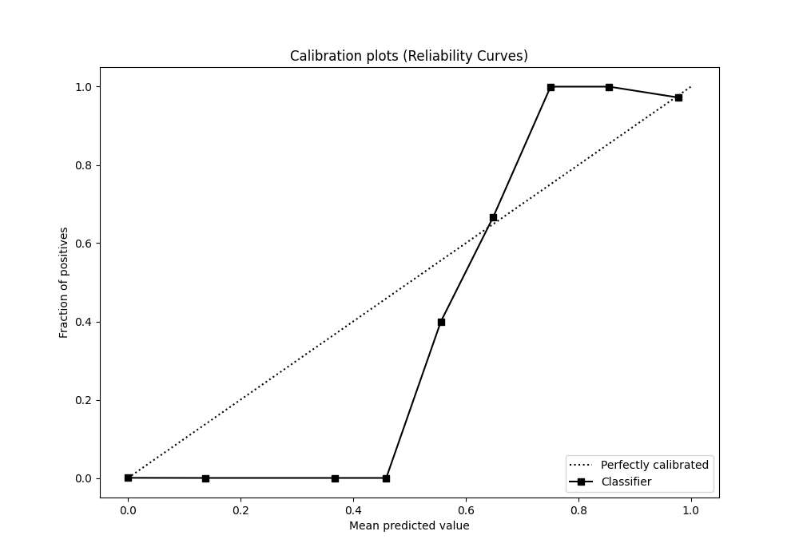
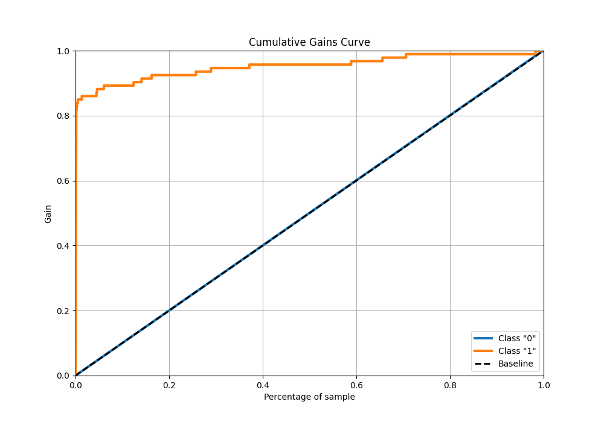
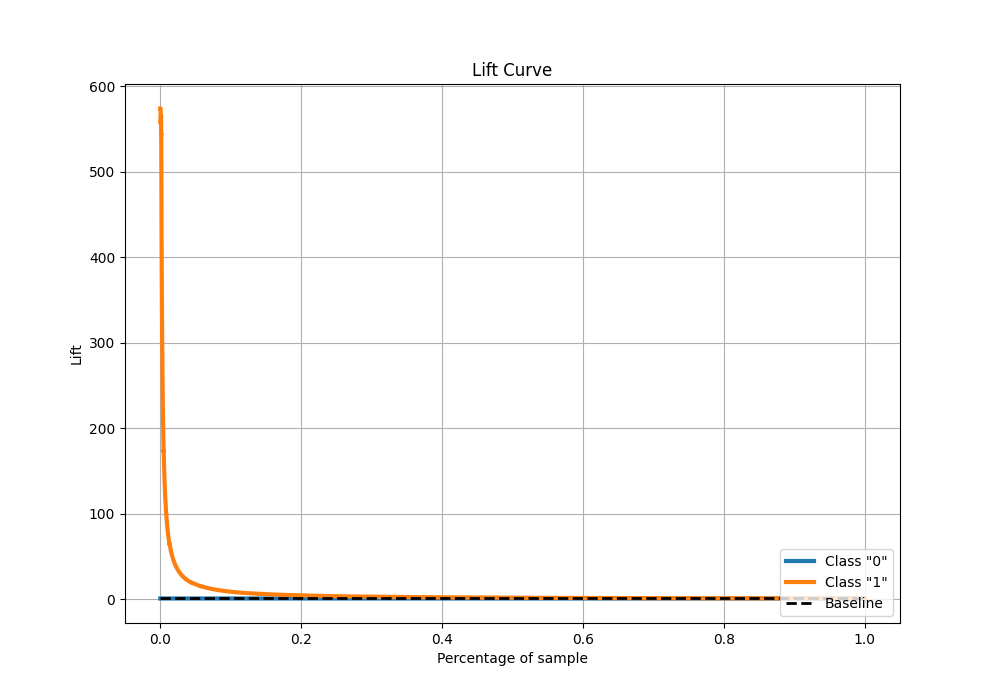

# Summary of Ensemble

[<< Go back](../README.md)

## Ensemble structure
| Model                  |   Weight |
|:-----------------------|---------:|
| 1_DecisionTree         |        1 |
| 3_Default_RandomForest |        2 |

## Metric details
|           |      score |     threshold |
|:----------|-----------:|--------------:|
| logloss   | 0.00319962 | nan           |
| auc       | 0.938764   | nan           |
| f1        | 0.849162   |   0.434972    |
| accuracy  | 0.999494   |   0.434972    |
| precision | 0.883721   |   0.434972    |
| recall    | 1          |   0.000225626 |
| mcc       | 0.849561   |   0.434972    |

## Confusion matrix (at threshold=0.434972)
|                |   Predicted as "0" |   Predicted as "1" |
|:---------------|-------------------:|-------------------:|
| Labeled as "0" |              53299 |                 10 |
| Labeled as "1" |                 17 |                 76 |

## Learning curves

## Confusion Matrix

## Normalized Confusion Matrix

## ROC Curve

## Kolmogorov-Smirnov Statistic

## Precision-Recall Curve

## Calibration Curve

## Cumulative Gains Curve

## Lift Curve

[<< Go back](../README.md)
