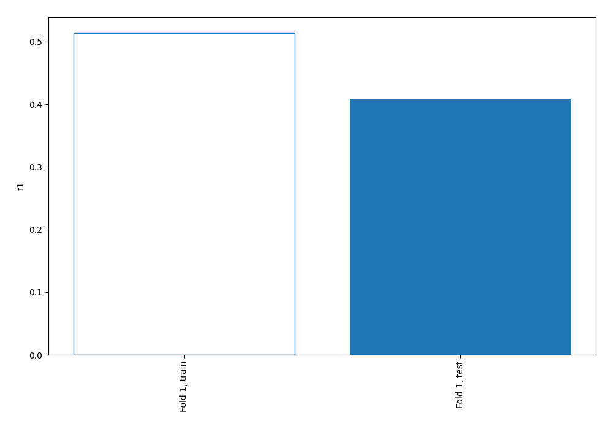
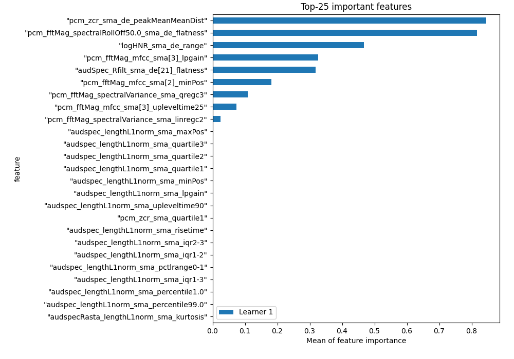
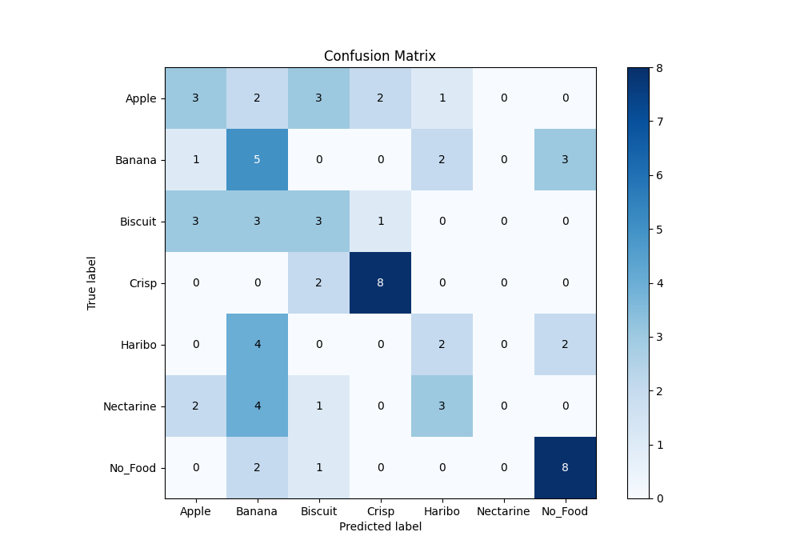
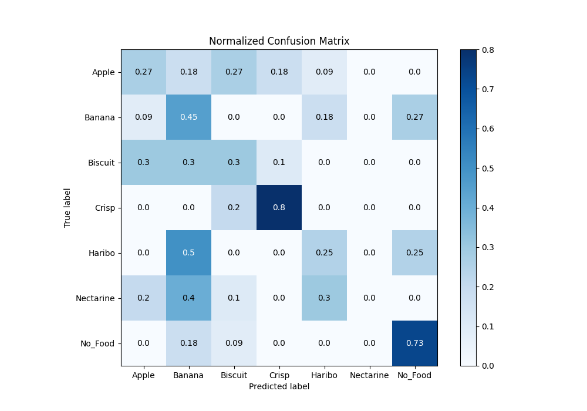
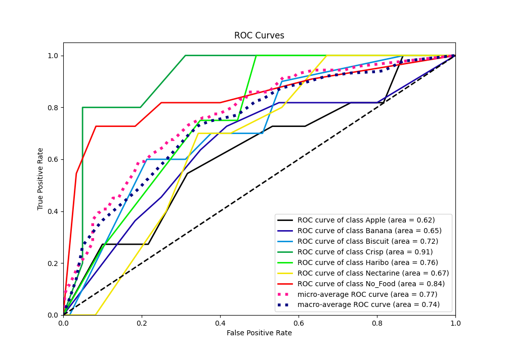
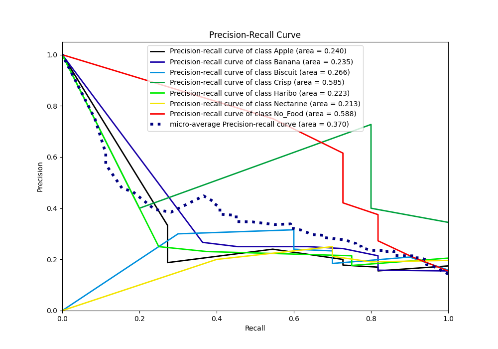

# Summary of 1_DecisionTree

[<< Go back](../README.md)

## Decision Tree
- **n_jobs**: -1
- **criterion**: entropy
- **max_depth**: 4
- **num_class**: 7
- **explain_level**: 1

## Validation
 - **validation_type**: split
 - **train_ratio**: 0.9
 - **shuffle**: True
 - **stratify**: True

## Optimized metric
f1

## Training time

416.2 seconds

### Metric details
|           |     Apple |    Banana |   Biscuit |     Crisp |   Haribo |   Nectarine |   No_Food |   accuracy |   macro avg |   weighted avg |   logloss |
|:----------|----------:|----------:|----------:|----------:|---------:|------------:|----------:|-----------:|------------:|---------------:|----------:|
| precision |  0.333333 |  0.25     |       0.3 |  0.727273 |     0.25 |           0 |  0.615385 |   0.408451 |    0.353713 |       0.358572 |   2.02138 |
| recall    |  0.272727 |  0.454545 |       0.3 |  0.8      |     0.25 |           0 |  0.727273 |   0.408451 |    0.400649 |       0.408451 |   2.02138 |
| f1-score  |  0.3      |  0.322581 |       0.3 |  0.761905 |     0.25 |           0 |  0.666667 |   0.408451 |    0.371593 |       0.377476 |   2.02138 |
| support   | 11        | 11        |      10   | 10        |     8    |          10 | 11        |   0.408451 |   71        |      71        |   2.02138 |

## Confusion matrix
|                      |   Predicted as Apple |   Predicted as Banana |   Predicted as Biscuit |   Predicted as Crisp |   Predicted as Haribo |   Predicted as Nectarine |   Predicted as No_Food |
|:---------------------|---------------------:|----------------------:|-----------------------:|---------------------:|----------------------:|-------------------------:|-----------------------:|
| Labeled as Apple     |                    3 |                     2 |                      3 |                    2 |                     1 |                        0 |                      0 |
| Labeled as Banana    |                    1 |                     5 |                      0 |                    0 |                     2 |                        0 |                      3 |
| Labeled as Biscuit   |                    3 |                     3 |                      3 |                    1 |                     0 |                        0 |                      0 |
| Labeled as Crisp     |                    0 |                     0 |                      2 |                    8 |                     0 |                        0 |                      0 |
| Labeled as Haribo    |                    0 |                     4 |                      0 |                    0 |                     2 |                        0 |                      2 |
| Labeled as Nectarine |                    2 |                     4 |                      1 |                    0 |                     3 |                        0 |                      0 |
| Labeled as No_Food   |                    0 |                     2 |                      1 |                    0 |                     0 |                        0 |                      8 |

## Learning curves

## Permutation-based Importance

## Confusion Matrix

## Normalized Confusion Matrix

## ROC Curve

## Precision Recall Curve

[<< Go back](../README.md)
