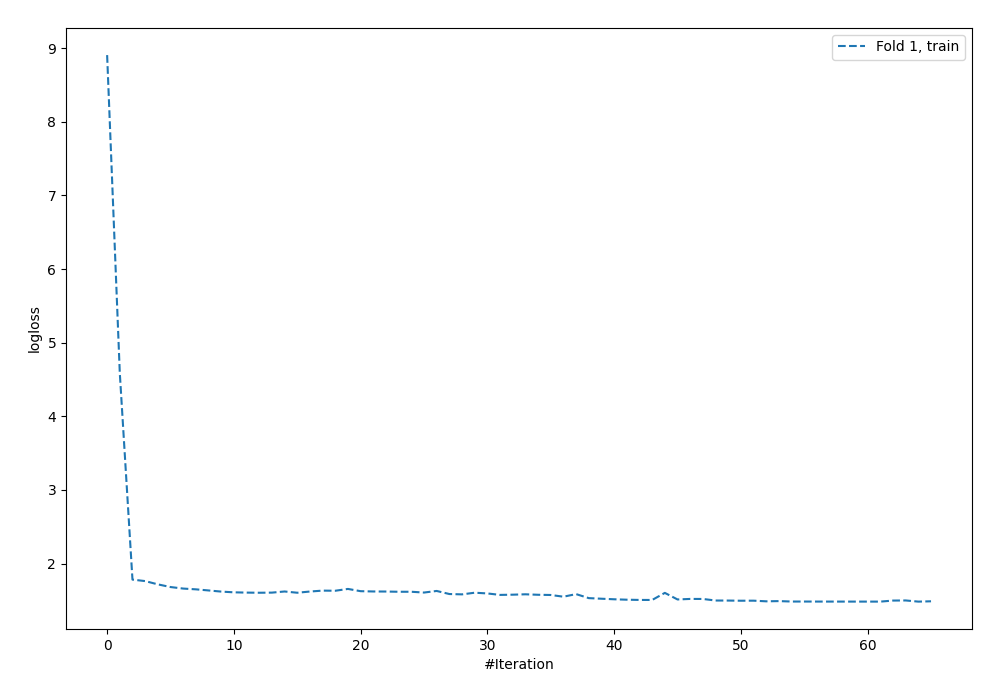
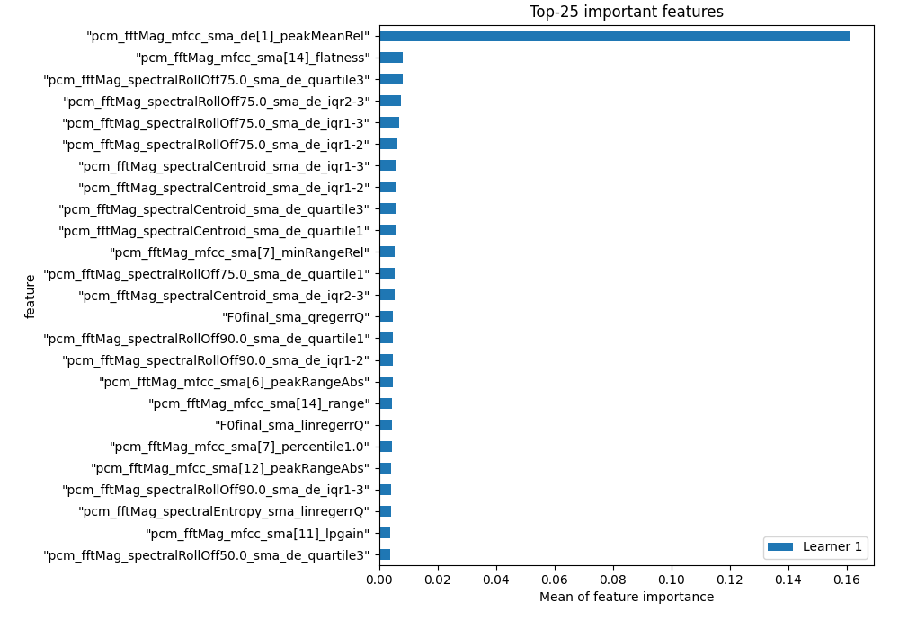
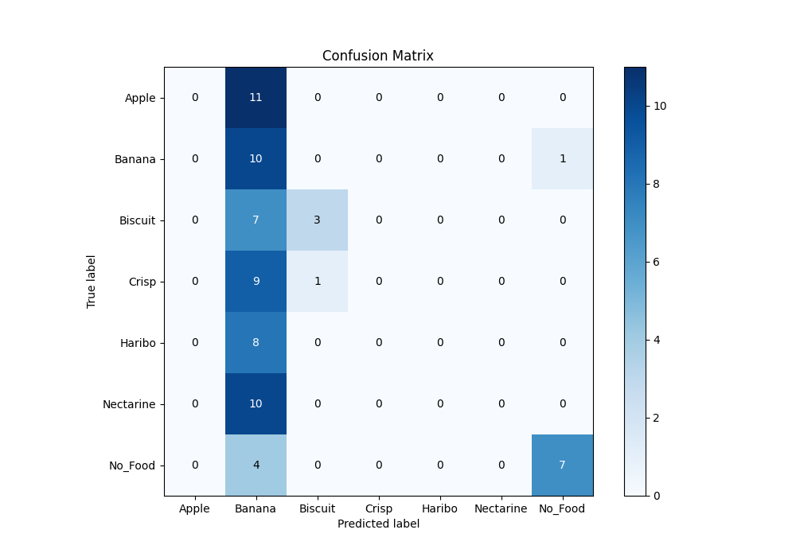
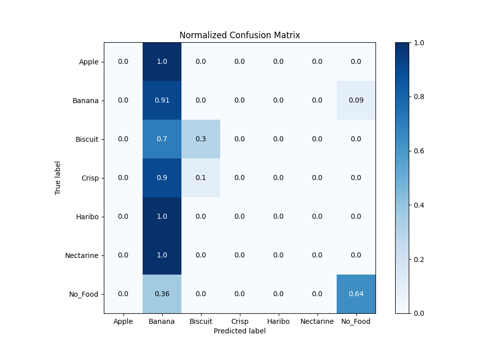
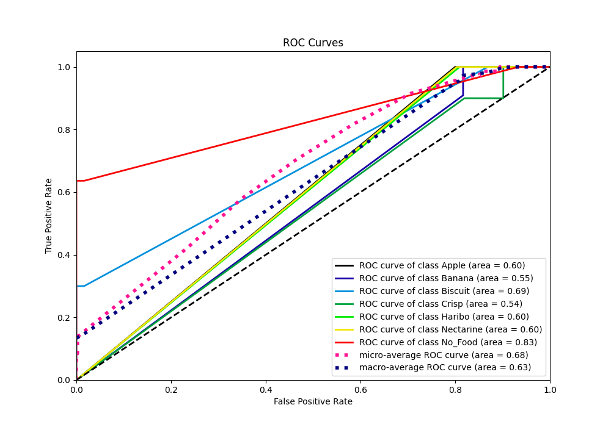
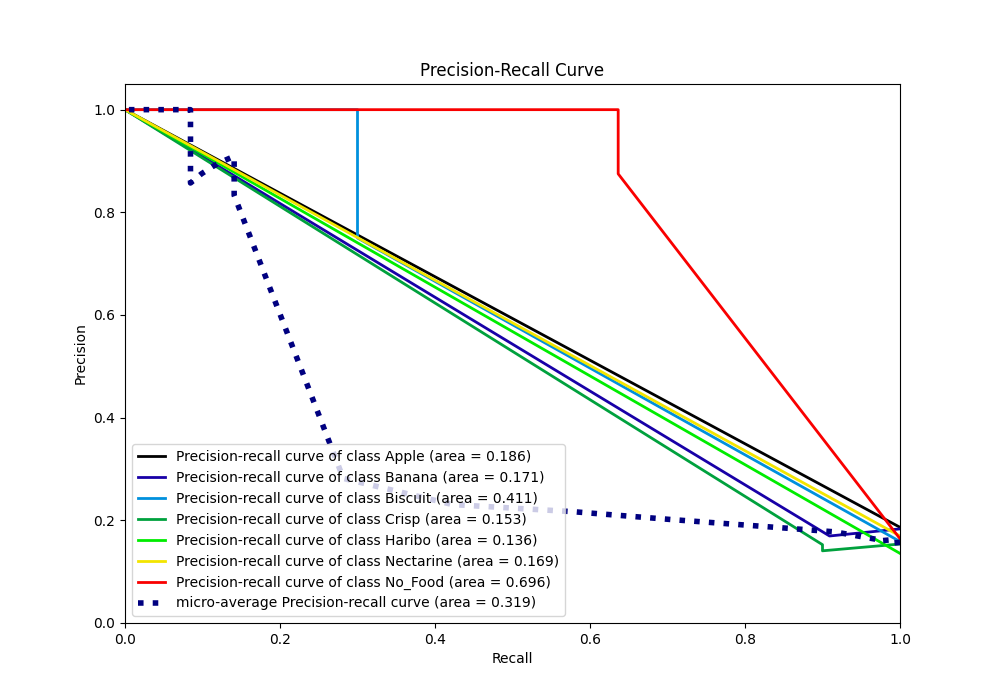

# Summary of 2_Default_NeuralNetwork

[<< Go back](../README.md)

## Neural Network
- **n_jobs**: -1
- **dense_1_size**: 32
- **dense_2_size**: 16
- **learning_rate**: 0.05
- **num_class**: 7
- **explain_level**: 1

## Validation
 - **validation_type**: split
 - **train_ratio**: 0.9
 - **shuffle**: True
 - **stratify**: True

## Optimized metric
f1

## Training time

411.8 seconds

### Metric details
|           |   Apple |    Banana |   Biscuit |   Crisp |   Haribo |   Nectarine |   No_Food |   accuracy |   macro avg |   weighted avg |   logloss |
|:----------|--------:|----------:|----------:|--------:|---------:|------------:|----------:|-----------:|------------:|---------------:|----------:|
| precision |       0 |  0.169492 |  0.75     |       0 |        0 |           0 |  0.875    |    0.28169 |    0.256356 |       0.267456 |   1.94452 |
| recall    |       0 |  0.909091 |  0.3      |       0 |        0 |           0 |  0.636364 |    0.28169 |    0.263636 |       0.28169  |   1.94452 |
| f1-score  |       0 |  0.285714 |  0.428571 |       0 |        0 |           0 |  0.736842 |    0.28169 |    0.207304 |       0.218786 |   1.94452 |
| support   |      11 | 11        | 10        |      10 |        8 |          10 | 11        |    0.28169 |   71        |      71        |   1.94452 |

## Confusion matrix
|                      |   Predicted as Apple |   Predicted as Banana |   Predicted as Biscuit |   Predicted as Crisp |   Predicted as Haribo |   Predicted as Nectarine |   Predicted as No_Food |
|:---------------------|---------------------:|----------------------:|-----------------------:|---------------------:|----------------------:|-------------------------:|-----------------------:|
| Labeled as Apple     |                    0 |                    11 |                      0 |                    0 |                     0 |                        0 |                      0 |
| Labeled as Banana    |                    0 |                    10 |                      0 |                    0 |                     0 |                        0 |                      1 |
| Labeled as Biscuit   |                    0 |                     7 |                      3 |                    0 |                     0 |                        0 |                      0 |
| Labeled as Crisp     |                    0 |                     9 |                      1 |                    0 |                     0 |                        0 |                      0 |
| Labeled as Haribo    |                    0 |                     8 |                      0 |                    0 |                     0 |                        0 |                      0 |
| Labeled as Nectarine |                    0 |                    10 |                      0 |                    0 |                     0 |                        0 |                      0 |
| Labeled as No_Food   |                    0 |                     4 |                      0 |                    0 |                     0 |                        0 |                      7 |

## Learning curves

## Permutation-based Importance

## Confusion Matrix

## Normalized Confusion Matrix

## ROC Curve

## Precision Recall Curve

[<< Go back](../README.md)
