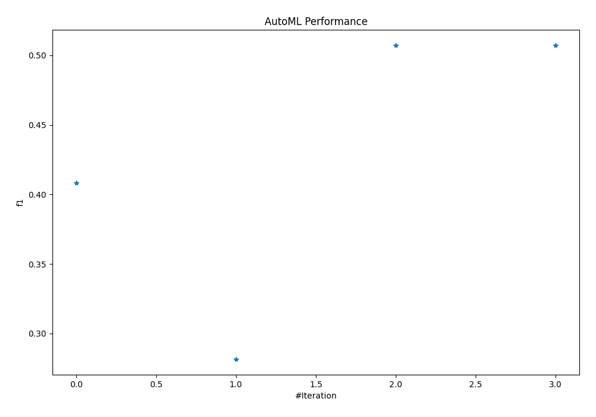
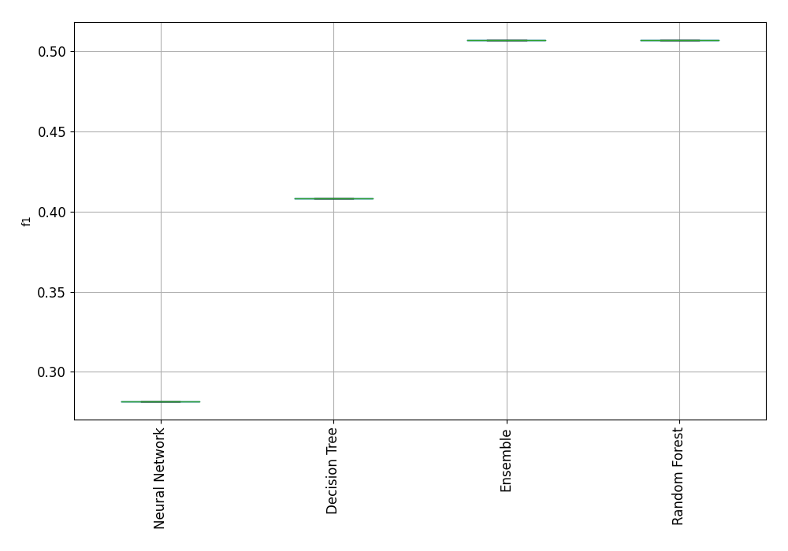
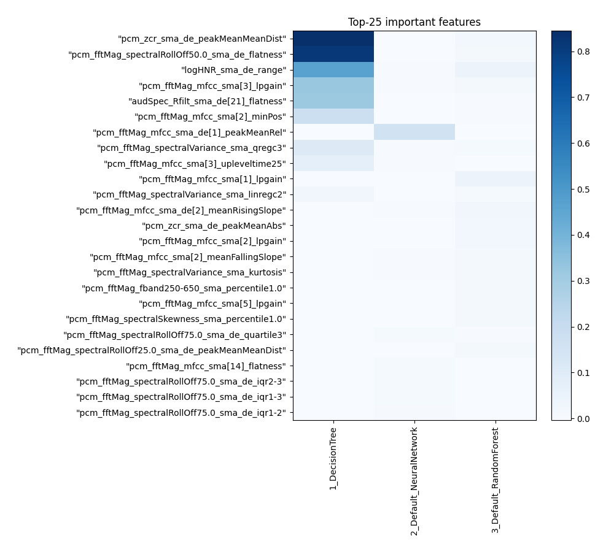
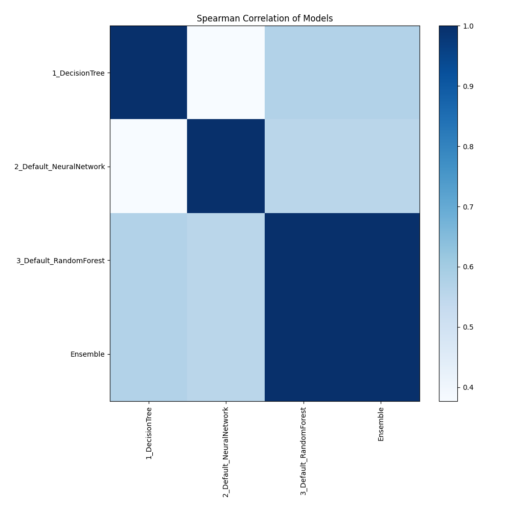

# AutoML Leaderboard

| Best model   | name                                                         | model_type     | metric_type   |   metric_value |   train_time |
|:-------------|:-------------------------------------------------------------|:---------------|:--------------|---------------:|-------------:|
|              | [1_DecisionTree](1_DecisionTree/README.md)                   | Decision Tree  | f1            |       0.408451 |       417.72 |
|              | [2_Default_NeuralNetwork](2_Default_NeuralNetwork/README.md) | Neural Network | f1            |       0.28169  |       413.34 |
| **the best** | [3_Default_RandomForest](3_Default_RandomForest/README.md)   | Random Forest  | f1            |       0.507042 |       610.42 |
|              | [Ensemble](Ensemble/README.md)                               | Ensemble       | f1            |       0.507042 |         0.21 |

### AutoML Performance

### AutoML Performance Boxplot

### Features Importance

### Spearman Correlation of Models

