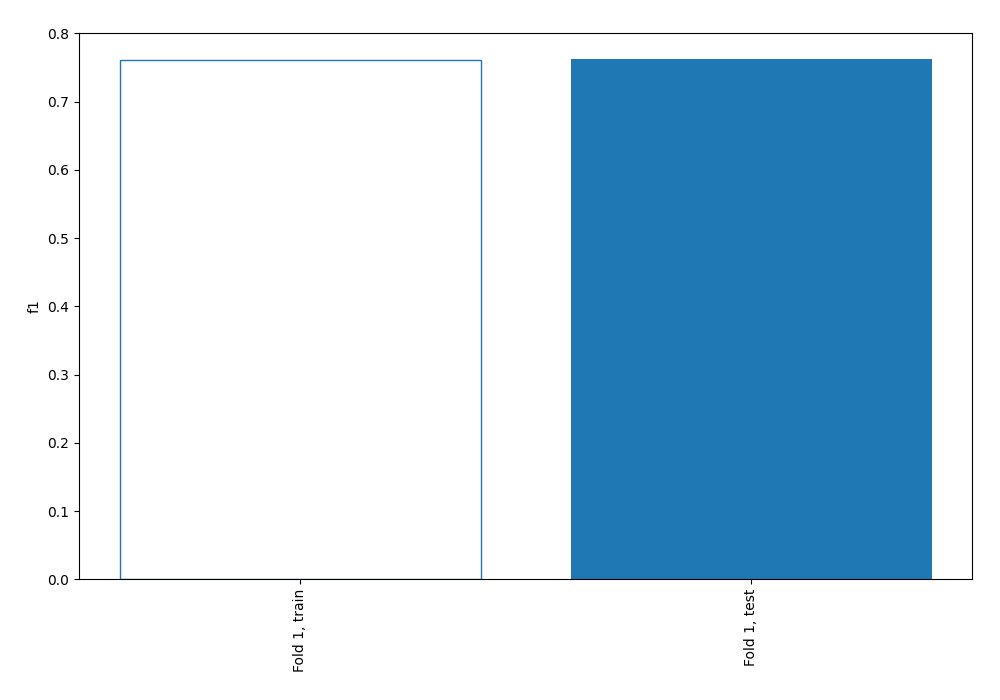
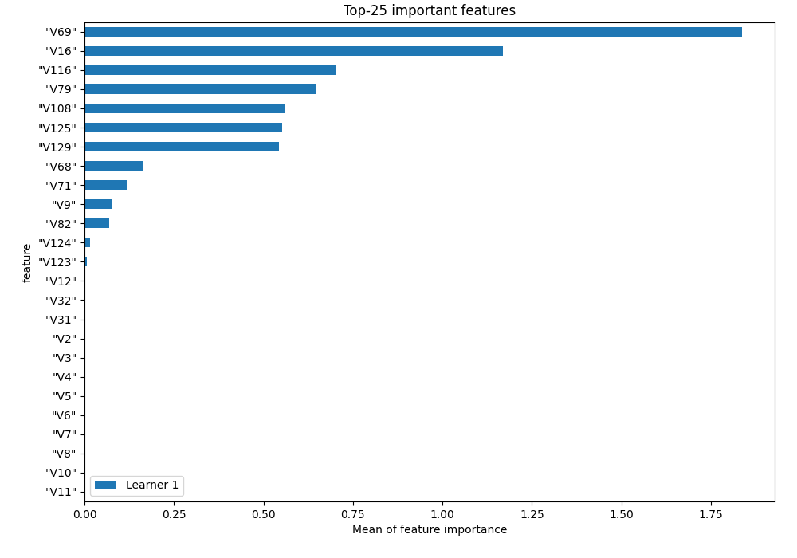
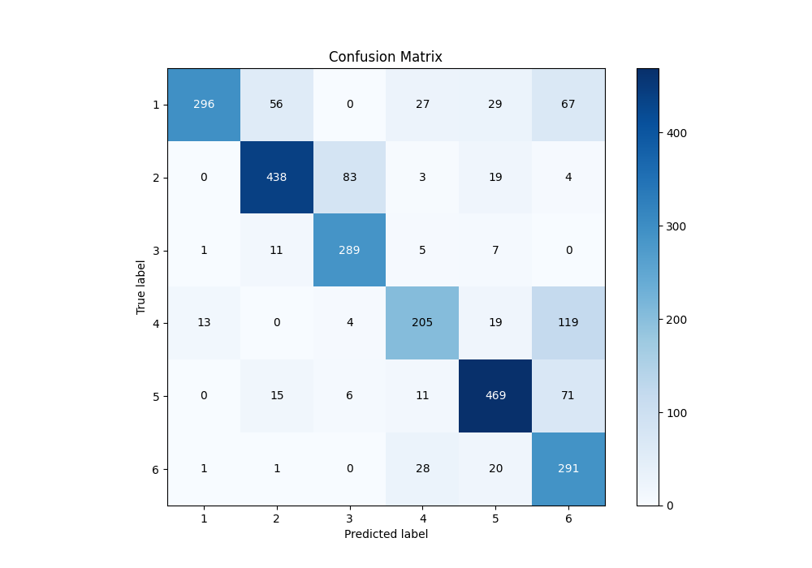
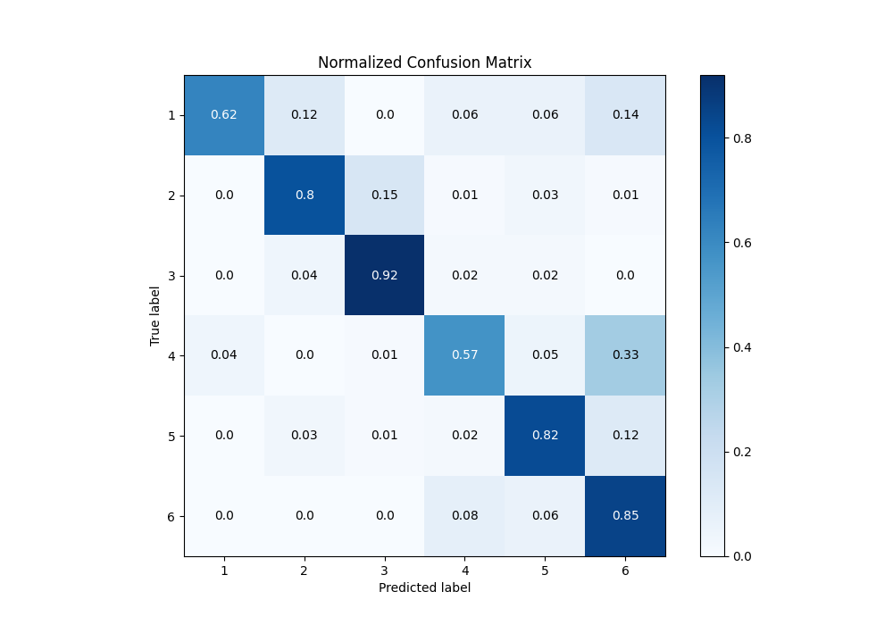
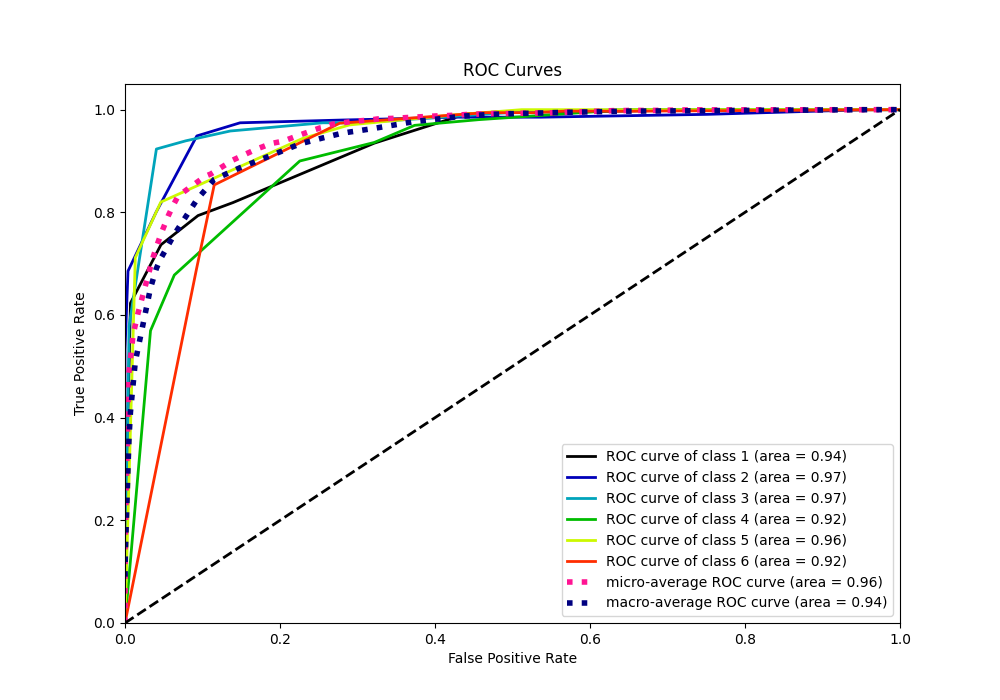
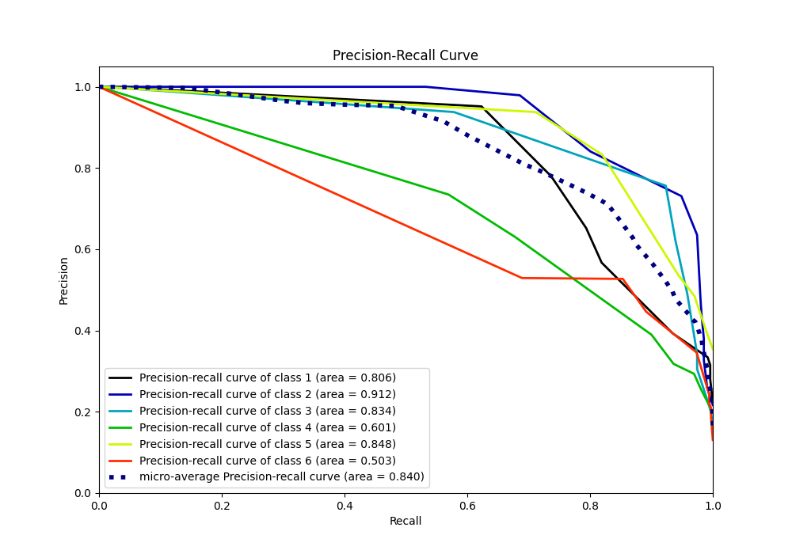

# Summary of 1_DecisionTree

[<< Go back](../README.md)

## Decision Tree
- **n_jobs**: -1
- **criterion**: entropy
- **max_depth**: 4
- **num_class**: 6
- **explain_level**: 1

## Validation
 - **validation_type**: split
 - **train_ratio**: 0.75
 - **shuffle**: True
 - **stratify**: True

## Optimized metric
f1

## Training time

7.4 seconds

### Metric details
|           |          1 |          2 |          3 |          4 |          5 |          6 |   accuracy |   macro avg |   weighted avg |   logloss |
|:----------|-----------:|-----------:|-----------:|-----------:|-----------:|-----------:|-----------:|------------:|---------------:|----------:|
| precision |   0.951768 |   0.840691 |   0.756545 |   0.734767 |   0.833037 |   0.527174 |    0.76227 |    0.773997 |       0.79353  |  0.655188 |
| recall    |   0.623158 |   0.800731 |   0.923323 |   0.569444 |   0.81993  |   0.853372 |    0.76227 |    0.764993 |       0.76227  |  0.655188 |
| f1-score  |   0.753181 |   0.820225 |   0.831655 |   0.641628 |   0.826432 |   0.651736 |    0.76227 |    0.754143 |       0.764064 |  0.655188 |
| support   | 475        | 547        | 313        | 360        | 572        | 341        |    0.76227 | 2608        |    2608        |  0.655188 |

## Confusion matrix
|              |   Predicted as 1 |   Predicted as 2 |   Predicted as 3 |   Predicted as 4 |   Predicted as 5 |   Predicted as 6 |
|:-------------|-----------------:|-----------------:|-----------------:|-----------------:|-----------------:|-----------------:|
| Labeled as 1 |              296 |               56 |                0 |               27 |               29 |               67 |
| Labeled as 2 |                0 |              438 |               83 |                3 |               19 |                4 |
| Labeled as 3 |                1 |               11 |              289 |                5 |                7 |                0 |
| Labeled as 4 |               13 |                0 |                4 |              205 |               19 |              119 |
| Labeled as 5 |                0 |               15 |                6 |               11 |              469 |               71 |
| Labeled as 6 |                1 |                1 |                0 |               28 |               20 |              291 |

## Learning curves

## Permutation-based Importance

## Confusion Matrix

## Normalized Confusion Matrix

## ROC Curve

## Precision Recall Curve

[<< Go back](../README.md)
