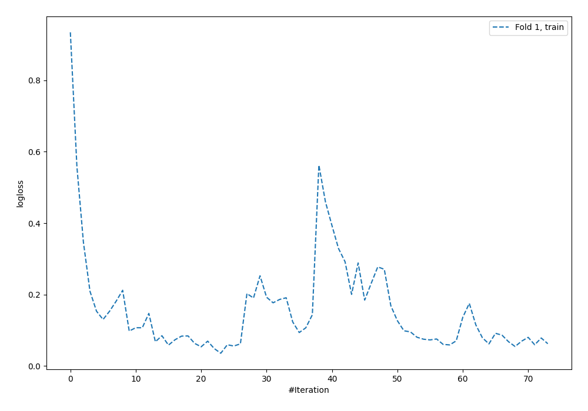
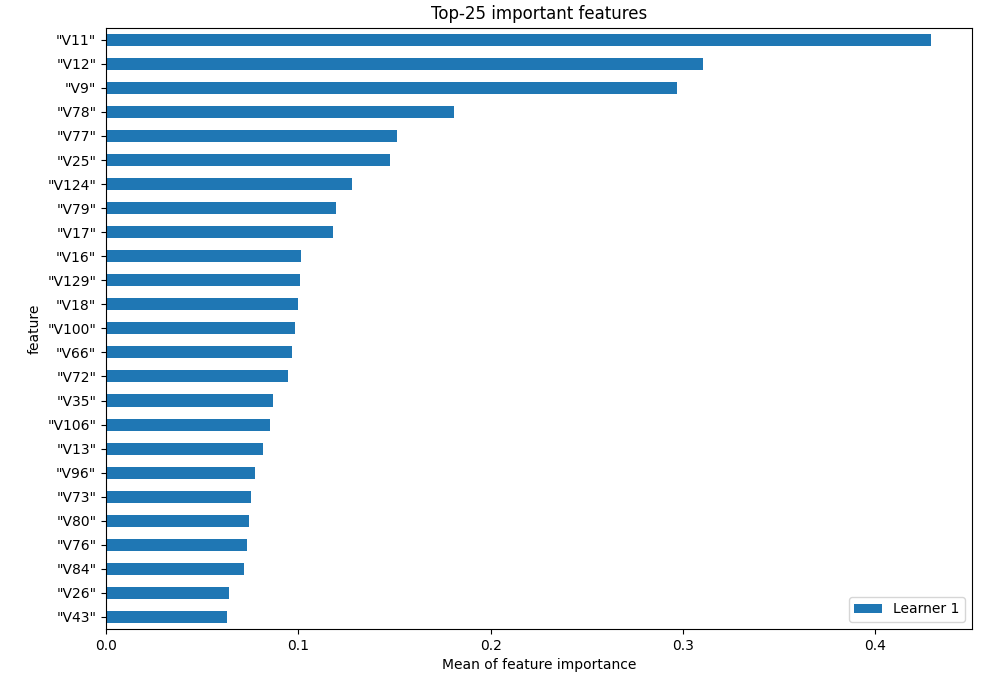
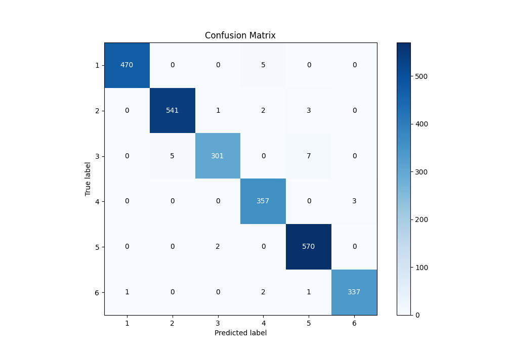
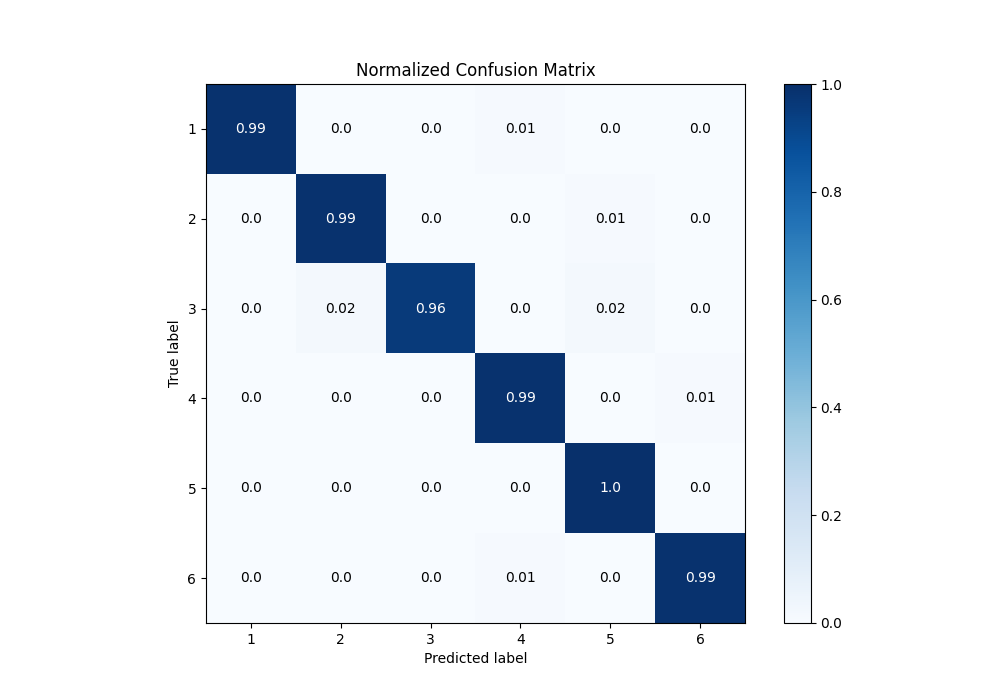
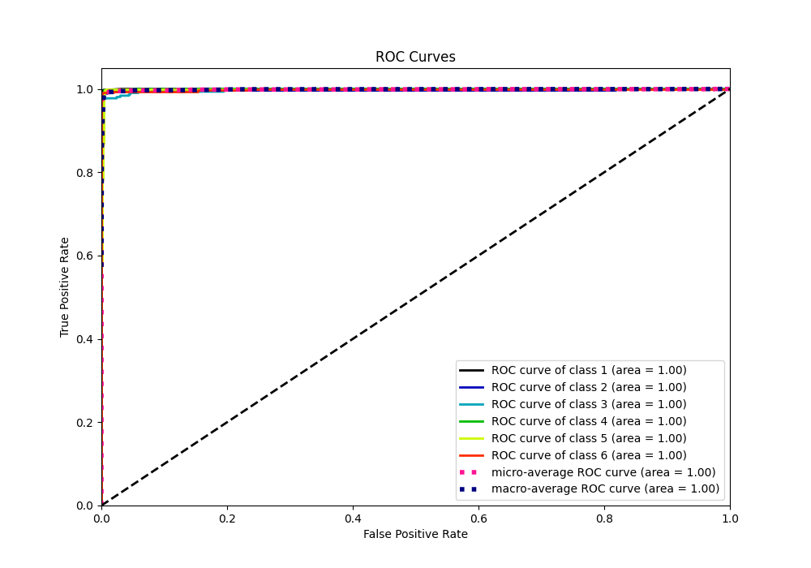
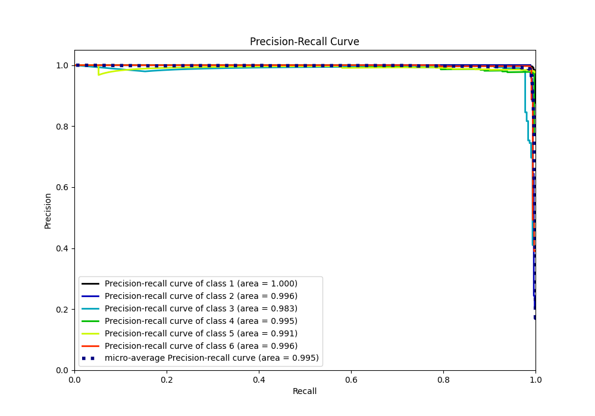

# Summary of 2_Default_NeuralNetwork

[<< Go back](../README.md)

## Neural Network
- **n_jobs**: -1
- **dense_1_size**: 32
- **dense_2_size**: 16
- **learning_rate**: 0.05
- **num_class**: 6
- **explain_level**: 1

## Validation
 - **validation_type**: split
 - **train_ratio**: 0.75
 - **shuffle**: True
 - **stratify**: True

## Optimized metric
f1

## Training time

4.4 seconds

### Metric details
|           |          1 |          2 |          3 |          4 |          5 |          6 |   accuracy |   macro avg |   weighted avg |   logloss |
|:----------|-----------:|-----------:|-----------:|-----------:|-----------:|-----------:|-----------:|------------:|---------------:|----------:|
| precision |   0.997877 |   0.990842 |   0.990132 |   0.97541  |   0.981067 |   0.991176 |    0.98773 |    0.987751 |       0.987808 | 0.0684019 |
| recall    |   0.989474 |   0.989031 |   0.961661 |   0.991667 |   0.996503 |   0.98827  |    0.98773 |    0.986101 |       0.98773  | 0.0684019 |
| f1-score  |   0.993658 |   0.989936 |   0.975689 |   0.983471 |   0.988725 |   0.989721 |    0.98773 |    0.986867 |       0.987718 | 0.0684019 |
| support   | 475        | 547        | 313        | 360        | 572        | 341        |    0.98773 | 2608        |    2608        | 0.0684019 |

## Confusion matrix
|              |   Predicted as 1 |   Predicted as 2 |   Predicted as 3 |   Predicted as 4 |   Predicted as 5 |   Predicted as 6 |
|:-------------|-----------------:|-----------------:|-----------------:|-----------------:|-----------------:|-----------------:|
| Labeled as 1 |              470 |                0 |                0 |                5 |                0 |                0 |
| Labeled as 2 |                0 |              541 |                1 |                2 |                3 |                0 |
| Labeled as 3 |                0 |                5 |              301 |                0 |                7 |                0 |
| Labeled as 4 |                0 |                0 |                0 |              357 |                0 |                3 |
| Labeled as 5 |                0 |                0 |                2 |                0 |              570 |                0 |
| Labeled as 6 |                1 |                0 |                0 |                2 |                1 |              337 |

## Learning curves

## Permutation-based Importance

## Confusion Matrix

## Normalized Confusion Matrix

## ROC Curve

## Precision Recall Curve

[<< Go back](../README.md)
