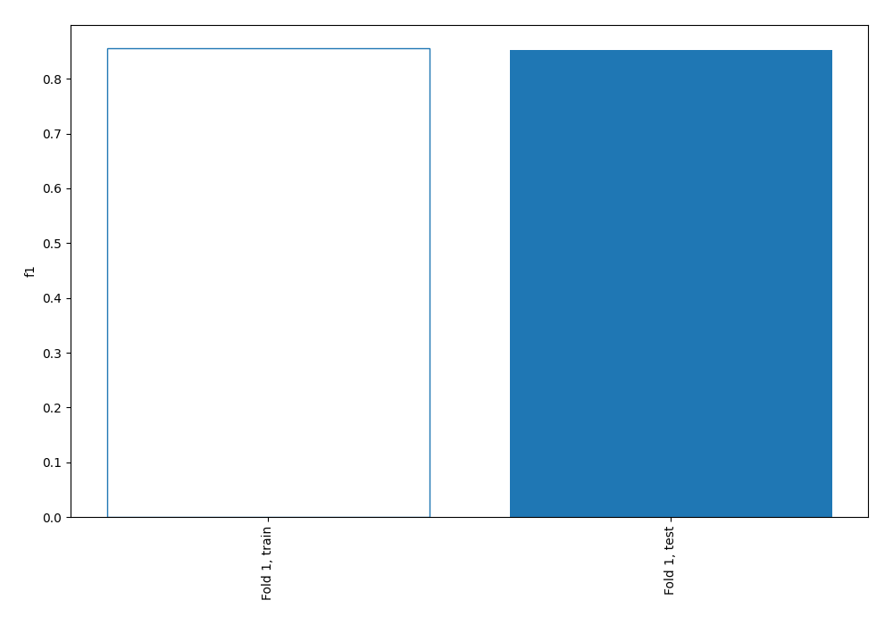
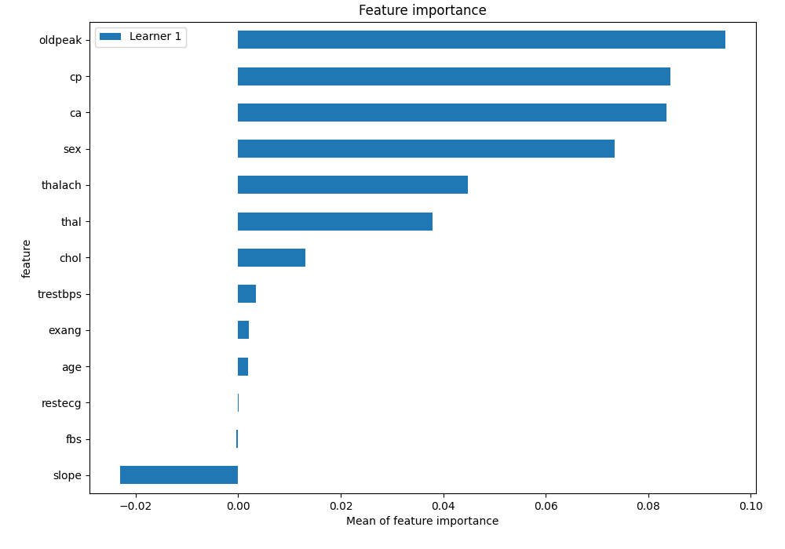
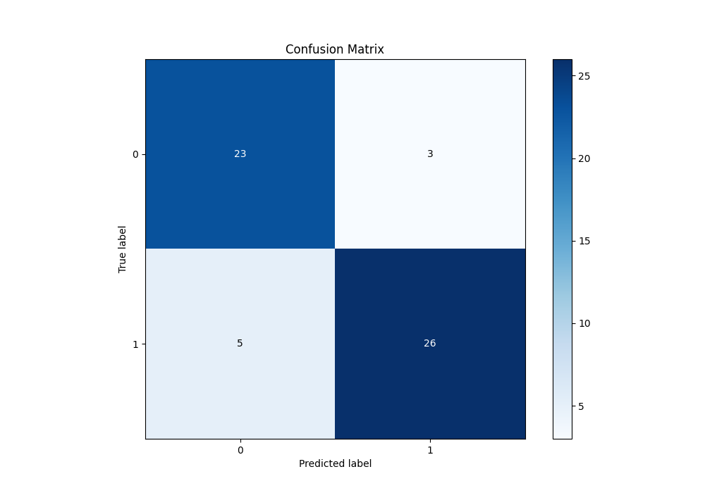
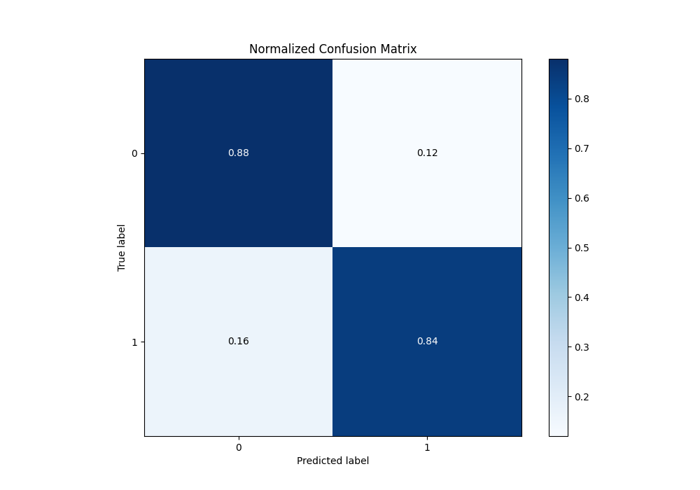
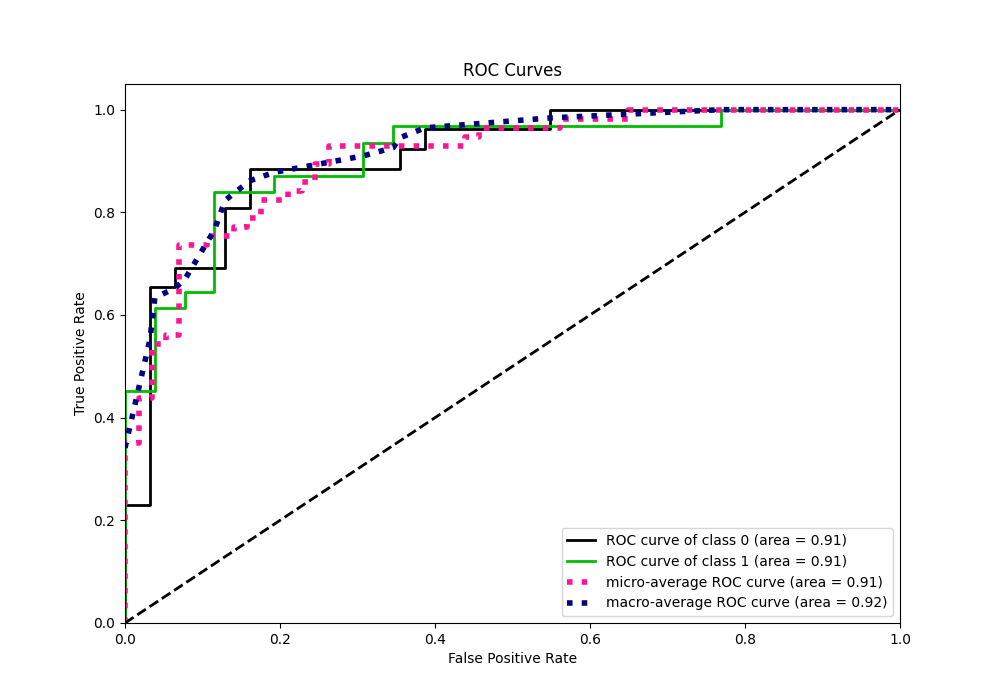
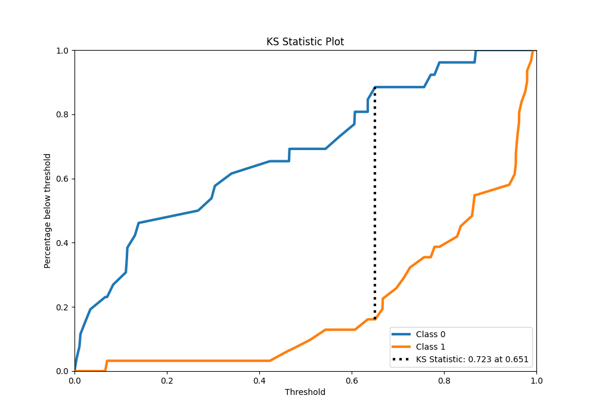
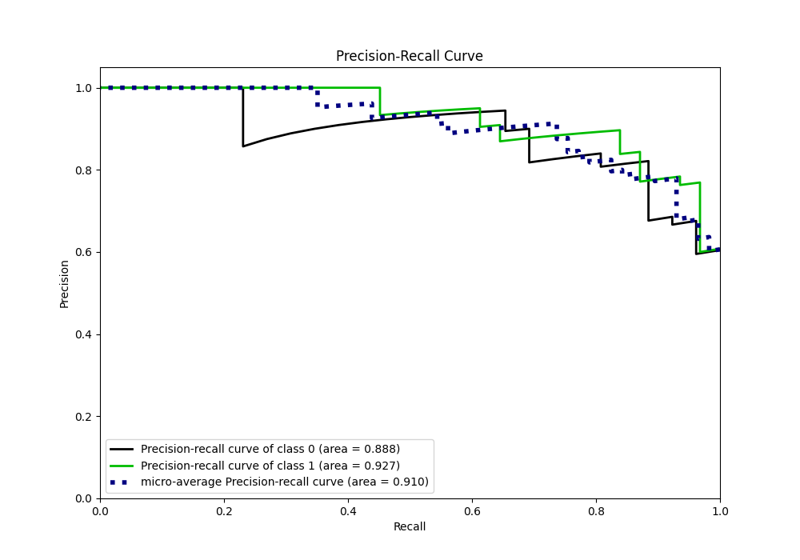
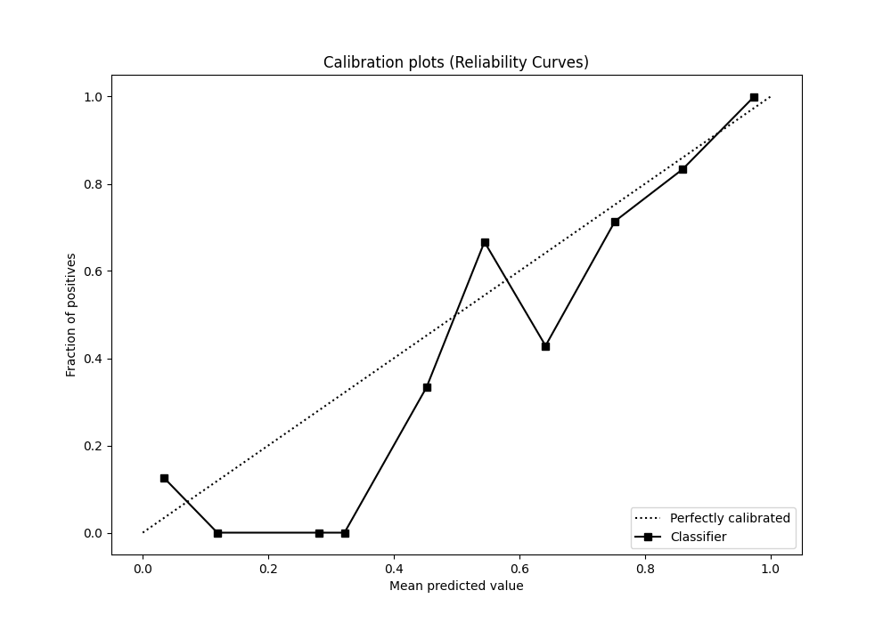
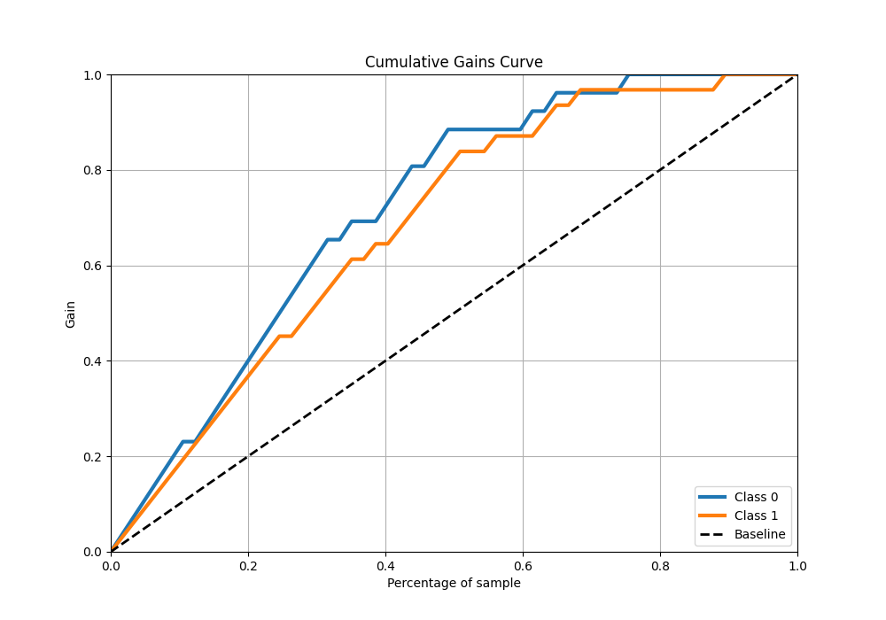
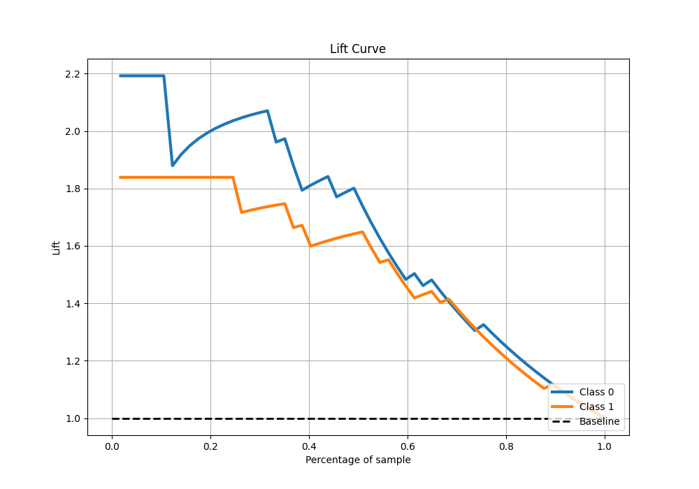

# Summary of 2_Linear

[<< Go back](../README.md)

## Logistic Regression (Linear)
- **n_jobs**: -1
- **explain_level**: 1

## Validation
 - **validation_type**: split
 - **train_ratio**: 0.75
 - **shuffle**: True
 - **stratify**: True

## Optimized metric
f1

## Training time

0.6 seconds

## Metric details
|           |    score |    threshold |
|:----------|---------:|-------------:|
| logloss   | 0.388657 | nan          |
| auc       | 0.906948 | nan          |
| f1        | 0.866667 |   0.659807   |
| accuracy  | 0.859649 |   0.659807   |
| precision | 1        |   0.969734   |
| recall    | 1        |   0.00394106 |
| mcc       | 0.720648 |   0.659807   |

## Confusion matrix (at threshold=0.659807)
|              |   Predicted as 0 |   Predicted as 1 |
|:-------------|-----------------:|-----------------:|
| Labeled as 0 |               23 |                3 |
| Labeled as 1 |                5 |               26 |

## Learning curves

## Coefficients
| feature   |   Learner_1 |
|:----------|------------:|
| thalach   |    0.851735 |
| cp        |    0.754352 |
| intercept |    0.316109 |
| restecg   |    0.264194 |
| age       |   -0.177862 |
| slope     |   -0.185761 |
| trestbps  |   -0.212705 |
| thal      |   -0.246667 |
| fbs       |   -0.267011 |
| chol      |   -0.316259 |
| ca        |   -0.559757 |
| exang     |   -0.729814 |
| oldpeak   |   -0.743416 |
| sex       |   -0.886396 |

## Permutation-based Importance

## Confusion Matrix

## Normalized Confusion Matrix

## ROC Curve

## Kolmogorov-Smirnov Statistic

## Precision-Recall Curve

## Calibration Curve

## Cumulative Gains Curve

## Lift Curve

[<< Go back](../README.md)
