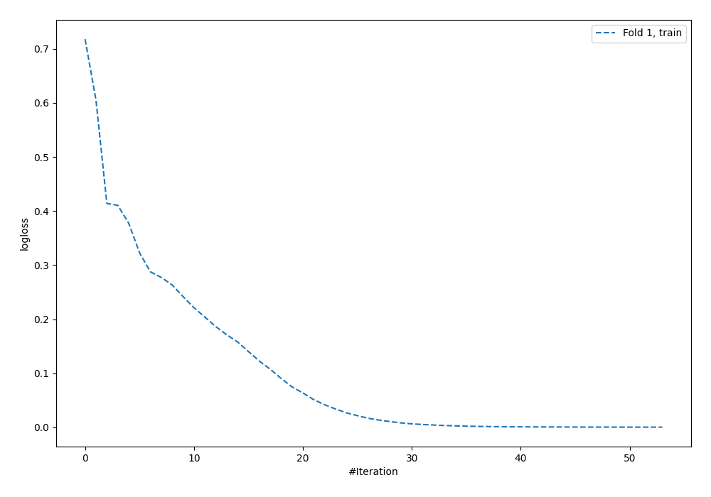
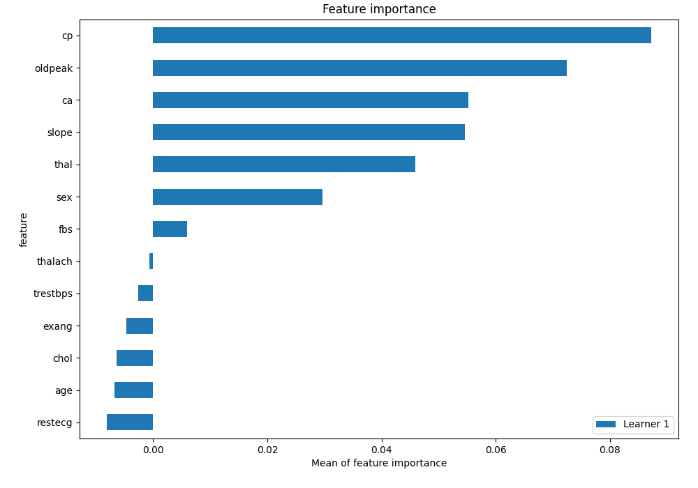
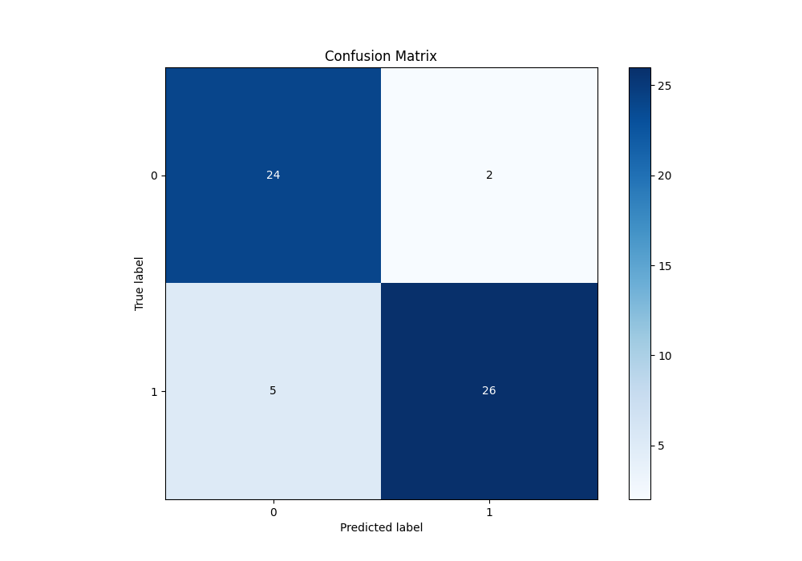
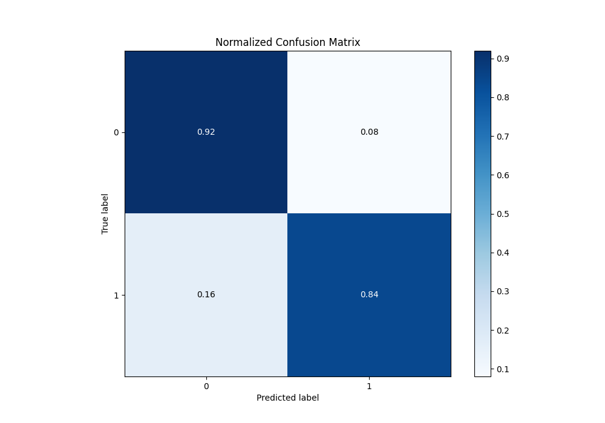
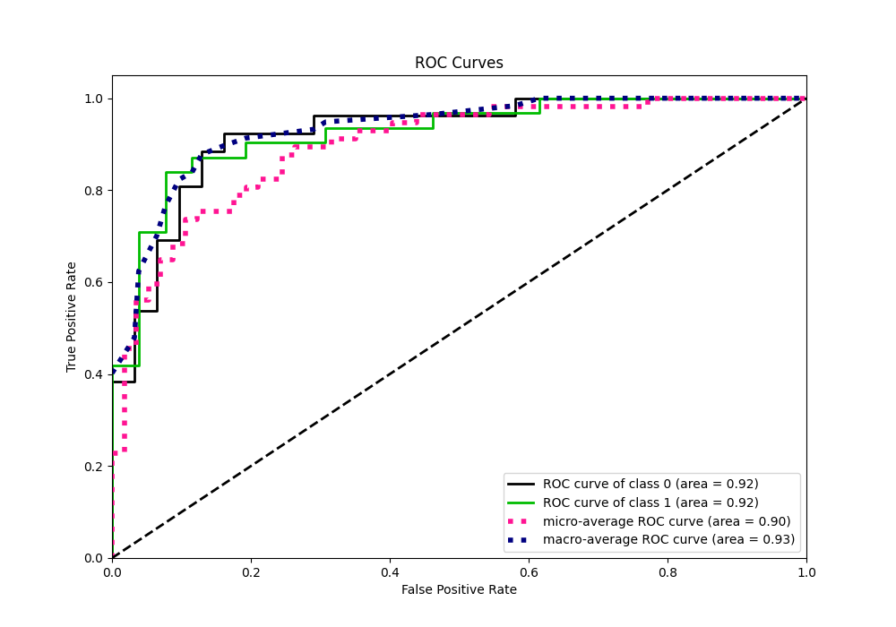
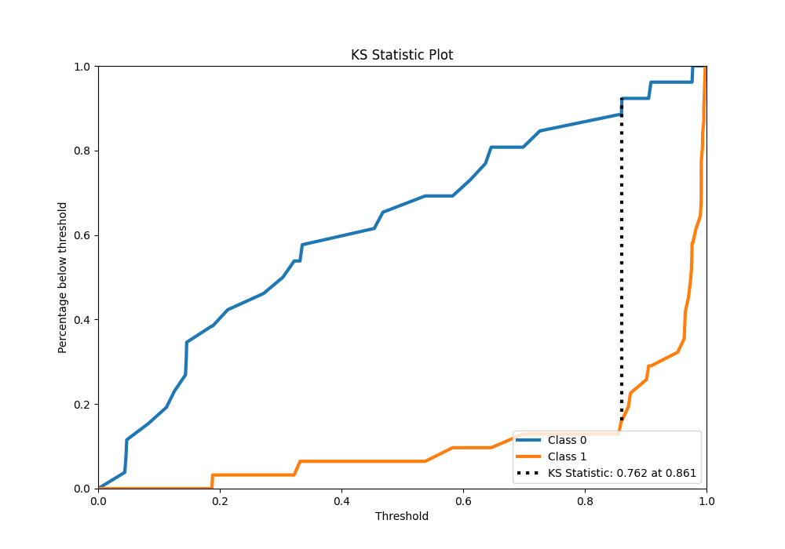
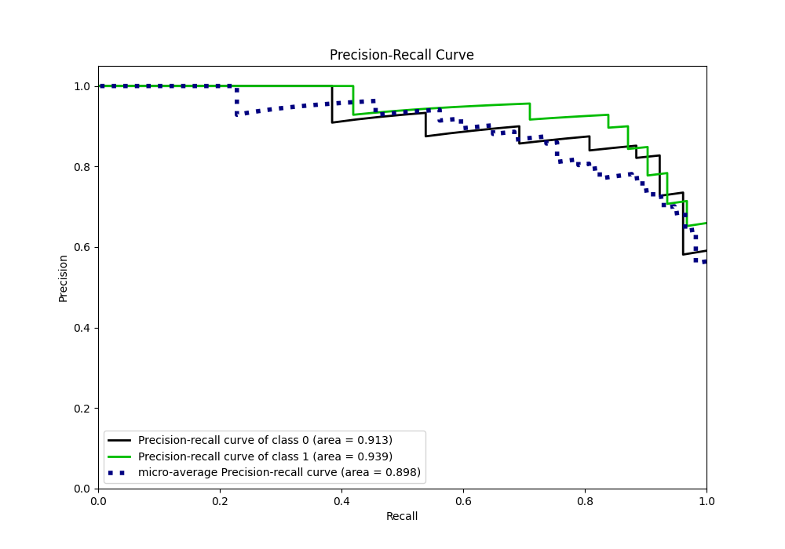
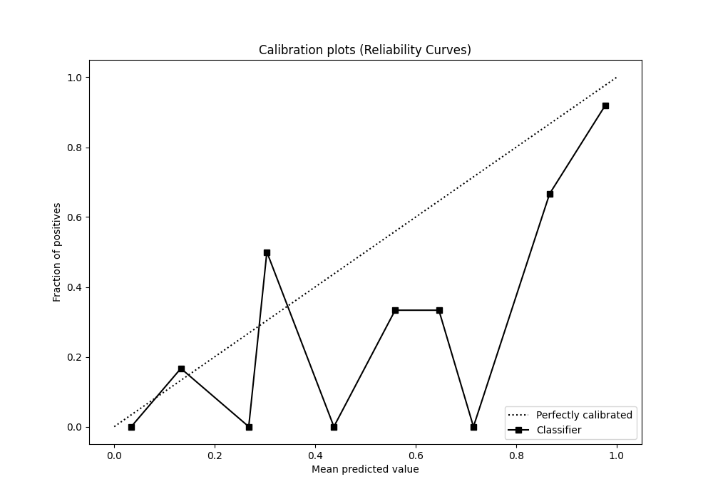
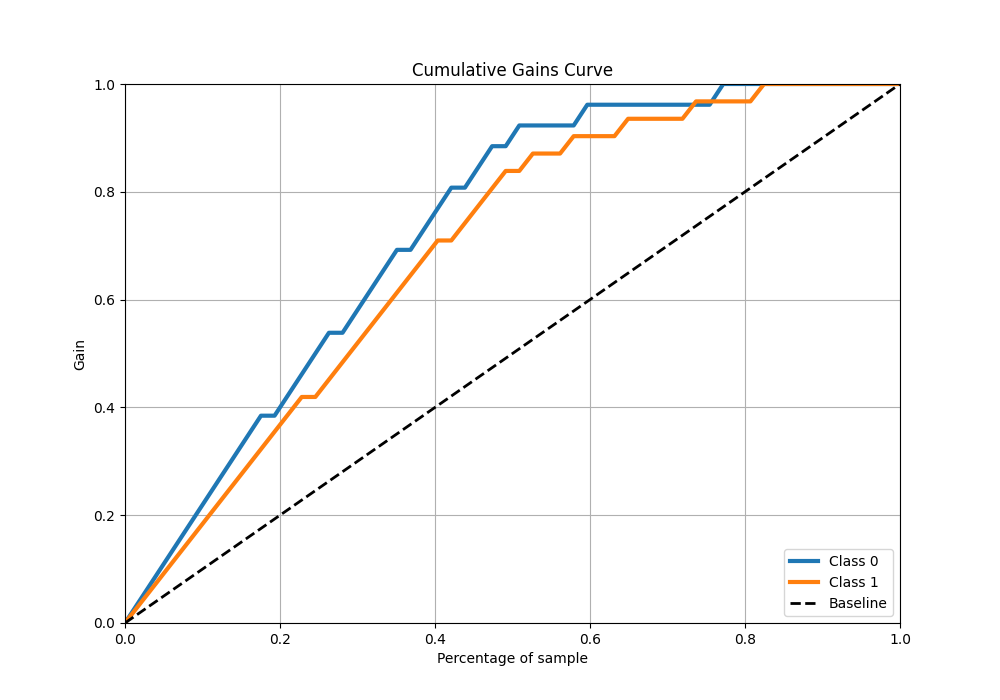
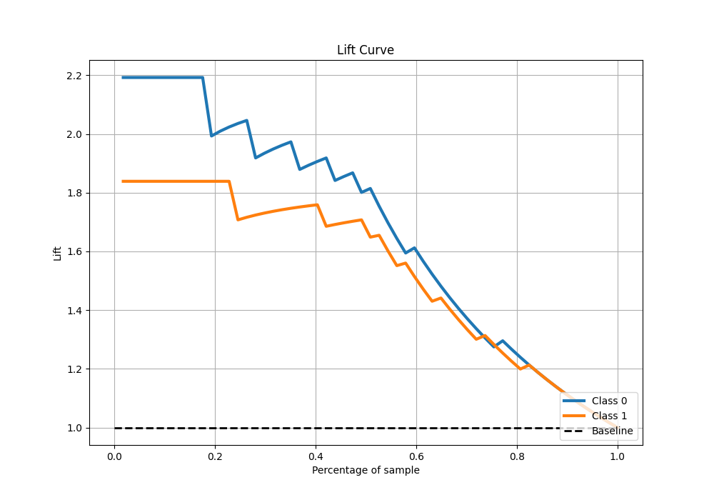

# Summary of 3_Default_NeuralNetwork

[<< Go back](../README.md)

## Neural Network
- **n_jobs**: -1
- **dense_1_size**: 32
- **dense_2_size**: 16
- **learning_rate**: 0.05
- **explain_level**: 1

## Validation
 - **validation_type**: split
 - **train_ratio**: 0.75
 - **shuffle**: True
 - **stratify**: True

## Optimized metric
f1

## Training time

0.7 seconds

## Metric details
|           |    score |   threshold |
|:----------|---------:|------------:|
| logloss   | 0.420089 | nan         |
| auc       | 0.924318 | nan         |
| f1        | 0.881356 |   0.866331  |
| accuracy  | 0.877193 |   0.866331  |
| precision | 1        |   0.97891   |
| recall    | 1        |   0.0394182 |
| mcc       | 0.758967 |   0.866331  |

## Confusion matrix (at threshold=0.866331)
|              |   Predicted as 0 |   Predicted as 1 |
|:-------------|-----------------:|-----------------:|
| Labeled as 0 |               24 |                2 |
| Labeled as 1 |                5 |               26 |

## Learning curves

## Permutation-based Importance

## Confusion Matrix

## Normalized Confusion Matrix

## ROC Curve

## Kolmogorov-Smirnov Statistic

## Precision-Recall Curve

## Calibration Curve

## Cumulative Gains Curve

## Lift Curve

[<< Go back](../README.md)
