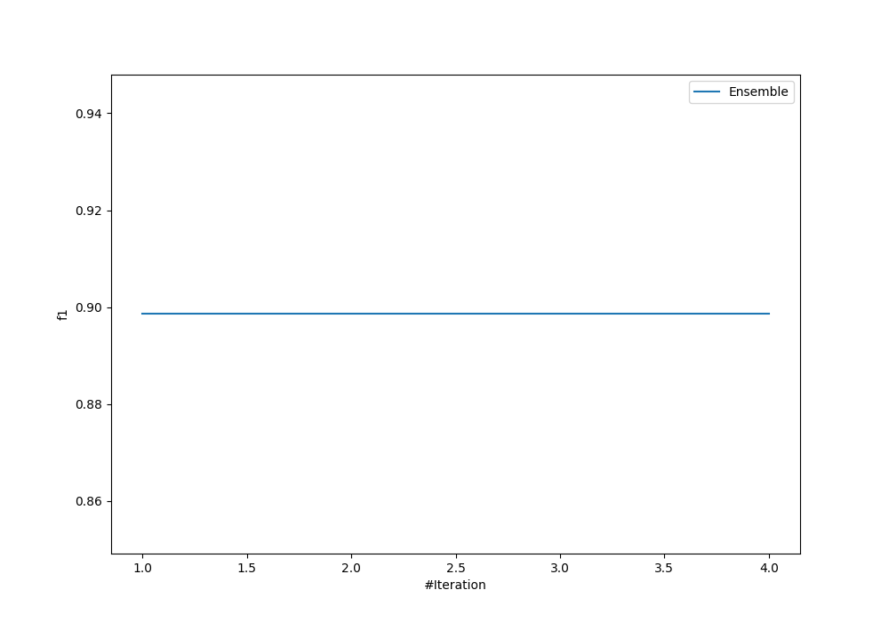
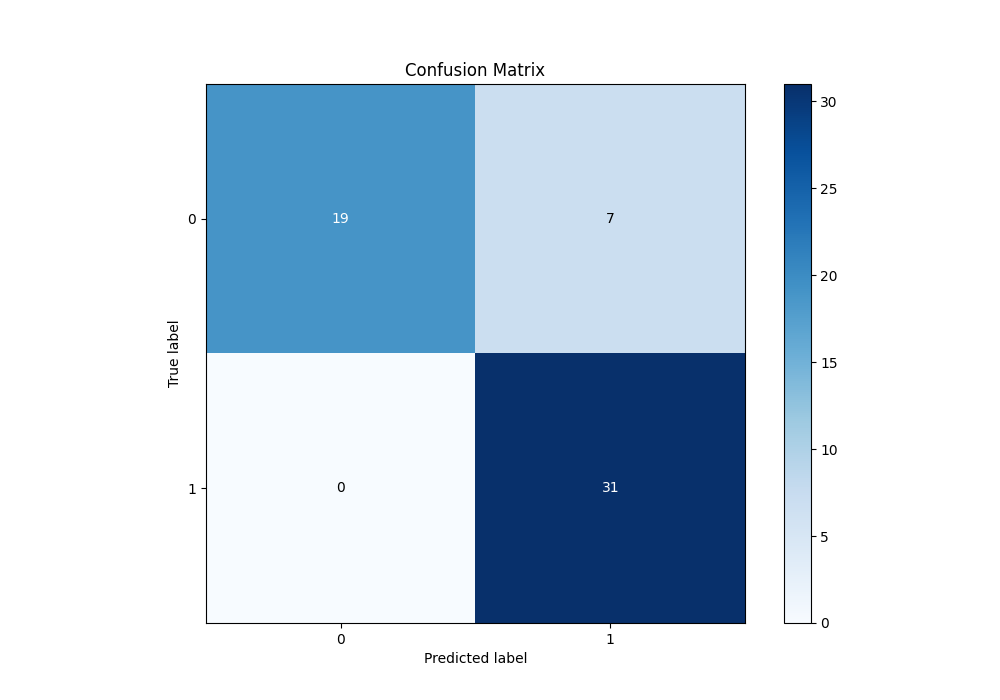
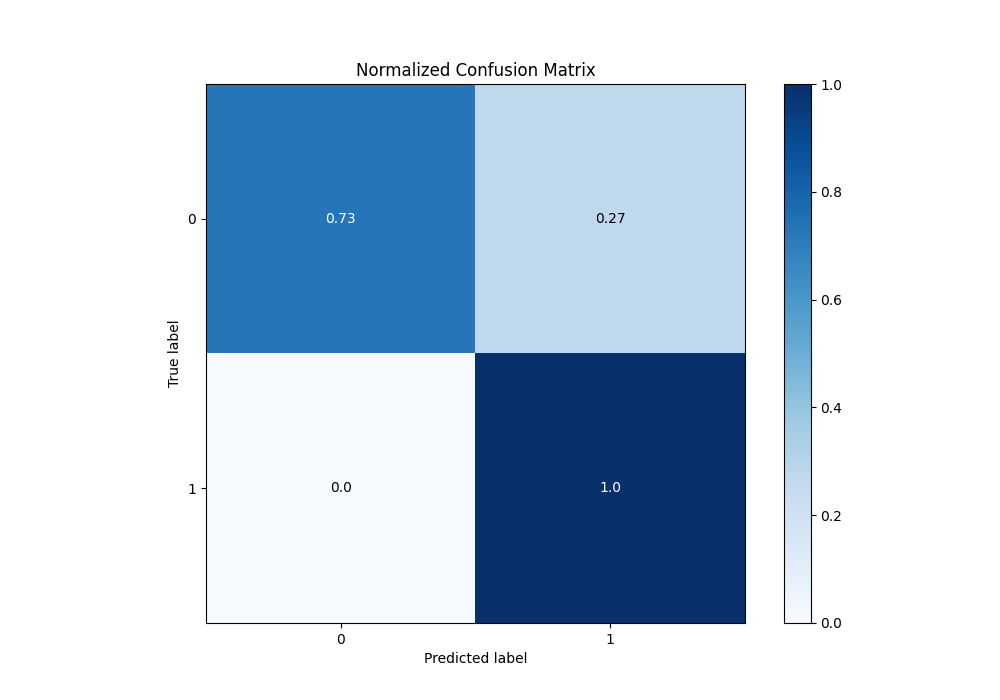
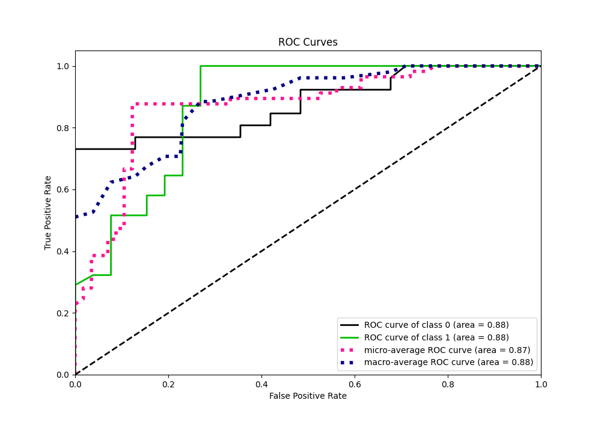
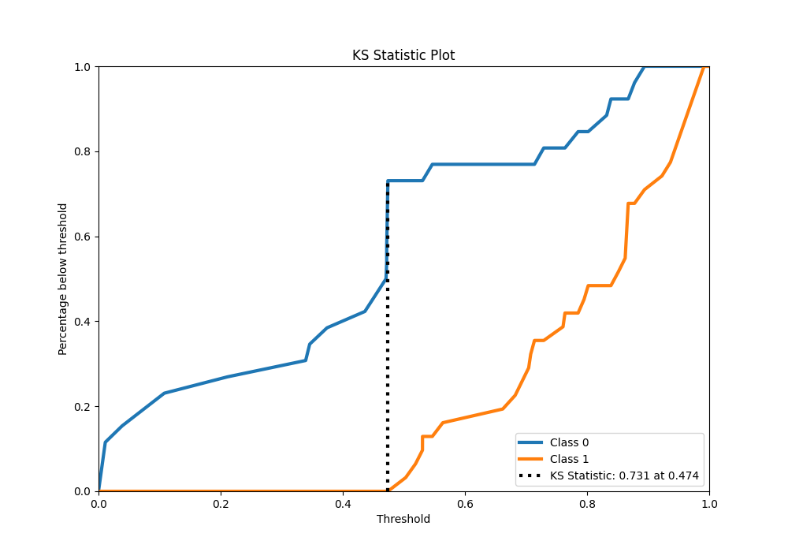
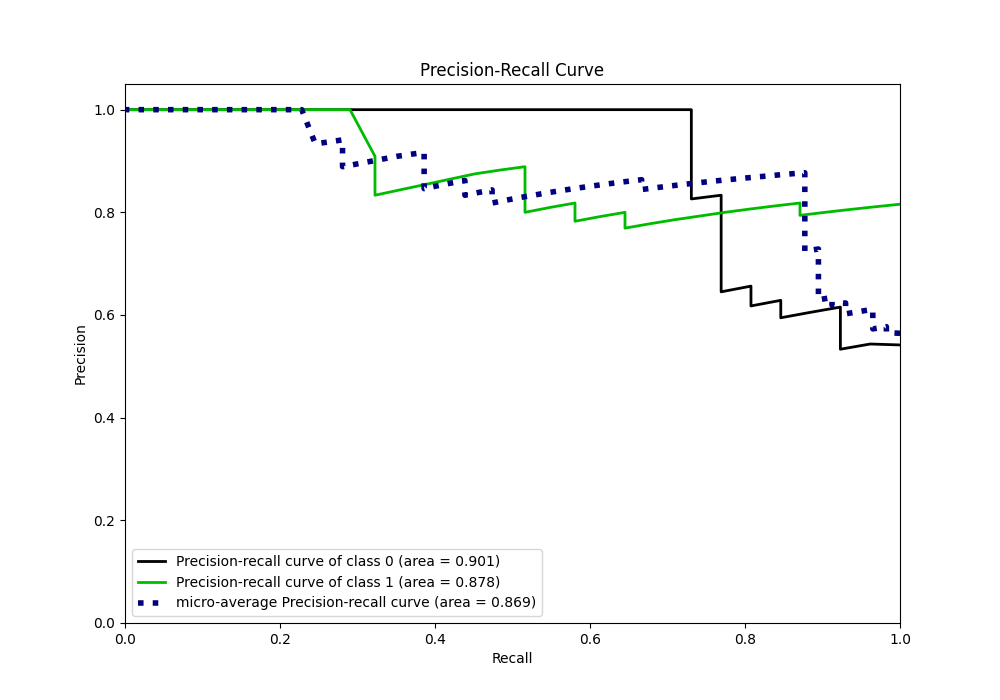
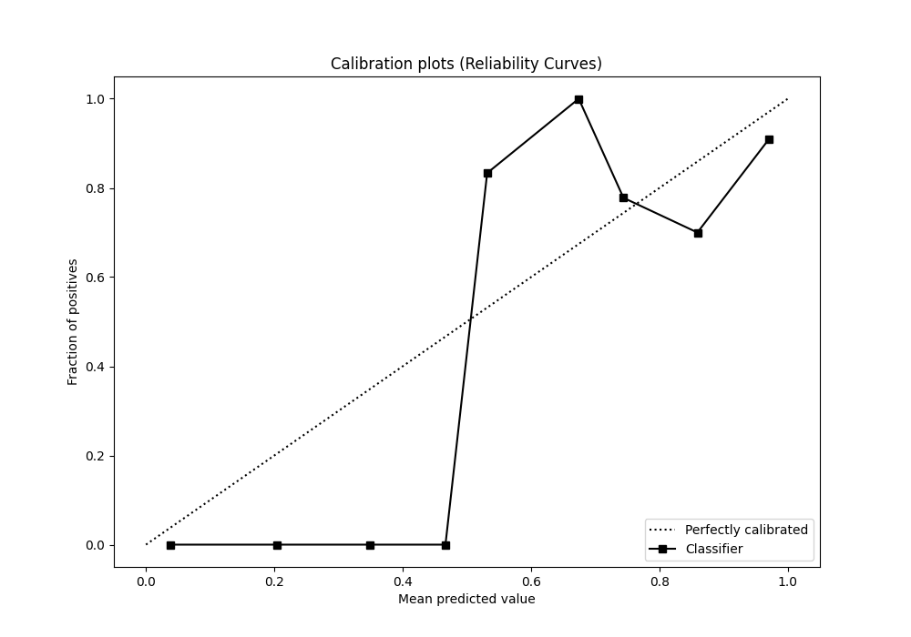
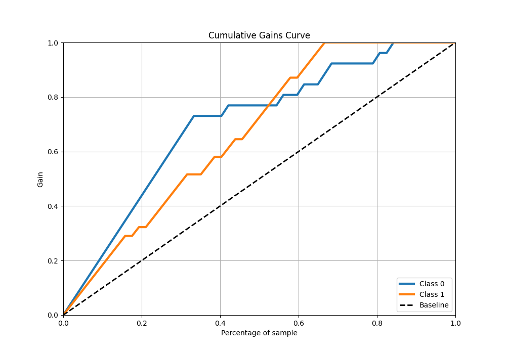
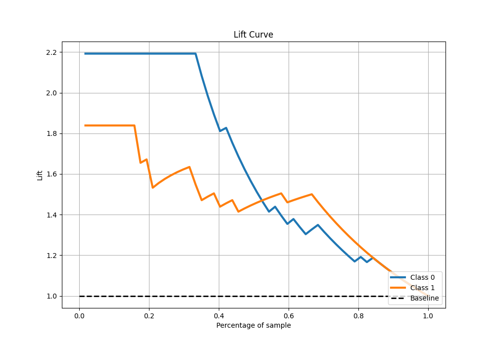

# Summary of Ensemble

[<< Go back](../README.md)

## Ensemble structure
| Model                  |   Weight |
|:-----------------------|---------:|
| 4_Default_RandomForest |        1 |

## Metric details
|           |    score |   threshold |
|:----------|---------:|------------:|
| logloss   | 0.468111 | nan         |
| auc       | 0.87531  | nan         |
| f1        | 0.898551 |   0.501313  |
| accuracy  | 0.877193 |   0.501313  |
| precision | 1        |   0.926945  |
| recall    | 1        |   0.0100255 |
| mcc       | 0.77211  |   0.501313  |

## Confusion matrix (at threshold=0.501313)
|              |   Predicted as 0 |   Predicted as 1 |
|:-------------|-----------------:|-----------------:|
| Labeled as 0 |               19 |                7 |
| Labeled as 1 |                0 |               31 |

## Learning curves

## Confusion Matrix

## Normalized Confusion Matrix

## ROC Curve

## Kolmogorov-Smirnov Statistic

## Precision-Recall Curve

## Calibration Curve

## Cumulative Gains Curve

## Lift Curve

[<< Go back](../README.md)
