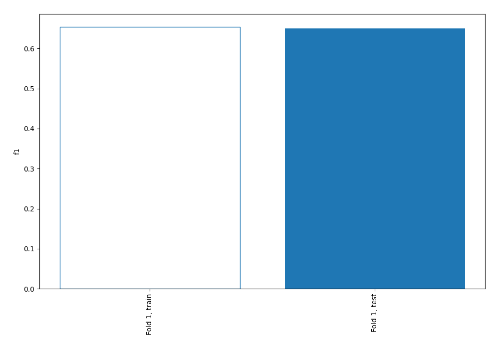
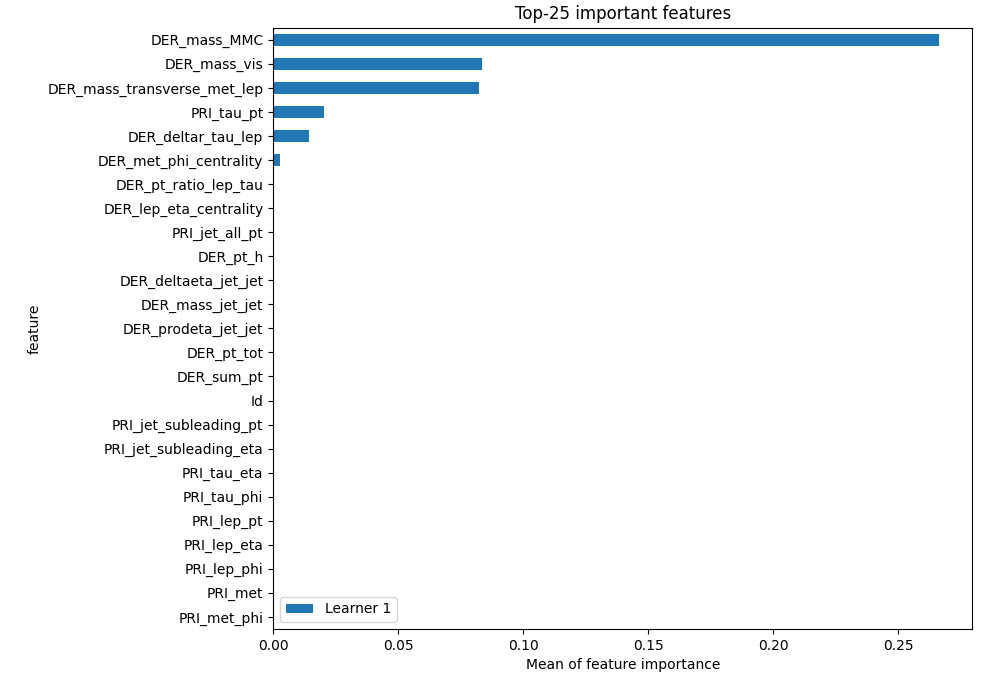
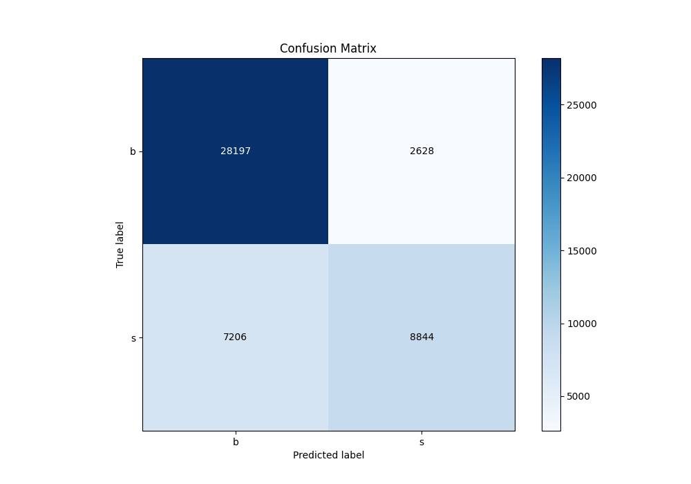
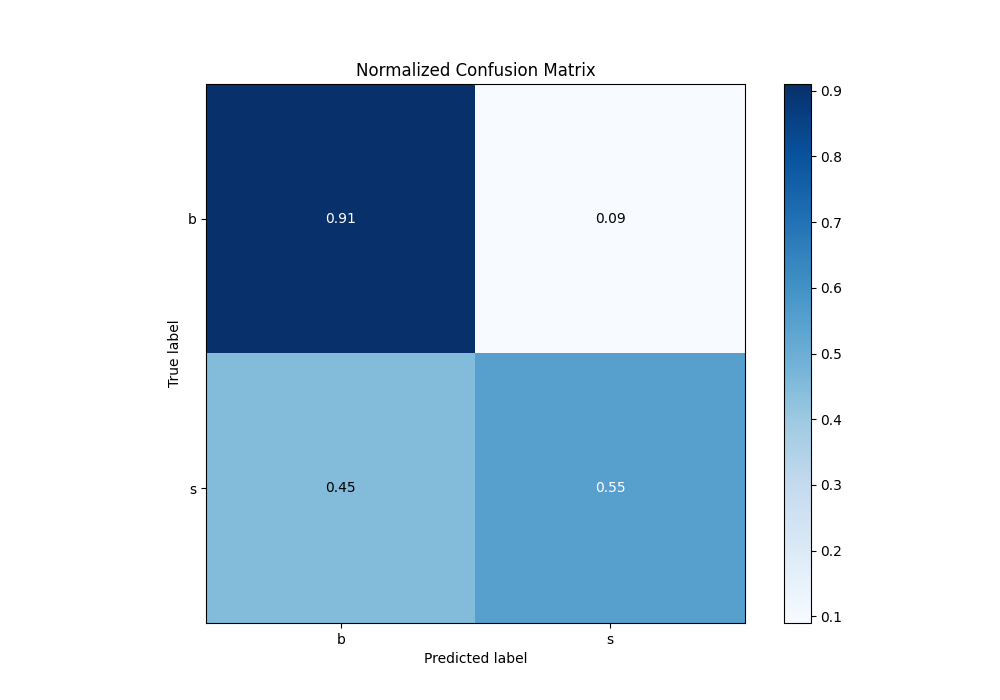
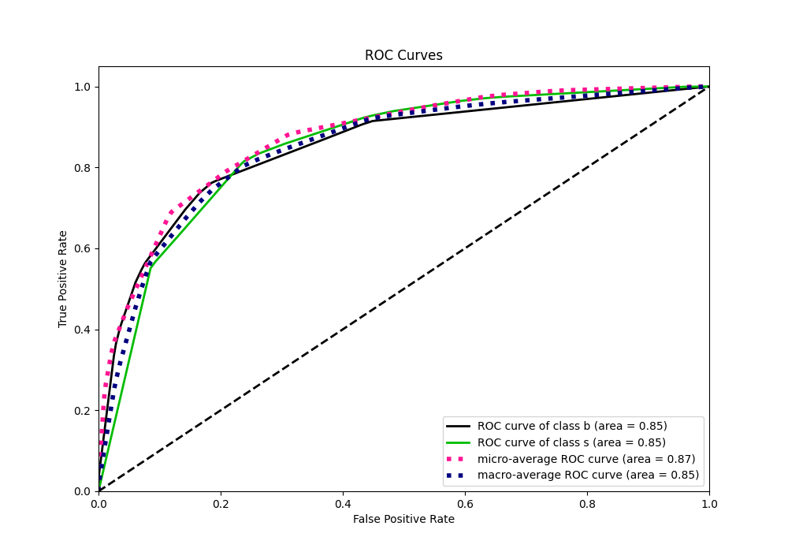
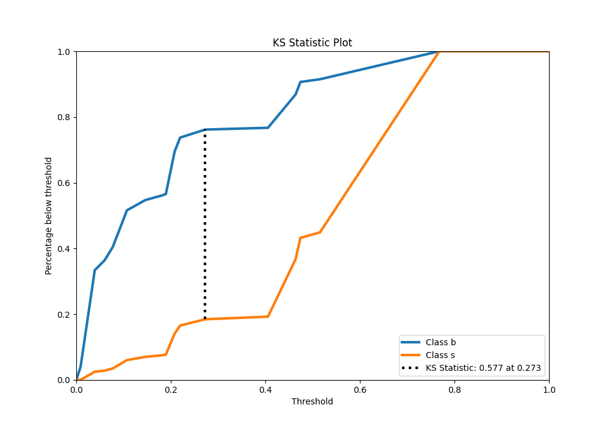
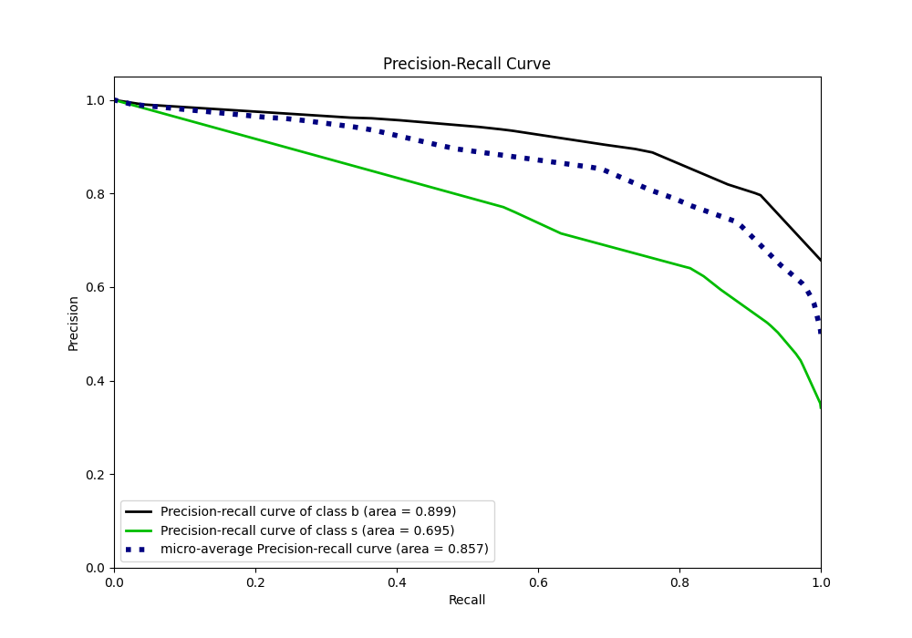
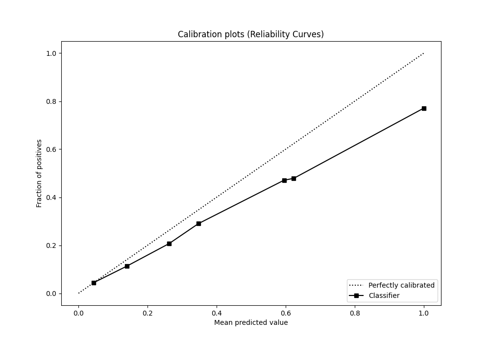
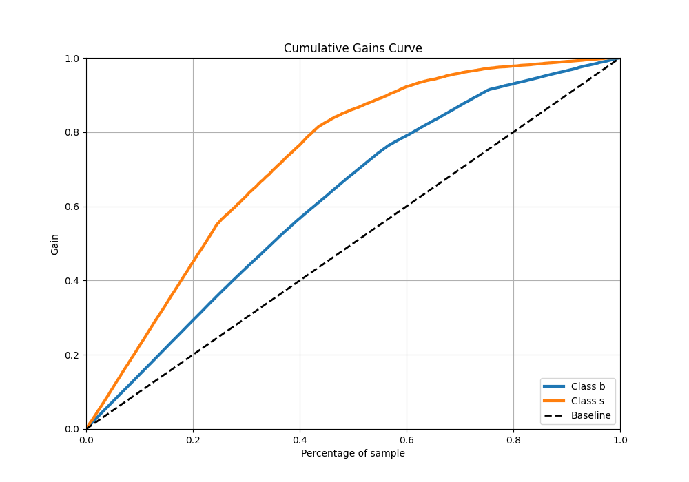
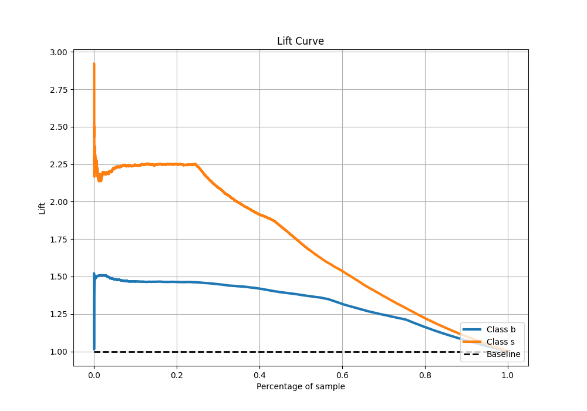

# Summary of 1_DecisionTree

[<< Go back](../README.md)

## Decision Tree
- **n_jobs**: -1
- **criterion**: entropy
- **max_depth**: 4
- **explain_level**: 1

## Validation
 - **validation_type**: split
 - **train_ratio**: 0.75
 - **shuffle**: True
 - **stratify**: True

## Optimized metric
f1

## Training time

35.3 seconds

## Metric details
|           |    score |    threshold |
|:----------|---------:|-------------:|
| logloss   | 0.44386  | nan          |
| auc       | 0.850423 | nan          |
| f1        | 0.717329 |   0.277317   |
| accuracy  | 0.790208 |   0.616      |
| precision | 0.770921 |   0.616      |
| recall    | 1        |   0.00825688 |
| mcc       | 0.552058 |   0.277317   |

## Confusion matrix (at threshold=0.616)
|              |   Predicted as b |   Predicted as s |
|:-------------|-----------------:|-----------------:|
| Labeled as b |            28197 |             2628 |
| Labeled as s |             7206 |             8844 |

## Learning curves

## Permutation-based Importance

## Confusion Matrix

## Normalized Confusion Matrix

## ROC Curve

## Kolmogorov-Smirnov Statistic

## Precision-Recall Curve

## Calibration Curve

## Cumulative Gains Curve

## Lift Curve

[<< Go back](../README.md)
