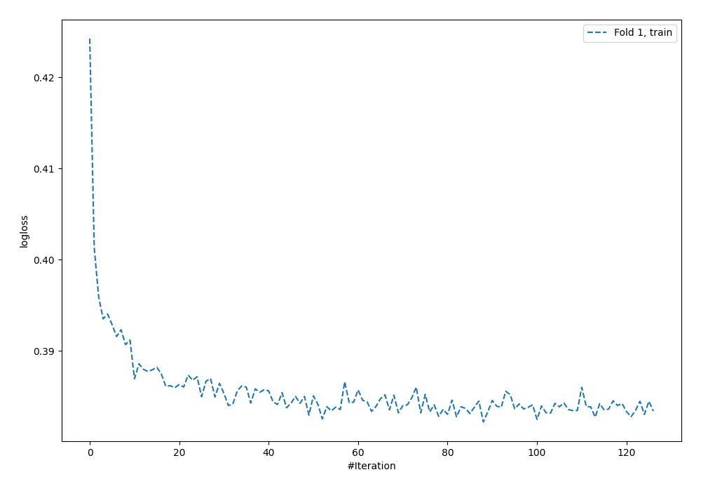
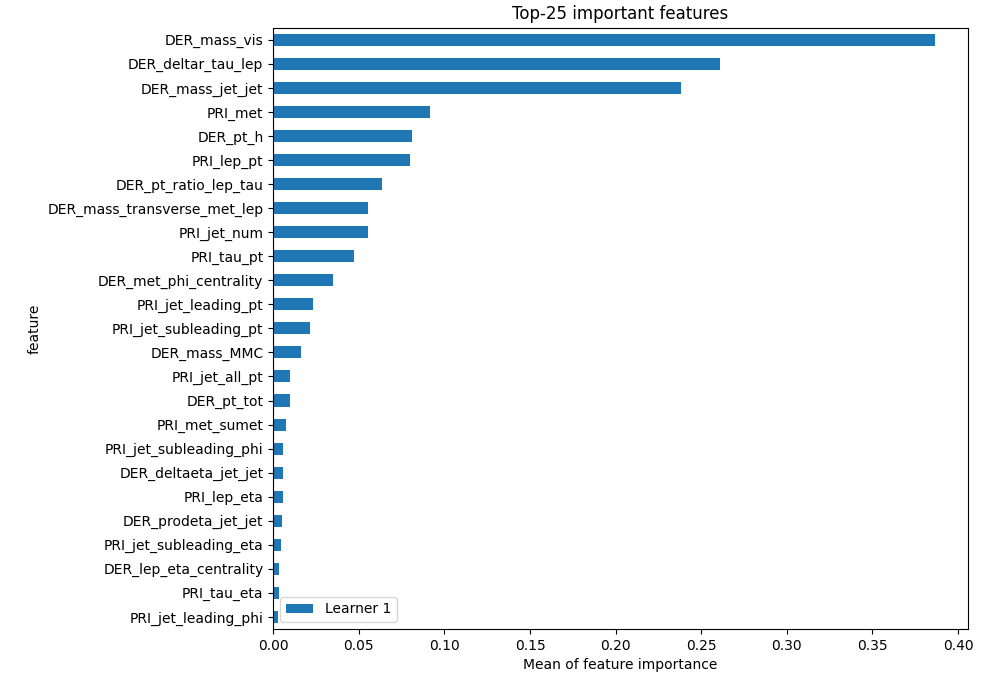
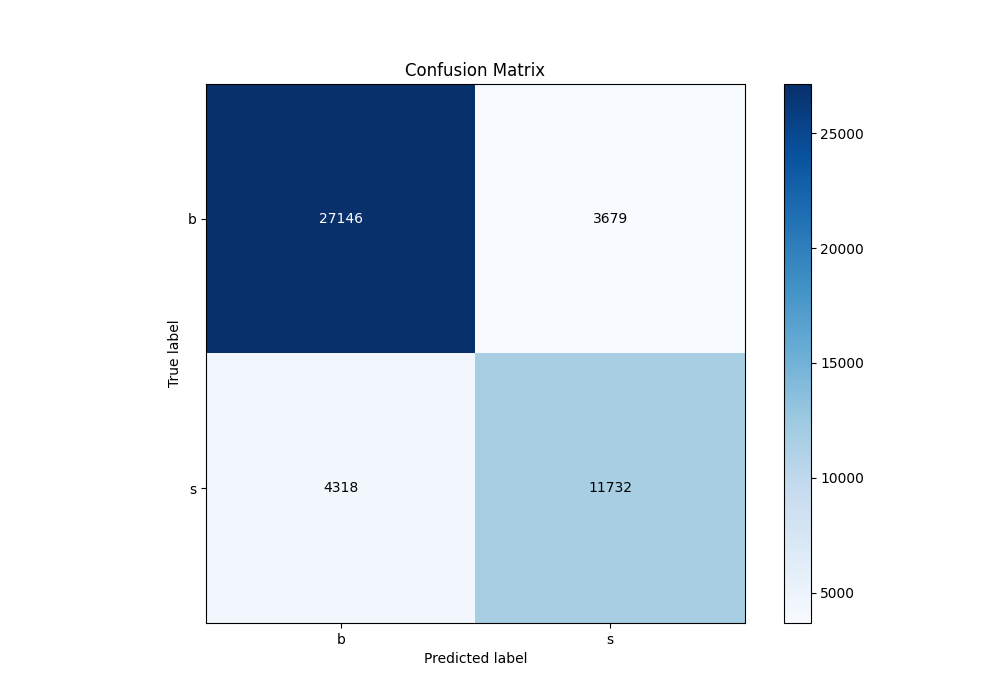
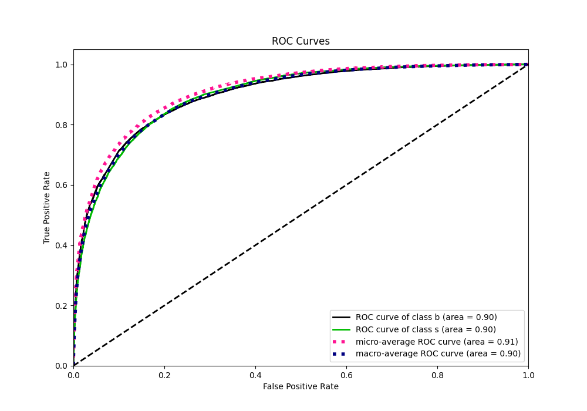
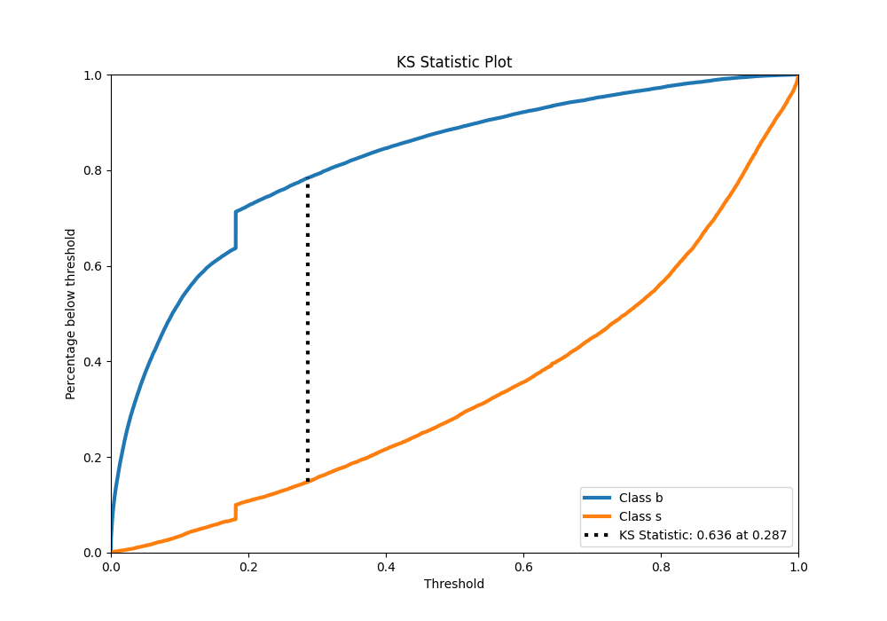
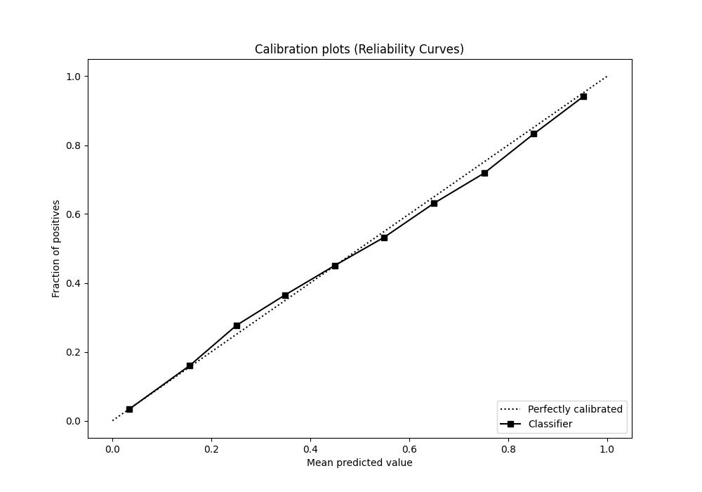
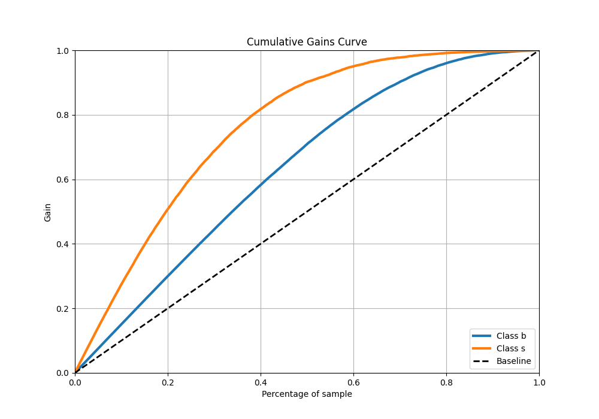
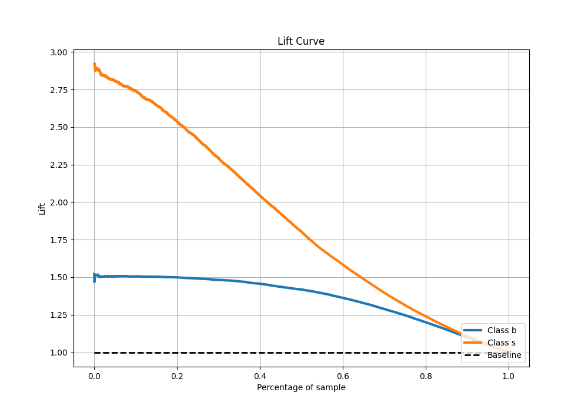

# Summary of 2_Default_NeuralNetwork

[<< Go back](../README.md)

## Neural Network
- **n_jobs**: -1
- **dense_1_size**: 32
- **dense_2_size**: 16
- **learning_rate**: 0.05
- **explain_level**: 1

## Validation
 - **validation_type**: split
 - **train_ratio**: 0.75
 - **shuffle**: True
 - **stratify**: True

## Optimized metric
f1

## Training time

187.0 seconds

## Metric details
|           |    score |     threshold |
|:----------|---------:|--------------:|
| logloss   | 0.377969 | nan           |
| auc       | 0.899546 | nan           |
| f1        | 0.754165 |   0.350094    |
| accuracy  | 0.829397 |   0.482367    |
| precision | 0.939553 |   0.893598    |
| recall    | 1        |   4.35864e-12 |
| mcc       | 0.619389 |   0.430966    |

## Confusion matrix (at threshold=0.482367)
|              |   Predicted as b |   Predicted as s |
|:-------------|-----------------:|-----------------:|
| Labeled as b |            27146 |             3679 |
| Labeled as s |             4318 |            11732 |

## Learning curves

## Permutation-based Importance

## Confusion Matrix

## Normalized Confusion Matrix

## ROC Curve

## Kolmogorov-Smirnov Statistic

## Precision-Recall Curve

## Calibration Curve

## Cumulative Gains Curve

## Lift Curve

[<< Go back](../README.md)
