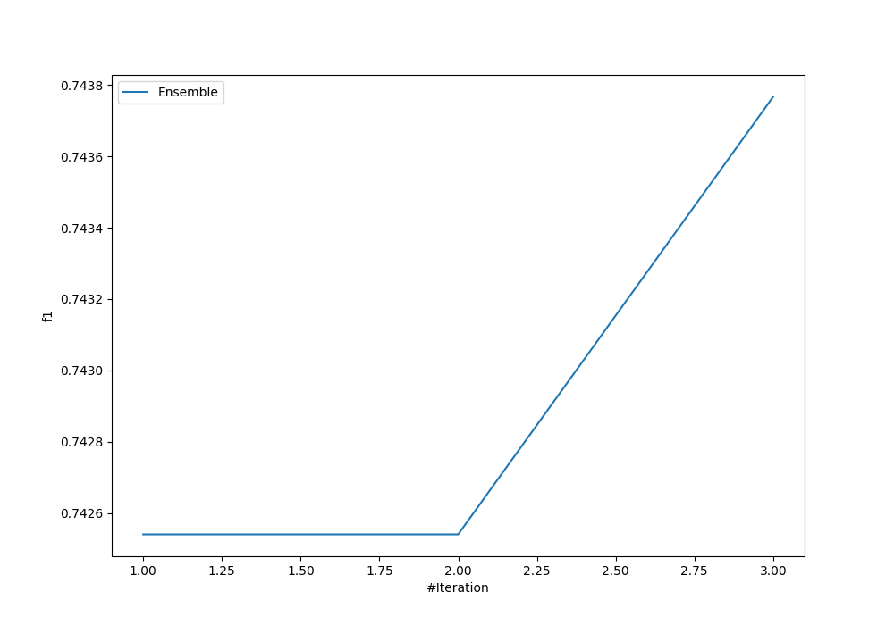
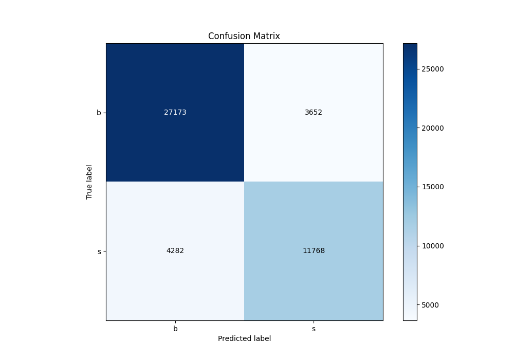
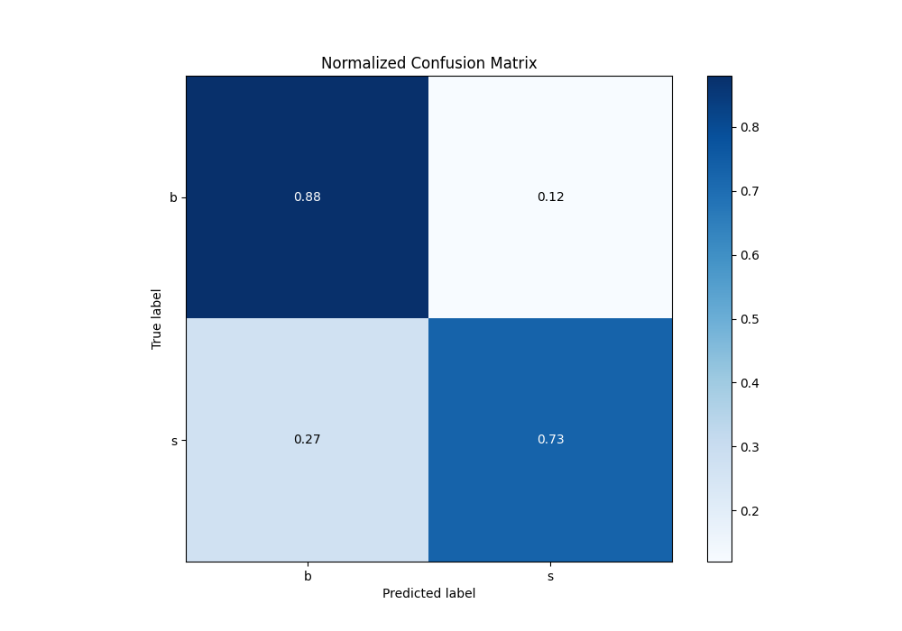
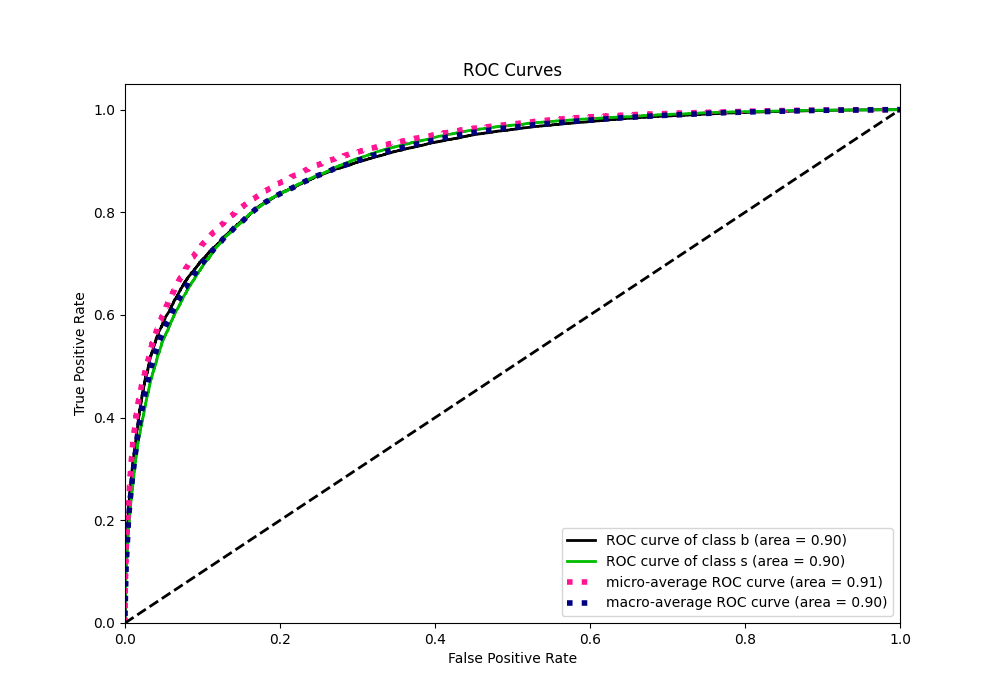
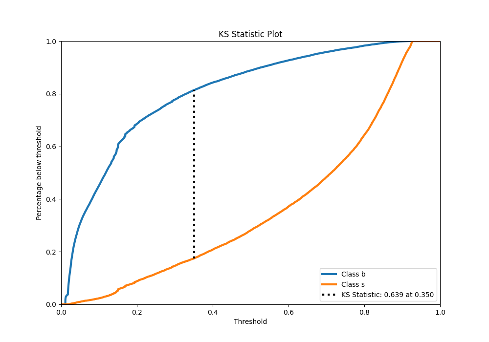
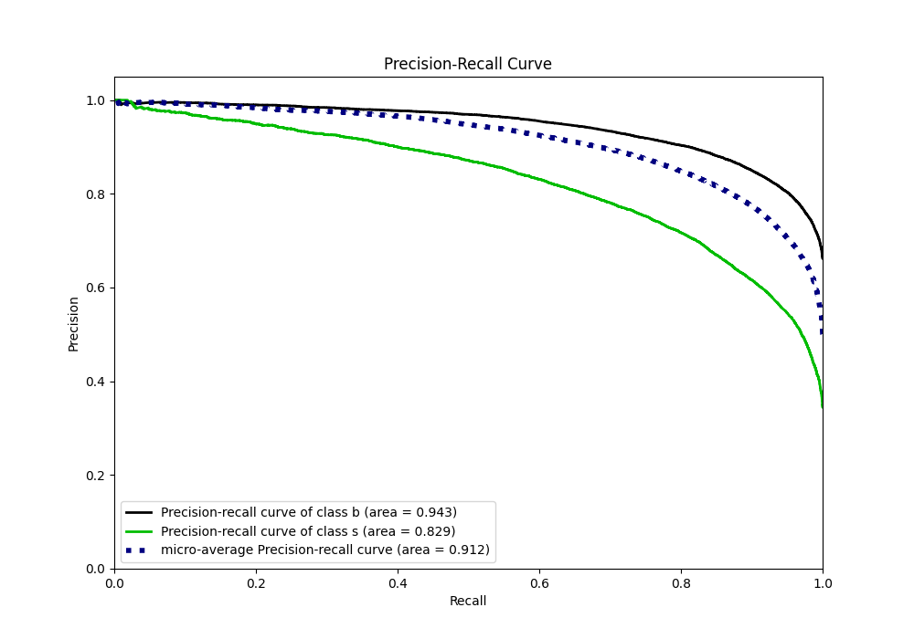
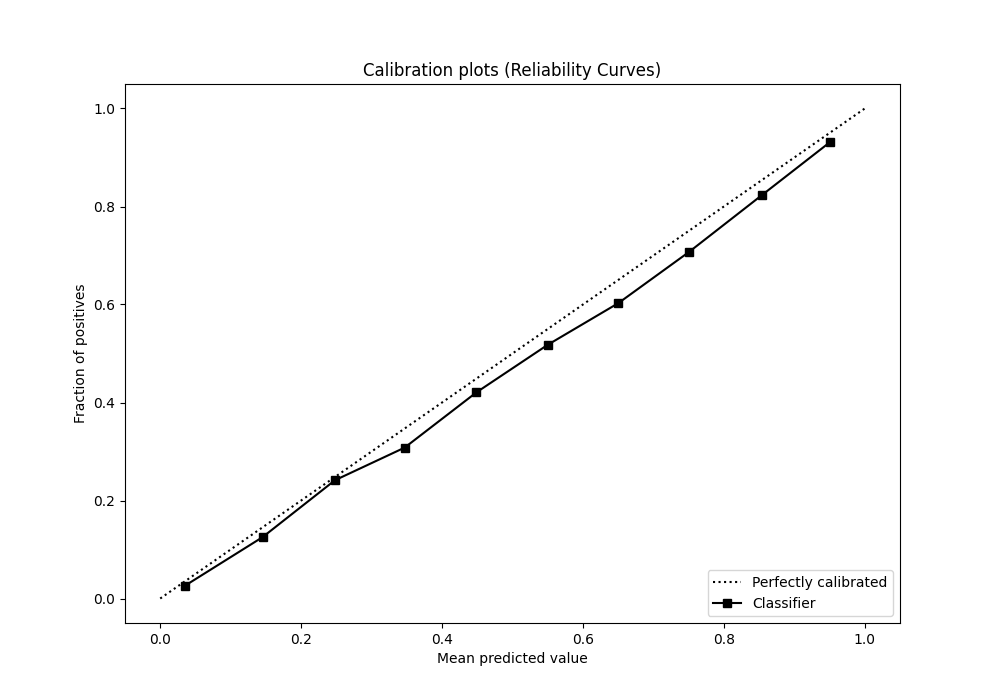
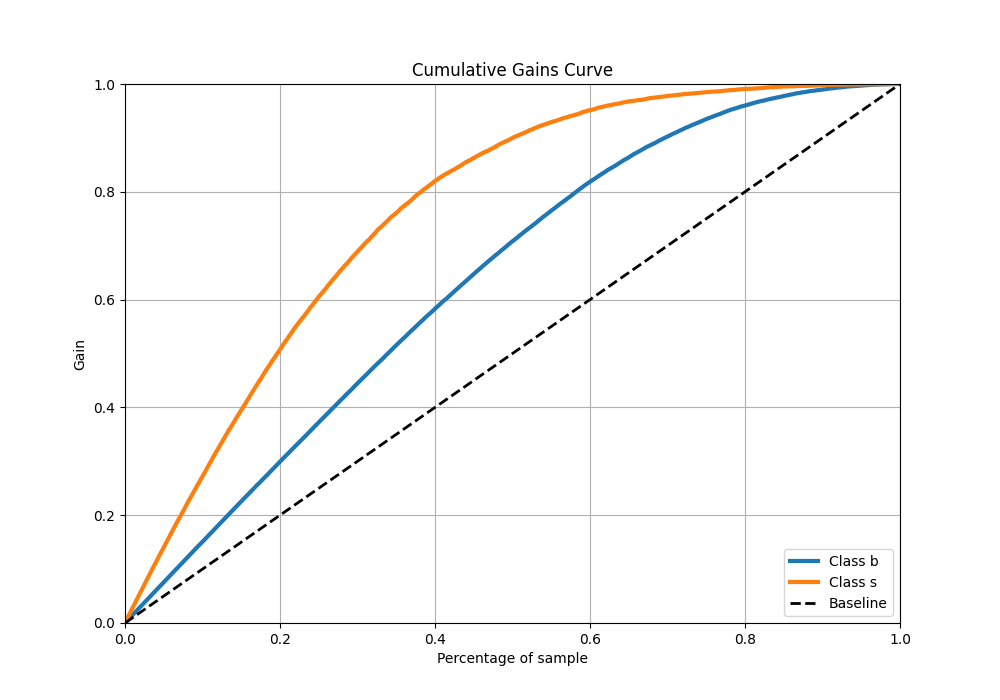
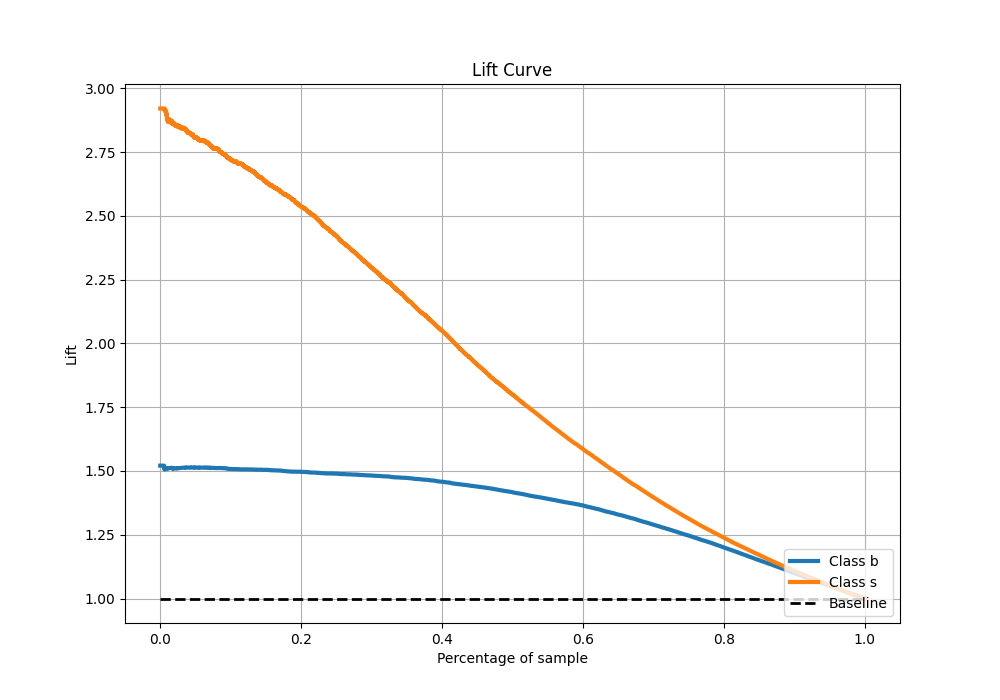

# Summary of Ensemble

[<< Go back](../README.md)

## Ensemble structure
| Model                   |   Weight |
|:------------------------|---------:|
| 2_Default_NeuralNetwork |        2 |
| 3_Default_RandomForest  |        1 |

## Metric details
|           |    score |    threshold |
|:----------|---------:|-------------:|
| logloss   | 0.379293 | nan          |
| auc       | 0.899786 | nan          |
| f1        | 0.756645 |   0.393763   |
| accuracy  | 0.830741 |   0.484483   |
| precision | 0.946381 |   0.85507    |
| recall    | 1        |   0.00996365 |
| mcc       | 0.622552 |   0.458182   |

## Confusion matrix (at threshold=0.484483)
|              |   Predicted as b |   Predicted as s |
|:-------------|-----------------:|-----------------:|
| Labeled as b |            27173 |             3652 |
| Labeled as s |             4282 |            11768 |

## Learning curves

## Confusion Matrix

## Normalized Confusion Matrix

## ROC Curve

## Kolmogorov-Smirnov Statistic

## Precision-Recall Curve

## Calibration Curve

## Cumulative Gains Curve

## Lift Curve

[<< Go back](../README.md)
