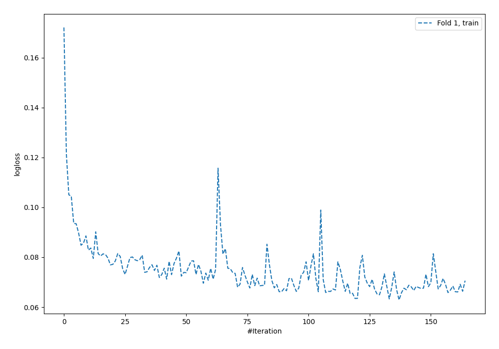
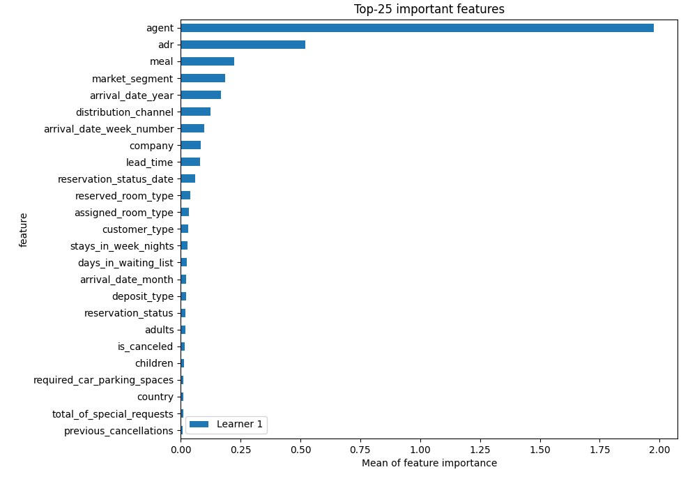
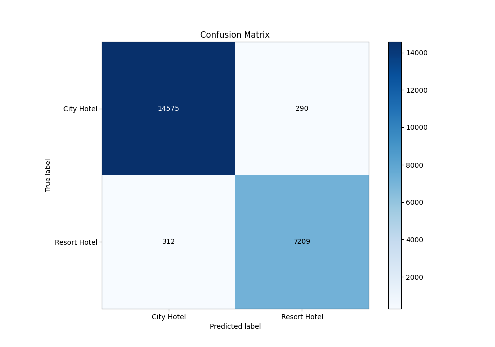
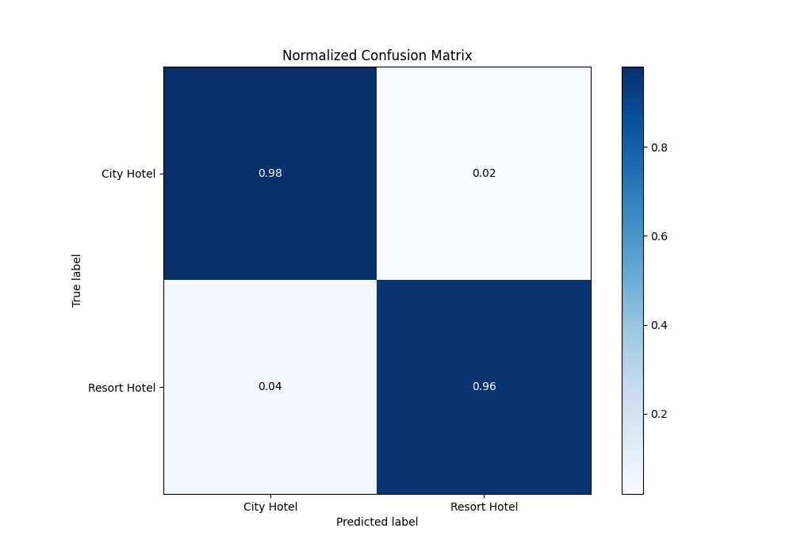
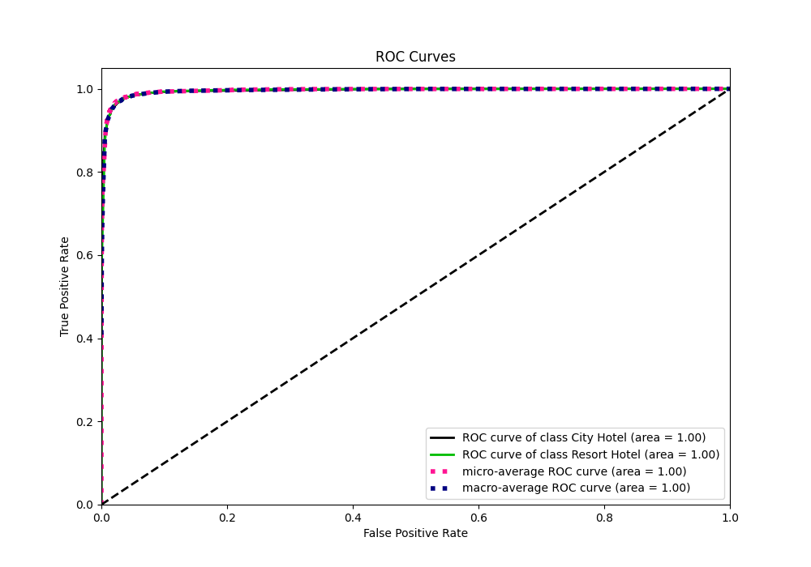
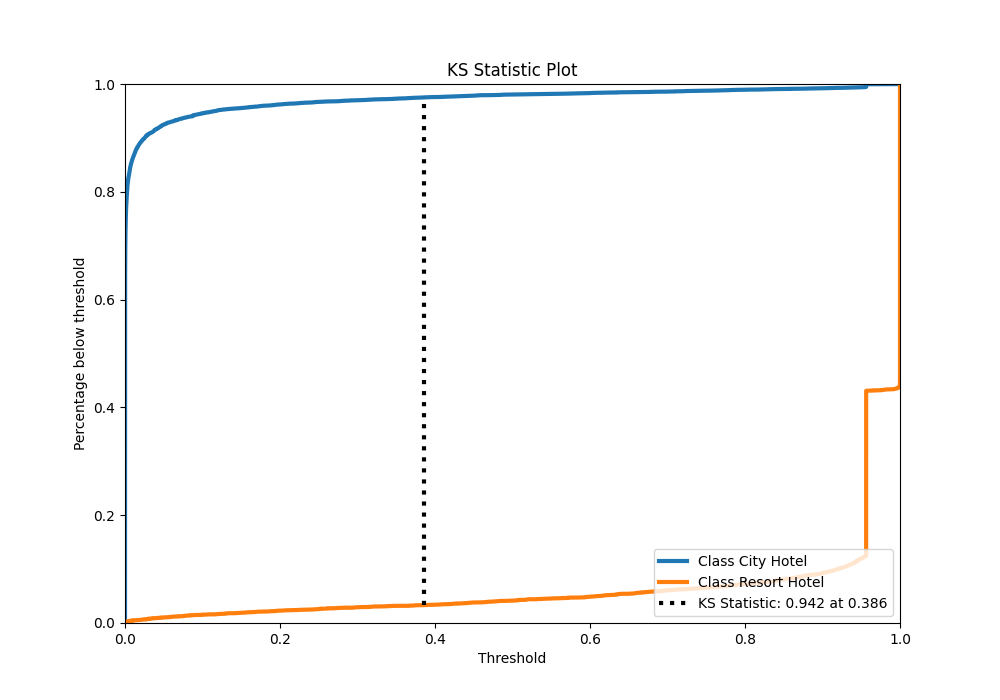
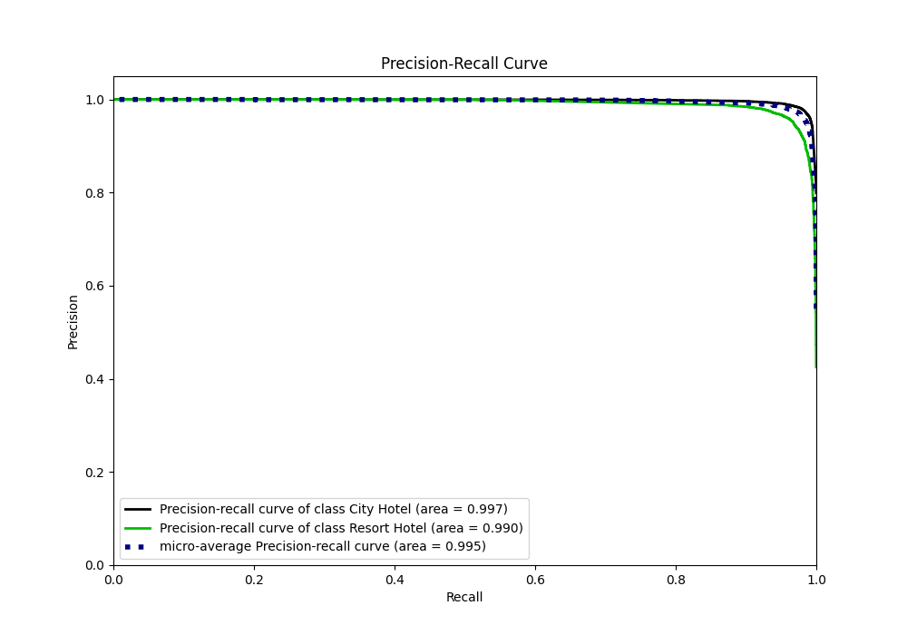
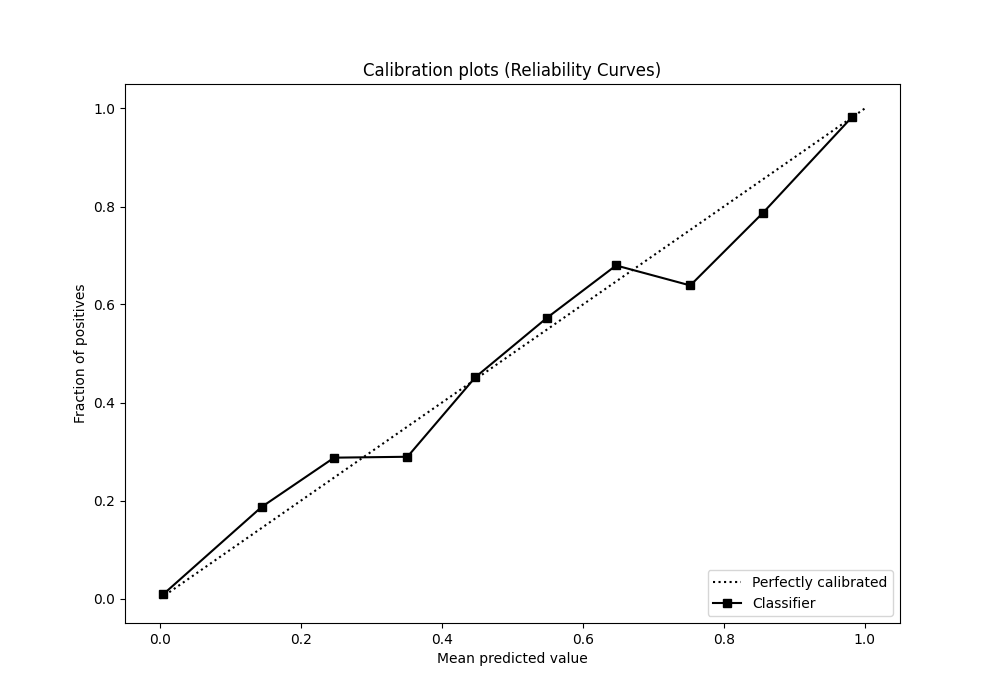
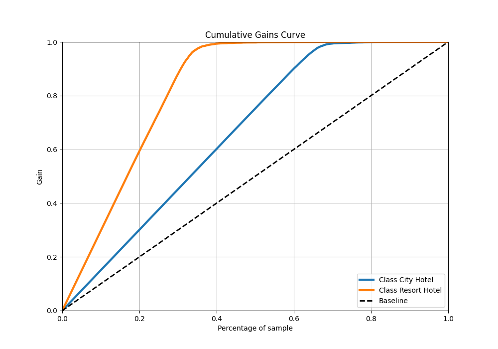
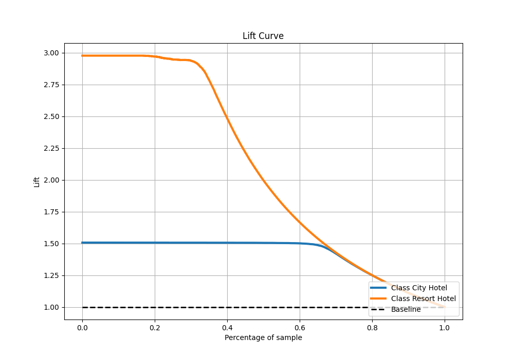

# Summary of 2_Default_NeuralNetwork

[<< Go back](../README.md)

## Neural Network
- **n_jobs**: -1
- **dense_1_size**: 32
- **dense_2_size**: 16
- **learning_rate**: 0.05
- **explain_level**: 1

## Validation
 - **validation_type**: split
 - **train_ratio**: 0.75
 - **shuffle**: True
 - **stratify**: True

## Optimized metric
f1

## Training time

54.6 seconds

## Metric details
|           |     score |     threshold |
|:----------|----------:|--------------:|
| logloss   | 0.0819877 | nan           |
| auc       | 0.995266  | nan           |
| f1        | 0.95992   |   0.502869    |
| accuracy  | 0.973108  |   0.502869    |
| precision | 0.9986    |   0.956351    |
| recall    | 1         |   1.10551e-79 |
| mcc       | 0.939689  |   0.502869    |

## Confusion matrix (at threshold=0.502869)
|                         |   Predicted as City Hotel |   Predicted as Resort Hotel |
|:------------------------|--------------------------:|----------------------------:|
| Labeled as City Hotel   |                     14575 |                         290 |
| Labeled as Resort Hotel |                       312 |                        7209 |

## Learning curves

## Permutation-based Importance

## Confusion Matrix

## Normalized Confusion Matrix

## ROC Curve

## Kolmogorov-Smirnov Statistic

## Precision-Recall Curve

## Calibration Curve

## Cumulative Gains Curve

## Lift Curve

[<< Go back](../README.md)
