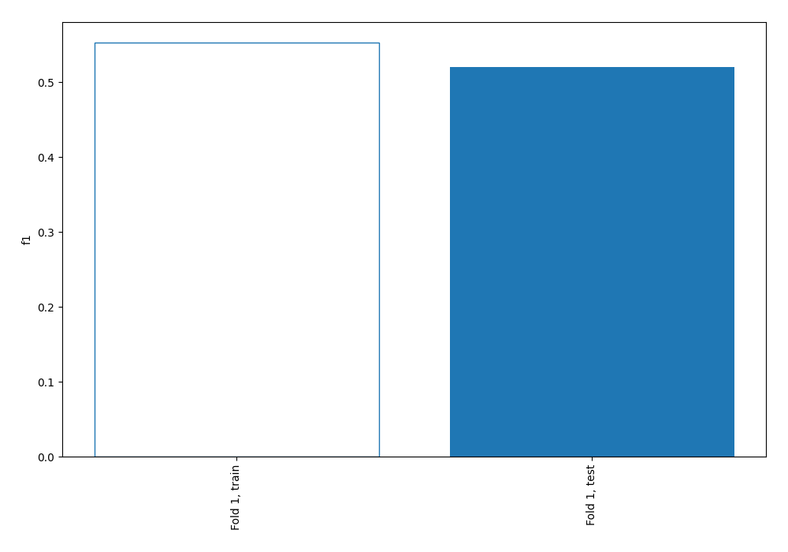
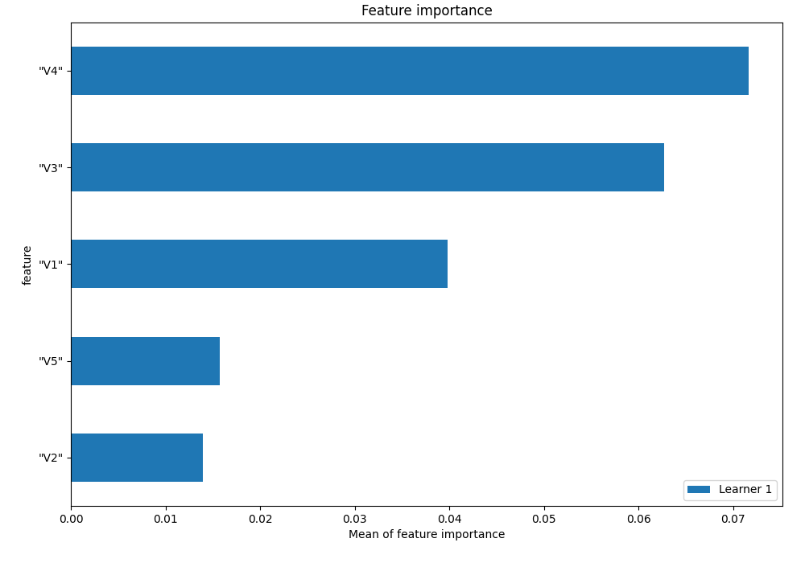
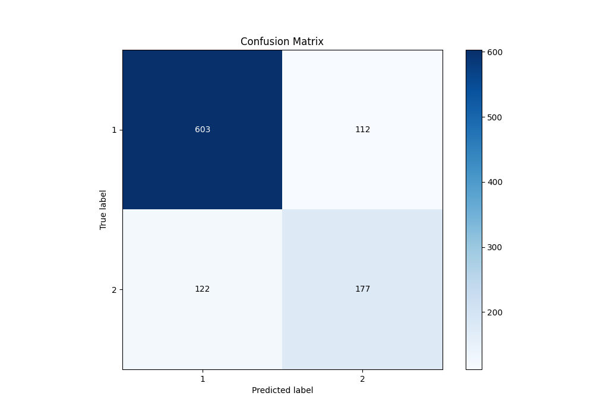
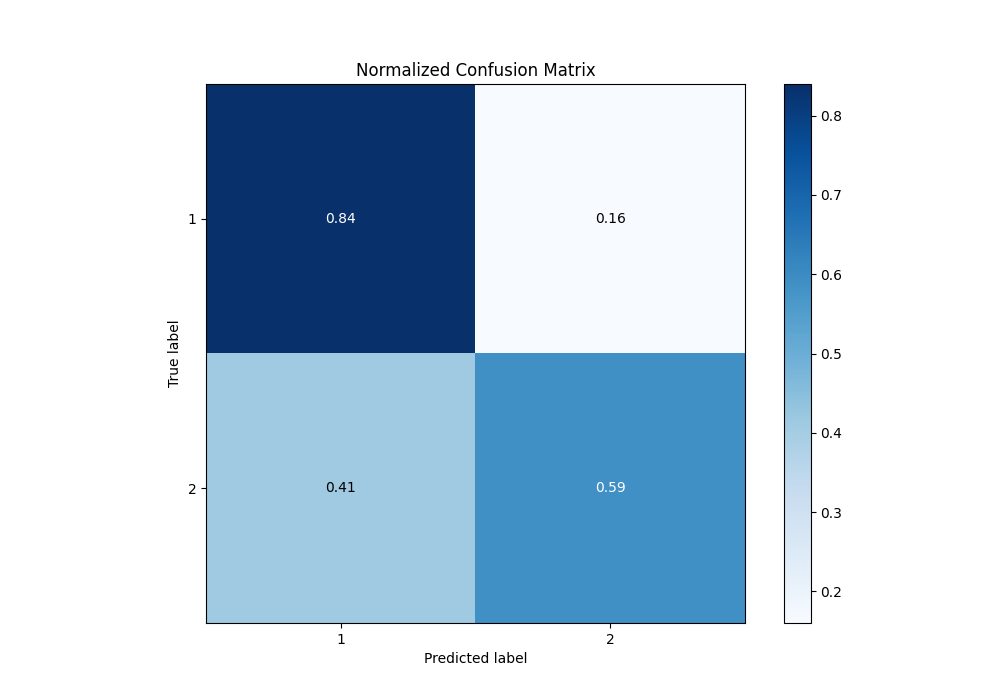
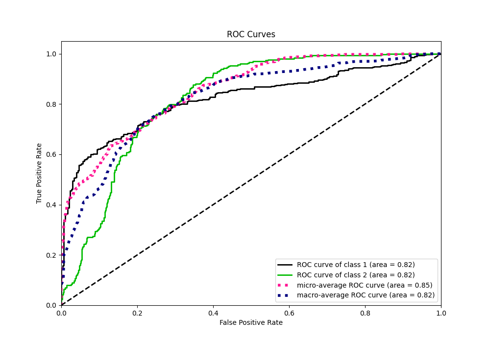
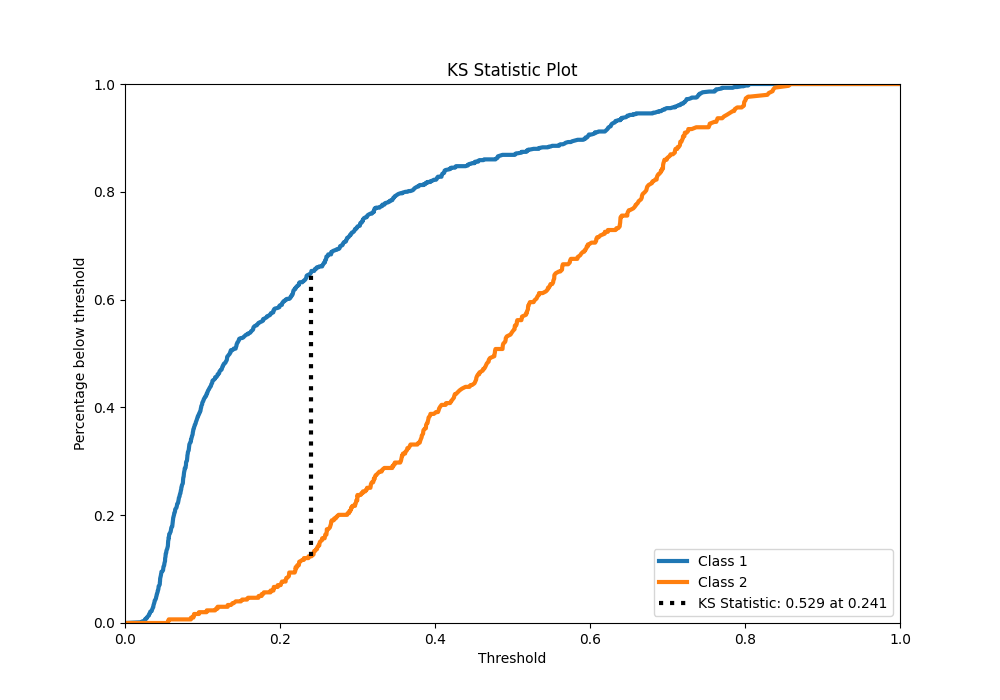
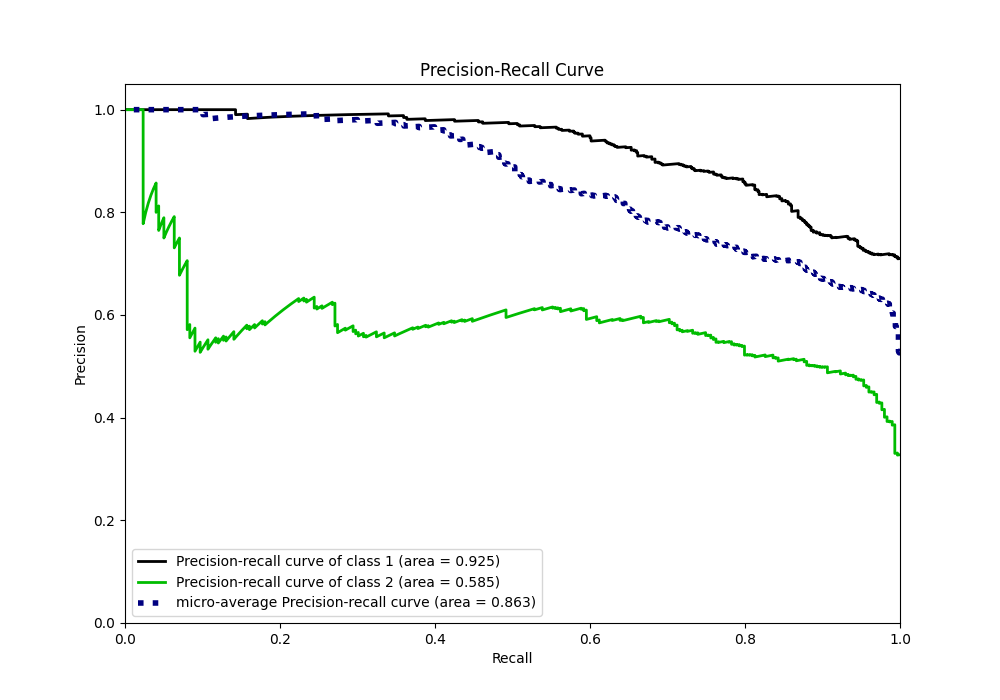
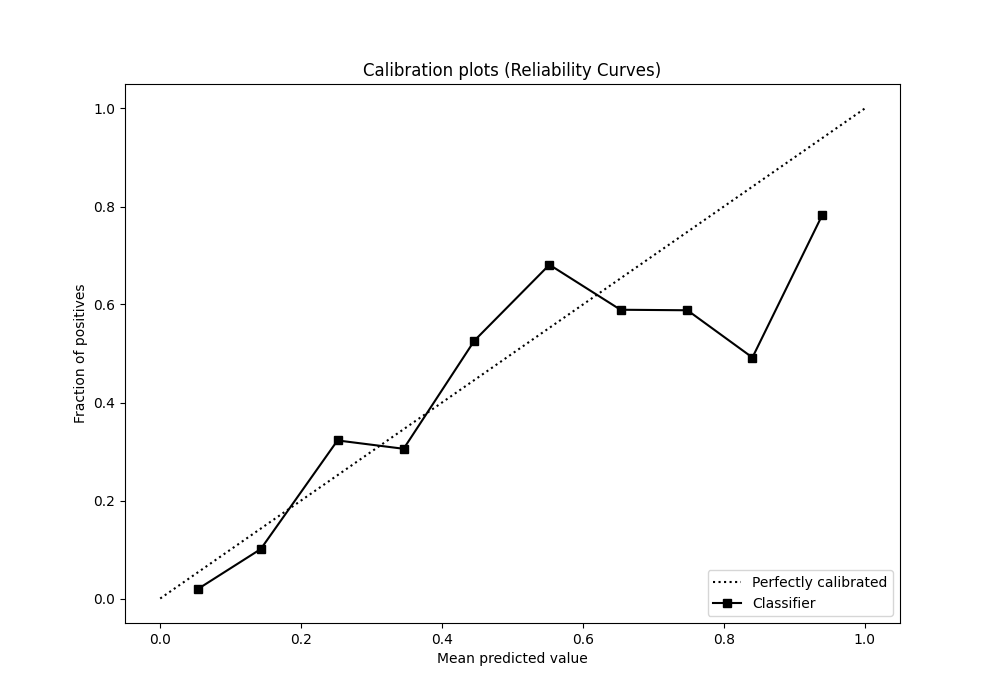
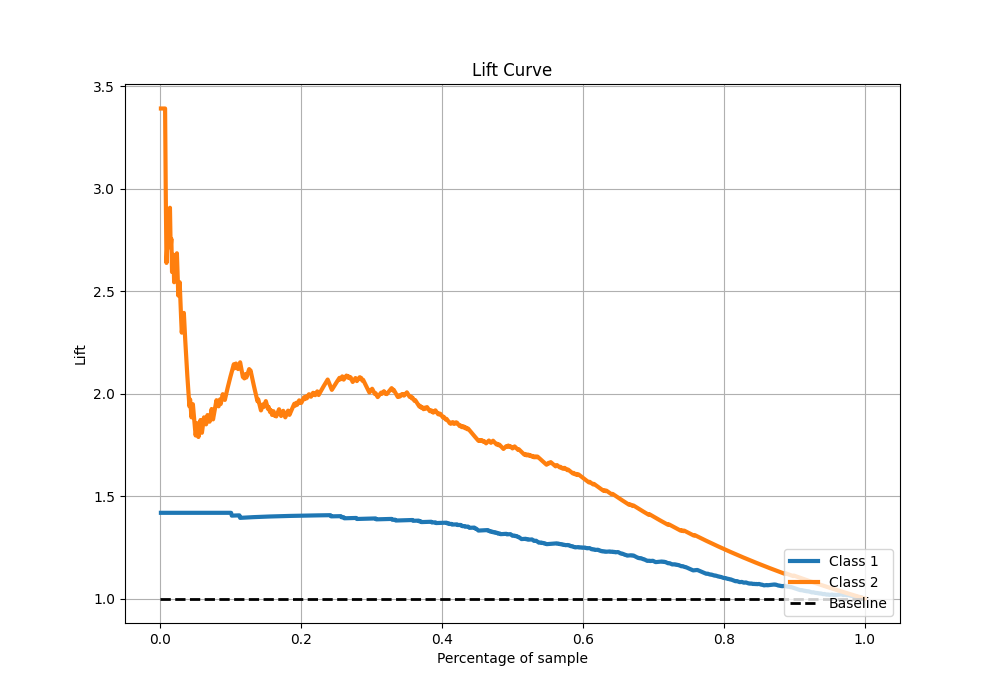

# Summary of 2_Linear

[<< Go back](../README.md)

## Logistic Regression (Linear)
- **n_jobs**: -1
- **explain_level**: 1

## Validation
 - **validation_type**: split
 - **train_ratio**: 0.75
 - **shuffle**: True
 - **stratify**: True

## Optimized metric
f1

## Training time

1.0 seconds

## Metric details
|           |    score |   threshold |
|:----------|---------:|------------:|
| logloss   | 0.46561  | nan         |
| auc       | 0.821484 | nan         |
| f1        | 0.647713 |   0.241701  |
| accuracy  | 0.769231 |   0.420469  |
| precision | 0.625    |   0.664086  |
| recall    | 1        |   0.0193922 |
| mcc       | 0.482806 |   0.241701  |

## Confusion matrix (at threshold=0.420469)
|              |   Predicted as 1 |   Predicted as 2 |
|:-------------|-----------------:|-----------------:|
| Labeled as 1 |              603 |              112 |
| Labeled as 2 |              122 |              177 |

## Learning curves

## Coefficients
| feature   |   Learner_1 |
|:----------|------------:|
| "V4"      |    0.659939 |
| "V3"      |    0.595286 |
| "V5"      |    0.276809 |
| "V2"      |   -0.323219 |
| "V1"      |   -0.526631 |
| intercept |   -1.17168  |

## Permutation-based Importance

## Confusion Matrix

## Normalized Confusion Matrix

## ROC Curve

## Kolmogorov-Smirnov Statistic

## Precision-Recall Curve

## Calibration Curve

## Cumulative Gains Curve

## Lift Curve

[<< Go back](../README.md)
