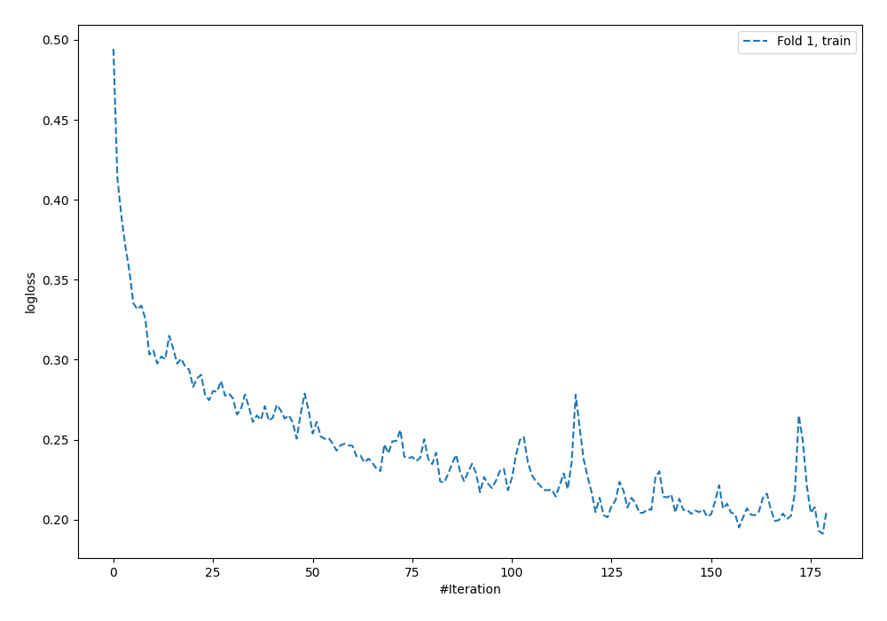
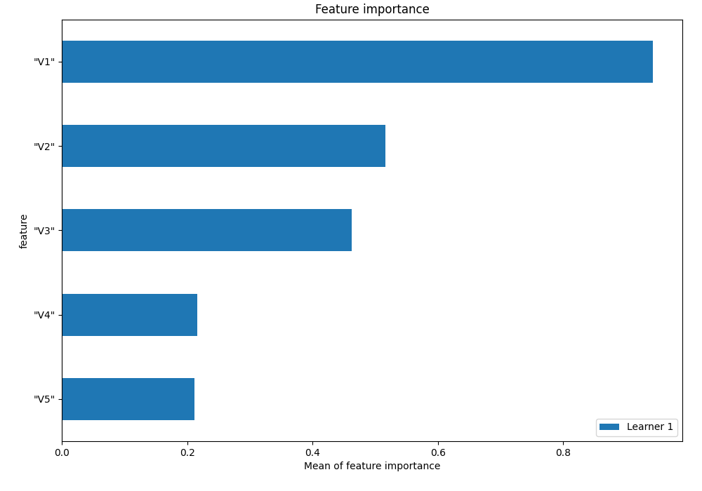
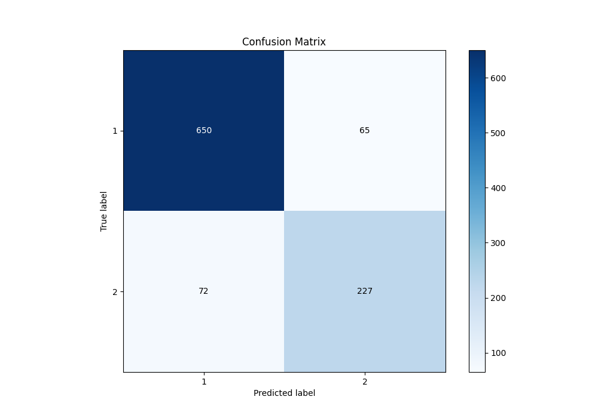
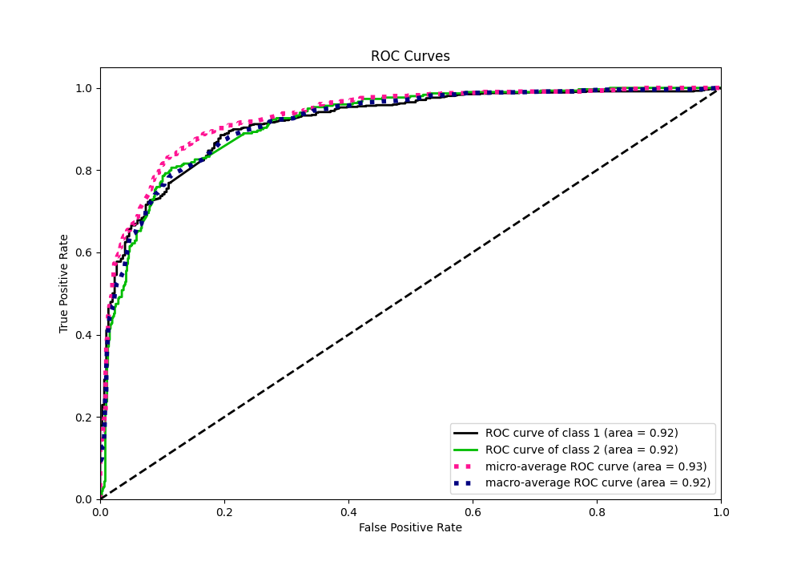
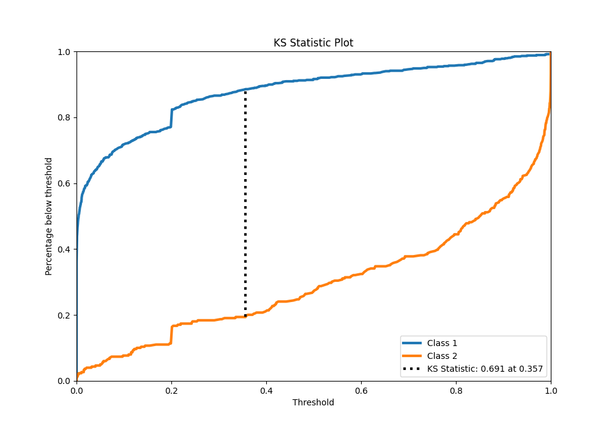
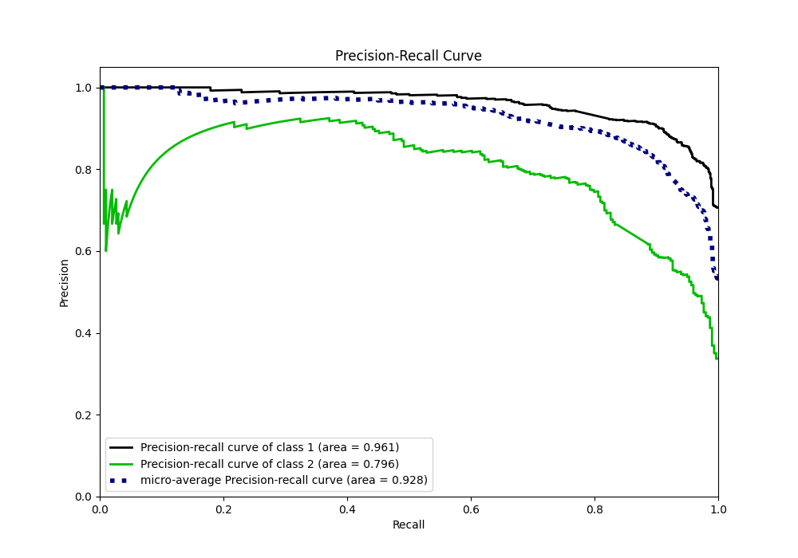
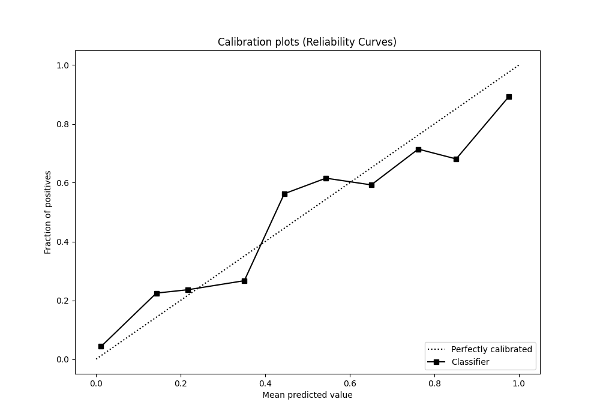
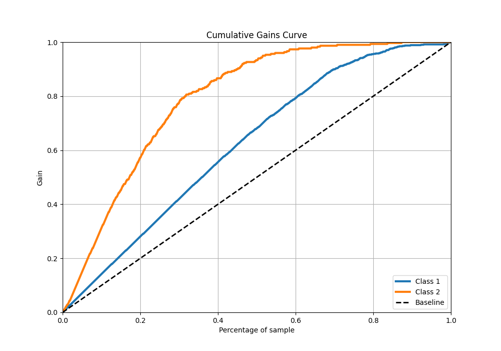
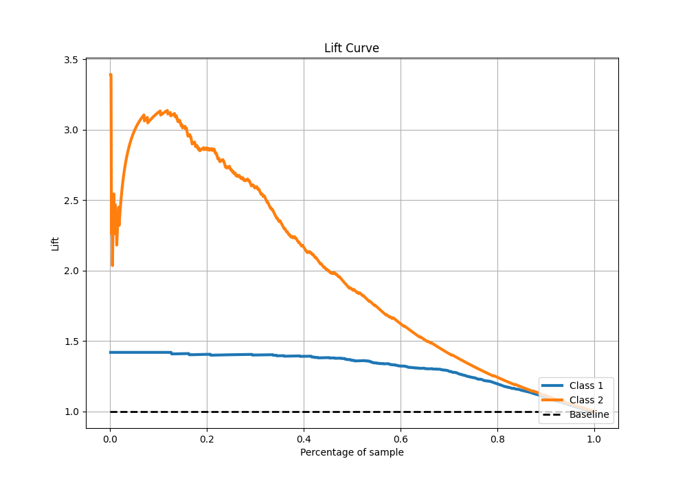

# Summary of 3_Default_NeuralNetwork

[<< Go back](../README.md)

## Neural Network
- **n_jobs**: -1
- **dense_1_size**: 32
- **dense_2_size**: 16
- **learning_rate**: 0.05
- **explain_level**: 1

## Validation
 - **validation_type**: split
 - **train_ratio**: 0.75
 - **shuffle**: True
 - **stratify**: True

## Optimized metric
f1

## Training time

2.6 seconds

## Metric details
|           |    score |     threshold |
|:----------|---------:|--------------:|
| logloss   | 0.430626 | nan           |
| auc       | 0.915195 | nan           |
| f1        | 0.77451  |   0.389462    |
| accuracy  | 0.864892 |   0.45502     |
| precision | 0.92381  |   0.970384    |
| recall    | 1        |   5.69537e-68 |
| mcc       | 0.677489 |   0.389462    |

## Confusion matrix (at threshold=0.45502)
|              |   Predicted as 1 |   Predicted as 2 |
|:-------------|-----------------:|-----------------:|
| Labeled as 1 |              650 |               65 |
| Labeled as 2 |               72 |              227 |

## Learning curves

## Permutation-based Importance

## Confusion Matrix

## Normalized Confusion Matrix

## ROC Curve

## Kolmogorov-Smirnov Statistic

## Precision-Recall Curve

## Calibration Curve

## Cumulative Gains Curve

## Lift Curve

[<< Go back](../README.md)
