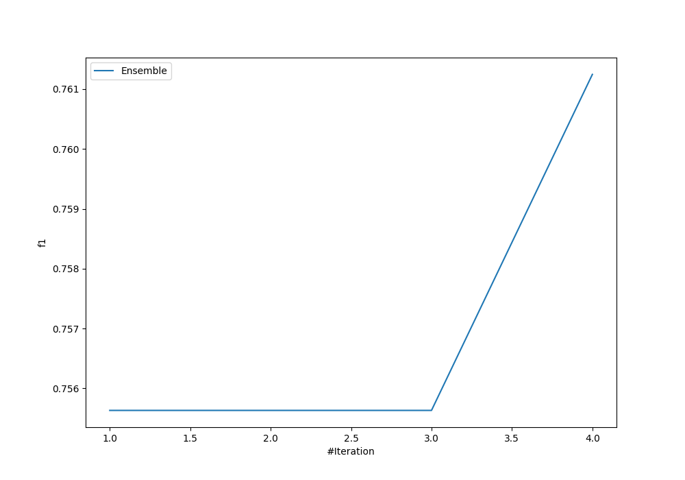
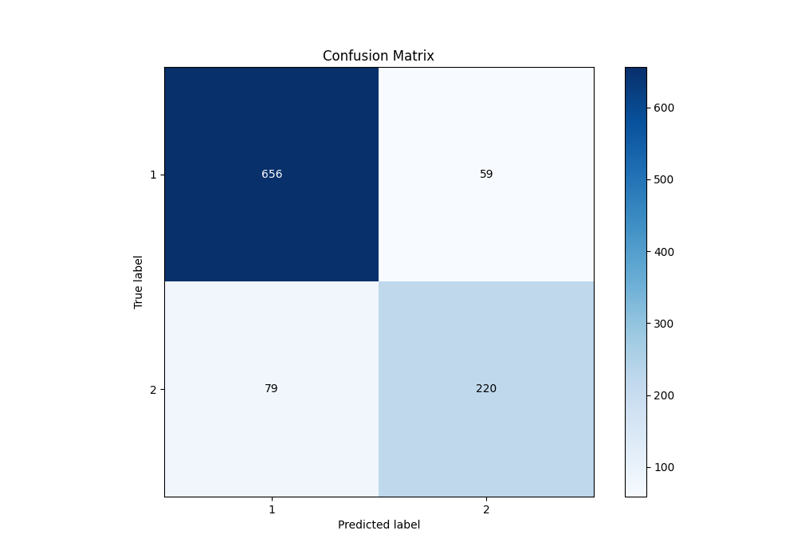
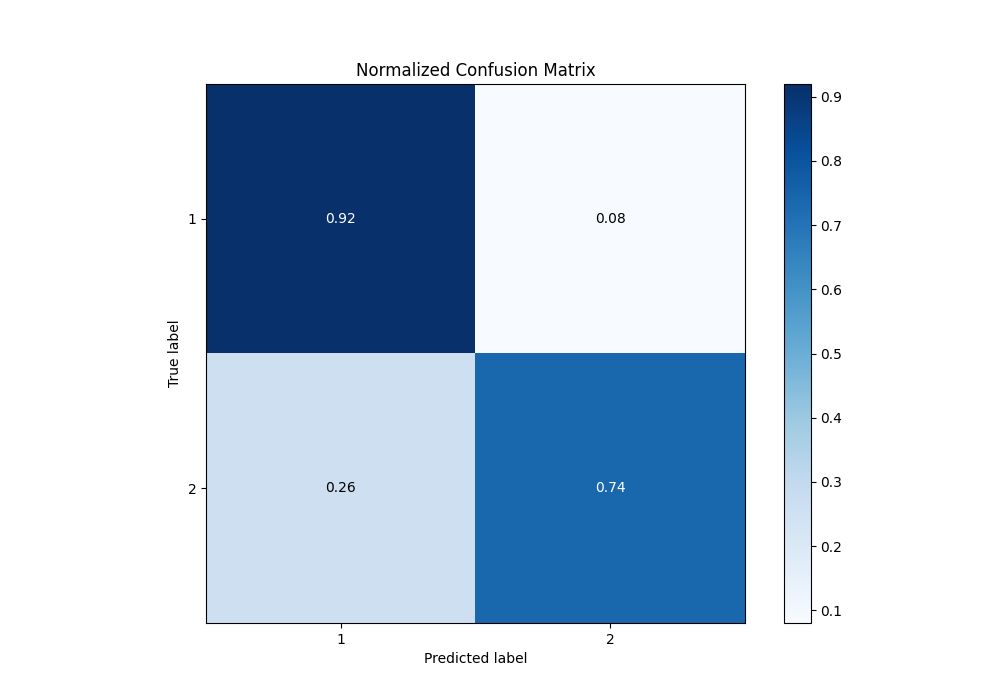
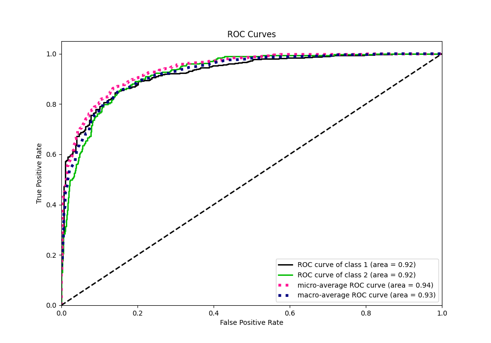
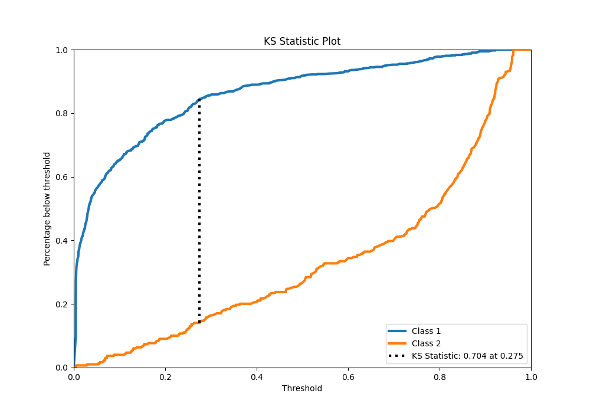
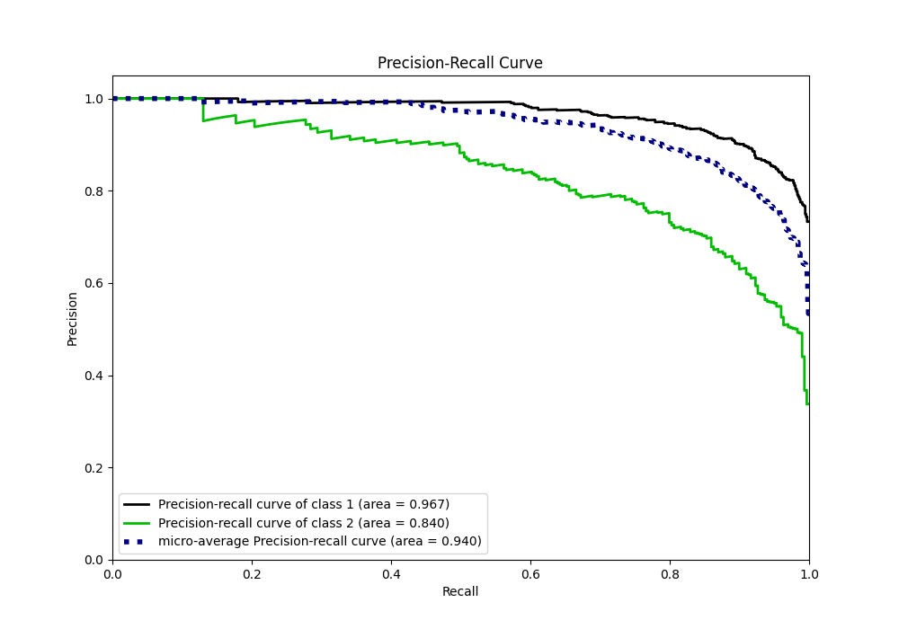
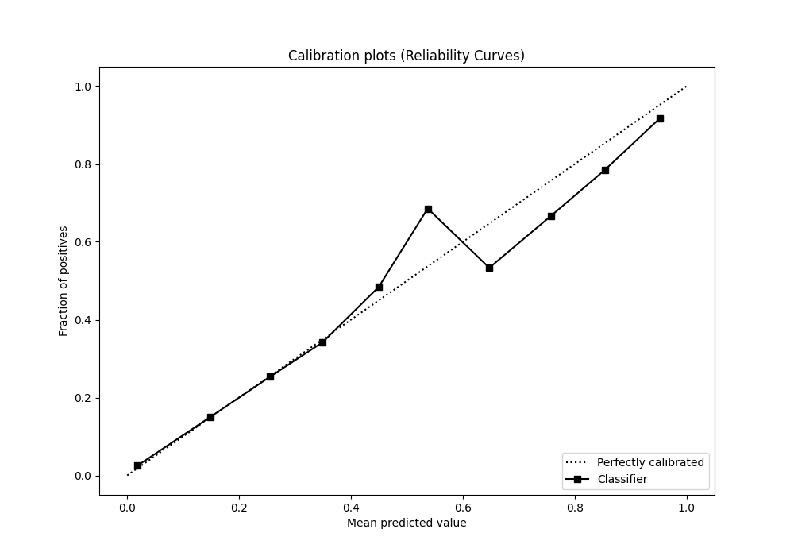
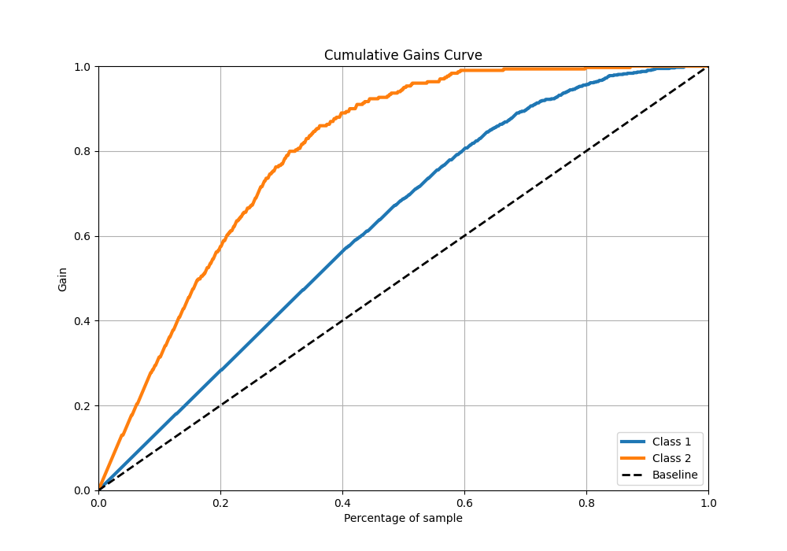
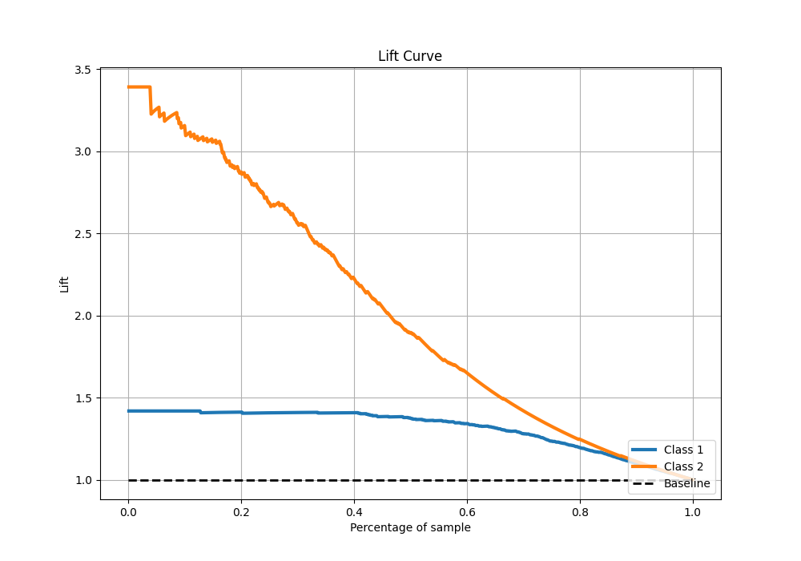

# Summary of Ensemble

[<< Go back](../README.md)

## Ensemble structure
| Model                   |   Weight |
|:------------------------|---------:|
| 3_Default_NeuralNetwork |        3 |
| 4_Default_RandomForest  |        1 |

## Metric details
|           |    score |    threshold |
|:----------|---------:|-------------:|
| logloss   | 0.315686 | nan          |
| auc       | 0.924583 | nan          |
| f1        | 0.774716 |   0.388975   |
| accuracy  | 0.863905 |   0.498832   |
| precision | 0.957447 |   0.920237   |
| recall    | 1        |   0.00400049 |
| mcc       | 0.677002 |   0.388975   |

## Confusion matrix (at threshold=0.498832)
|              |   Predicted as 1 |   Predicted as 2 |
|:-------------|-----------------:|-----------------:|
| Labeled as 1 |              656 |               59 |
| Labeled as 2 |               79 |              220 |

## Learning curves

## Confusion Matrix

## Normalized Confusion Matrix

## ROC Curve

## Kolmogorov-Smirnov Statistic

## Precision-Recall Curve

## Calibration Curve

## Cumulative Gains Curve

## Lift Curve

[<< Go back](../README.md)
