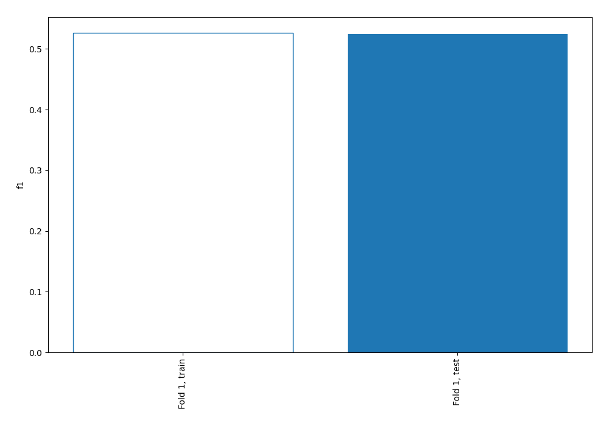
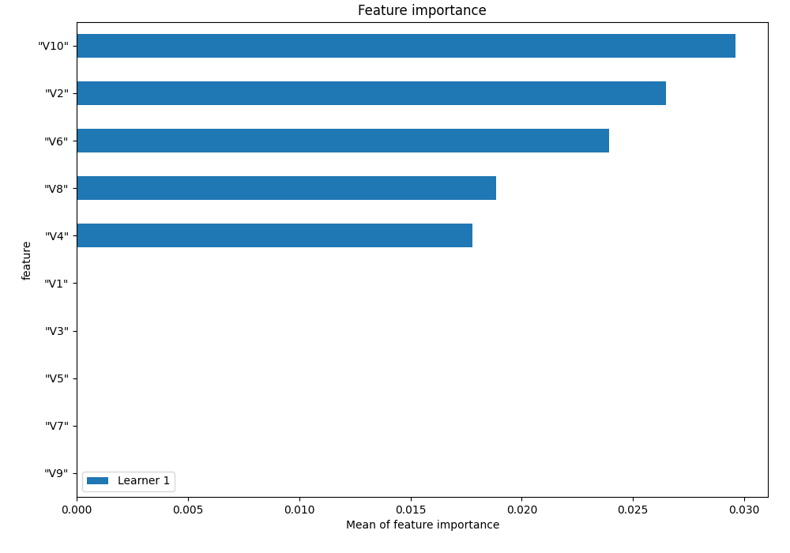
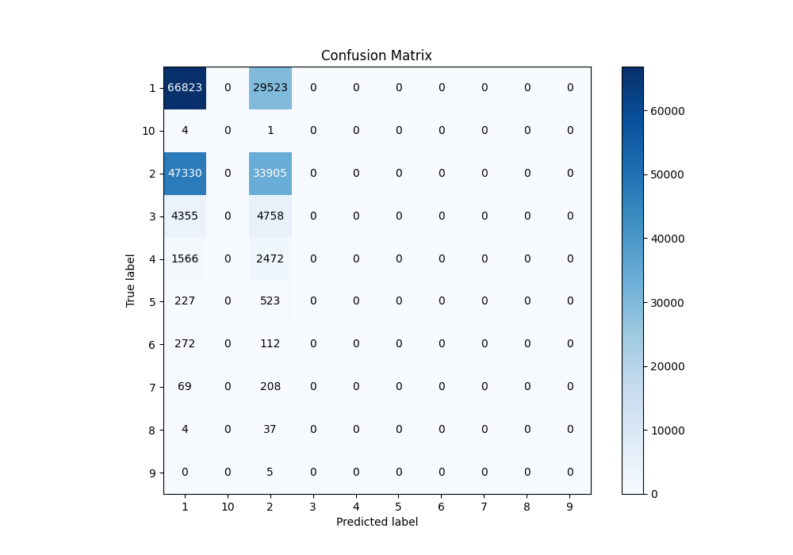
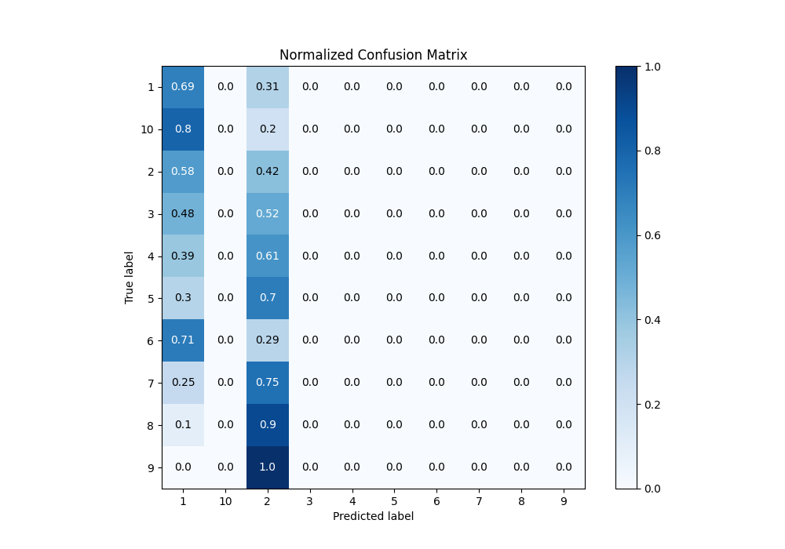
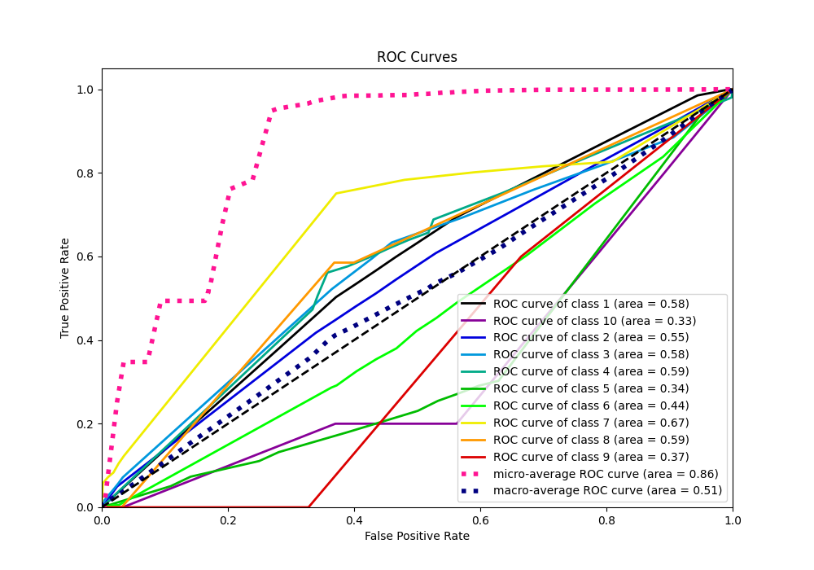
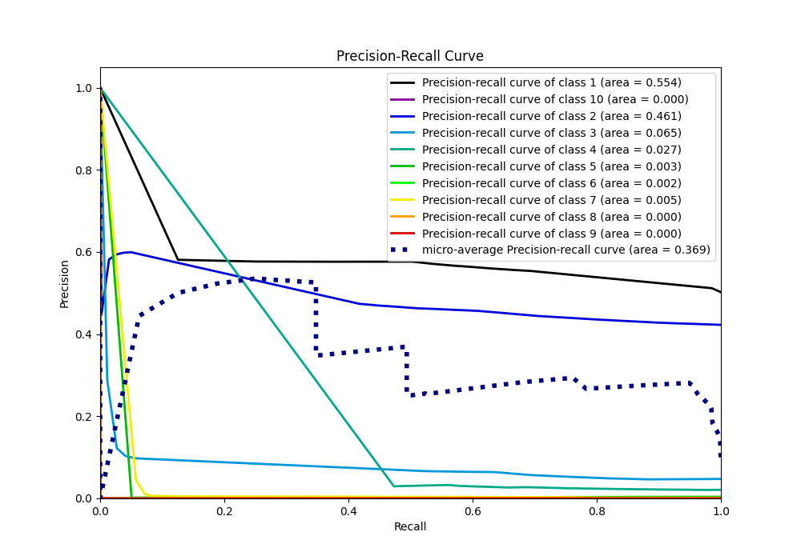

# Summary of 1_DecisionTree

[<< Go back](../README.md)

## Decision Tree
- **n_jobs**: -1
- **criterion**: entropy
- **max_depth**: 4
- **num_class**: 10
- **explain_level**: 1

## Validation
 - **validation_type**: split
 - **train_ratio**: 0.75
 - **shuffle**: True
 - **stratify**: True

## Optimized metric
f1

## Training time

100.0 seconds

### Metric details
|           |            1 |            2 |    3 |    4 |   5 |   6 |   7 |   8 |   9 |   10 |   accuracy |     macro avg |   weighted avg |   logloss |
|:----------|-------------:|-------------:|-----:|-----:|----:|----:|----:|----:|----:|-----:|-----------:|--------------:|---------------:|----------:|
| precision |     0.553858 |     0.473904 |    0 |    0 |   0 |   0 |   0 |   0 |   0 |    0 |   0.524095 |      0.102776 |       0.477953 |  0.961351 |
| recall    |     0.693573 |     0.417369 |    0 |    0 |   0 |   0 |   0 |   0 |   0 |    0 |   0.524095 |      0.111094 |       0.524095 |  0.961351 |
| f1-score  |     0.615892 |     0.443844 |    0 |    0 |   0 |   0 |   0 |   0 |   0 |    0 |   0.524095 |      0.105974 |       0.496344 |  0.961351 |
| support   | 96346        | 81235        | 9113 | 4038 | 750 | 384 | 277 |  41 |   5 |    5 |   0.524095 | 192194        |  192194        |  0.961351 |

## Confusion matrix
|               |   Predicted as 1 |   Predicted as 2 |   Predicted as 3 |   Predicted as 4 |   Predicted as 5 |   Predicted as 6 |   Predicted as 7 |   Predicted as 8 |   Predicted as 9 |   Predicted as 10 |
|:--------------|-----------------:|-----------------:|-----------------:|-----------------:|-----------------:|-----------------:|-----------------:|-----------------:|-----------------:|------------------:|
| Labeled as 1  |            66823 |            29523 |                0 |                0 |                0 |                0 |                0 |                0 |                0 |                 0 |
| Labeled as 2  |            47330 |            33905 |                0 |                0 |                0 |                0 |                0 |                0 |                0 |                 0 |
| Labeled as 3  |             4355 |             4758 |                0 |                0 |                0 |                0 |                0 |                0 |                0 |                 0 |
| Labeled as 4  |             1566 |             2472 |                0 |                0 |                0 |                0 |                0 |                0 |                0 |                 0 |
| Labeled as 5  |              227 |              523 |                0 |                0 |                0 |                0 |                0 |                0 |                0 |                 0 |
| Labeled as 6  |              272 |              112 |                0 |                0 |                0 |                0 |                0 |                0 |                0 |                 0 |
| Labeled as 7  |               69 |              208 |                0 |                0 |                0 |                0 |                0 |                0 |                0 |                 0 |
| Labeled as 8  |                4 |               37 |                0 |                0 |                0 |                0 |                0 |                0 |                0 |                 0 |
| Labeled as 9  |                0 |                5 |                0 |                0 |                0 |                0 |                0 |                0 |                0 |                 0 |
| Labeled as 10 |                4 |                1 |                0 |                0 |                0 |                0 |                0 |                0 |                0 |                 0 |

## Learning curves

## Permutation-based Importance

## Confusion Matrix

## Normalized Confusion Matrix

## ROC Curve

## Precision Recall Curve

[<< Go back](../README.md)
