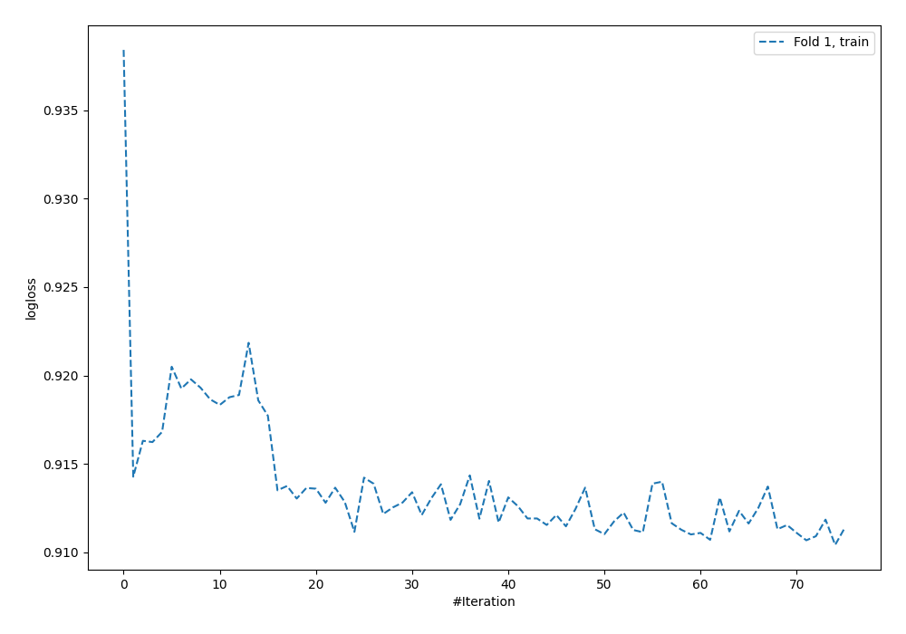
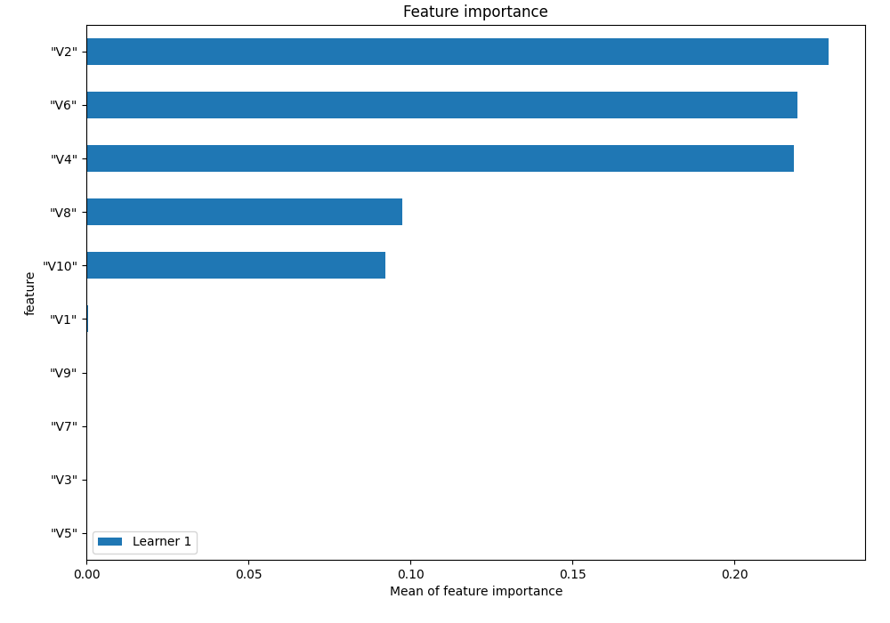
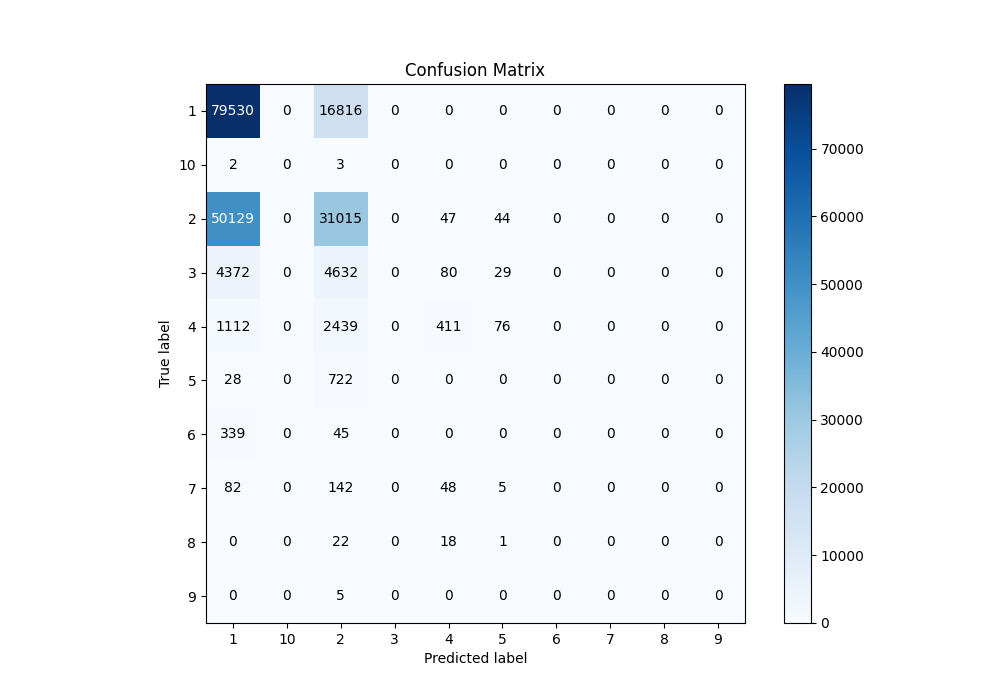
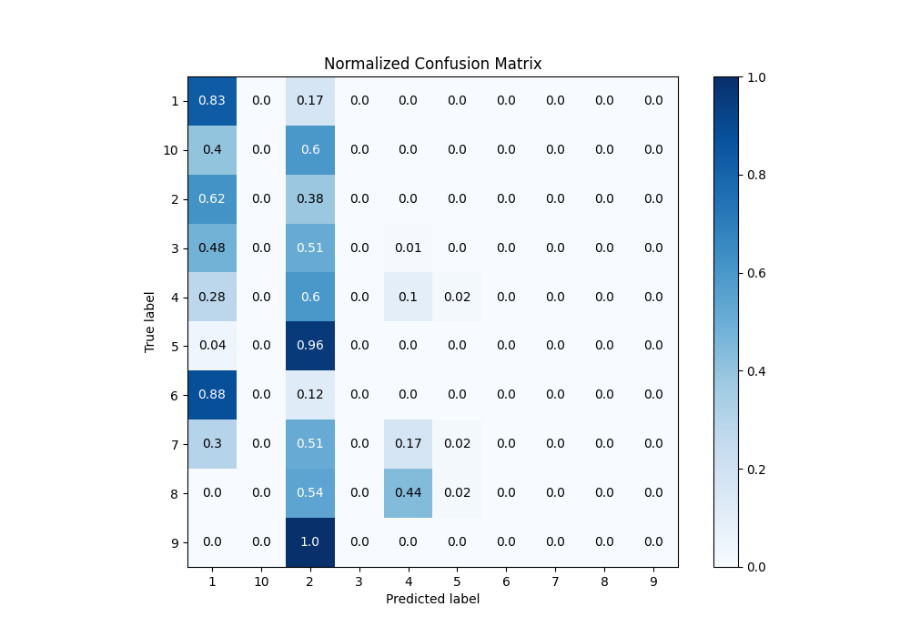
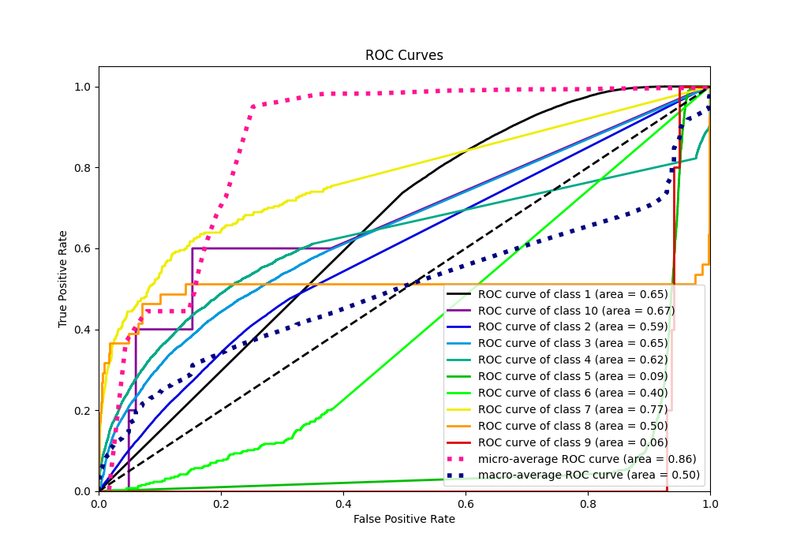
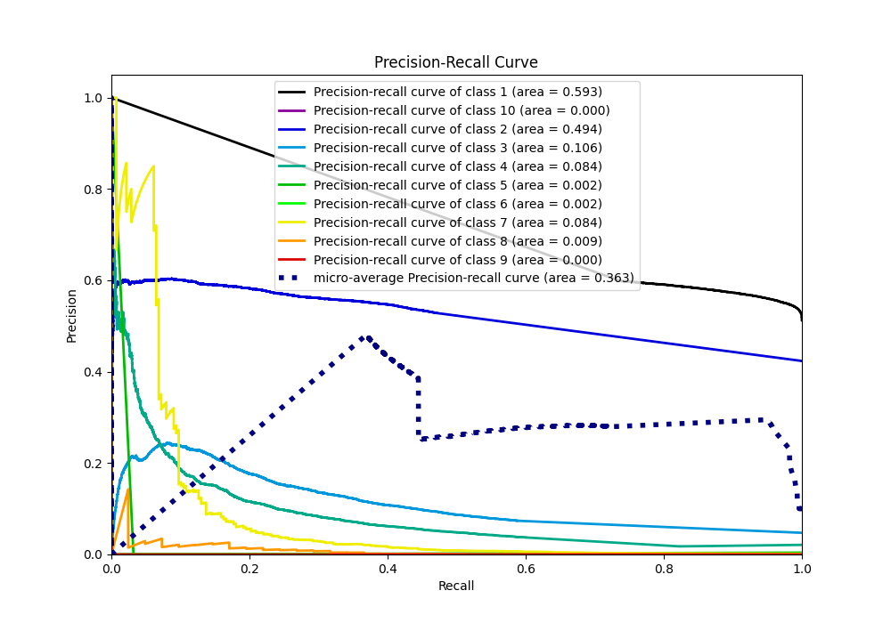

# Summary of 2_Default_NeuralNetwork

[<< Go back](../README.md)

## Neural Network
- **n_jobs**: -1
- **dense_1_size**: 32
- **dense_2_size**: 16
- **learning_rate**: 0.05
- **num_class**: 10
- **explain_level**: 1

## Validation
 - **validation_type**: split
 - **train_ratio**: 0.75
 - **shuffle**: True
 - **stratify**: True

## Optimized metric
f1

## Training time

387.0 seconds

### Metric details
|           |            1 |            2 |    3 |           4 |   5 |   6 |   7 |   8 |   9 |   10 |   accuracy |     macro avg |   weighted avg |   logloss |
|:----------|-------------:|-------------:|-----:|------------:|----:|----:|----:|----:|----:|-----:|-----------:|--------------:|---------------:|----------:|
| precision |     0.58653  |     0.555416 |    0 |    0.680464 |   0 |   0 |   0 |   0 |   0 |    0 |   0.577313 |      0.182241 |       0.54308  |   0.91294 |
| recall    |     0.825462 |     0.381794 |    0 |    0.101783 |   0 |   0 |   0 |   0 |   0 |    0 |   0.577313 |      0.130904 |       0.577313 |   0.91294 |
| f1-score  |     0.685781 |     0.452523 |    0 |    0.177079 |   0 |   0 |   0 |   0 |   0 |    0 |   0.577313 |      0.131538 |       0.538768 |   0.91294 |
| support   | 96346        | 81235        | 9113 | 4038        | 750 | 384 | 277 |  41 |   5 |    5 |   0.577313 | 192194        |  192194        |   0.91294 |

## Confusion matrix
|               |   Predicted as 1 |   Predicted as 2 |   Predicted as 3 |   Predicted as 4 |   Predicted as 5 |   Predicted as 6 |   Predicted as 7 |   Predicted as 8 |   Predicted as 9 |   Predicted as 10 |
|:--------------|-----------------:|-----------------:|-----------------:|-----------------:|-----------------:|-----------------:|-----------------:|-----------------:|-----------------:|------------------:|
| Labeled as 1  |            79530 |            16816 |                0 |                0 |                0 |                0 |                0 |                0 |                0 |                 0 |
| Labeled as 2  |            50129 |            31015 |                0 |               47 |               44 |                0 |                0 |                0 |                0 |                 0 |
| Labeled as 3  |             4372 |             4632 |                0 |               80 |               29 |                0 |                0 |                0 |                0 |                 0 |
| Labeled as 4  |             1112 |             2439 |                0 |              411 |               76 |                0 |                0 |                0 |                0 |                 0 |
| Labeled as 5  |               28 |              722 |                0 |                0 |                0 |                0 |                0 |                0 |                0 |                 0 |
| Labeled as 6  |              339 |               45 |                0 |                0 |                0 |                0 |                0 |                0 |                0 |                 0 |
| Labeled as 7  |               82 |              142 |                0 |               48 |                5 |                0 |                0 |                0 |                0 |                 0 |
| Labeled as 8  |                0 |               22 |                0 |               18 |                1 |                0 |                0 |                0 |                0 |                 0 |
| Labeled as 9  |                0 |                5 |                0 |                0 |                0 |                0 |                0 |                0 |                0 |                 0 |
| Labeled as 10 |                2 |                3 |                0 |                0 |                0 |                0 |                0 |                0 |                0 |                 0 |

## Learning curves

## Permutation-based Importance

## Confusion Matrix

## Normalized Confusion Matrix

## ROC Curve

## Precision Recall Curve

[<< Go back](../README.md)
