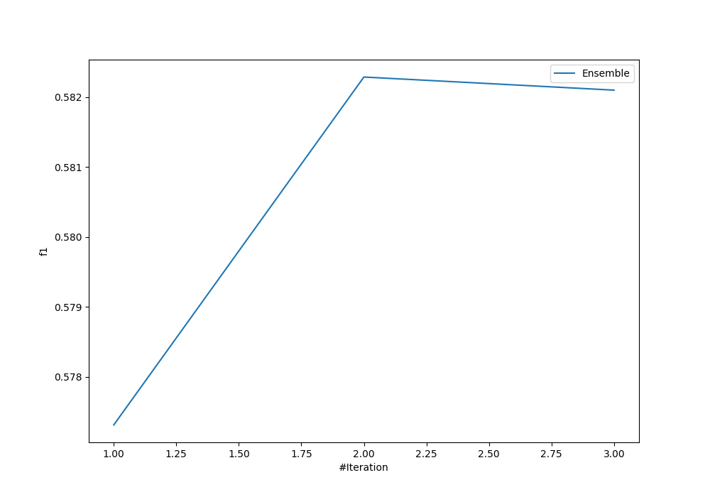
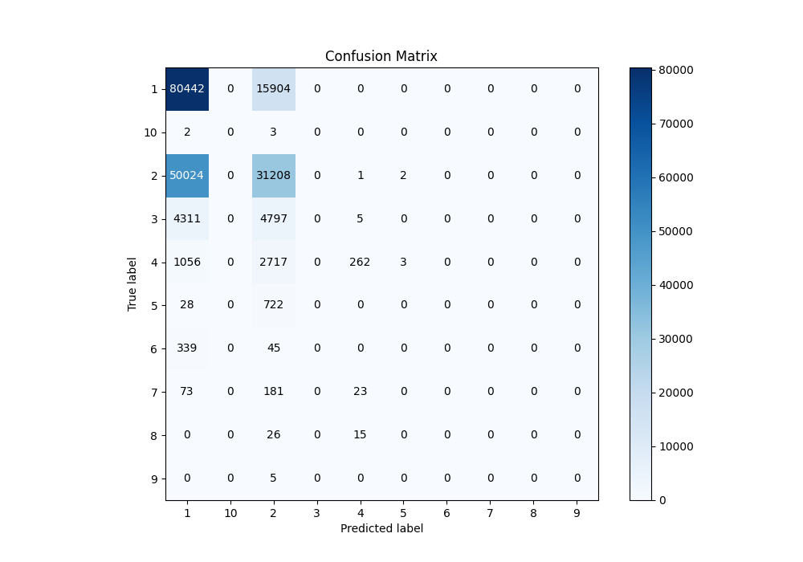
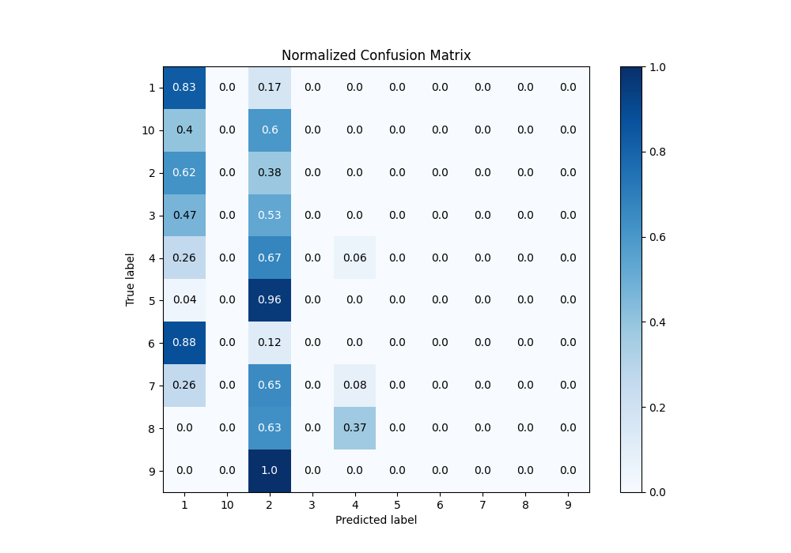
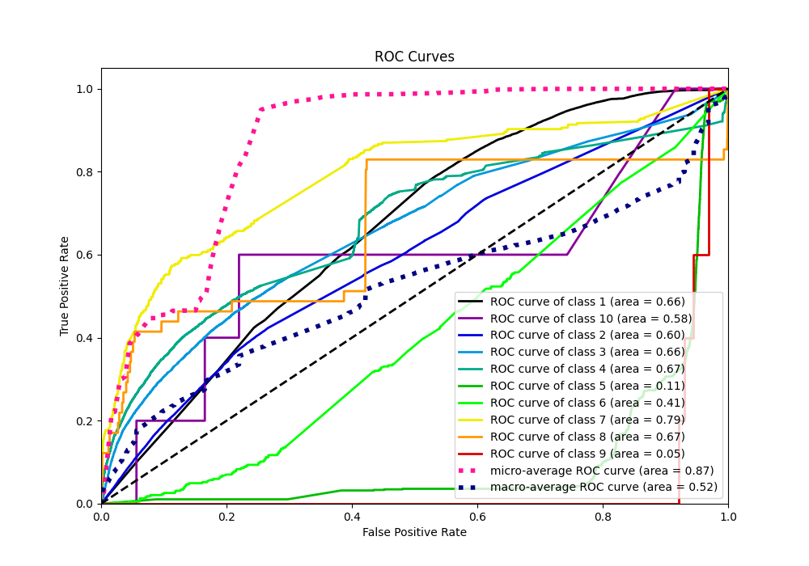
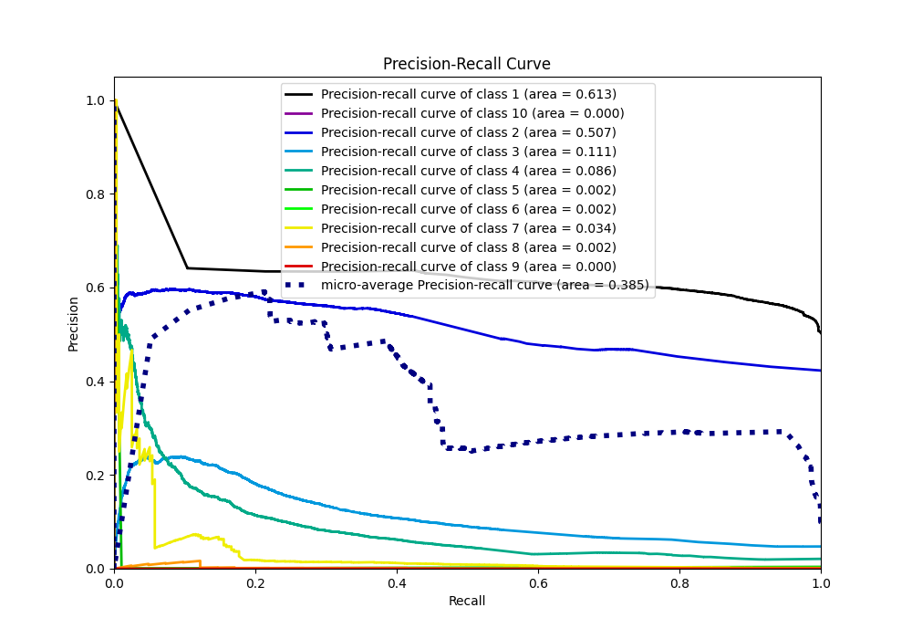

# Summary of Ensemble

[<< Go back](../README.md)

## Ensemble structure
| Model                   |   Weight |
|:------------------------|---------:|
| 1_DecisionTree          |        1 |
| 2_Default_NeuralNetwork |        1 |

### Metric details
|           |            1 |            2 |    3 |            4 |   5 |   6 |   7 |   8 |   9 |   10 |   accuracy |     macro avg |   weighted avg |   logloss |
|:----------|-------------:|-------------:|-----:|-------------:|----:|----:|----:|----:|----:|-----:|-----------:|--------------:|---------------:|----------:|
| precision |     0.590292 |     0.561214 |    0 |    0.856209  |   0 |   0 |   0 |   0 |   0 |    0 |   0.582287 |      0.200772 |       0.551109 |  0.911926 |
| recall    |     0.834928 |     0.384169 |    0 |    0.0648836 |   0 |   0 |   0 |   0 |   0 |    0 |   0.582287 |      0.128398 |       0.582287 |  0.911926 |
| f1-score  |     0.691614 |     0.456114 |    0 |    0.120626  |   0 |   0 |   0 |   0 |   0 |    0 |   0.582287 |      0.126835 |       0.542024 |  0.911926 |
| support   | 96346        | 81235        | 9113 | 4038         | 750 | 384 | 277 |  41 |   5 |    5 |   0.582287 | 192194        |  192194        |  0.911926 |

## Confusion matrix
|               |   Predicted as 1 |   Predicted as 2 |   Predicted as 3 |   Predicted as 4 |   Predicted as 5 |   Predicted as 6 |   Predicted as 7 |   Predicted as 8 |   Predicted as 9 |   Predicted as 10 |
|:--------------|-----------------:|-----------------:|-----------------:|-----------------:|-----------------:|-----------------:|-----------------:|-----------------:|-----------------:|------------------:|
| Labeled as 1  |            80442 |            15904 |                0 |                0 |                0 |                0 |                0 |                0 |                0 |                 0 |
| Labeled as 2  |            50024 |            31208 |                0 |                1 |                2 |                0 |                0 |                0 |                0 |                 0 |
| Labeled as 3  |             4311 |             4797 |                0 |                5 |                0 |                0 |                0 |                0 |                0 |                 0 |
| Labeled as 4  |             1056 |             2717 |                0 |              262 |                3 |                0 |                0 |                0 |                0 |                 0 |
| Labeled as 5  |               28 |              722 |                0 |                0 |                0 |                0 |                0 |                0 |                0 |                 0 |
| Labeled as 6  |              339 |               45 |                0 |                0 |                0 |                0 |                0 |                0 |                0 |                 0 |
| Labeled as 7  |               73 |              181 |                0 |               23 |                0 |                0 |                0 |                0 |                0 |                 0 |
| Labeled as 8  |                0 |               26 |                0 |               15 |                0 |                0 |                0 |                0 |                0 |                 0 |
| Labeled as 9  |                0 |                5 |                0 |                0 |                0 |                0 |                0 |                0 |                0 |                 0 |
| Labeled as 10 |                2 |                3 |                0 |                0 |                0 |                0 |                0 |                0 |                0 |                 0 |

## Learning curves

## Confusion Matrix

## Normalized Confusion Matrix

## ROC Curve

## Precision Recall Curve

[<< Go back](../README.md)
