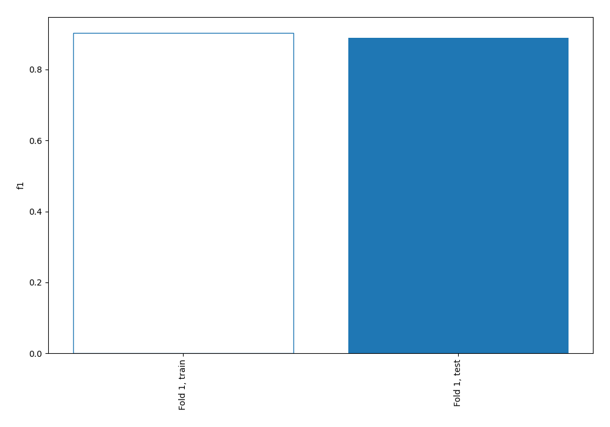
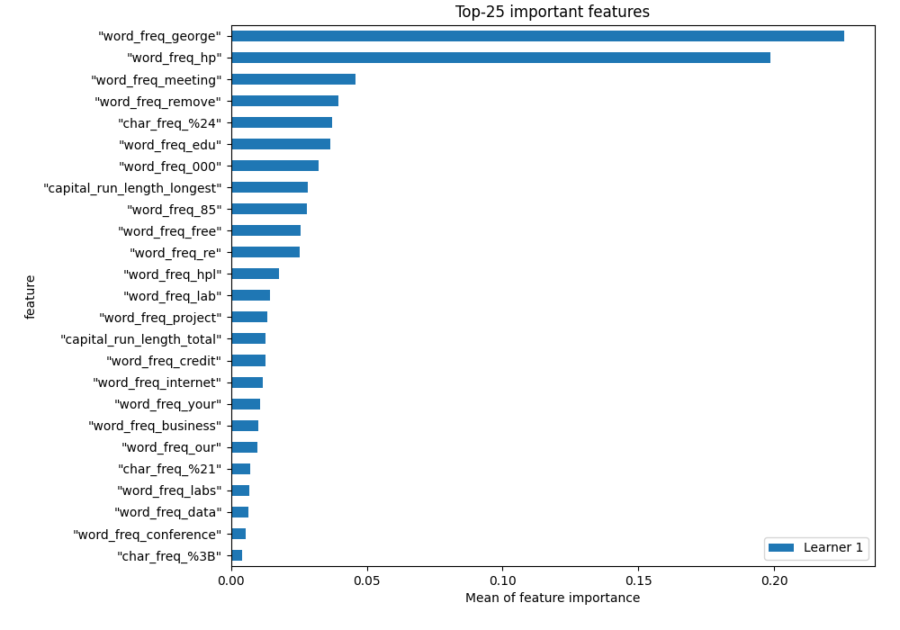
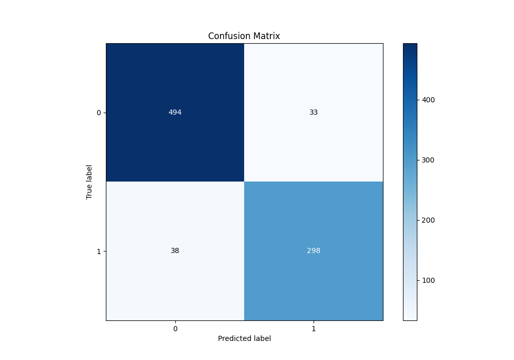
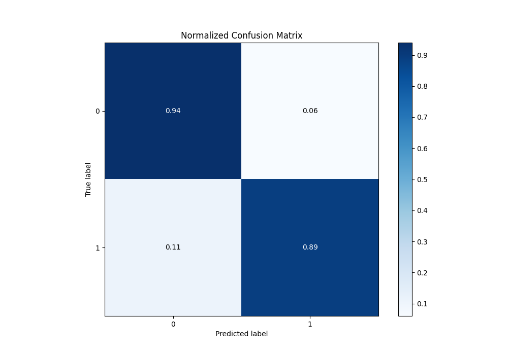
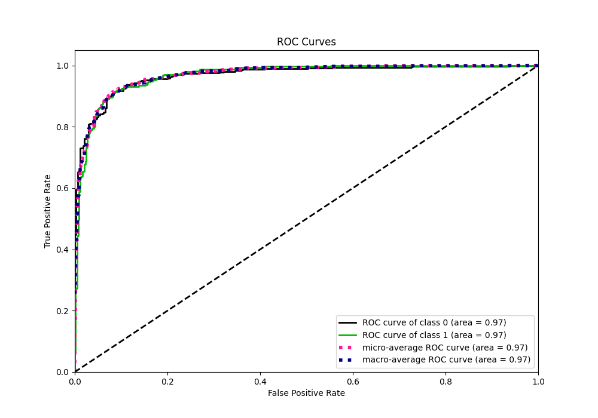
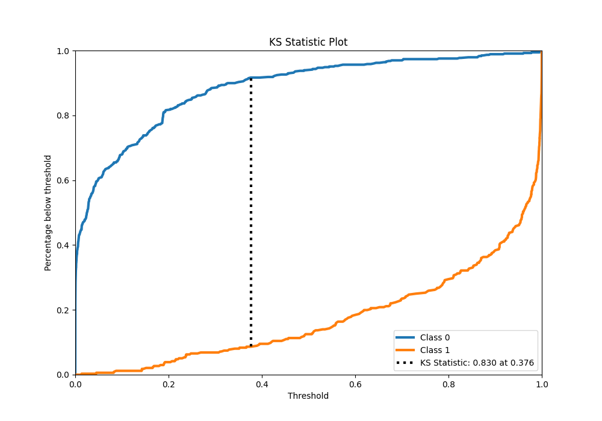
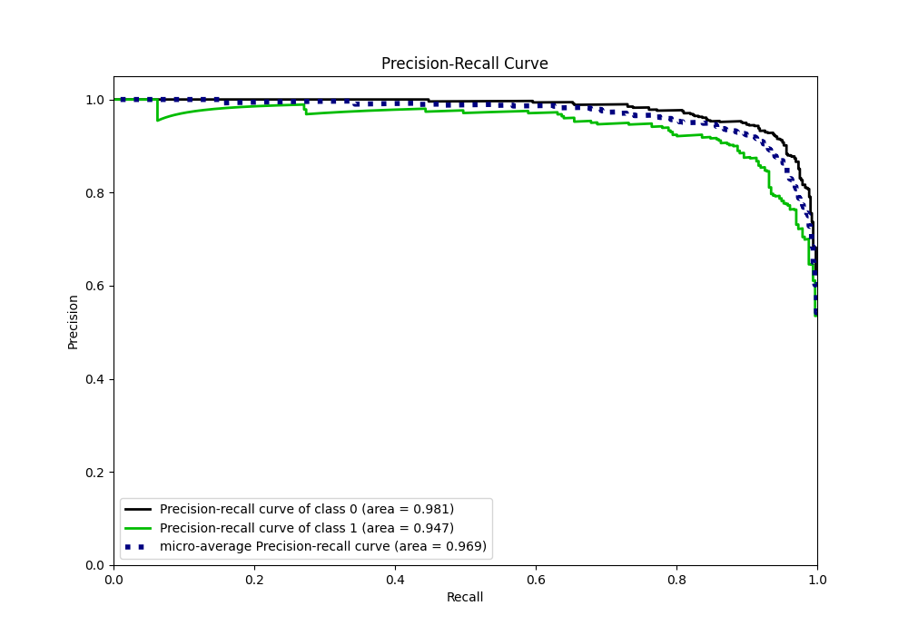
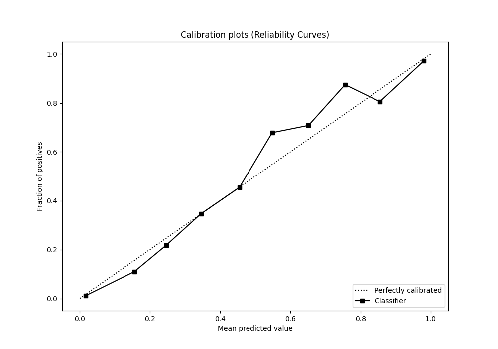
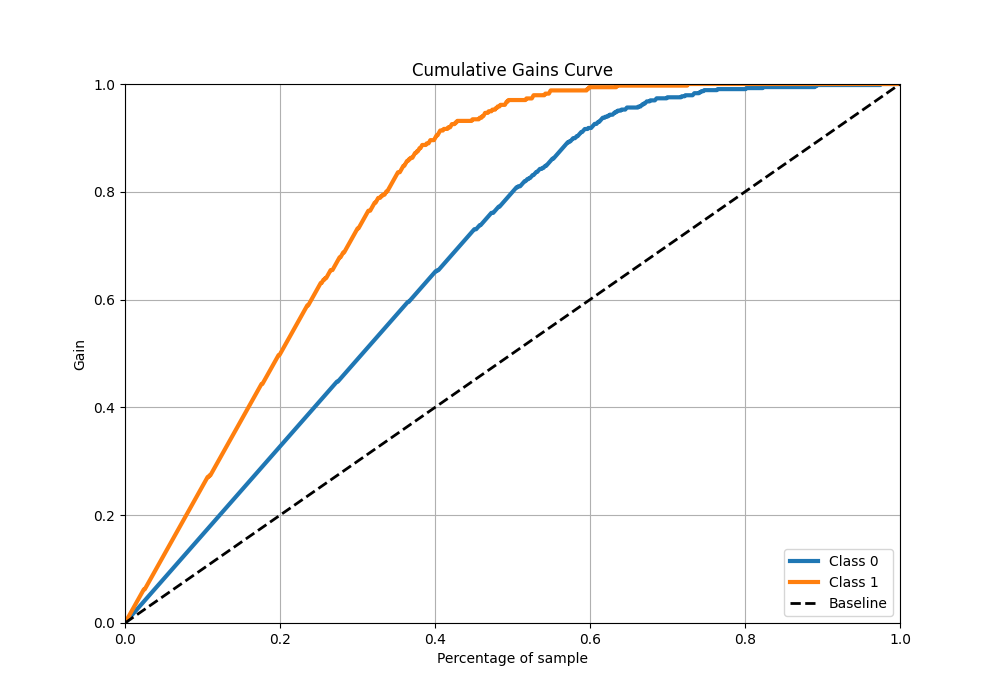
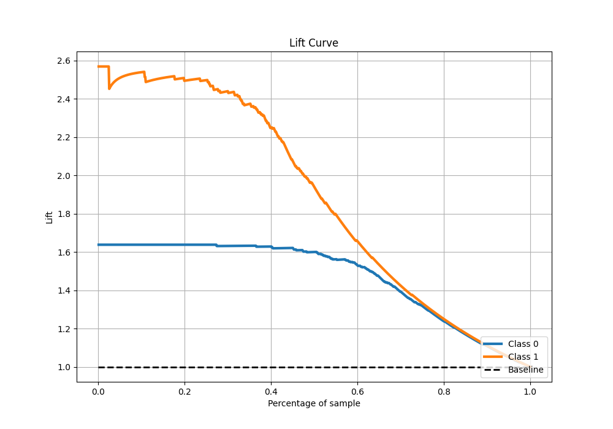

# Summary of 2_Linear

[<< Go back](../README.md)

## Logistic Regression (Linear)
- **n_jobs**: -1
- **explain_level**: 1

## Validation
 - **validation_type**: split
 - **train_ratio**: 0.75
 - **shuffle**: True
 - **stratify**: True

## Optimized metric
f1

## Training time

1.8 seconds

## Metric details
|           |    score |     threshold |
|:----------|---------:|--------------:|
| logloss   | 0.229196 | nan           |
| auc       | 0.968482 | nan           |
| f1        | 0.893741 |   0.38781     |
| accuracy  | 0.917729 |   0.482748    |
| precision | 0.985294 |   0.99747     |
| recall    | 1        |   1.67727e-22 |
| mcc       | 0.826577 |   0.482748    |

## Confusion matrix (at threshold=0.482748)
|              |   Predicted as 0 |   Predicted as 1 |
|:-------------|-----------------:|-----------------:|
| Labeled as 0 |              494 |               33 |
| Labeled as 1 |               38 |              298 |

## Learning curves

## Coefficients
| feature                      |   Learner_1 |
|:-----------------------------|------------:|
| "char_freq_%24"              |   3.88837   |
| "word_freq_remove"           |   2.47253   |
| "word_freq_000"              |   2.13756   |
| "word_freq_internet"         |   1.1165    |
| "word_freq_credit"           |   1.10296   |
| "word_freq_business"         |   1.03932   |
| "word_freq_free"             |   0.990125  |
| "capital_run_length_longest" |   0.947823  |
| "word_freq_3d"               |   0.88027   |
| "char_freq_%23"              |   0.847244  |
| "word_freq_technology"       |   0.818485  |
| "word_freq_our"              |   0.498895  |
| "word_freq_order"            |   0.484099  |
| "word_freq_over"             |   0.448041  |
| "capital_run_length_total"   |   0.441549  |
| "word_freq_parts"            |   0.426185  |
| "word_freq_money"            |   0.327413  |
| "word_freq_font"             |   0.324759  |
| "word_freq_your"             |   0.311224  |
| "word_freq_email"            |   0.288976  |
| "word_freq_report"           |   0.270836  |
| "word_freq_650"              |   0.263762  |
| "word_freq_addresses"        |   0.260066  |
| "char_freq_%21"              |   0.240231  |
| "word_freq_all"              |   0.208185  |
| "word_freq_you"              |   0.116382  |
| "word_freq_mail"             |   0.10984   |
| "word_freq_people"           |  -0.0249398 |
| "char_freq_%28"              |  -0.0447542 |
| "word_freq_will"             |  -0.0905007 |
| "word_freq_1999"             |  -0.12384   |
| "word_freq_address"          |  -0.145457  |
| "capital_run_length_average" |  -0.198028  |
| "word_freq_receive"          |  -0.20608   |
| "word_freq_857"              |  -0.369856  |
| "word_freq_make"             |  -0.409198  |
| "word_freq_pm"               |  -0.50574   |
| "word_freq_direct"           |  -0.520295  |
| "word_freq_original"         |  -0.721917  |
| "char_freq_%5B"              |  -0.730383  |
| "word_freq_415"              |  -0.746785  |
| "word_freq_data"             |  -0.758023  |
| "word_freq_re"               |  -0.844537  |
| "word_freq_labs"             |  -0.945019  |
| "word_freq_telnet"           |  -0.987732  |
| "word_freq_hpl"              |  -1.02092   |
| "word_freq_project"          |  -1.05592   |
| "word_freq_table"            |  -1.08134   |
| "char_freq_%3B"              |  -1.14812   |
| "word_freq_lab"              |  -1.19811   |
| "word_freq_cs"               |  -1.27237   |
| "word_freq_85"               |  -1.29209   |
| "word_freq_edu"              |  -1.48168   |
| "word_freq_conference"       |  -1.48355   |
| "word_freq_meeting"          |  -1.5926    |
| intercept                    |  -2.48915   |
| "word_freq_hp"               |  -2.53808   |
| "word_freq_george"           |  -3.66408   |

## Permutation-based Importance

## Confusion Matrix

## Normalized Confusion Matrix

## ROC Curve

## Kolmogorov-Smirnov Statistic

## Precision-Recall Curve

## Calibration Curve

## Cumulative Gains Curve

## Lift Curve

[<< Go back](../README.md)
