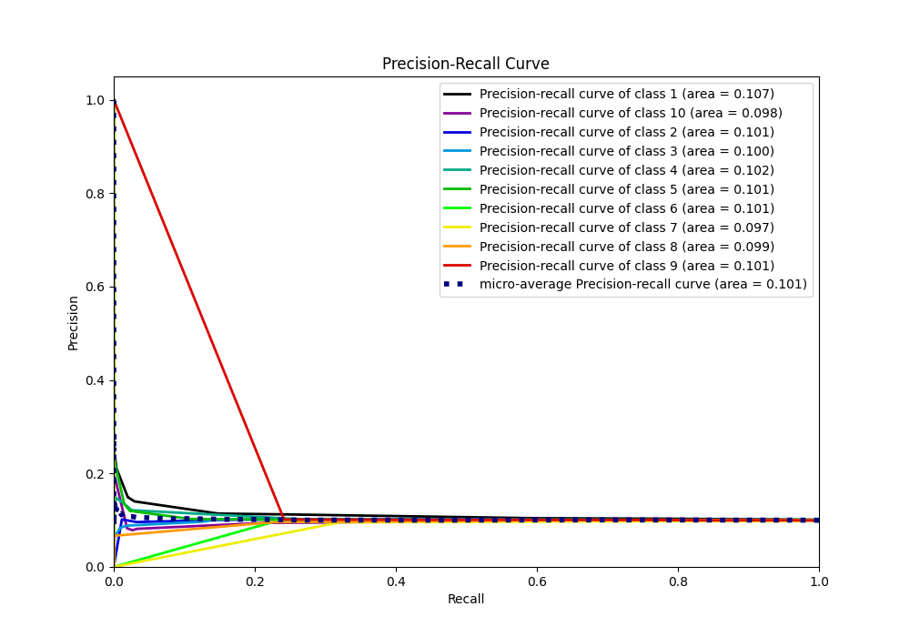

# Summary of 1_DecisionTree

[<< Go back](../README.md)

## Decision Tree
- **n_jobs**: -1
- **criterion**: entropy
- **max_depth**: 4
- **num_class**: 10
- **explain_level**: 1

## Validation
 - **validation_type**: split
 - **train_ratio**: 0.75
 - **shuffle**: True
 - **stratify**: True

## Optimized metric
f1

## Training time

42.6 seconds

### Metric details
|           |           1 |            2 |           3 |            4 |            5 |            6 |    7 |              8 |    9 |   10 |   accuracy |     macro avg |   weighted avg |   logloss |
|:----------|------------:|-------------:|------------:|-------------:|-------------:|-------------:|-----:|---------------:|-----:|-----:|-----------:|--------------:|---------------:|----------:|
| precision |    0.102348 |    0.0941541 |    0.122534 |    0.112016  |    0.0992116 |    0.096934  |    0 |    0.0909091   |    0 |    0 |   0.100383 |     0.0718107 |      0.0720529 |   2.30382 |
| recall    |    0.445759 |    0.171948  |    0.04154  |    0.0111178 |    0.243401  |    0.0828796 |    0 |    0.000203046 |    0 |    0 |   0.100383 |     0.0996848 |      0.100383  |   2.30382 |
| f1-score  |    0.166473 |    0.12168   |    0.062046 |    0.020228  |    0.140965  |    0.0893575 |    0 |    0.000405186 |    0 |    0 |   0.100383 |     0.0601155 |      0.060455  |   2.30382 |
| support   | 4987        | 4955         | 4935        | 4947         | 4963         | 4959         | 4858 | 4925           | 4903 | 4929 |   0.100383 | 49361         |  49361         |   2.30382 |

## Confusion matrix
|               |   Predicted as 1 |   Predicted as 2 |   Predicted as 3 |   Predicted as 4 |   Predicted as 5 |   Predicted as 6 |   Predicted as 7 |   Predicted as 8 |   Predicted as 9 |   Predicted as 10 |
|:--------------|-----------------:|-----------------:|-----------------:|-----------------:|-----------------:|-----------------:|-----------------:|-----------------:|-----------------:|------------------:|
| Labeled as 1  |             2223 |              903 |              181 |               68 |             1145 |              465 |                0 |                2 |                0 |                 0 |
| Labeled as 2  |             2211 |              852 |              161 |               54 |             1232 |              444 |                0 |                1 |                0 |                 0 |
| Labeled as 3  |             2135 |              919 |              205 |               41 |             1207 |              427 |                0 |                1 |                0 |                 0 |
| Labeled as 4  |             2165 |              914 |              142 |               55 |             1242 |              428 |                0 |                1 |                0 |                 0 |
| Labeled as 5  |             2185 |              937 |              154 |               55 |             1208 |              422 |                0 |                2 |                0 |                 0 |
| Labeled as 6  |             2202 |              897 |              154 |               52 |             1242 |              411 |                0 |                1 |                0 |                 0 |
| Labeled as 7  |             2095 |              889 |              205 |               44 |             1220 |              405 |                0 |                0 |                0 |                 0 |
| Labeled as 8  |             2187 |              955 |              160 |               40 |             1169 |              412 |                1 |                1 |                0 |                 0 |
| Labeled as 9  |             2134 |              905 |              177 |               41 |             1231 |              415 |                0 |                0 |                0 |                 0 |
| Labeled as 10 |             2183 |              878 |              134 |               41 |             1280 |              411 |                0 |                2 |                0 |                 0 |

## Learning curves

## Permutation-based Importance

## Confusion Matrix

## Normalized Confusion Matrix

## ROC Curve

## Precision Recall Curve

[<< Go back](../README.md)
