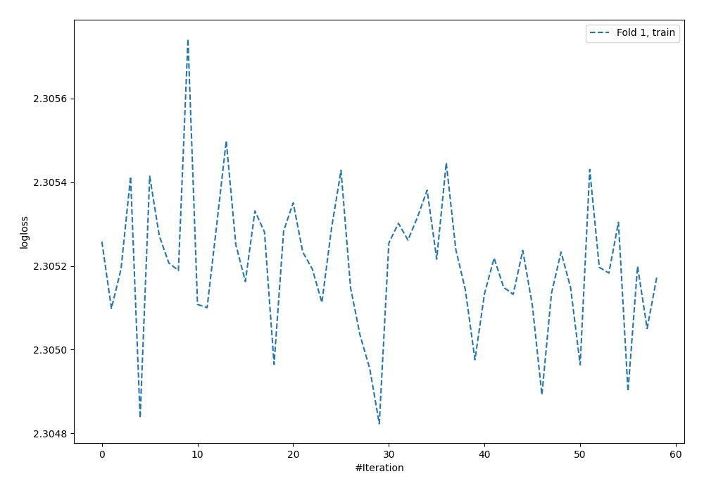
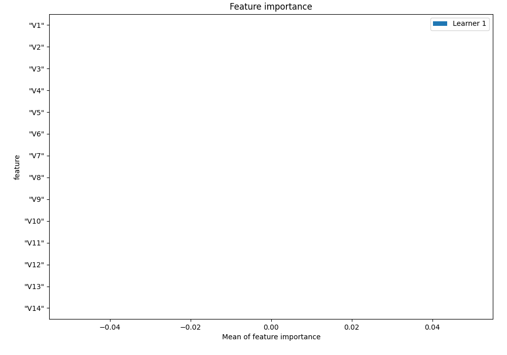
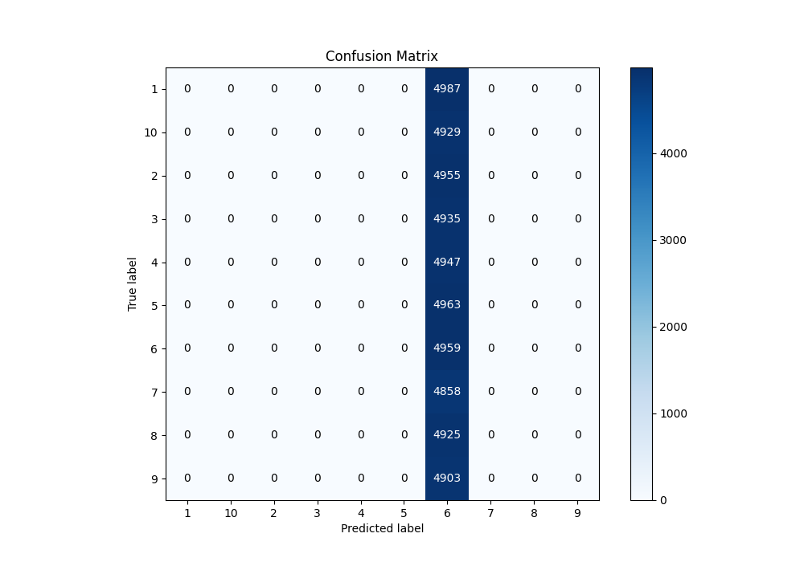
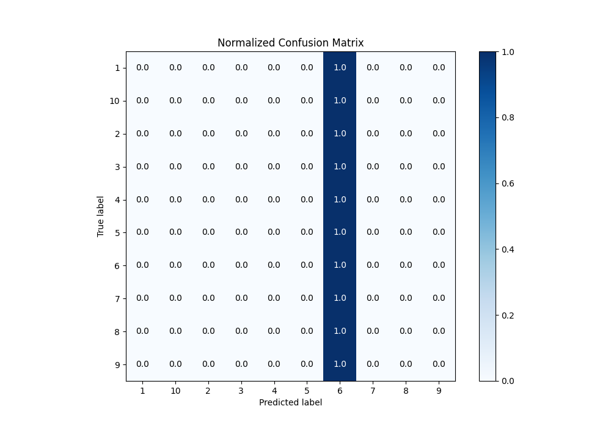
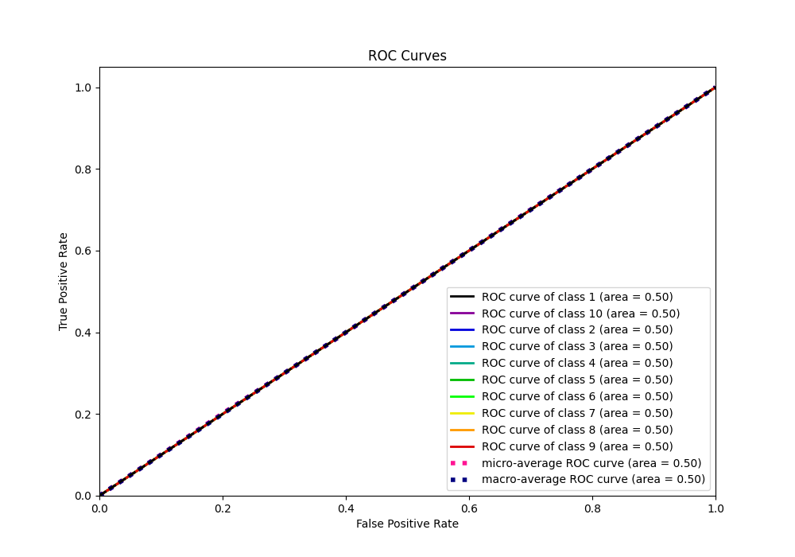
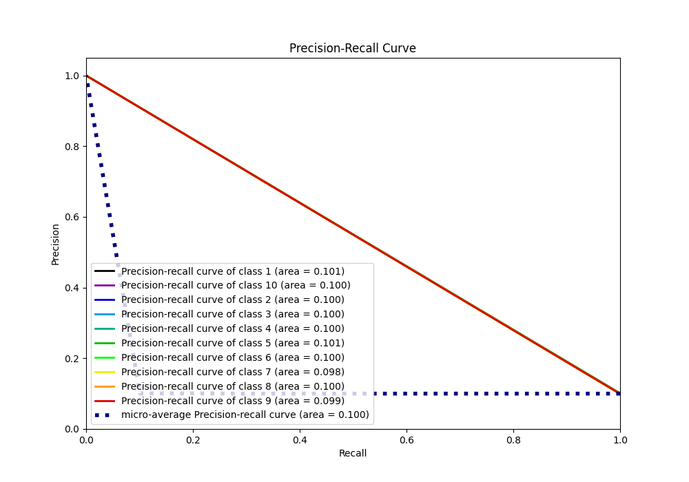

# Summary of 2_Default_NeuralNetwork

[<< Go back](../README.md)

## Neural Network
- **n_jobs**: -1
- **dense_1_size**: 32
- **dense_2_size**: 16
- **learning_rate**: 0.05
- **num_class**: 10
- **explain_level**: 1

## Validation
 - **validation_type**: split
 - **train_ratio**: 0.75
 - **shuffle**: True
 - **stratify**: True

## Optimized metric
f1

## Training time

80.1 seconds

### Metric details
|           |    1 |    2 |    3 |    4 |    5 |           6 |    7 |    8 |    9 |   10 |   accuracy |     macro avg |   weighted avg |   logloss |
|:----------|-----:|-----:|-----:|-----:|-----:|------------:|-----:|-----:|-----:|-----:|-----------:|--------------:|---------------:|----------:|
| precision |    0 |    0 |    0 |    0 |    0 |    0.100464 |    0 |    0 |    0 |    0 |   0.100464 |     0.0100464 |      0.010093  |   2.30466 |
| recall    |    0 |    0 |    0 |    0 |    0 |    1        |    0 |    0 |    0 |    0 |   0.100464 |     0.1       |      0.100464  |   2.30466 |
| f1-score  |    0 |    0 |    0 |    0 |    0 |    0.182585 |    0 |    0 |    0 |    0 |   0.100464 |     0.0182585 |      0.0183432 |   2.30466 |
| support   | 4987 | 4955 | 4935 | 4947 | 4963 | 4959        | 4858 | 4925 | 4903 | 4929 |   0.100464 | 49361         |  49361         |   2.30466 |

## Confusion matrix
|               |   Predicted as 1 |   Predicted as 2 |   Predicted as 3 |   Predicted as 4 |   Predicted as 5 |   Predicted as 6 |   Predicted as 7 |   Predicted as 8 |   Predicted as 9 |   Predicted as 10 |
|:--------------|-----------------:|-----------------:|-----------------:|-----------------:|-----------------:|-----------------:|-----------------:|-----------------:|-----------------:|------------------:|
| Labeled as 1  |                0 |                0 |                0 |                0 |                0 |             4987 |                0 |                0 |                0 |                 0 |
| Labeled as 2  |                0 |                0 |                0 |                0 |                0 |             4955 |                0 |                0 |                0 |                 0 |
| Labeled as 3  |                0 |                0 |                0 |                0 |                0 |             4935 |                0 |                0 |                0 |                 0 |
| Labeled as 4  |                0 |                0 |                0 |                0 |                0 |             4947 |                0 |                0 |                0 |                 0 |
| Labeled as 5  |                0 |                0 |                0 |                0 |                0 |             4963 |                0 |                0 |                0 |                 0 |
| Labeled as 6  |                0 |                0 |                0 |                0 |                0 |             4959 |                0 |                0 |                0 |                 0 |
| Labeled as 7  |                0 |                0 |                0 |                0 |                0 |             4858 |                0 |                0 |                0 |                 0 |
| Labeled as 8  |                0 |                0 |                0 |                0 |                0 |             4925 |                0 |                0 |                0 |                 0 |
| Labeled as 9  |                0 |                0 |                0 |                0 |                0 |             4903 |                0 |                0 |                0 |                 0 |
| Labeled as 10 |                0 |                0 |                0 |                0 |                0 |             4929 |                0 |                0 |                0 |                 0 |

## Learning curves

## Permutation-based Importance

## Confusion Matrix

## Normalized Confusion Matrix

## ROC Curve

## Precision Recall Curve

[<< Go back](../README.md)
