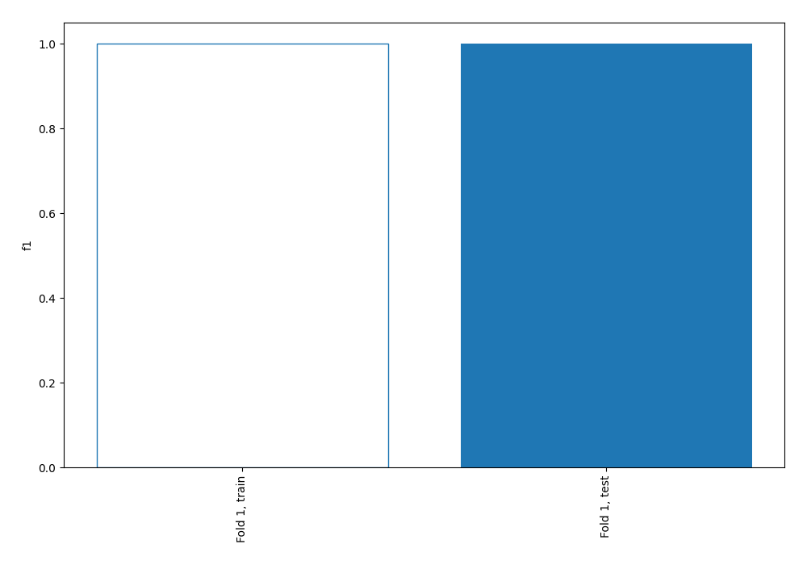

# Summary of 2_Linear

[<< Go back](../README.md)

## Logistic Regression (Linear)
- **n_jobs**: -1
- **explain_level**: 1

## Validation
 - **validation_type**: split
 - **train_ratio**: 0.75
 - **shuffle**: True
 - **stratify**: True

## Optimized metric
f1

## Training time

1.4 seconds

## Metric details
|           |     score |    threshold |
|:----------|----------:|-------------:|
| logloss   | 0.0582282 | nan          |
| auc       | 1         | nan          |
| f1        | 1         |   0.50277    |
| accuracy  | 1         |   0.50277    |
| precision | 1         |   0.50277    |
| recall    | 1         |   0.00438791 |
| mcc       | 1         |   0.50277    |

## Confusion matrix (at threshold=0.50277)
|              |   Predicted as 1 |   Predicted as 2 |
|:-------------|-----------------:|-----------------:|
| Labeled as 1 |              237 |                0 |
| Labeled as 2 |                0 |              127 |

## Learning curves

## Coefficients
| feature   |   Learner_1 |
|:----------|------------:|
| intercept |  2.11064    |
| "V23"     |  0.628477   |
| "V25"     |  0.583036   |
| "V14"     |  0.368412   |
| "V9"      |  0.258907   |
| "V7"      |  0.213841   |
| "V19"     |  0.213054   |
| "V21"     |  0.188807   |
| "V16"     |  0.175654   |
| "V11"     |  0.173146   |
| "V1"      |  0.116687   |
| "V13"     |  0.0534837  |
| "V27"     |  0.0361707  |
| "V5"      |  0.0344618  |
| "V22"     |  0.00766688 |
| "V2"      | -0.00235505 |
| "V17"     | -0.00574404 |
| "V12"     | -0.0254997  |
| "V4"      | -0.0268209  |
| "V3"      | -0.0269108  |
| "V18"     | -0.0421347  |
| "V15"     | -0.0498526  |
| "V10"     | -0.0555232  |
| "V20"     | -0.151742   |
| "V8"      | -0.185235   |
| "V24"     | -0.227147   |
| "V26"     | -0.289858   |
| "V6"      | -0.510372   |
| "V31"     | -4.12944    |
| "V32"     | -4.16431    |
| "V29"     | -5.08608    |
| "V28"     | -5.22011    |
| "V30"     | -5.41786    |
| "V33"     | -6.01328    |

## Permutation-based Importance

## Confusion Matrix

## Normalized Confusion Matrix

## ROC Curve

## Kolmogorov-Smirnov Statistic

## Precision-Recall Curve

## Calibration Curve

## Cumulative Gains Curve

## Lift Curve

[<< Go back](../README.md)
