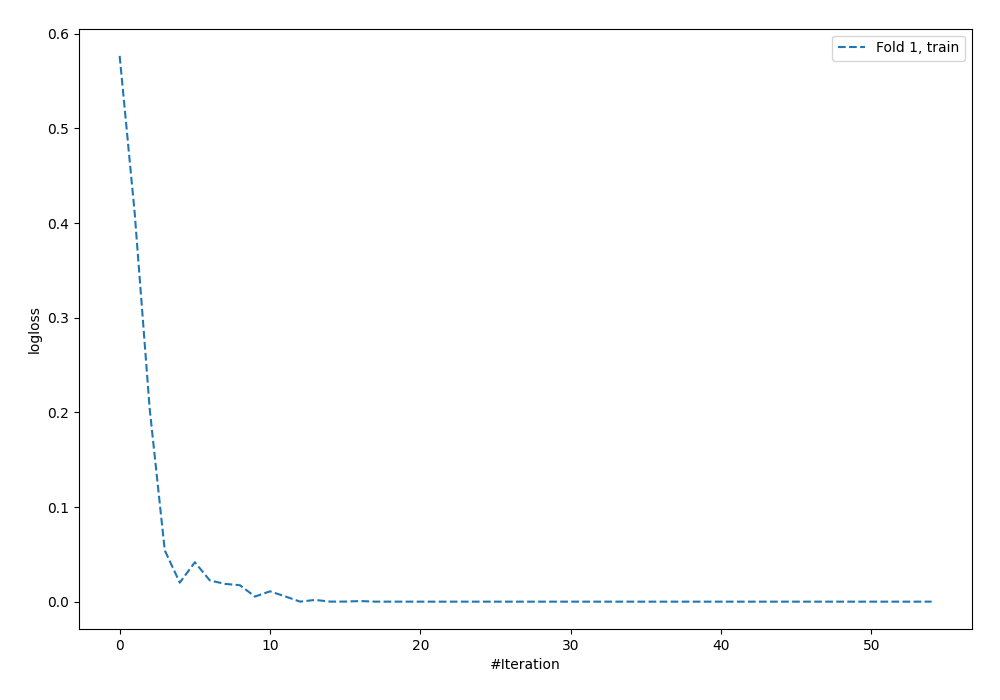
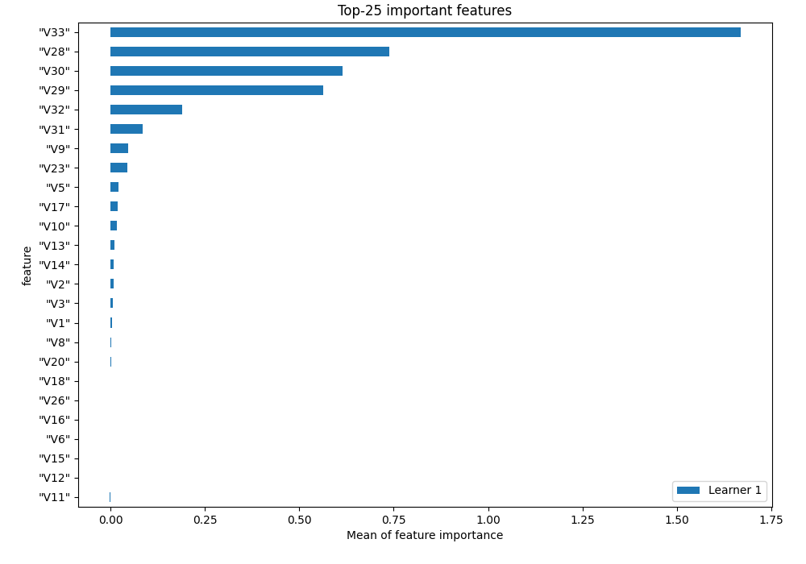
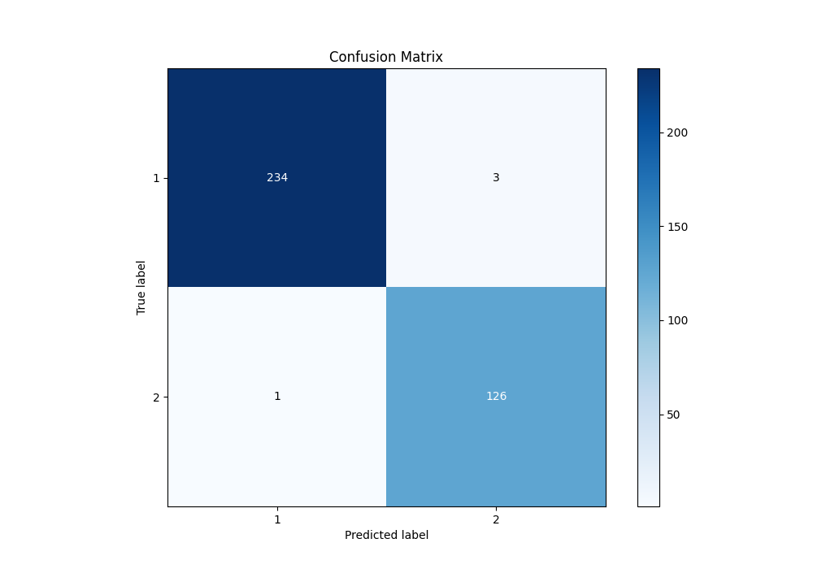
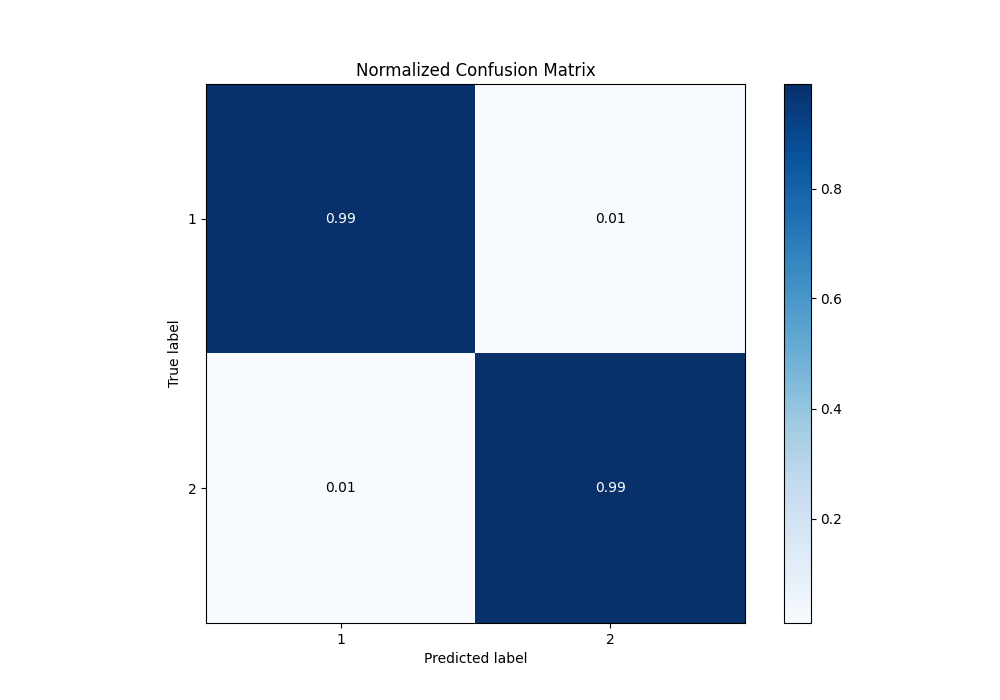
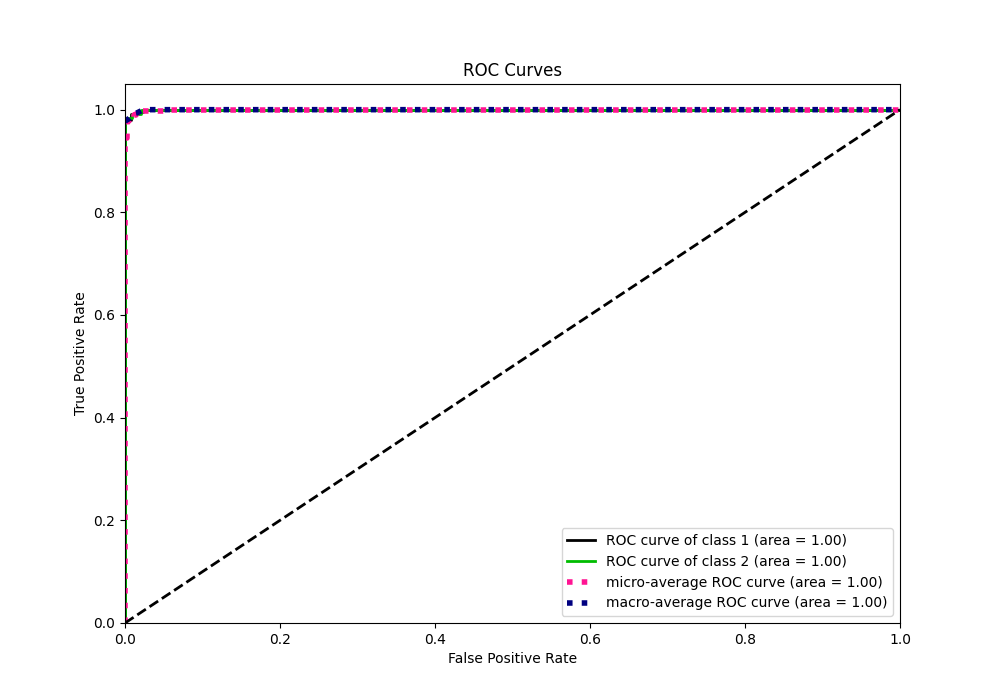
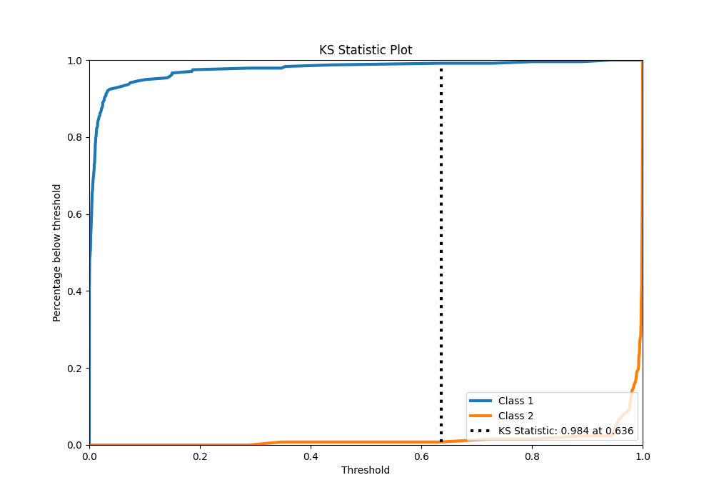
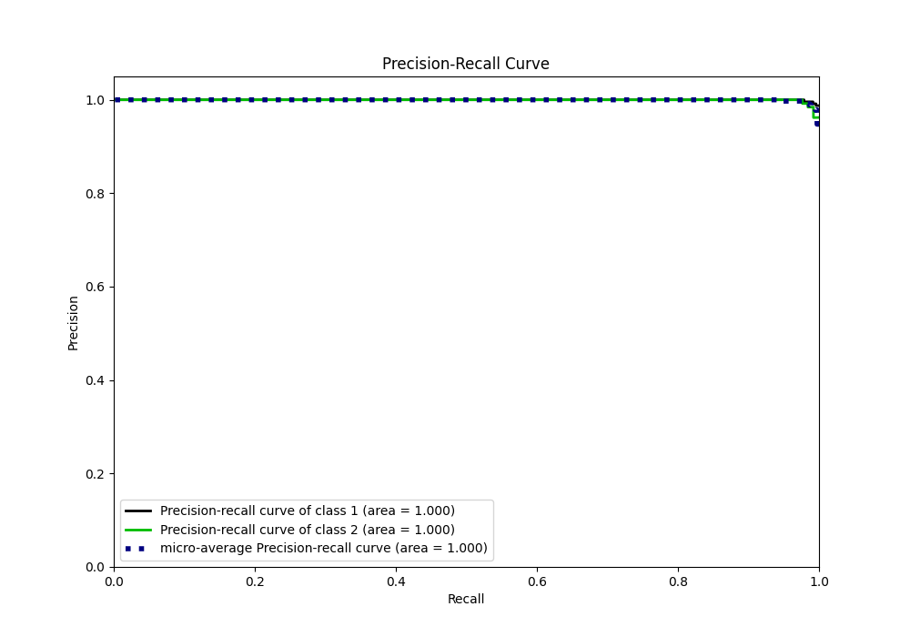
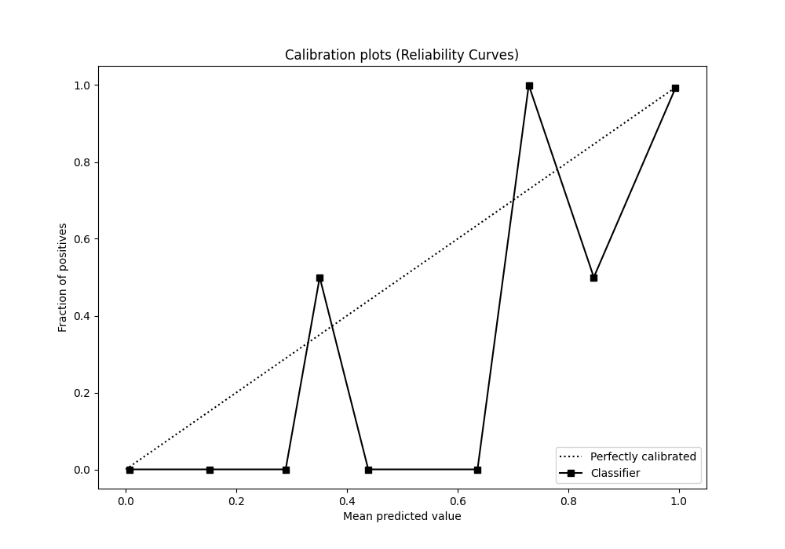
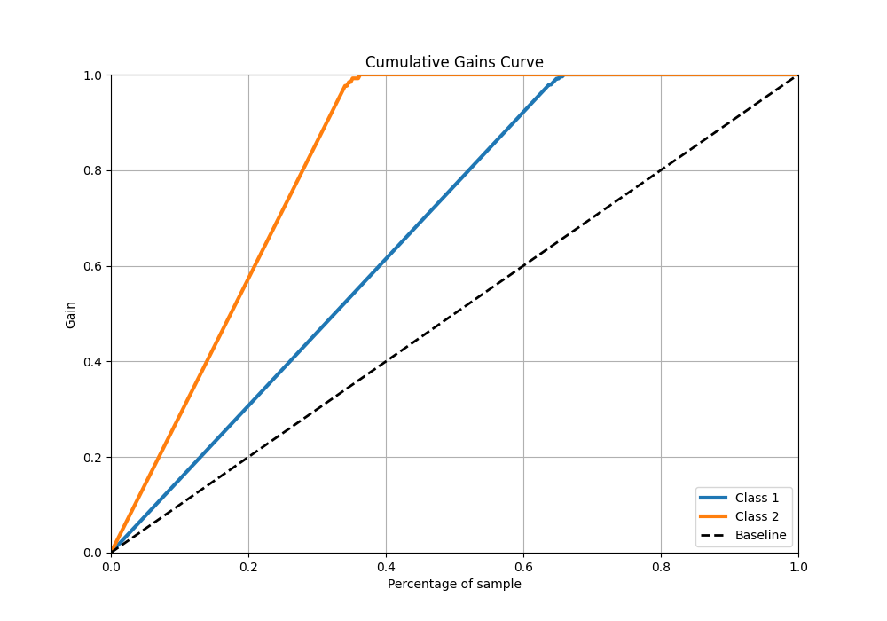

# Summary of 3_Default_NeuralNetwork

[<< Go back](../README.md)

## Neural Network
- **n_jobs**: -1
- **dense_1_size**: 32
- **dense_2_size**: 16
- **learning_rate**: 0.05
- **explain_level**: 1

## Validation
 - **validation_type**: split
 - **train_ratio**: 0.75
 - **shuffle**: True
 - **stratify**: True

## Optimized metric
f1

## Training time

1.7 seconds

## Metric details
|           |     score |     threshold |
|:----------|----------:|--------------:|
| logloss   | 0.0321154 | nan           |
| auc       | 0.999734  | nan           |
| f1        | 0.984375  |   0.482363    |
| accuracy  | 0.989011  |   0.482363    |
| precision | 1         |   0.999629    |
| recall    | 1         |   4.63736e-07 |
| mcc       | 0.975972  |   0.482363    |

## Confusion matrix (at threshold=0.482363)
|              |   Predicted as 1 |   Predicted as 2 |
|:-------------|-----------------:|-----------------:|
| Labeled as 1 |              234 |                3 |
| Labeled as 2 |                1 |              126 |

## Learning curves

## Permutation-based Importance

## Confusion Matrix

## Normalized Confusion Matrix

## ROC Curve

## Kolmogorov-Smirnov Statistic

## Precision-Recall Curve

## Calibration Curve

## Cumulative Gains Curve

## Lift Curve

[<< Go back](../README.md)
