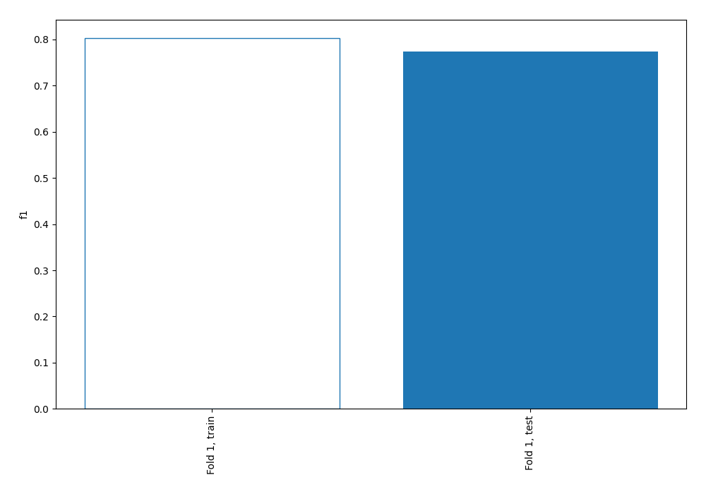
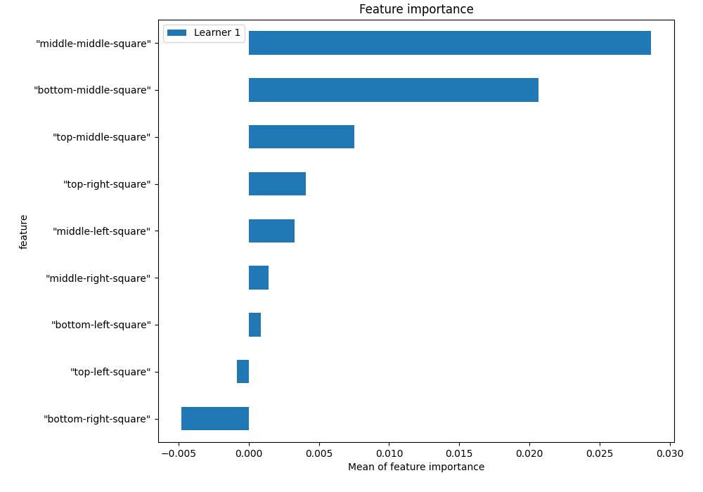
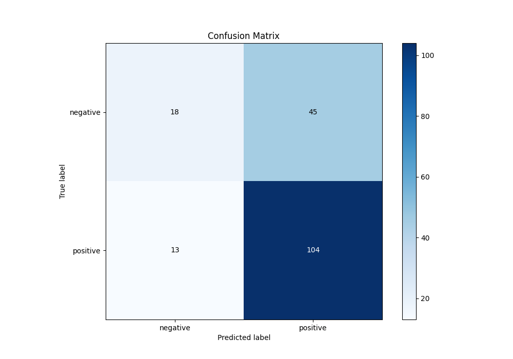
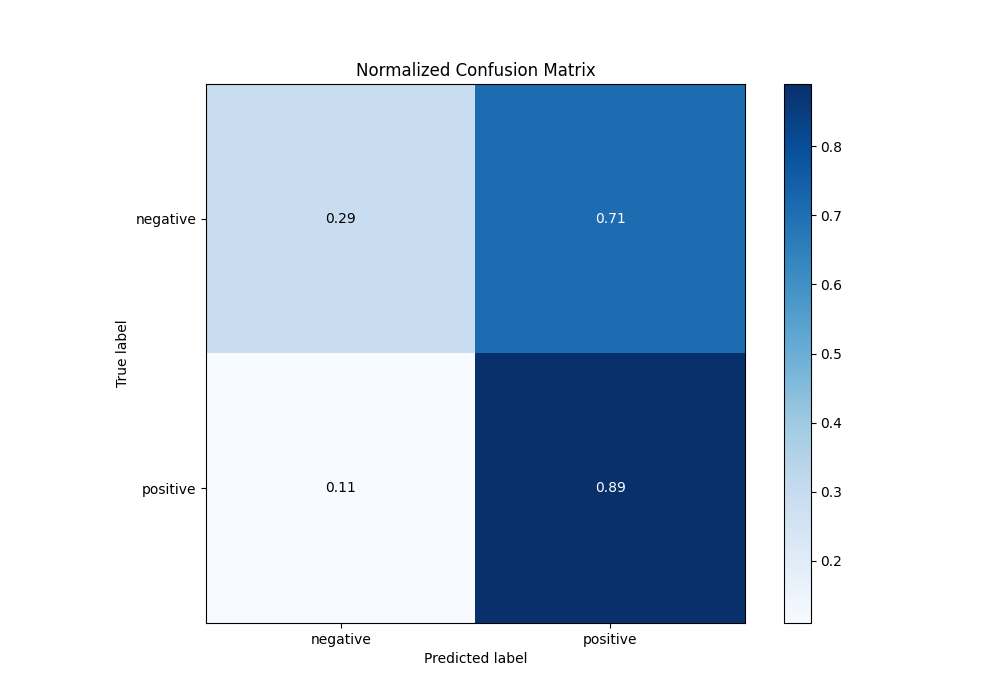
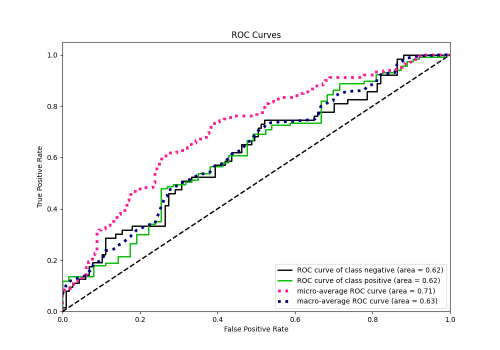
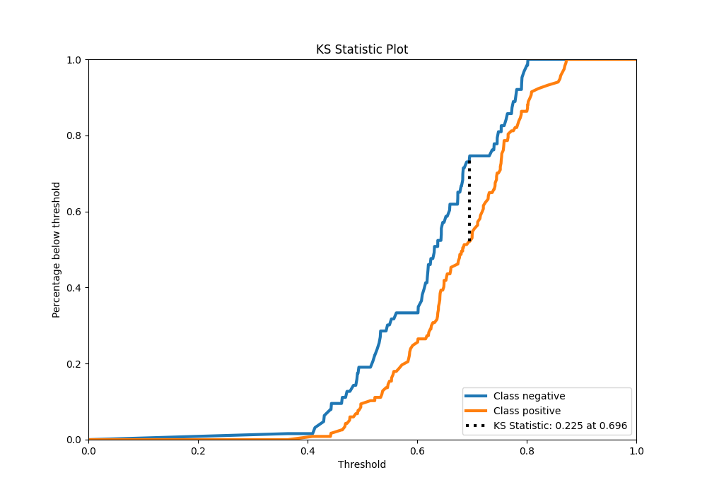
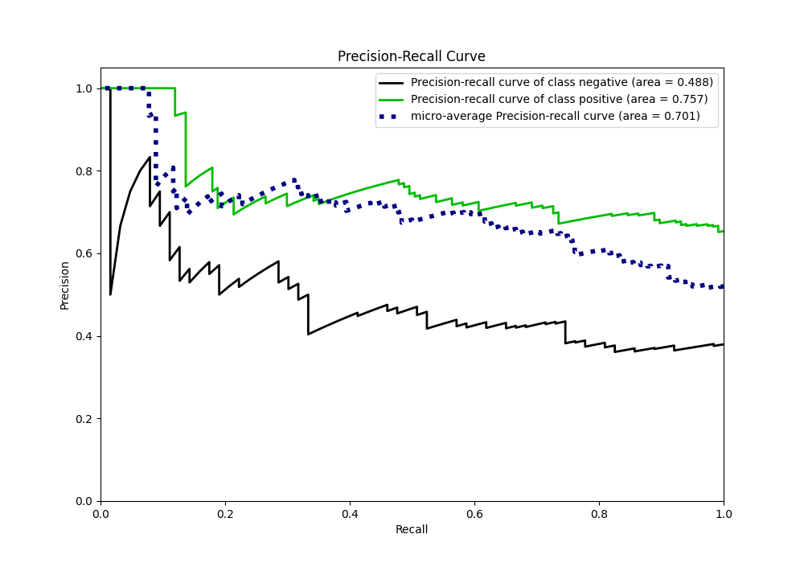
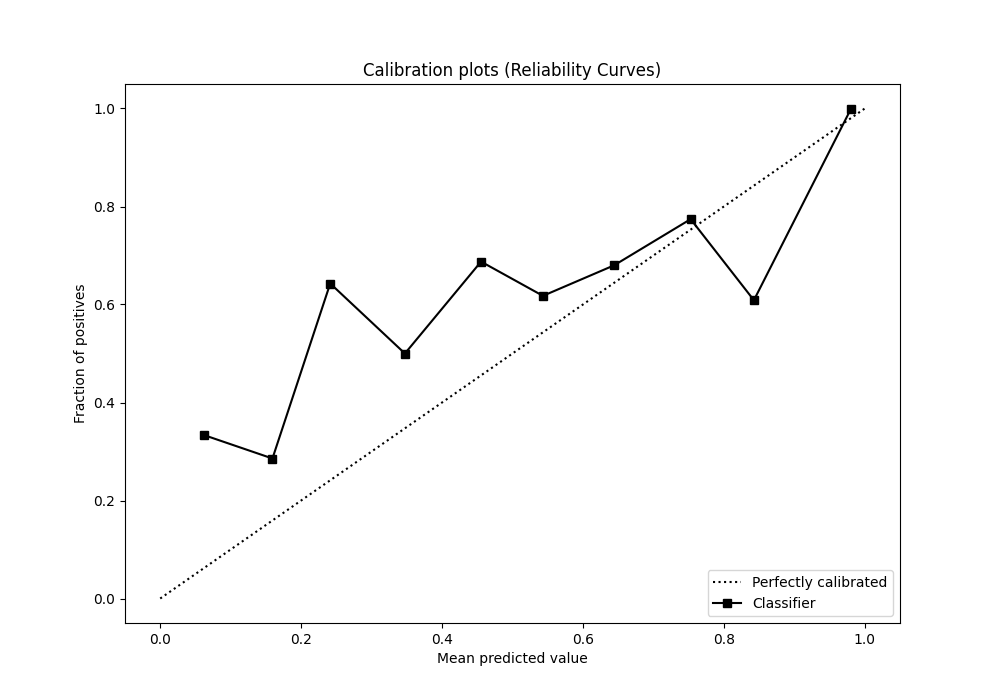
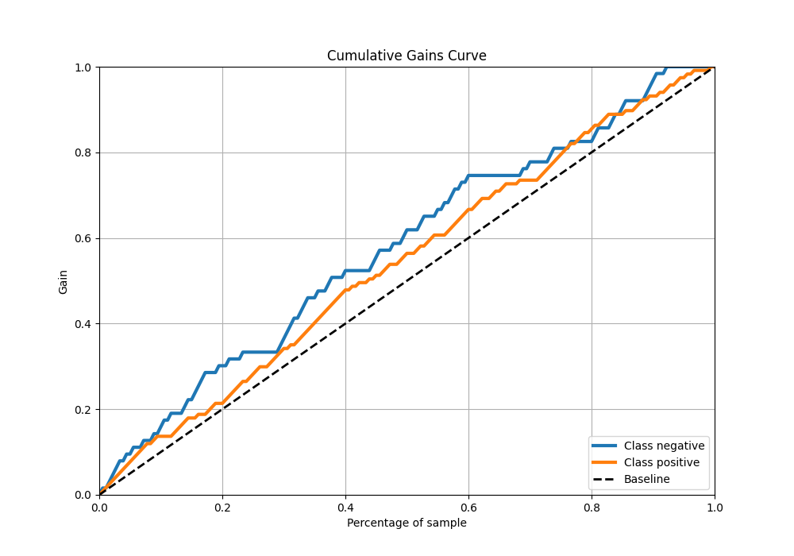
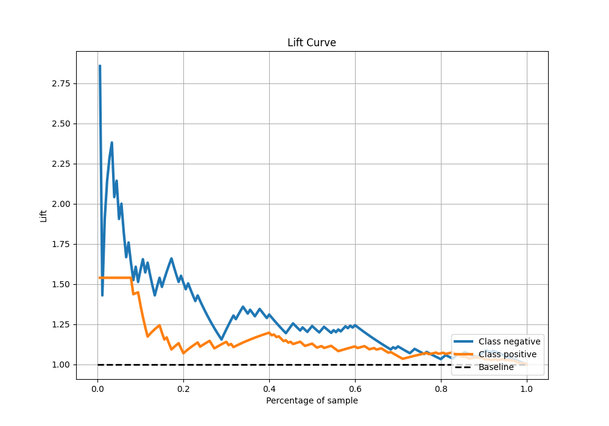

# Summary of 2_Linear

[<< Go back](../README.md)

## Logistic Regression (Linear)
- **n_jobs**: -1
- **explain_level**: 1

## Validation
 - **validation_type**: split
 - **train_ratio**: 0.75
 - **shuffle**: True
 - **stratify**: True

## Optimized metric
f1

## Training time

0.9 seconds

## Metric details
|           |    score |   threshold |
|:----------|---------:|------------:|
| logloss   | 0.623729 |  nan        |
| auc       | 0.620133 |  nan        |
| f1        | 0.788732 |    0.474393 |
| accuracy  | 0.677778 |    0.534248 |
| precision | 1        |    0.803534 |
| recall    | 1        |    0.327377 |
| mcc       | 0.220567 |    0.534248 |

## Confusion matrix (at threshold=0.534248)
|                     |   Predicted as negative |   Predicted as positive |
|:--------------------|------------------------:|------------------------:|
| Labeled as negative |                      18 |                      45 |
| Labeled as positive |                      13 |                     104 |

## Learning curves

## Coefficients
| feature                |   Learner_1 |
|:-----------------------|------------:|
| intercept              |   0.665397  |
| "middle-middle-square" |   0.292638  |
| "bottom-right-square"  |   0.15263   |
| "top-right-square"     |   0.134958  |
| "top-left-square"      |   0.0438993 |
| "bottom-left-square"   |   0.0297839 |
| "top-middle-square"    |  -0.13832   |
| "bottom-middle-square" |  -0.173165  |
| "middle-right-square"  |  -0.212714  |
| "middle-left-square"   |  -0.235445  |

## Permutation-based Importance

## Confusion Matrix

## Normalized Confusion Matrix

## ROC Curve

## Kolmogorov-Smirnov Statistic

## Precision-Recall Curve

## Calibration Curve

## Cumulative Gains Curve

## Lift Curve

[<< Go back](../README.md)
