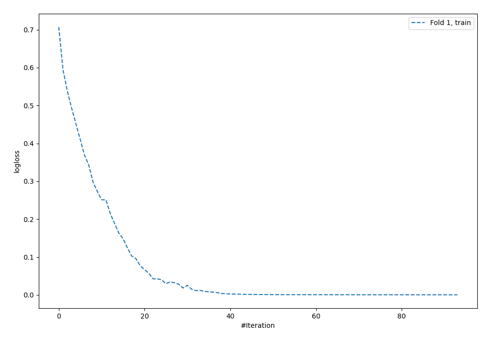
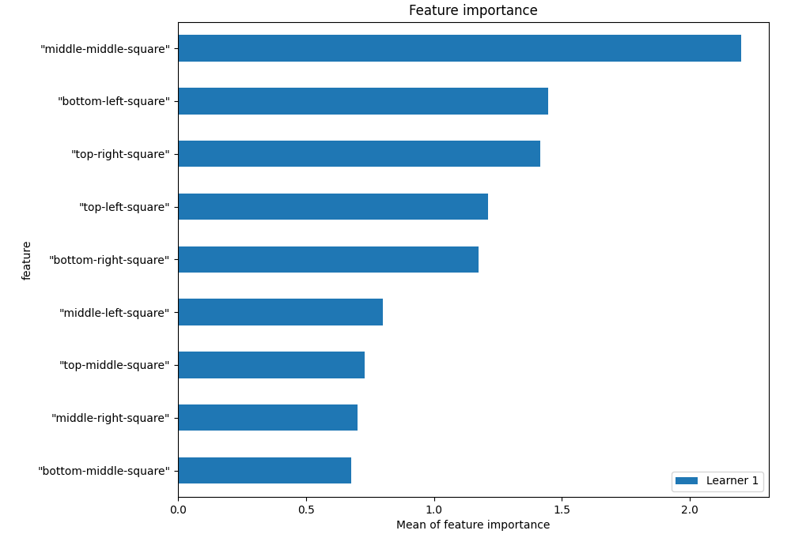
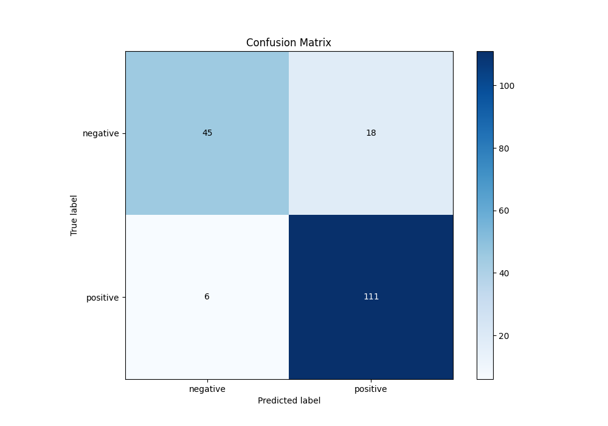
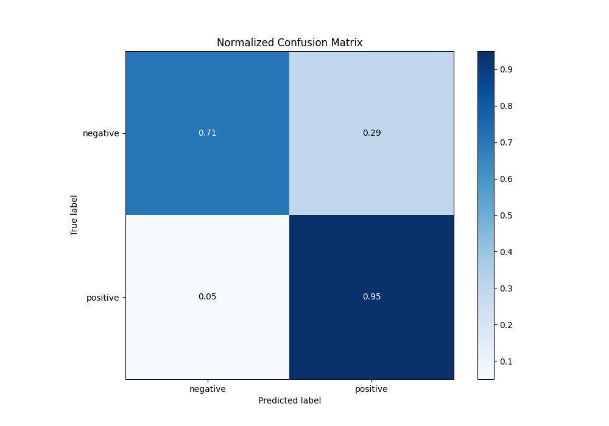
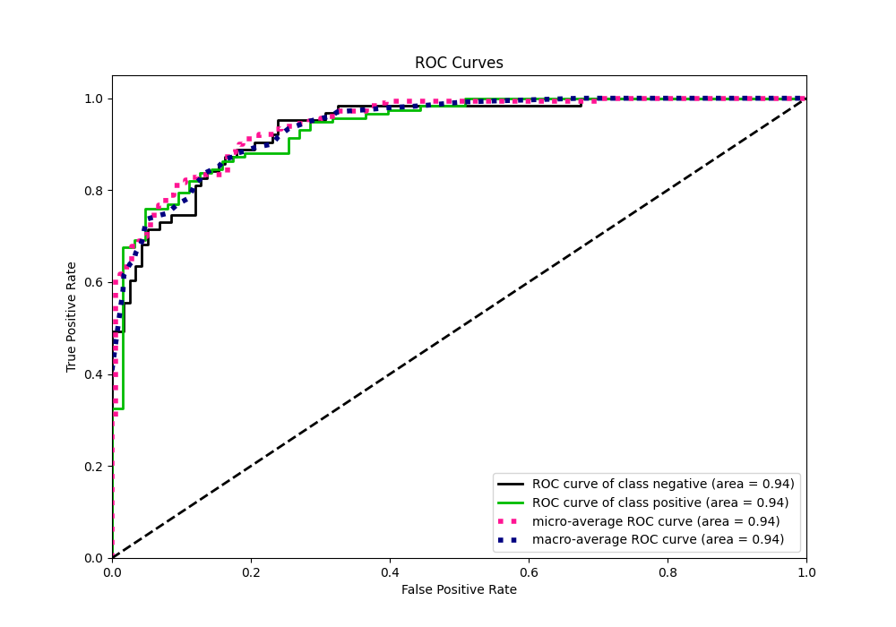
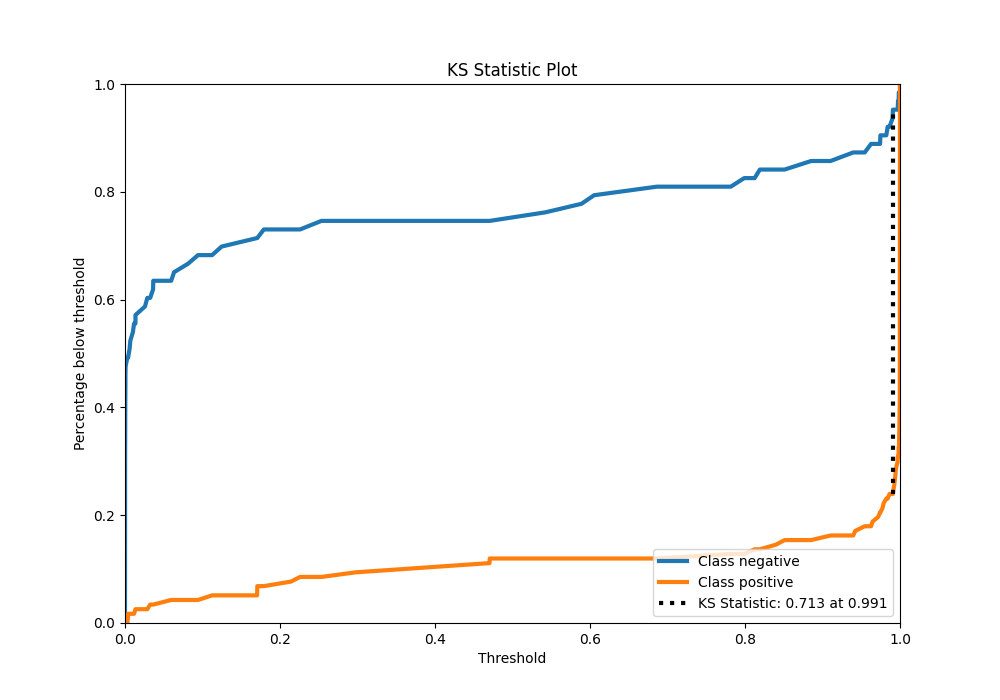
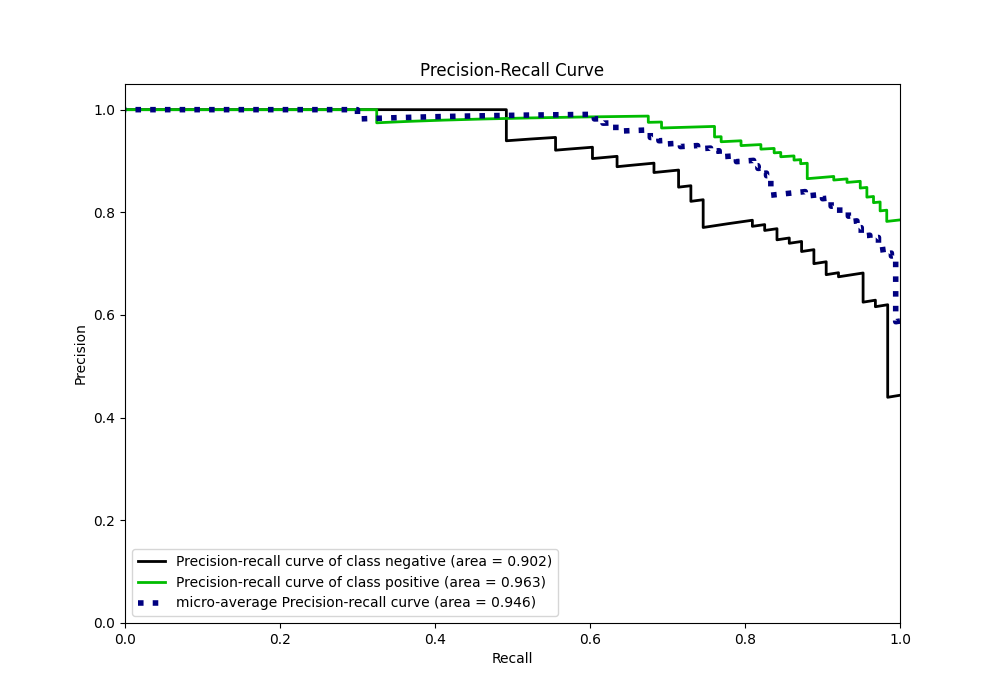
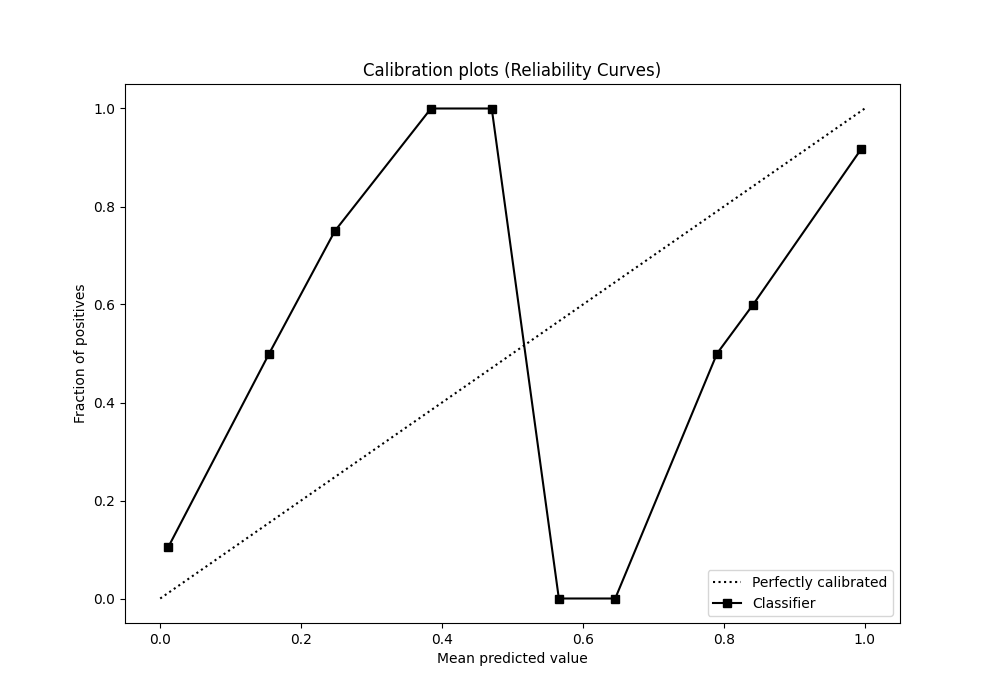
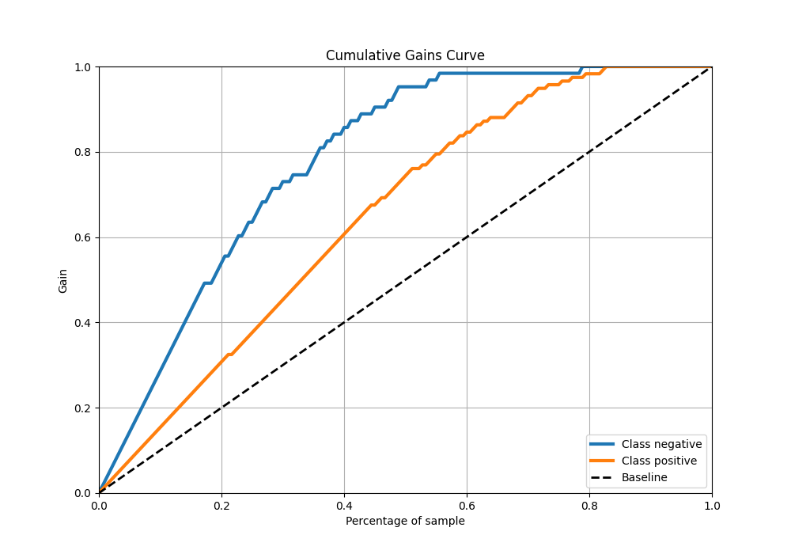
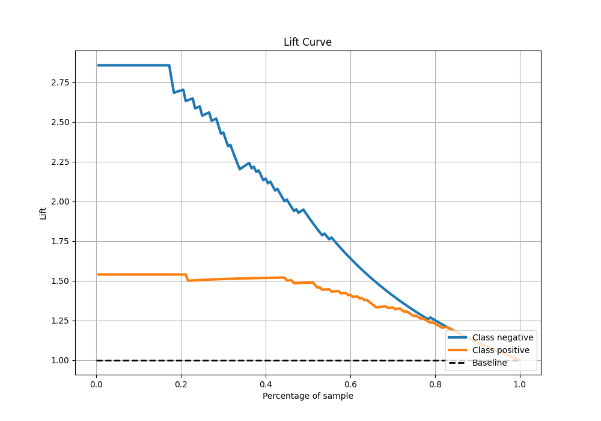

# Summary of 3_Default_NeuralNetwork

[<< Go back](../README.md)

## Neural Network
- **n_jobs**: -1
- **dense_1_size**: 32
- **dense_2_size**: 16
- **learning_rate**: 0.05
- **explain_level**: 1

## Validation
 - **validation_type**: split
 - **train_ratio**: 0.75
 - **shuffle**: True
 - **stratify**: True

## Optimized metric
f1

## Training time

1.1 seconds

## Metric details
|           |    score |     threshold |
|:----------|---------:|--------------:|
| logloss   | 0.51536  | nan           |
| auc       | 0.935558 | nan           |
| f1        | 0.902439 |   0.170565    |
| accuracy  | 0.866667 |   0.170565    |
| precision | 1        |   0.999999    |
| recall    | 1        |   5.91579e-16 |
| mcc       | 0.701777 |   0.170565    |

## Confusion matrix (at threshold=0.170565)
|                     |   Predicted as negative |   Predicted as positive |
|:--------------------|------------------------:|------------------------:|
| Labeled as negative |                      45 |                      18 |
| Labeled as positive |                       6 |                     111 |

## Learning curves

## Permutation-based Importance

## Confusion Matrix

## Normalized Confusion Matrix

## ROC Curve

## Kolmogorov-Smirnov Statistic

## Precision-Recall Curve

## Calibration Curve

## Cumulative Gains Curve

## Lift Curve

[<< Go back](../README.md)
