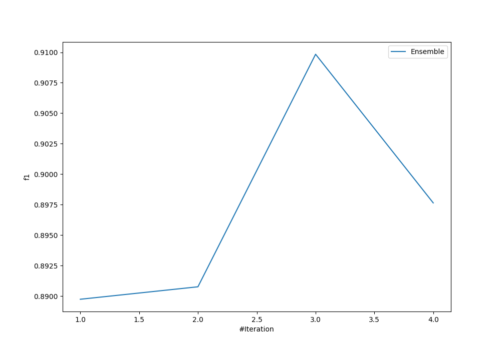
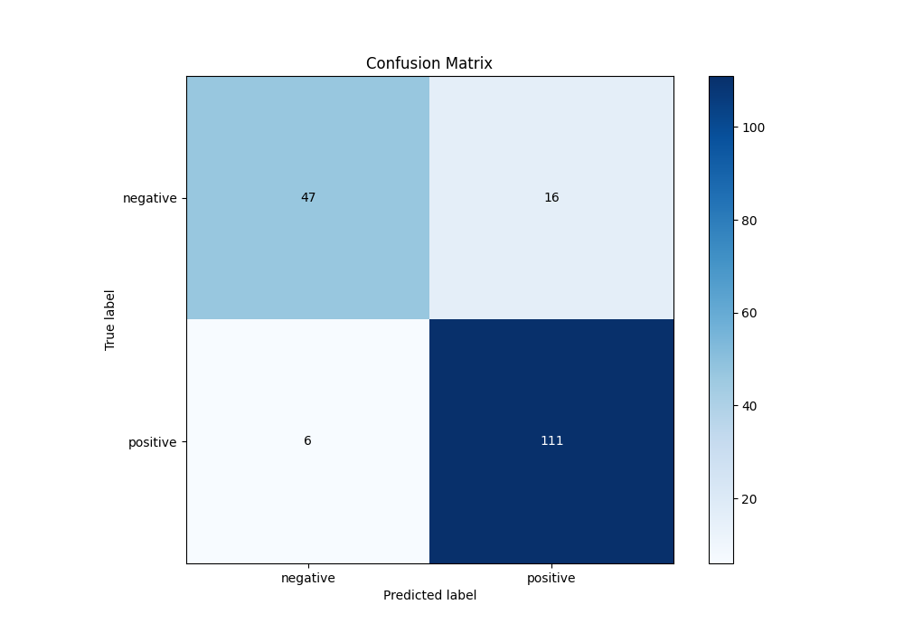
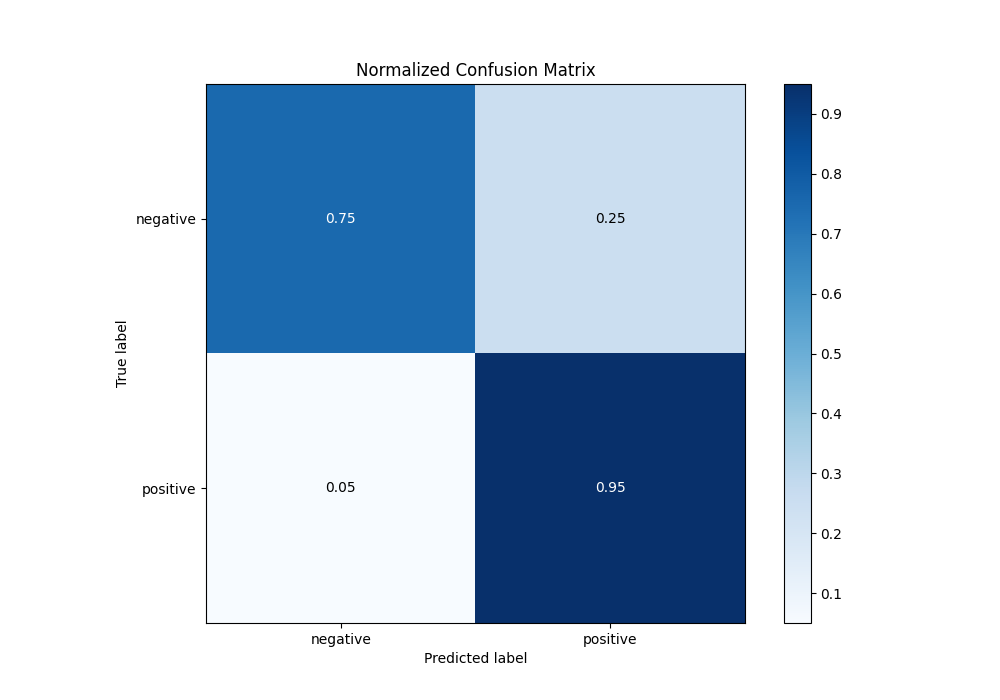
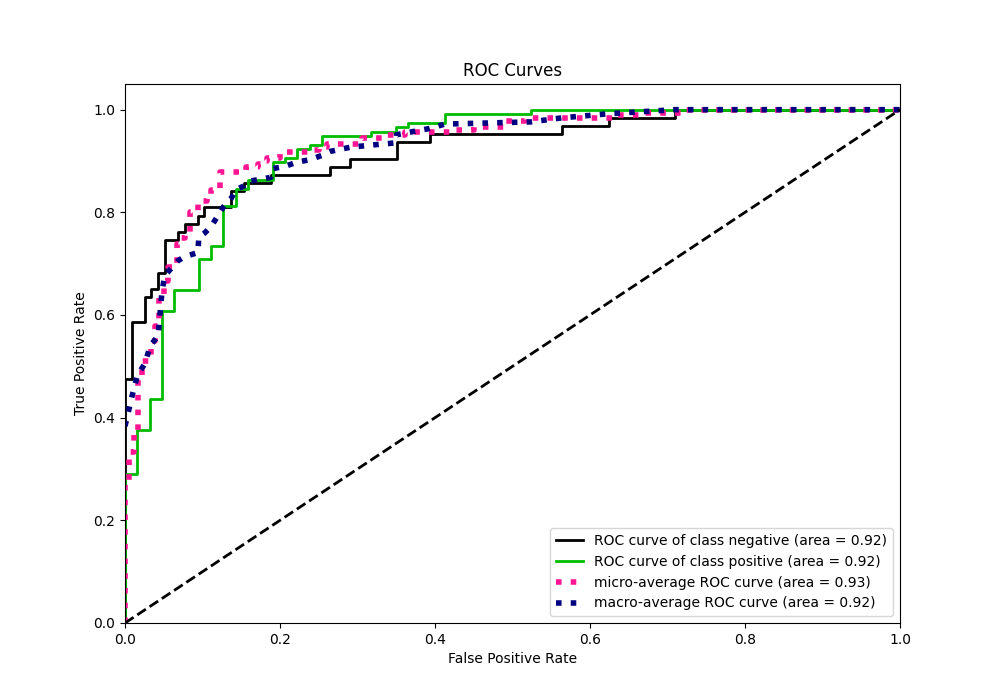
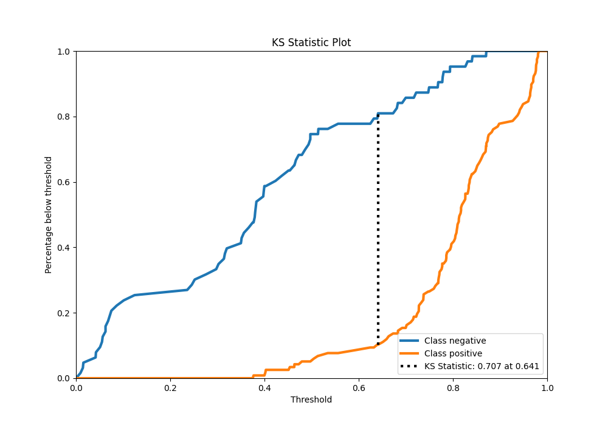
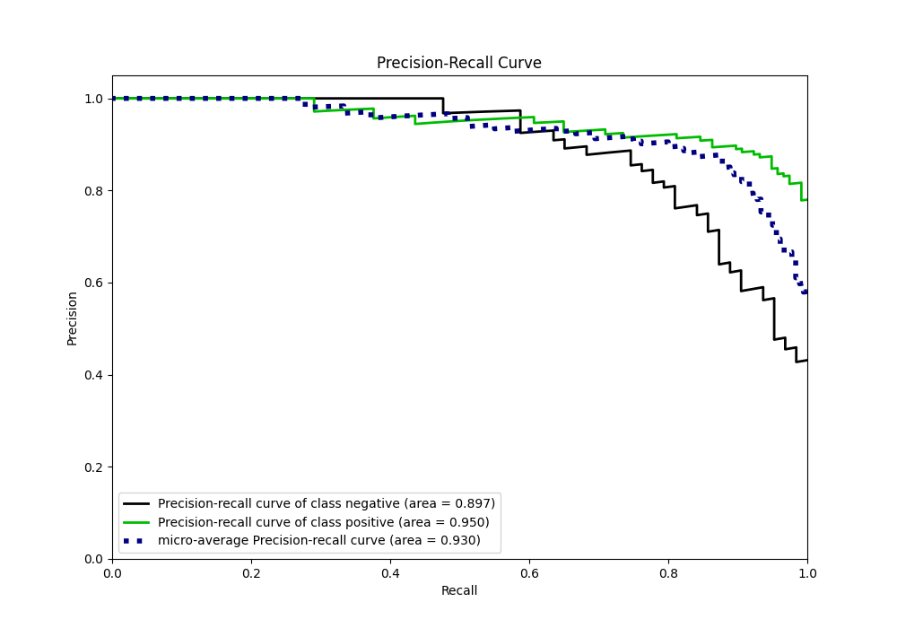
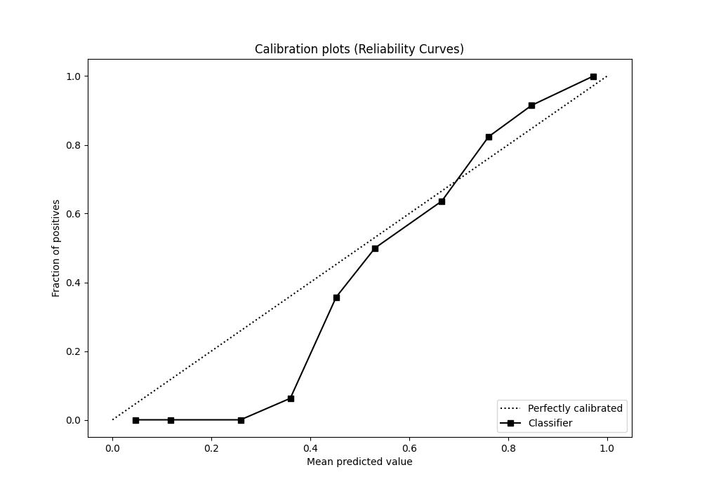
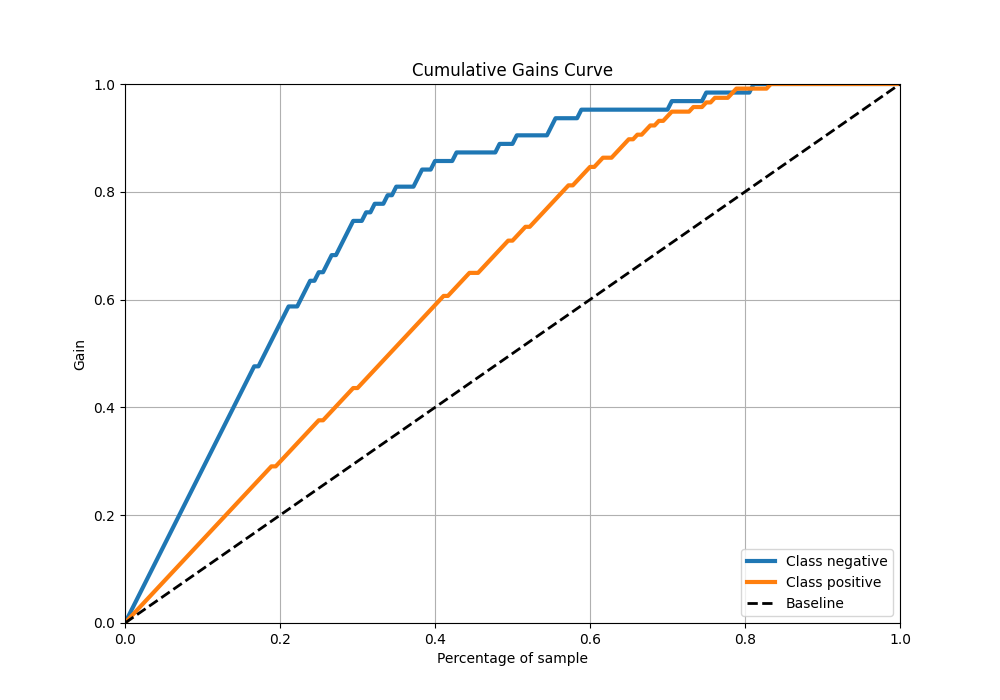
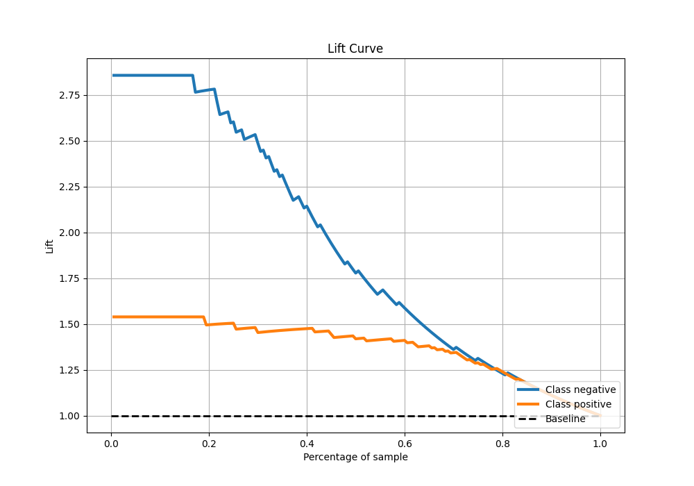

# Summary of Ensemble

[<< Go back](../README.md)

## Ensemble structure
| Model                   |   Weight |
|:------------------------|---------:|
| 1_DecisionTree          |        1 |
| 3_Default_NeuralNetwork |        1 |
| 4_Default_RandomForest  |        1 |

## Metric details
|           |    score |    threshold |
|:----------|---------:|-------------:|
| logloss   | 0.362518 | nan          |
| auc       | 0.921178 | nan          |
| f1        | 0.909836 |   0.503542   |
| accuracy  | 0.877778 |   0.503542   |
| precision | 1        |   0.913082   |
| recall    | 1        |   0.00848909 |
| mcc       | 0.727029 |   0.503542   |

## Confusion matrix (at threshold=0.503542)
|                     |   Predicted as negative |   Predicted as positive |
|:--------------------|------------------------:|------------------------:|
| Labeled as negative |                      47 |                      16 |
| Labeled as positive |                       6 |                     111 |

## Learning curves

## Confusion Matrix

## Normalized Confusion Matrix

## ROC Curve

## Kolmogorov-Smirnov Statistic

## Precision-Recall Curve

## Calibration Curve

## Cumulative Gains Curve

## Lift Curve

[<< Go back](../README.md)
