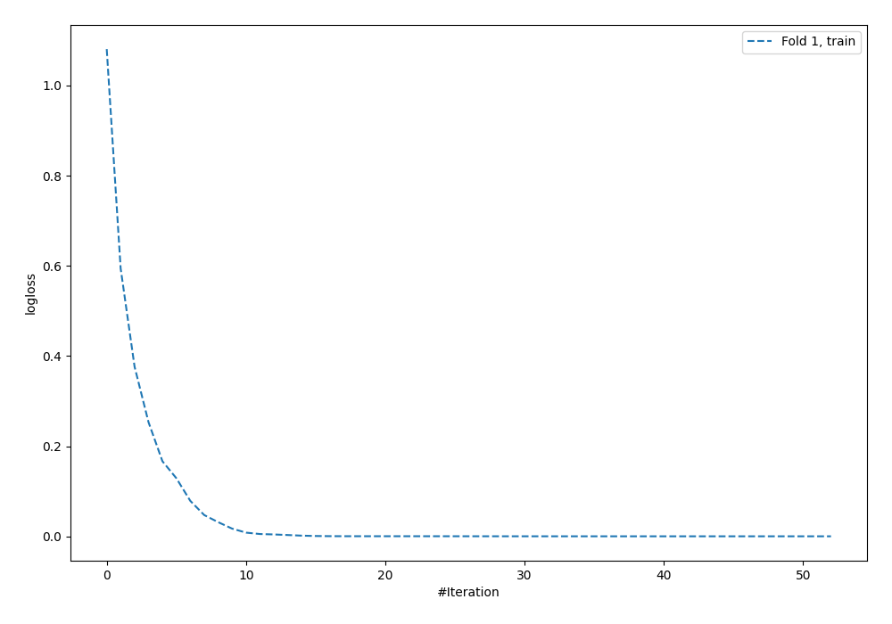
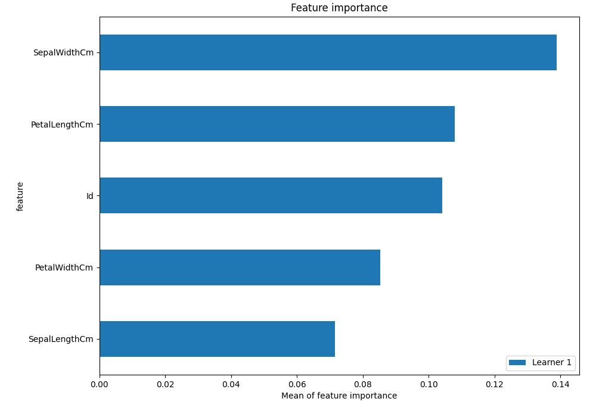
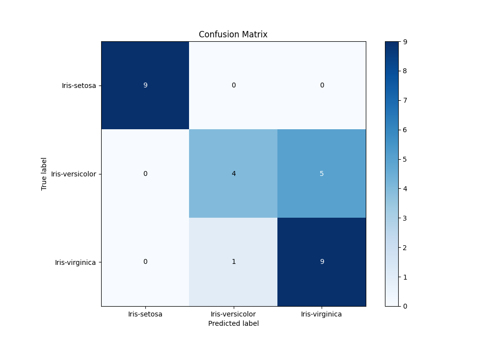
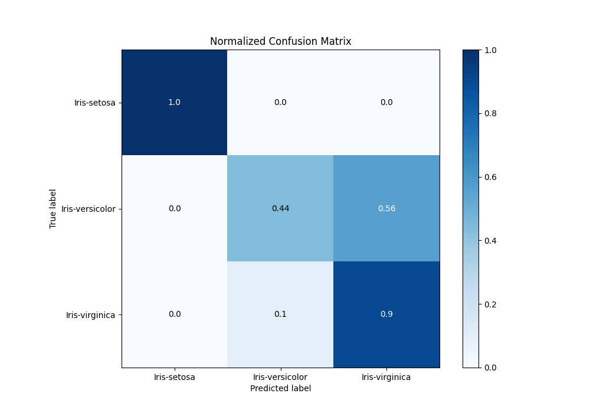
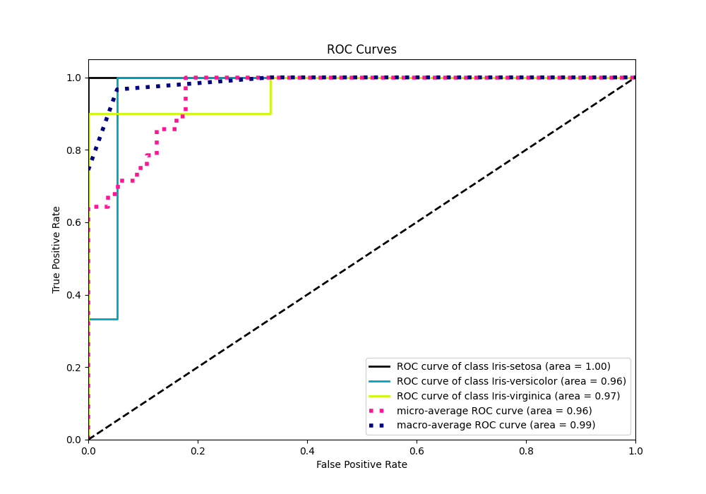
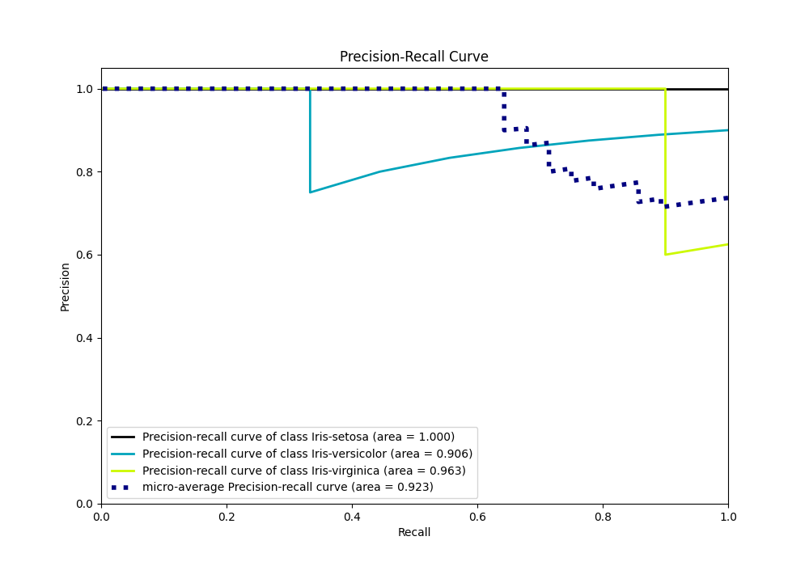

# Summary of 3_Default_NeuralNetwork

[<< Go back](../README.md)

## Neural Network
- **n_jobs**: -1
- **dense_1_size**: 32
- **dense_2_size**: 16
- **learning_rate**: 0.05
- **num_class**: 3
- **explain_level**: 1

## Validation
 - **validation_type**: split
 - **train_ratio**: 0.75
 - **shuffle**: True
 - **stratify**: True

## Optimized metric
f1

## Training time

0.4 seconds

### Metric details
|           |   Iris-setosa |   Iris-versicolor |   Iris-virginica |   accuracy |   macro avg |   weighted avg |   logloss |
|:----------|--------------:|------------------:|-----------------:|-----------:|------------:|---------------:|----------:|
| precision |             1 |          0.8      |         0.642857 |   0.785714 |    0.814286 |       0.808163 |   0.39419 |
| recall    |             1 |          0.444444 |         0.9      |   0.785714 |    0.781481 |       0.785714 |   0.39419 |
| f1-score  |             1 |          0.571429 |         0.75     |   0.785714 |    0.77381  |       0.772959 |   0.39419 |
| support   |             9 |          9        |        10        |   0.785714 |   28        |      28        |   0.39419 |

## Confusion matrix
|                            |   Predicted as Iris-setosa |   Predicted as Iris-versicolor |   Predicted as Iris-virginica |
|:---------------------------|---------------------------:|-------------------------------:|------------------------------:|
| Labeled as Iris-setosa     |                          9 |                              0 |                             0 |
| Labeled as Iris-versicolor |                          0 |                              4 |                             5 |
| Labeled as Iris-virginica  |                          0 |                              1 |                             9 |

## Learning curves

## Permutation-based Importance

## Confusion Matrix

## Normalized Confusion Matrix

## ROC Curve

## Precision Recall Curve

[<< Go back](../README.md)
