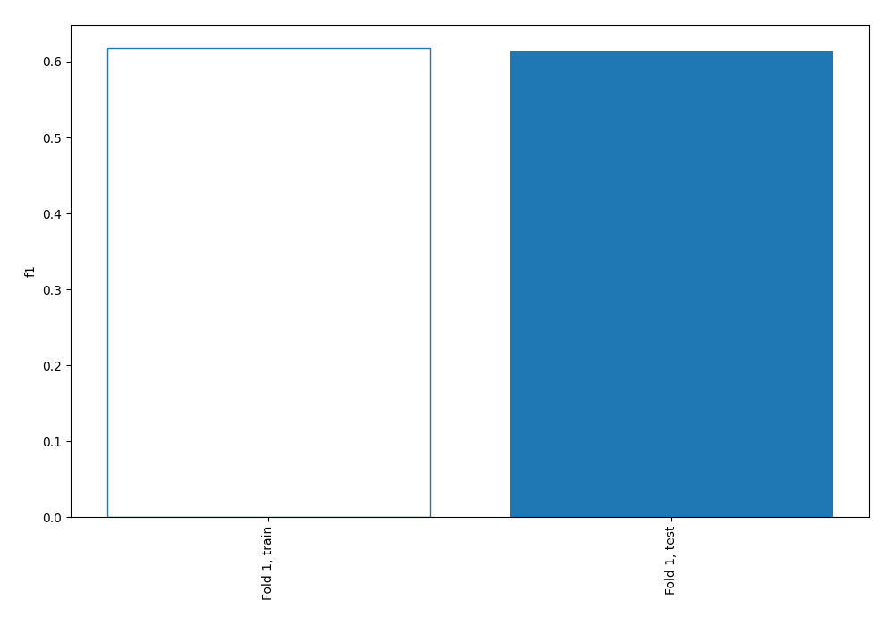
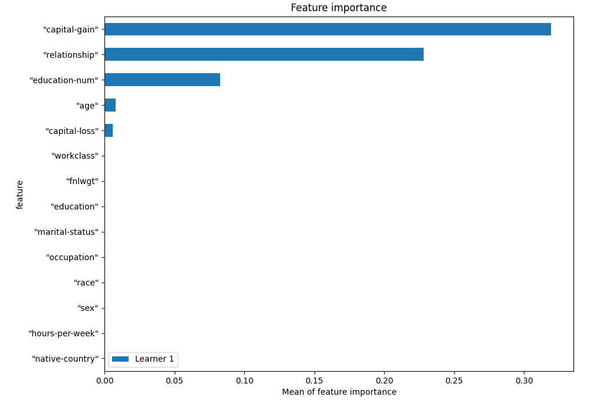
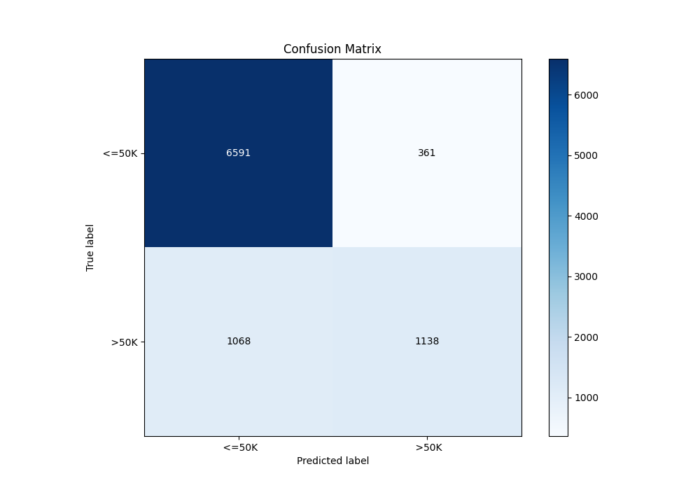
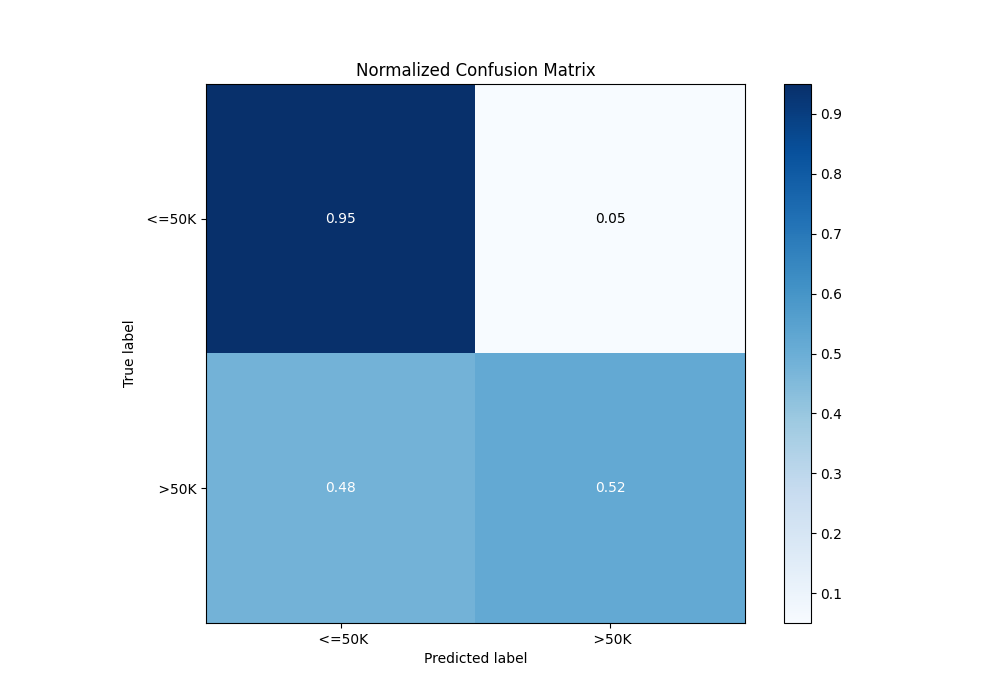
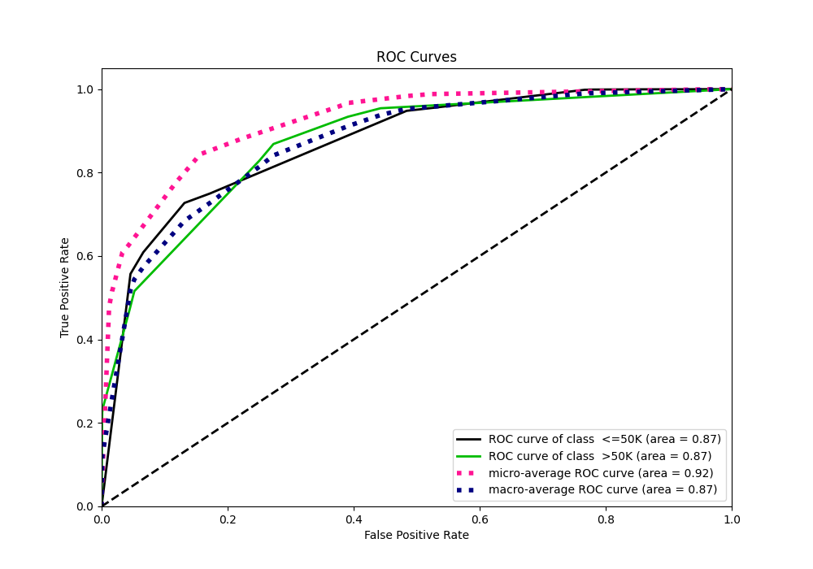
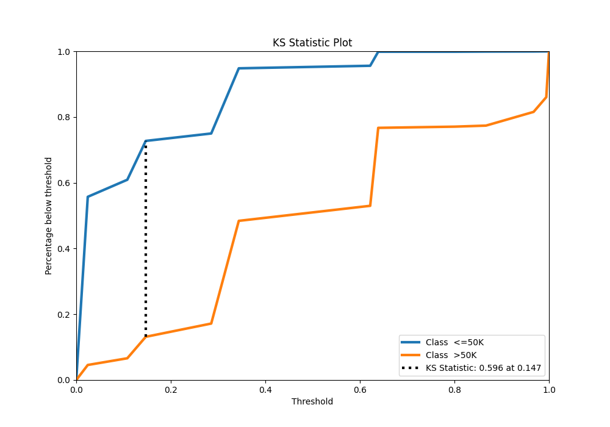
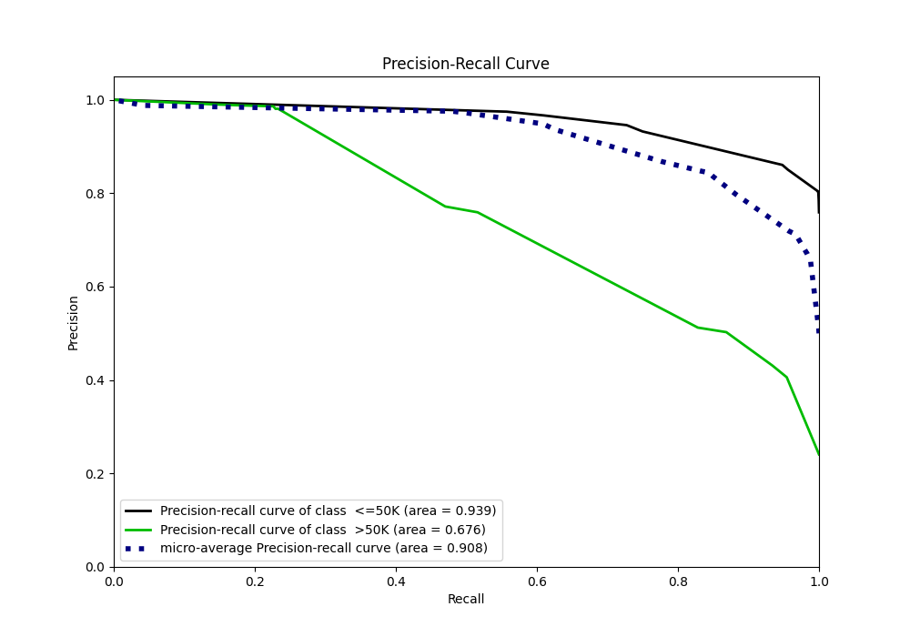
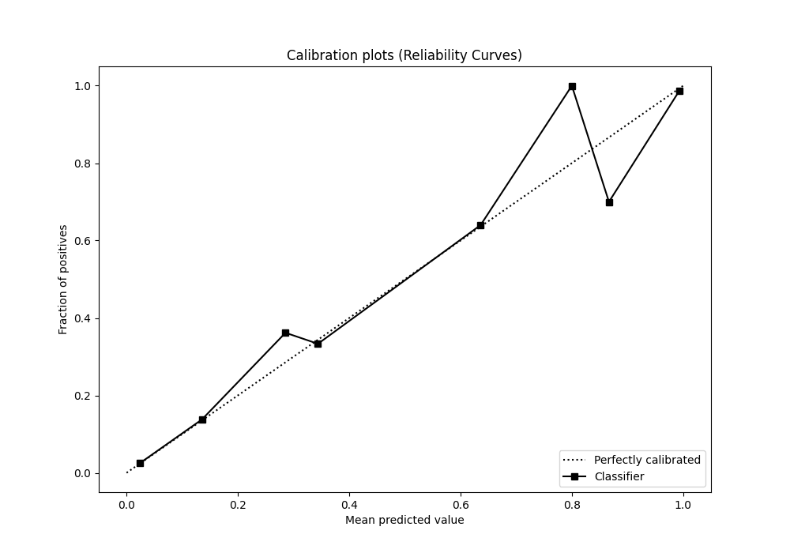
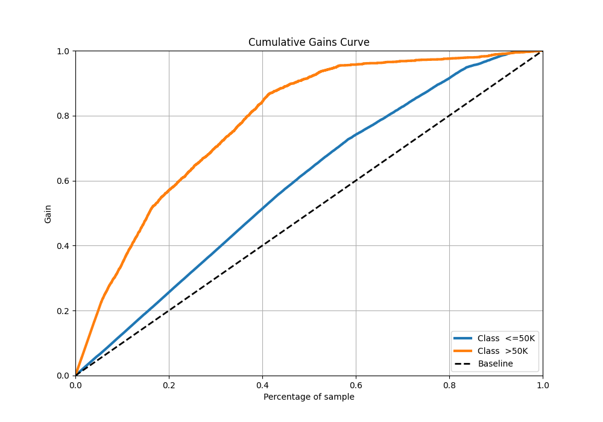
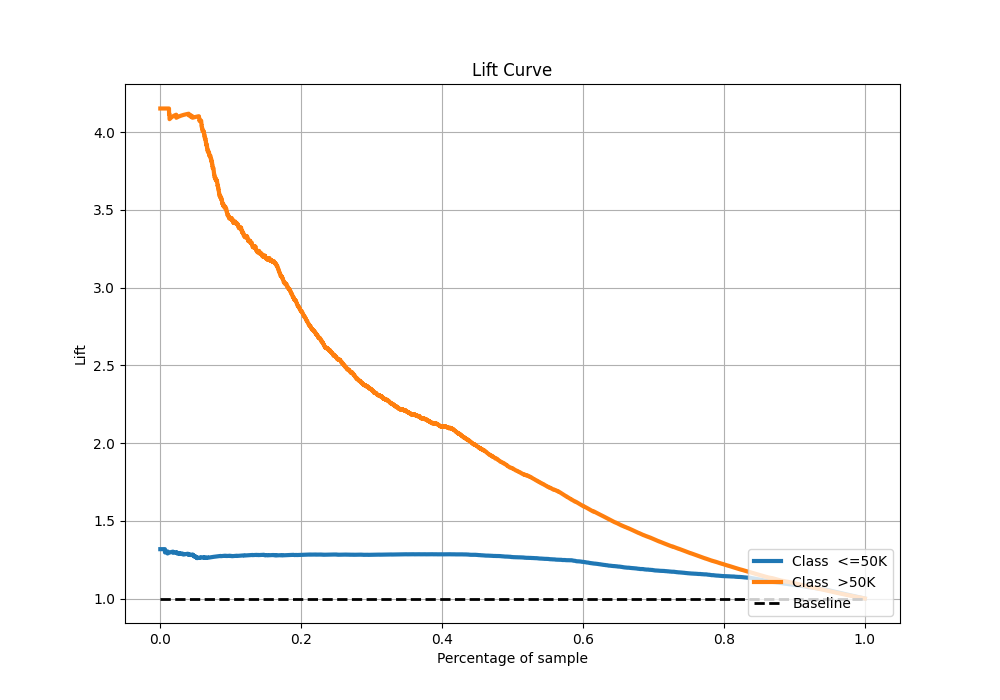

# Summary of 1_DecisionTree

[<< Go back](../README.md)

## Decision Tree
- **n_jobs**: -1
- **criterion**: entropy
- **max_depth**: 4
- **explain_level**: 1

## Validation
 - **validation_type**: split
 - **train_ratio**: 0.75
 - **shuffle**: True
 - **stratify**: True

## Optimized metric
f1

## Training time

16.0 seconds

## Metric details
|           |    score |   threshold |
|:----------|---------:|------------:|
| logloss   | 0.350258 |  nan        |
| auc       | 0.87139  |  nan        |
| f1        | 0.636756 |    0.154946 |
| accuracy  | 0.843962 |    0.491296 |
| precision | 0.980916 |    0.671916 |
| recall    | 1        |    0        |
| mcc       | 0.536205 |    0.491296 |

## Confusion matrix (at threshold=0.491296)
|                   |   Predicted as  <=50K |   Predicted as  >50K |
|:------------------|----------------------:|---------------------:|
| Labeled as  <=50K |                  6591 |                  361 |
| Labeled as  >50K  |                  1068 |                 1138 |

## Learning curves

## Permutation-based Importance

## Confusion Matrix

## Normalized Confusion Matrix

## ROC Curve

## Kolmogorov-Smirnov Statistic

## Precision-Recall Curve

## Calibration Curve

## Cumulative Gains Curve

## Lift Curve

[<< Go back](../README.md)
