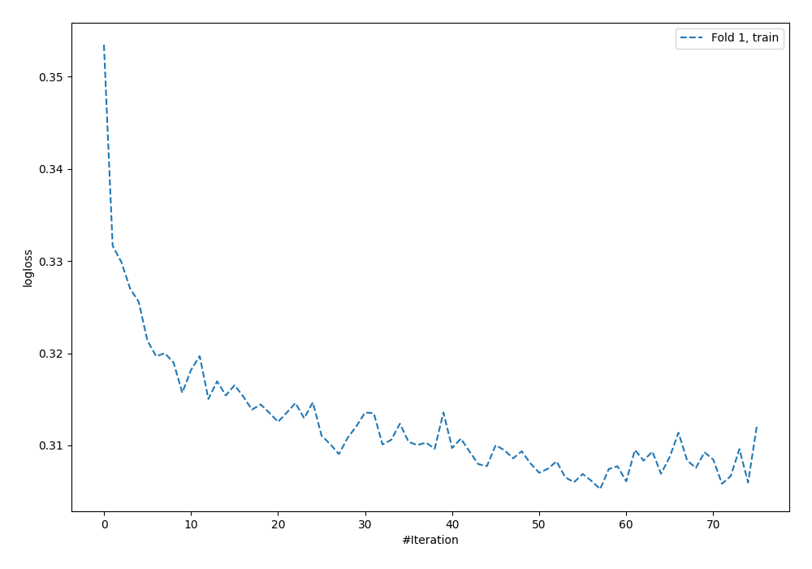
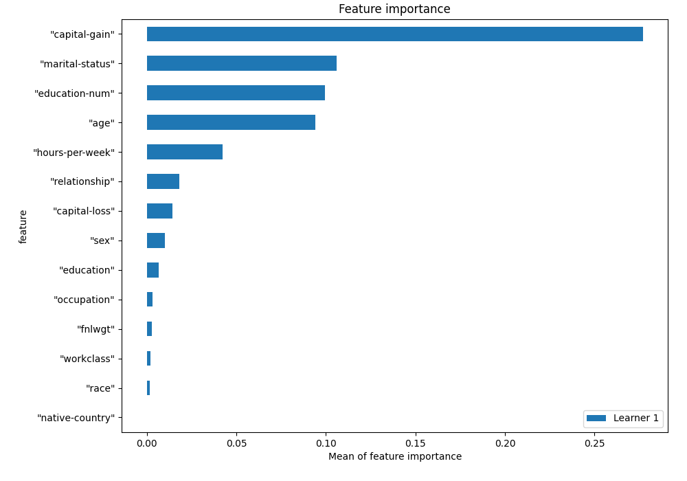
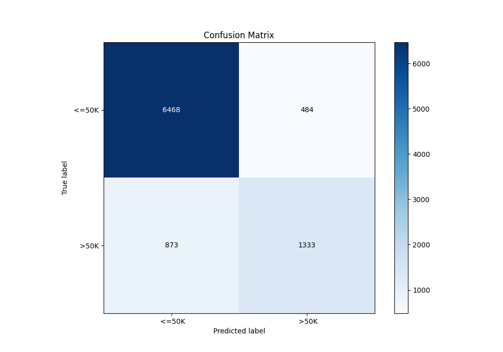
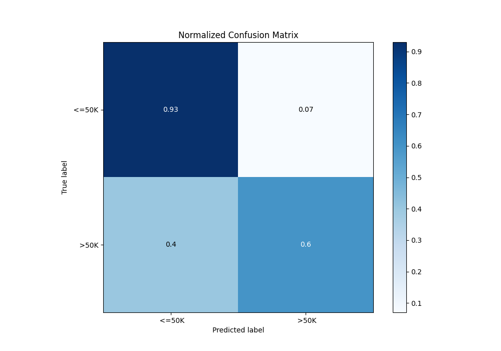
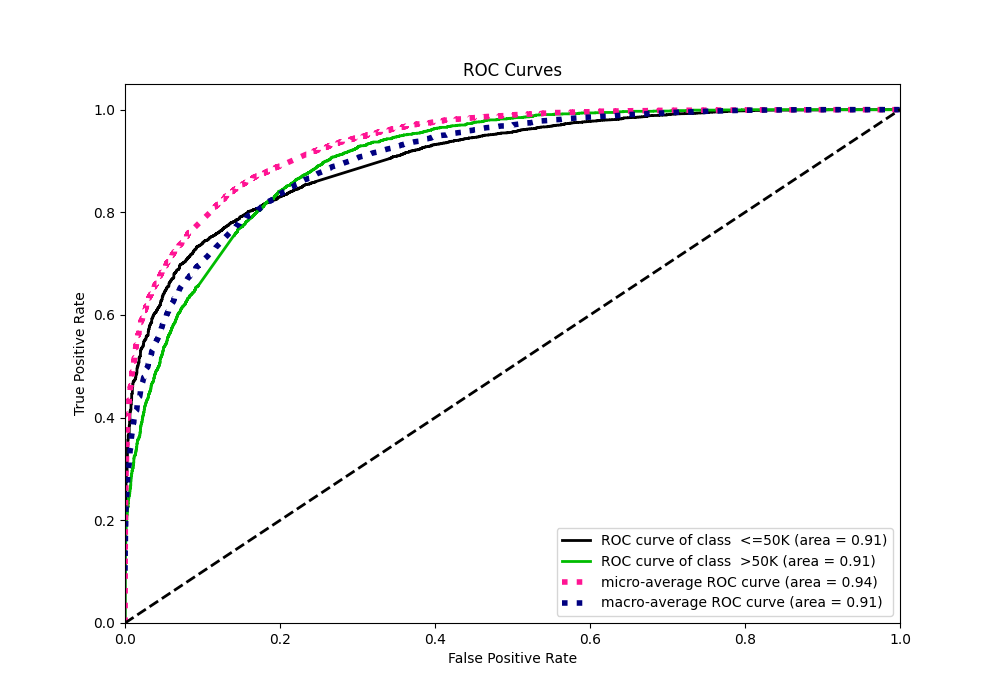
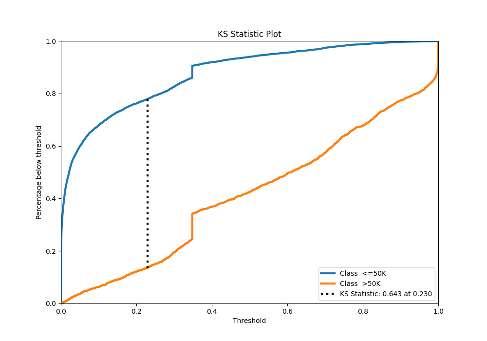
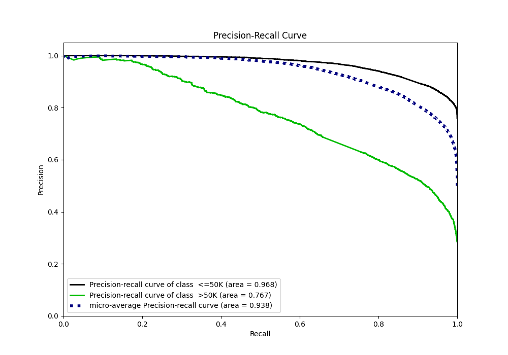
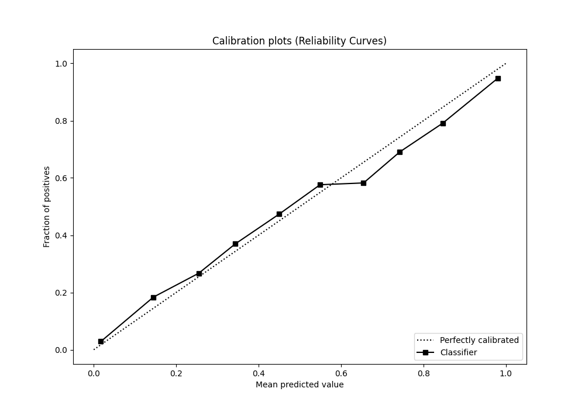
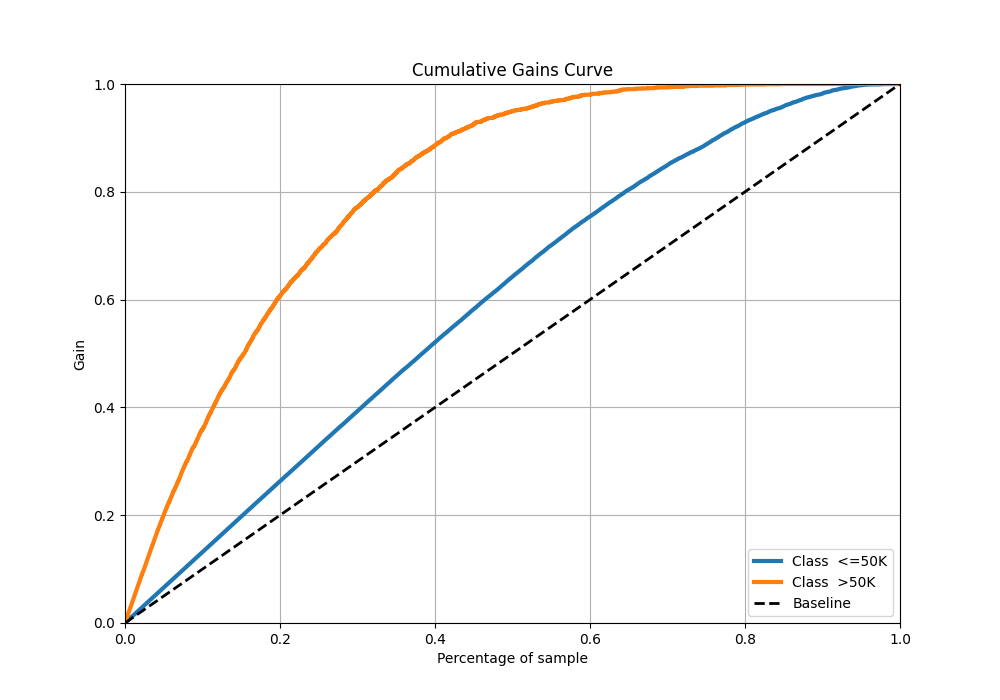
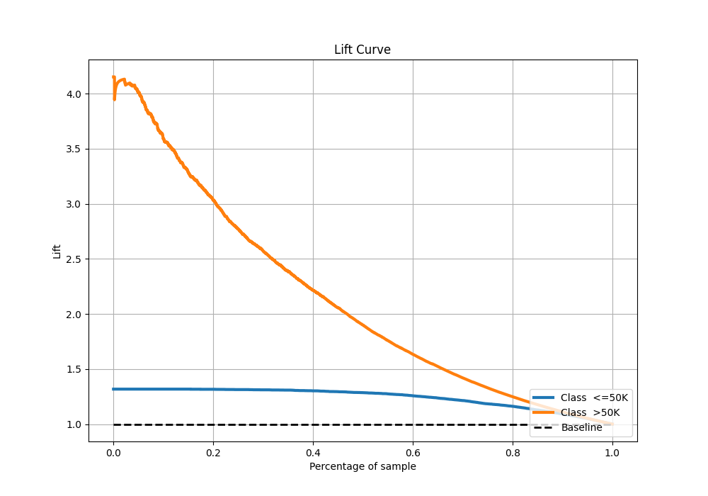

# Summary of 2_Default_NeuralNetwork

[<< Go back](../README.md)

## Neural Network
- **n_jobs**: -1
- **dense_1_size**: 32
- **dense_2_size**: 16
- **learning_rate**: 0.05
- **explain_level**: 1

## Validation
 - **validation_type**: split
 - **train_ratio**: 0.75
 - **shuffle**: True
 - **stratify**: True

## Optimized metric
f1

## Training time

9.5 seconds

## Metric details
|           |    score |     threshold |
|:----------|---------:|--------------:|
| logloss   | 0.323541 | nan           |
| auc       | 0.90587  | nan           |
| f1        | 0.687577 |   0.342664    |
| accuracy  | 0.851824 |   0.450195    |
| precision | 0.980822 |   0.978502    |
| recall    | 1        |   3.49125e-08 |
| mcc       | 0.580482 |   0.342664    |

## Confusion matrix (at threshold=0.450195)
|                   |   Predicted as  <=50K |   Predicted as  >50K |
|:------------------|----------------------:|---------------------:|
| Labeled as  <=50K |                  6468 |                  484 |
| Labeled as  >50K  |                   873 |                 1333 |

## Learning curves

## Permutation-based Importance

## Confusion Matrix

## Normalized Confusion Matrix

## ROC Curve

## Kolmogorov-Smirnov Statistic

## Precision-Recall Curve

## Calibration Curve

## Cumulative Gains Curve

## Lift Curve

[<< Go back](../README.md)
