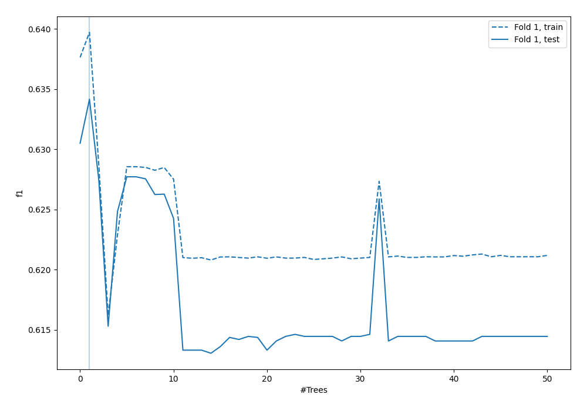
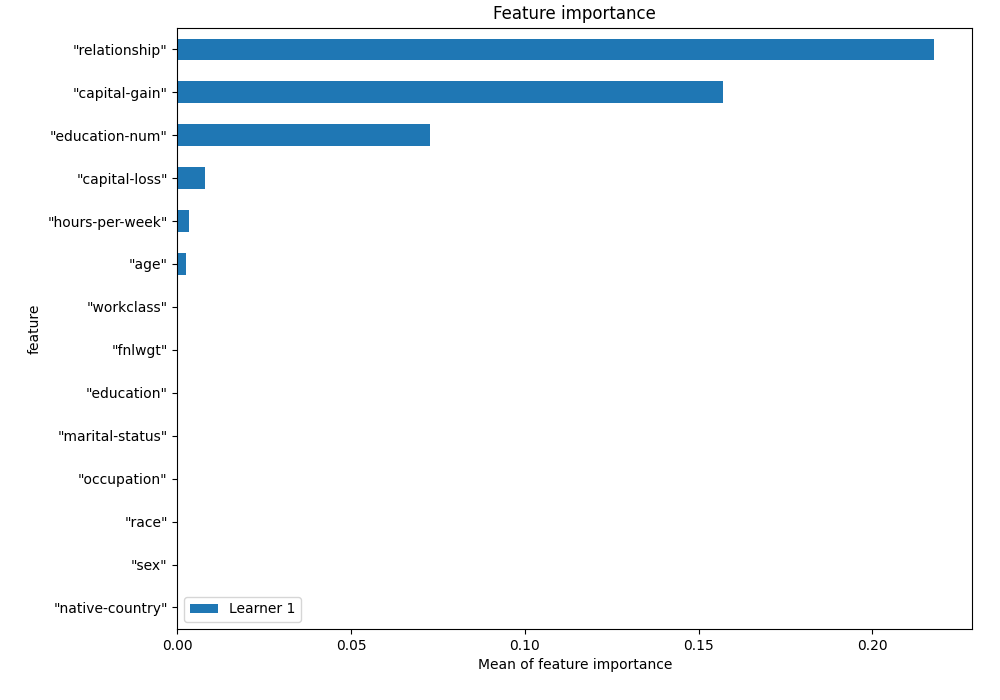
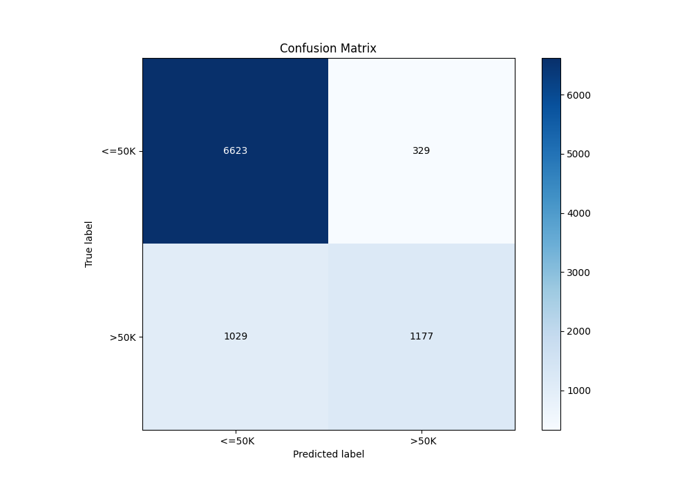
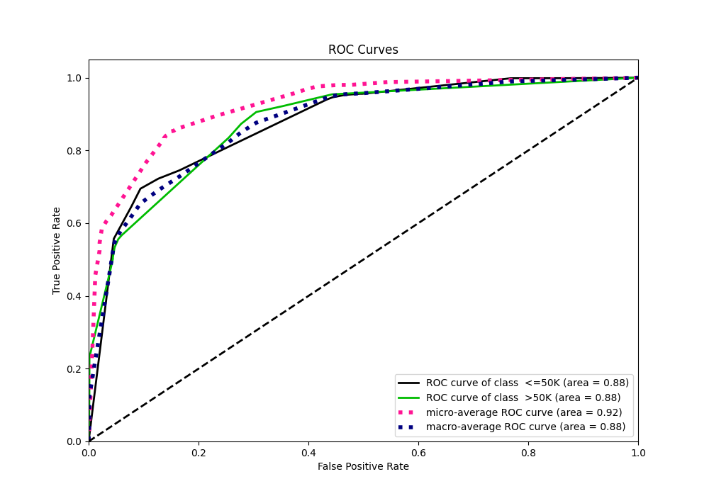
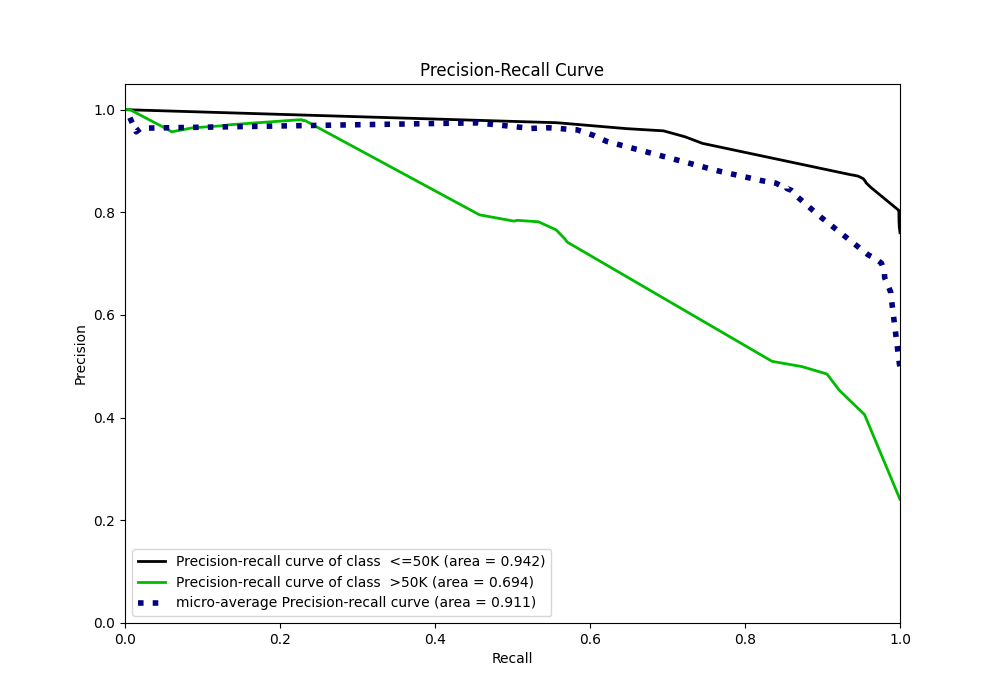
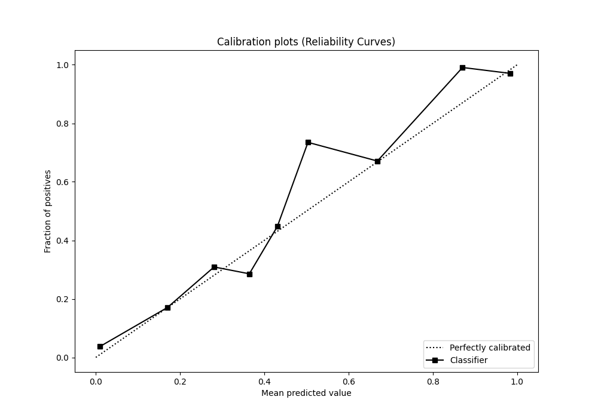
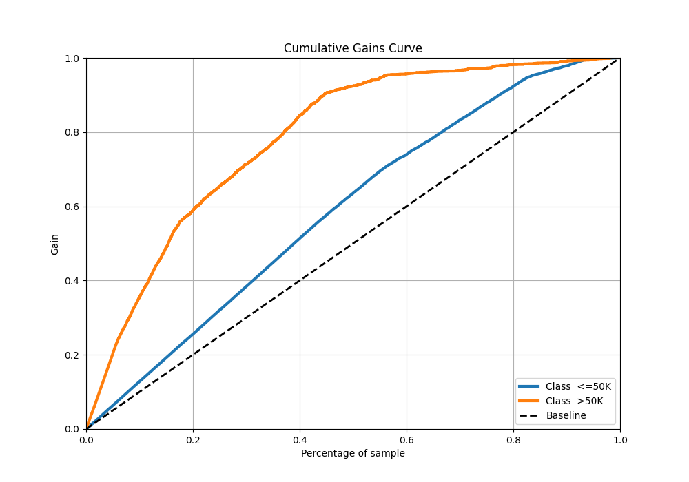
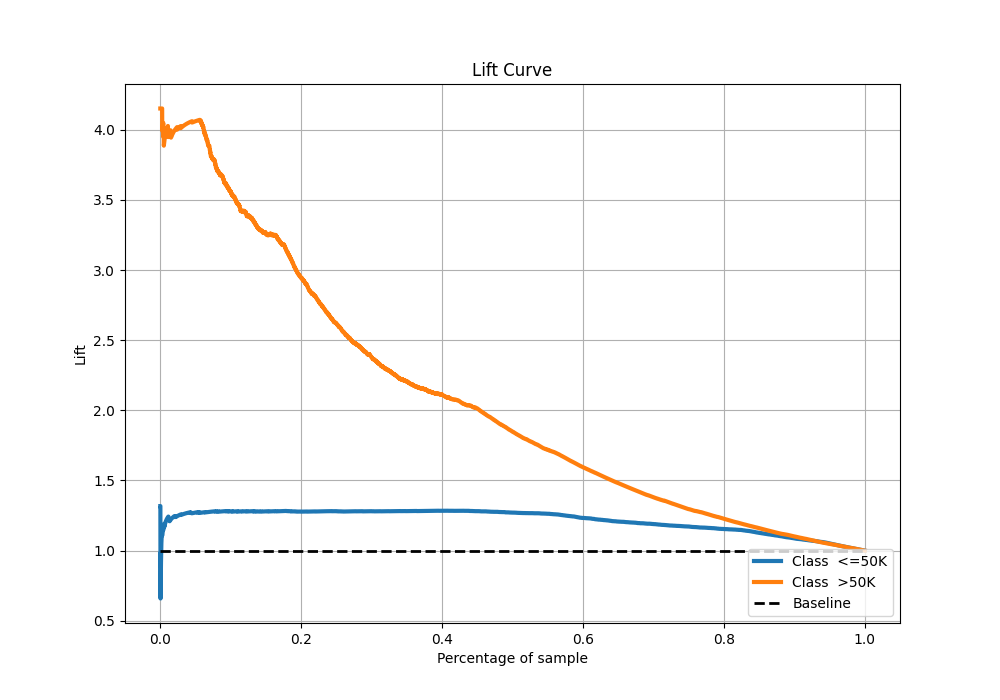

# Summary of 3_Default_RandomForest

[<< Go back](../README.md)

## Random Forest
- **n_jobs**: -1
- **criterion**: gini
- **max_features**: 0.9
- **min_samples_split**: 30
- **max_depth**: 4
- **eval_metric_name**: f1
- **explain_level**: 1

## Validation
 - **validation_type**: split
 - **train_ratio**: 0.75
 - **shuffle**: True
 - **stratify**: True

## Optimized metric
f1

## Training time

4.3 seconds

## Metric details
|           |    score |   threshold |
|:----------|---------:|------------:|
| logloss   | 0.345914 | nan         |
| auc       | 0.87725  | nan         |
| f1        | 0.645544 |   0.44307   |
| accuracy  | 0.851714 |   0.494724  |
| precision | 0.978723 |   0.823271  |
| recall    | 1        |   0.0265165 |
| mcc       | 0.560907 |   0.494724  |

## Confusion matrix (at threshold=0.494724)
|                   |   Predicted as  <=50K |   Predicted as  >50K |
|:------------------|----------------------:|---------------------:|
| Labeled as  <=50K |                  6623 |                  329 |
| Labeled as  >50K  |                  1029 |                 1177 |

## Learning curves

## Permutation-based Importance

## Confusion Matrix

## Normalized Confusion Matrix

## ROC Curve

## Kolmogorov-Smirnov Statistic

## Precision-Recall Curve

## Calibration Curve

## Cumulative Gains Curve

## Lift Curve

[<< Go back](../README.md)
