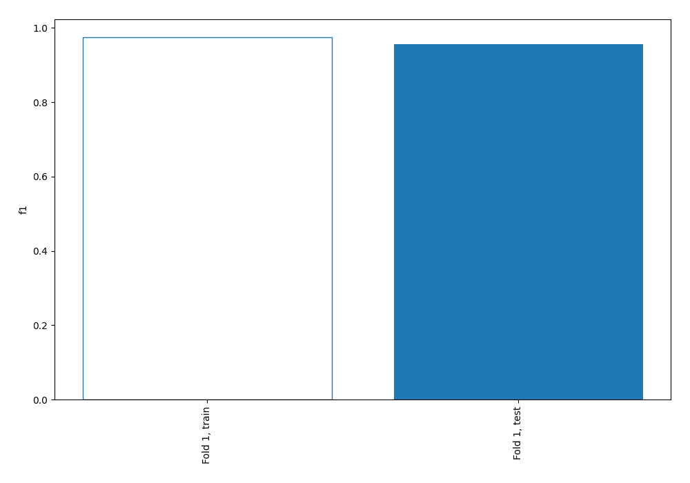
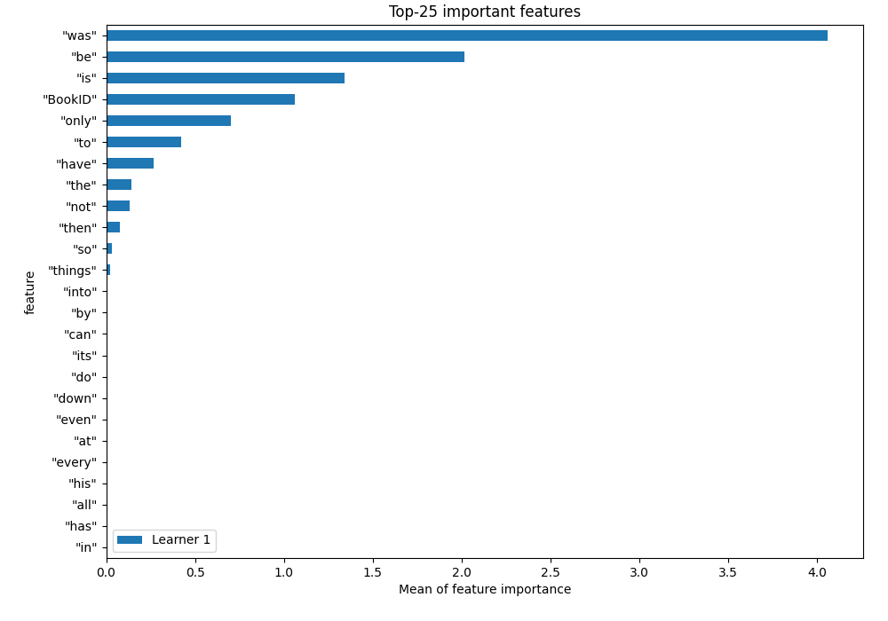
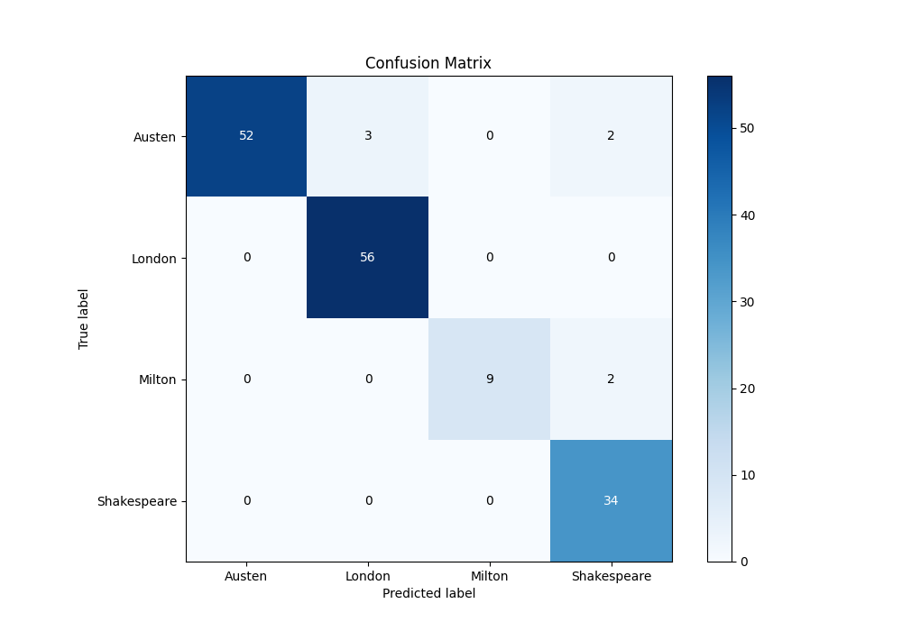
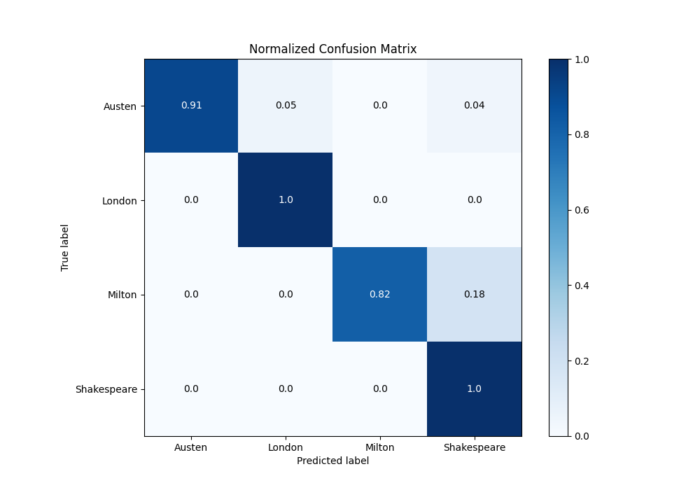
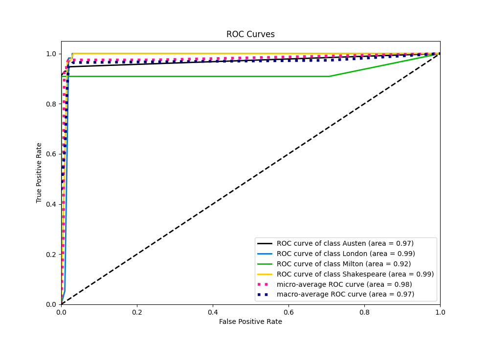
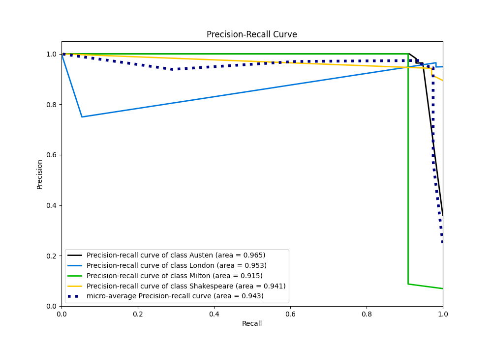

# Summary of 1_DecisionTree

[<< Go back](../README.md)

## Decision Tree
- **n_jobs**: -1
- **criterion**: entropy
- **max_depth**: 4
- **num_class**: 4
- **explain_level**: 1

## Validation
 - **validation_type**: split
 - **train_ratio**: 0.75
 - **shuffle**: True
 - **stratify**: True

## Optimized metric
f1

## Training time

3.7 seconds

### Metric details
|           |    Austen |    London |    Milton |   Shakespeare |   accuracy |   macro avg |   weighted avg |   logloss |
|:----------|----------:|----------:|----------:|--------------:|-----------:|------------:|---------------:|----------:|
| precision |  1        |  0.949153 |  1        |      0.894737 |   0.955696 |    0.960972 |       0.959327 |  0.385027 |
| recall    |  0.912281 |  1        |  0.818182 |      1        |   0.955696 |    0.932616 |       0.955696 |  0.385027 |
| f1-score  |  0.954128 |  0.973913 |  0.9      |      0.944444 |   0.955696 |    0.943121 |       0.955288 |  0.385027 |
| support   | 57        | 56        | 11        |     34        |   0.955696 |  158        |     158        |  0.385027 |

## Confusion matrix
|                        |   Predicted as Austen |   Predicted as London |   Predicted as Milton |   Predicted as Shakespeare |
|:-----------------------|----------------------:|----------------------:|----------------------:|---------------------------:|
| Labeled as Austen      |                    52 |                     3 |                     0 |                          2 |
| Labeled as London      |                     0 |                    56 |                     0 |                          0 |
| Labeled as Milton      |                     0 |                     0 |                     9 |                          2 |
| Labeled as Shakespeare |                     0 |                     0 |                     0 |                         34 |

## Learning curves

## Permutation-based Importance

## Confusion Matrix

## Normalized Confusion Matrix

## ROC Curve

## Precision Recall Curve

[<< Go back](../README.md)
