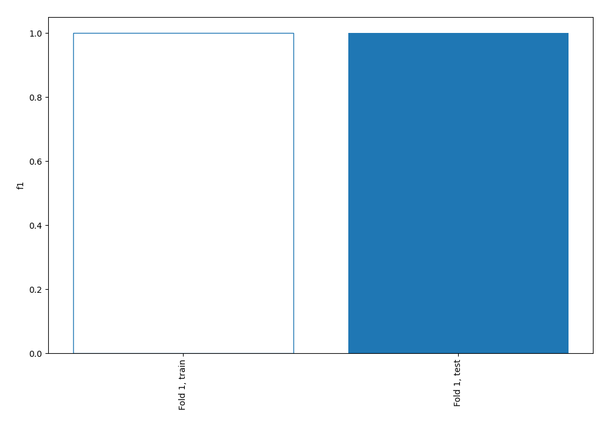
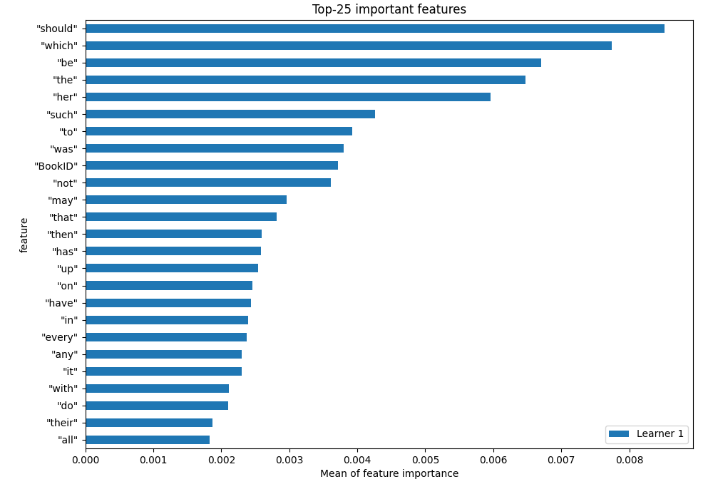
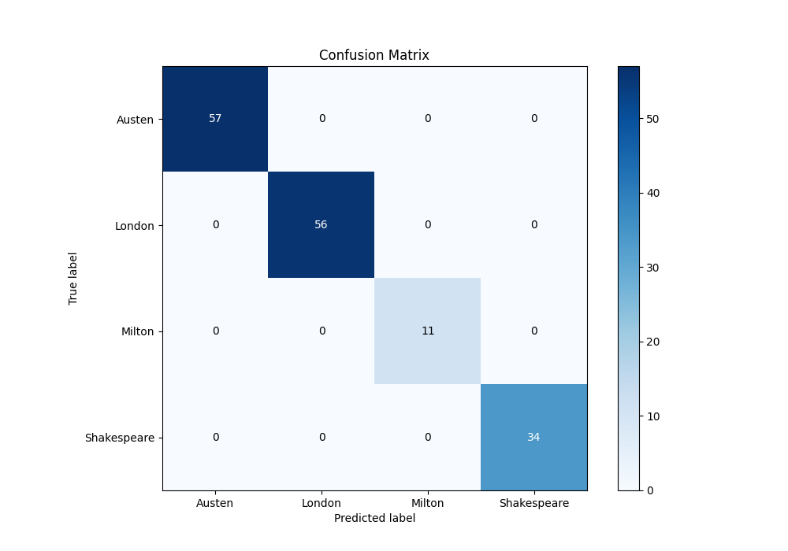
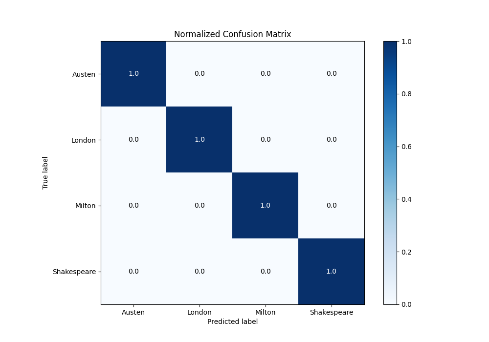
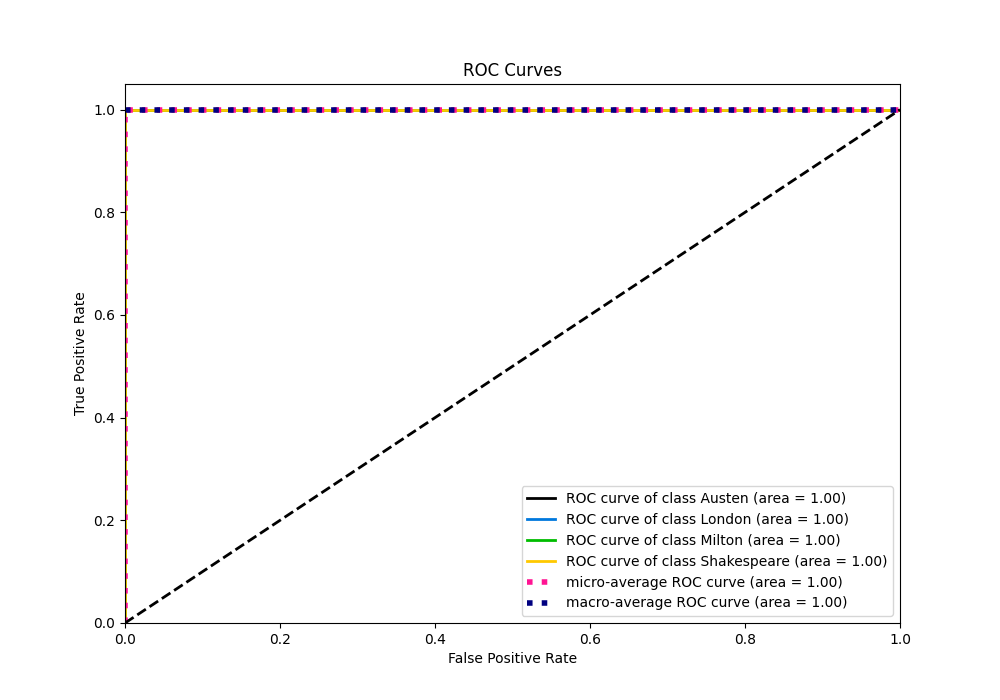
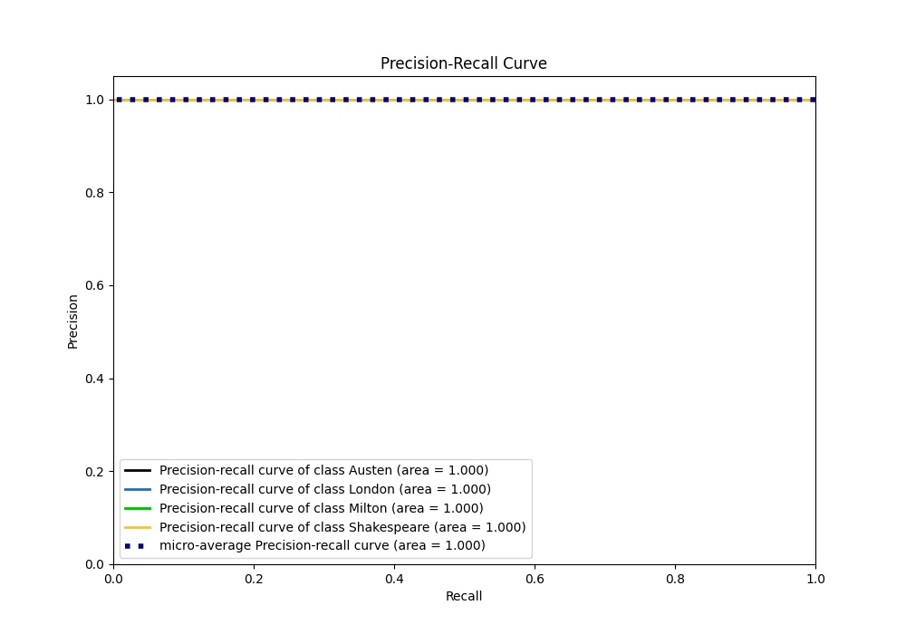

# Summary of 2_Linear

[<< Go back](../README.md)

## Logistic Regression (Linear)
- **n_jobs**: -1
- **num_class**: 4
- **explain_level**: 1

## Validation
 - **validation_type**: split
 - **train_ratio**: 0.75
 - **shuffle**: True
 - **stratify**: True

## Optimized metric
f1

## Training time

0.8 seconds

### Metric details
|           |   Austen |   London |   Milton |   Shakespeare |   accuracy |   macro avg |   weighted avg |   logloss |
|:----------|---------:|---------:|---------:|--------------:|-----------:|------------:|---------------:|----------:|
| precision |        1 |        1 |        1 |             1 |          1 |           1 |              1 | 0.0126094 |
| recall    |        1 |        1 |        1 |             1 |          1 |           1 |              1 | 0.0126094 |
| f1-score  |        1 |        1 |        1 |             1 |          1 |           1 |              1 | 0.0126094 |
| support   |       57 |       56 |       11 |            34 |          1 |         158 |            158 | 0.0126094 |

## Confusion matrix
|                        |   Predicted as Austen |   Predicted as London |   Predicted as Milton |   Predicted as Shakespeare |
|:-----------------------|----------------------:|----------------------:|----------------------:|---------------------------:|
| Labeled as Austen      |                    57 |                     0 |                     0 |                          0 |
| Labeled as London      |                     0 |                    56 |                     0 |                          0 |
| Labeled as Milton      |                     0 |                     0 |                    11 |                          0 |
| Labeled as Shakespeare |                     0 |                     0 |                     0 |                         34 |

## Learning curves

## Coefficients

### Coefficients learner #1
|           |      Austen |      London |       Milton |   Shakespeare |
|:----------|------------:|------------:|-------------:|--------------:|
| intercept |  1.60737    |  1.02703    | -2.23299     |  -0.40142     |
| "a"       |  0.0265221  |  0.219043   | -0.330384    |   0.0848196   |
| "all"     | -0.131508   |  0.113716   |  0.173497    |  -0.155705    |
| "also"    | -0.0891874  |  0.136787   | -0.00421844  |  -0.0433807   |
| "an"      | -0.0254903  |  0.199368   | -0.136029    |  -0.0378482   |
| "and"     | -0.102244   |  0.0879897  |  0.184809    |  -0.170554    |
| "any"     |  0.420623   | -0.183705   | -0.124086    |  -0.112832    |
| "are"     |  0.0436316  |  0.0339223  | -0.20794     |   0.130387    |
| "as"      |  0.277901   | -0.337157   | -0.00926616  |   0.0685217   |
| "at"      |  0.476209   | -0.146181   | -0.0657146   |  -0.264314    |
| "be"      |  0.415557   | -0.329155   | -0.040196    |  -0.0462054   |
| "been"    |  0.276381   |  0.0258564  | -0.0734454   |  -0.228792    |
| "but"     |  0.0955725  | -0.195035   |  0.0619595   |   0.0375031   |
| "by"      |  0.0995917  | -0.202657   |  0.0633171   |   0.0397481   |
| "can"     |  0.0539013  |  0.114602   |  0.0779376   |  -0.246441    |
| "do"      |  0.181752   | -0.12631    | -0.170533    |   0.115091    |
| "down"    | -0.0222145  |  0.0750242  | -0.0376564   |  -0.0151533   |
| "even"    | -0.0482396  |  0.00916447 | -0.0414068   |   0.0804819   |
| "every"   |  0.354083   | -0.269753   | -0.0548419   |  -0.0294878   |
| "for"     |  0.147513   | -0.105881   | -0.16749     |   0.125858    |
| "from"    | -0.0784198  | -0.0318484  |  0.289537    |  -0.179269    |
| "had"     |  0.285942   |  0.16426    | -0.078705    |  -0.371496    |
| "has"     |  0.206959   |  0.142234   | -0.0805176   |  -0.268676    |
| "have"    |  0.214078   | -0.0957941  | -0.14418     |   0.0258968   |
| "her"     |  0.598067   | -0.364153   | -0.02721     |  -0.206704    |
| "his"     | -0.057044   |  0.00535756 |  0.0514699   |   0.000216536 |
| "if"      | -0.0670582  | -0.12842    |  0.00486837  |   0.190609    |
| "in"      | -0.1242     |  0.217967   | -0.0236873   |  -0.0700793   |
| "into"    | -0.0468909  |  0.143599   | -0.0263074   |  -0.0704007   |
| "is"      |  0.0468839  | -0.170268   | -0.196377    |   0.319761    |
| "it"      |  0.180513   |  0.356897   | -0.236277    |  -0.301133    |
| "its"     |  0.134639   |  0.196175   | -0.0704135   |  -0.2604      |
| "may"     |  0.0852656  | -0.290684   |  0.0432229   |   0.162195    |
| "more"    |  0.0620857  | -0.134909   |  0.119001    |  -0.0461779   |
| "must"    |  0.215374   | -0.0204211  | -0.0489108   |  -0.146043    |
| "my"      | -0.244251   |  0.0761477  | -0.129093    |   0.297197    |
| "no"      |  0.00519671 | -0.0234308  | -0.0405084   |   0.0587424   |
| "not"     |  0.320639   | -0.25545    | -0.00575445  |  -0.0594342   |
| "now"     |  0.0632161  | -0.416461   |  0.25717     |   0.0960753   |
| "of"      |  0.223426   | -0.0524447  | -0.0569087   |  -0.114073    |
| "on"      | -0.0150366  |  0.249256   |  0.123711    |  -0.35793     |
| "one"     |  0.0113956  |  0.0498227  | -0.0843217   |   0.0231034   |
| "only"    |  0.278645   |  0.0605327  | -0.00419062  |  -0.334987    |
| "or"      | -0.0811706  | -0.249907   |  0.374317    |  -0.0432393   |
| "our"     | -0.254028   | -0.0654039  |  0.0798258   |   0.239606    |
| "should"  |  0.344798   | -0.46854    | -0.0243323   |   0.148074    |
| "so"      |  0.0126513  | -0.245488   |  0.162059    |   0.0707779   |
| "some"    |  0.127254   | -0.135798   | -0.0337671   |   0.0423112   |
| "such"    |  0.32933    | -0.327333   |  0.0577849   |  -0.0597817   |
| "than"    |  0.007447   | -0.129241   |  0.0520718   |   0.0697224   |
| "that"    | -0.245387   |  0.320158   | -0.0896084   |   0.014838    |
| "the"     | -0.289279   |  0.472987   | -0.12652     |  -0.0571881   |
| "their"   | -0.00435963 | -0.280208   |  0.296215    |  -0.0116473   |
| "then"    | -0.319035   |  0.0446293  |  0.175634    |   0.0987719   |
| "there"   |  0.0853148  | -0.034308   | -0.0276925   |  -0.0233142   |
| "things"  | -0.12153    |  0.114605   |  0.178371    |  -0.171446    |
| "this"    | -0.214462   | -0.133222   |  0.0442425   |   0.303442    |
| "to"      |  0.619033   | -0.270501   |  0.0640575   |  -0.412589    |
| "up"      | -0.0926905  |  0.278342   | -0.104476    |  -0.0811753   |
| "upon"    | -0.154279   | -0.0352179  | -0.182891    |   0.372388    |
| "was"     |  0.161248   |  0.40243    | -0.143453    |  -0.420225    |
| "were"    |  0.127571   |  0.19723    | -0.131211    |  -0.193591    |
| "what"    | -0.203992   | -0.0800634  |  0.142028    |   0.142027    |
| "when"    | -0.0934509  |  0.283454   |  0.0343679   |  -0.224371    |
| "which"   |  0.31828    | -0.318689   |  0.000223711 |   0.000185381 |
| "who"     |  0.0874121  | -0.0555734  |  0.142262    |  -0.174101    |
| "will"    |  0.0184112  | -0.0738871  | -0.0579441   |   0.11342     |
| "with"    | -0.0315275  | -0.14868    |  0.308814    |  -0.128606    |
| "would"   |  0.16119    | -0.0598199  | -0.115167    |   0.0137971   |
| "your"    | -0.143643   | -0.0441733  | -0.200752    |   0.388568    |
| "BookID"  |  0.0982314  | -0.198037   | -0.267909    |   0.367714    |

## Permutation-based Importance

## Confusion Matrix

## Normalized Confusion Matrix

## ROC Curve

## Precision Recall Curve

[<< Go back](../README.md)
